# Agent Executor 架构文档（当前实现）

> 本文档描述已实现并通过测试的架构现状。未来演进方向见 [vision.md](vision.md)。

## 1. 项目概述

### 一期设计范围

- **运行环境**：单台 Mac / Linux，一个项目对应一个 agent-executor 实例
- **暂不涉及**：项目管理能力、跨项目协调、分布式部署
- **核心目标**：在单机上让多 Agent 协作完成一个项目的开发任务，各种预期可达

### 核心能力

Agent Executor 是一个 AI Agent 编排执行框架：

- **多 Agent 管理**：通过 YAML 配置定义不同 Agent（evolve、planner、pm、frontend、product、db-design）
- **DAG 驱动执行**：Task 之间的依赖关系形成有向无环图，自动调度执行顺序
- **多模型支持**：同一框架下使用不同 LLM（Claude Opus/Sonnet、GLM、MiniMax 等）
- **安全防护**：Guard Chain（熔断、时间窗口、余额检查）防止失控
- **可观测性**：Event Bus 驱动日志、状态持久化、执行追踪

## 2. 目录结构

```
agent-executor/
├── executor.yaml                  # 全局配置（调度、Guard、事件处理器）
├── agents/                        # Agent 配置（每 Agent 一个 YAML）
│   ├── evolve-agent.yaml          #   自我演进 Agent（multi_round，target="./"）
│   ├── planner-agent.yaml         #   需求 → task_list.json（callable）
│   ├── pm-agent.yaml              #   项目管理 Agent（management，single_round）
│   ├── frontend-agent.yaml        #   前端开发 Agent（multi_round）
│   ├── product-agent.yaml         #   产品设计 Agent（single_round）
│   └── db-design-agent.yaml       #   数据库设计 Agent（single_round）
├── prompts/                       # Prompt 模板（第一层：项目级自定义，优先）
│   ├── evolve/                    #   init.md / worker.md / vibe.md
│   ├── planner/                   #   worker.md
│   ├── pm/                        #   worker.md（4 场景：初始化/任务/巡检/规范更新）
│   ├── frontend/                  #   init.md / worker.md
│   ├── helper/                    #   worker.md（统一控制面板，9 场景：分析 + 操作）
│   ├── product/                   #   worker.md
│   └── db-design/                 #   worker.md
├── nezha/                # 核心代码
│   ├── __main__.py                #   CLI 入口（两步 locale 初始化：env var → yaml）
│   ├── config.py                  #   配置加载（YAML → dataclass，含 locale 字段）
│   ├── executor.py                #   主执行器（串联所有模块，解析 project_dir）
│   ├── i18n.py                    #   国际化（setup_locale / t() 封装 python-i18n）
│   ├── locales/                   #   翻译文件
│   │   ├── en.yaml                #     英文字符串（默认）
│   │   └── zh_CN.yaml             #     简体中文字符串
│   ├── feature_queue.py           #   Feature 队列（Port/Adapter：Protocol + FileFeatureQueue）
│   ├── engine.py                  #   LLM 引擎（Claude Code SDK 封装）
│   ├── testing/                    #   集成测试子系统
│   │   ├── __init__.py             #     包初始化
│   │   └── integration.py          #     run_test_command / write_test_report / RunResult / CycleResult
│   ├── tools/                     #   确定性工具（post_tools：session 结束后自动执行）
│   │   ├── base.py                #     BaseTool Protocol + ToolResult
│   │   ├── git_tool.py            #     GitTool（status/diff/add/commit/push/log）
│   │   ├── test_tool.py           #     TestTool（run/coverage）
│   │   └── __init__.py            #     工具注册表 + create_tool() 工厂函数
│   ├── templates/                 #   包内置 Prompt + 配置模板（第二层：回退）
│   │   ├── prompts/
│   │   │   ├── coding/base.md     #     角色声明 + 变量（PromptComposer 基础模板）
│   │   │   ├── coding/vibe.md     #     通用 vibe-mode prompt 回退
│   │   │   ├── coding/fix.md     #     集成测试修复 prompt（English）
│   │   │   ├── coding/fix.zh.md  #     集成测试修复 prompt（中文）
│   │   │   ├── modules/           #     可插拔 prompt 模块（PromptComposer）
│   │   │   │   ├── phases/        #       工作流阶段模块
│   │   │   │   │   ├── context-acquisition.md
│   │   │   │   │   ├── rework.md
│   │   │   │   │   ├── tdd.md
│   │   │   │   │   ├── regression.md
│   │   │   │   │   └── commit-rules.md
│   │   │   │   ├── stacks/        #       技术栈模块
│   │   │   │   │   ├── java-spring.md
│   │   │   │   │   ├── python.md
│   │   │   │   │   ├── frontend.md
│   │   │   │   │   └── general.md
│   │   │   │   └── concerns/      #       横切关注点模块
│   │   │   │       ├── exec-plan.md
│   │   │   │       └── quality-tracking.md
│   │   │   ├── helper/worker.md   #     统一控制面板 Helper prompt（9 场景）
│   │   │   ├── java/              #     Java Agent 内置 prompt
│   │   │   │   ├── worker.md      #       Java/Spring Boot 开发（TDD 流程）
│   │   │   │   └── worker.zh.md   #       中文版
│   │   │   ├── frontend/          #     前端 Agent 内置 prompt
│   │   │   │   ├── init.md        #       项目初始化（Next.js/Vite scaffold）
│   │   │   │   ├── worker.md      #       功能迭代开发（DAG 驱动）
│   │   │   │   ├── vibe.md        #       交互式 VibeCoding（nezha code 注入）
│   │   │   │   ├── init.zh.md     #       中文版初始化 prompt
│   │   │   │   ├── worker.zh.md   #       中文版开发 prompt
│   │   │   │   └── vibe.zh.md     #       中文版 vibe prompt
│   │   │   ├── planner/
│   │   │   │   └── worker.md      #     需求 → task_list.json
│   │   │   ├── product/
│   │   │   │   └── worker.md      #     需求 → PRD + tech_stack
│   │   │   ├── pm/
│   │   │   │   └── worker.md      #     项目管理 4 场景
│   │   │   ├── evolve/
│   │   │   │   ├── init.md        #     自我演进初始化
│   │   │   │   ├── worker.md      #     自我演进迭代
│   │   │   │   └── vibe.md        #     自我演进 vibe 模式
│   │   │   └── db-design/
│   │   │       └── worker.md      #     数据库设计
│   │   ├── agents/
│   │   │   ├── coding-agent.yaml  #     starter coding agent 模板
│   │   │   ├── java-agent.yaml    #     Java/Spring Boot Agent 模板
│   │   │   ├── frontend-agent.yaml #    前端开发 Agent 模板
│   │   │   ├── planner-agent.yaml #     规划 Agent 模板
│   │   │   ├── pm-agent.yaml      #     项目管理 Agent 模板
│   │   │   └── product-agent.yaml #     产品设计 Agent 模板
│   │   └── executor.yaml          #     starter executor 配置模板
│   ├── dag/                       #   DAG 子系统
│   │   ├── graph.py               #     TaskDAG 依赖图数据结构
│   │   ├── engine.py              #     DAG 执行循环
│   │   ├── verifier.py            #     Task 验证（Agent 报告 + 外部命令）
│   │   ├── report.py              #     执行报告生成
│   │   └── handoff.py             #     VibeCoding 上下文生成（含 generate_all_context）
│   ├── pipeline/                  #   Session 管道
│   │   ├── session.py             #     会话管理（single/multi/vibe，接收 agent_workspace）
│   │   ├── direct_api.py          #     Direct API 模式（调用 anthropic/openai SDK，无 Claude Code 子进程）
│   │   ├── io.py                  #     文件 I/O（input 扫描、output 目录）
│   │   ├── prompt_template.py     #     模板渲染 + 两层 Prompt 路径查找
│   │   ├── prompt_composer.py     #     Prompt 模块组合（compose_prompt()，可插拔模块系统）
│   │   ├── knowledge.py           #     知识注入（CLAUDE.md + project context + agent memory）
│   │   └── security.py            #     命令安全钩子（白名单）
│   ├── scheduler/                 #   调度器
│   │   ├── base.py                #     抽象基类 + Factory
│   │   ├── manual.py              #     单次执行
│   │   ├── continuous.py          #     循环执行（间隔 N 秒）
│   │   └── cron.py                #     定时执行（cron 表达式）
│   ├── guards/                    #   安全守卫
│   │   ├── base.py                #     抽象基类 + GuardChain + Factory
│   │   ├── circuit_breaker.py     #     连续失败熔断
│   │   ├── time_window.py         #     时间窗口限制
│   │   └── balance.py             #     余额检查（预留）
│   ├── events/                    #   事件系统
│   │   ├── bus.py                 #     EventBus（pub/sub）
│   │   ├── types.py               #     EventType 枚举 + Event 数据类
│   │   ├── file_logger.py         #     文件日志 Handler
│   │   ├── state_writer.py        #     状态持久化 Handler
│   │   └── trace_writer.py        #     执行路径追踪 Handler
│   └── interface/
│       ├── cli.py                 #     CLI 命令实现（status/history/logs/rework/plan/task/agent-context/dashboard）
│       └── dashboard.py           #     静态 HTML Dashboard 生成（feature 状态 + 费用可视化）
├── workspace/                     #   Agent 元数据目录（per_agent 隔离）
│   ├── project/                   #     项目级共享知识（所有 Agent 共享）
│   │   ├── project.yaml           #       项目基本信息
│   │   ├── tech_stack.yaml        #       技术栈配置
│   │   ├── standards/             #       编码规范（*.md，全部注入 prompt）
│   │   ├── knowledge/CLAUDE.md    #       项目级 CLAUDE.md（优先于 target 下的）
│   │   └── roadmap.md             #       项目路线图
│   └── <agent-name>/
│       ├── agent-context.md       #     跨任务持久记忆（每轮 session 注入，Agent 自动维护）
│       └── features/              #     Feature 队列目录（存在时启用 Feature Queue 模式）
│           └── <timestamp>/
│               ├── feature.yaml   #       Feature 状态元数据
│               └── input/         #       Feature 输入文件
├── state/                         #   运行时状态（status.json、history/、logs/、traces/）
├── tests/                         #   测试（844 tests）
└── design/                        #   架构文档（本文件）
```

## 3. 系统架构总览

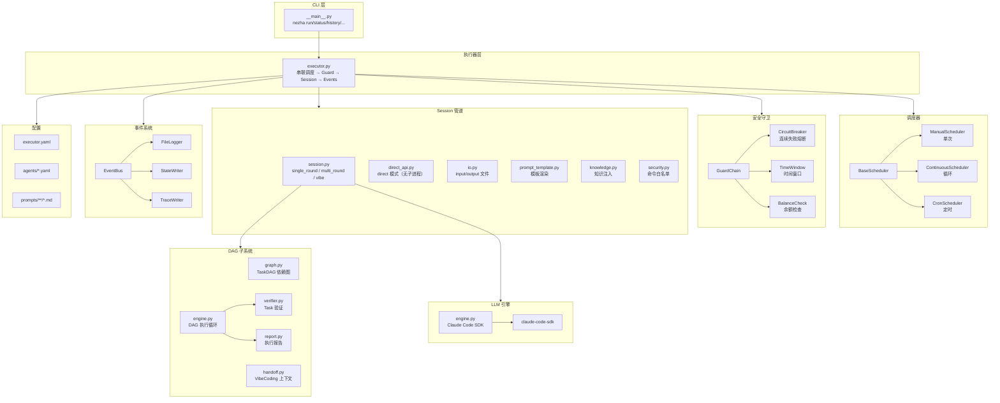

## 4. 执行流程

### 4.1 完整执行流程

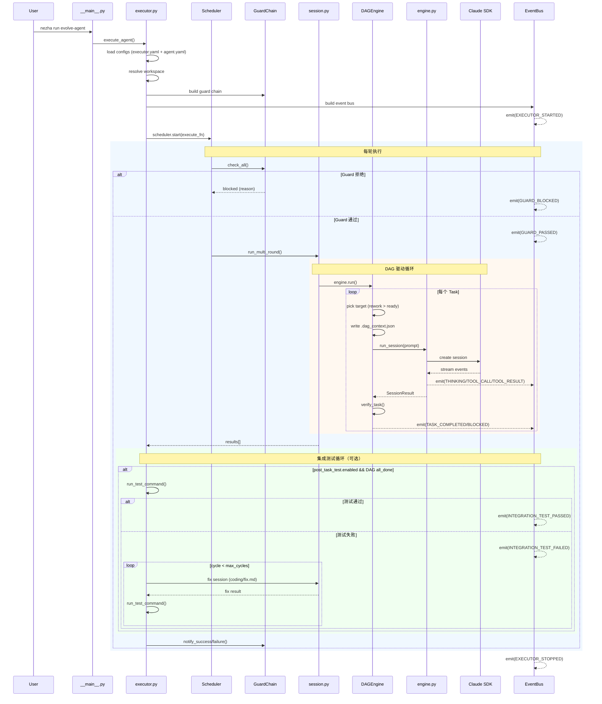

### 4.2 Session 模式

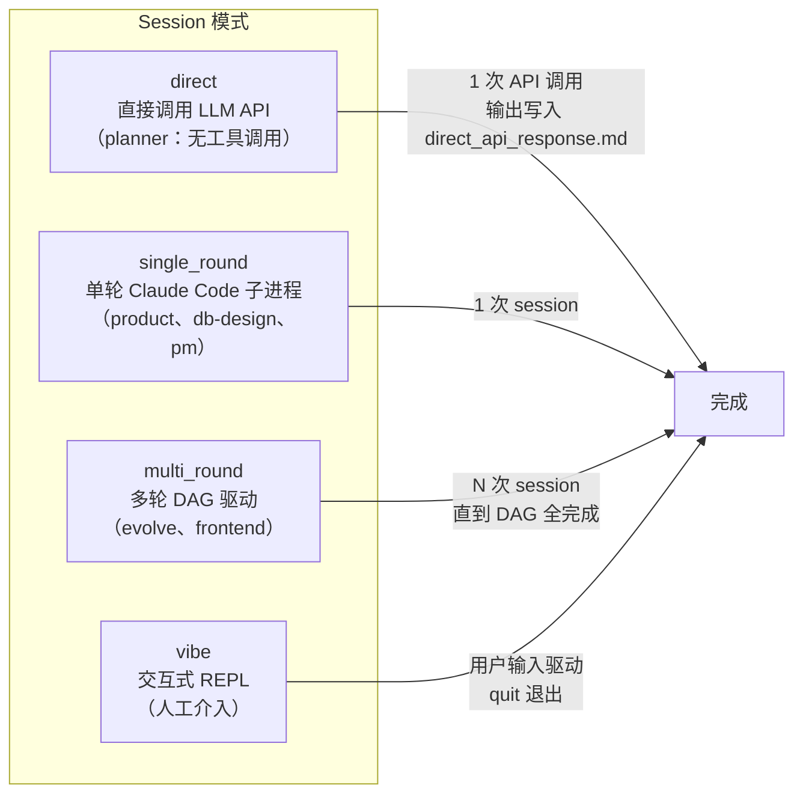

**direct 模式**特点：
- 直接调用 `anthropic` 或 `openai` SDK，跳过 Claude Code SDK 子进程
- 无 tool call 能力，输入文件内容注入 prompt，LLM 直接输出文本
- 适用于"分析/规划"类 Agent（只需生成文本，不需要写文件）
- `engine.api_type: "anthropic" | "openai"` 选择协议（同 code-analysis-mcp 的 NL2Cypher 模式）
- 延迟显著低于 single_round（无子进程启动开销）

vibe 模式额外选项：
- `--feature-id <id>`：切换到指定 Feature 的 workspace（读取该 Feature 的 task_list.json 等）
- `--context all`：注入全量 Task 状态 + 历史尝试记录
- `--context latest`（默认）：只注入当前 Task 的 handoff context
- `--context none`：不注入任何 handoff context（干净上下文）

### 4.3 multi_round Task 生成优先级

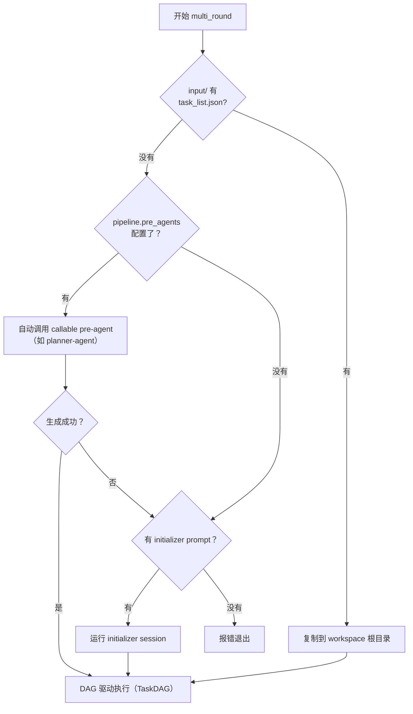

## 5. DAG 子系统

### 5.1 Task 状态机

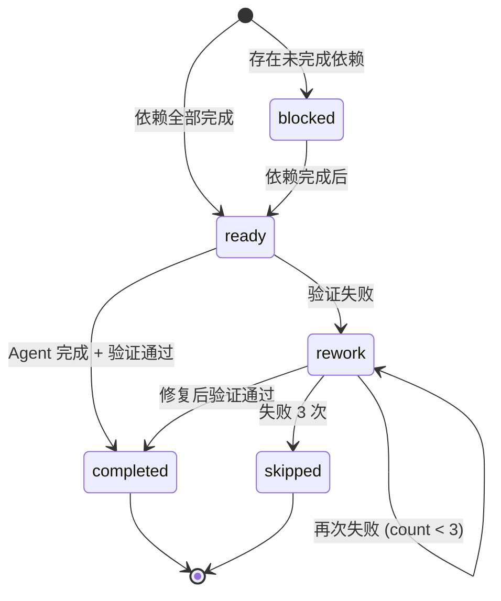

> 状态不是存储在 Task 上的字段，而是由 `TaskDAG.get_status()` 每次**动态计算**。

### 5.2 DAG 执行循环

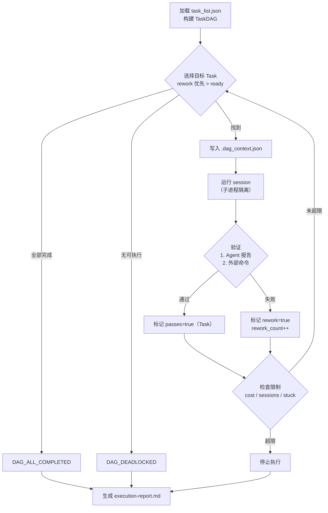

### 5.3 两级验证

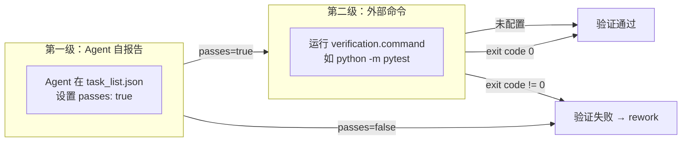

## 6. 配置体系

### 6.1 配置层级

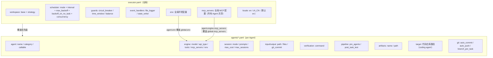

### 6.2 Agent 分类

| Agent | category | callable | session mode | api_type | target | 用途 |
|-------|----------|----------|-------------|----------|--------|------|
| evolve-agent | coding | false | multi_round | — | `"./"` | AI 自我演进，迭代升级自身代码 |
| frontend-agent | coding | false | multi_round | — | 代码仓库 | 前端 UI 开发 |
| planner-agent | planning | **true** | **direct** | anthropic | — | 需求 → task_list.json（纯文本输出，无工具调用） |
| product-agent | planning | false | single_round | — | — | 需求 → PRD + tech_stack（需写文件） |
| db-design-agent | design | false | single_round | — | — | 架构 → DDL + 数据模型 |
| pm-agent | management | false | single_round | — | — | 项目管理：初始化/任务创建/进度巡检/规范更新 |
| helper-agent | management | **true** | single_round | — | — | 统一控制面板：9 场景（分析 + 操作），通过 nezha CLI 执行管理命令 |

`api_type` 仅在 `session.mode: "direct"` 时有效：
- `"anthropic"`：使用 Anthropic SDK（`ANTHROPIC_API_KEY` + `ANTHROPIC_BASE_URL`），支持官方及第三方兼容地址（MiniMax、字节等）
- `"openai"`：使用 OpenAI-compatible SDK（`OPENAI_API_KEY` + `OPENAI_BASE_URL`），适合 MiniMax /v1、DeepSeek 等

- `callable=true`：可被其他 Agent 自动调用（无需人工审查）
- `callable=false`（默认）：需要人工审查后才能运行
- `target`：coding agent 的代码仓库路径（LLM 的 cwd）；planning/design/management 类无 target，cwd = feature_workspace
- `management` 类：无代码仓库，操作 `workspace/project/` 目录，无安全检查（`_check_coding_safety` 仅对 coding 类执行）

### 6.3 Pipeline Pre-Agent 机制

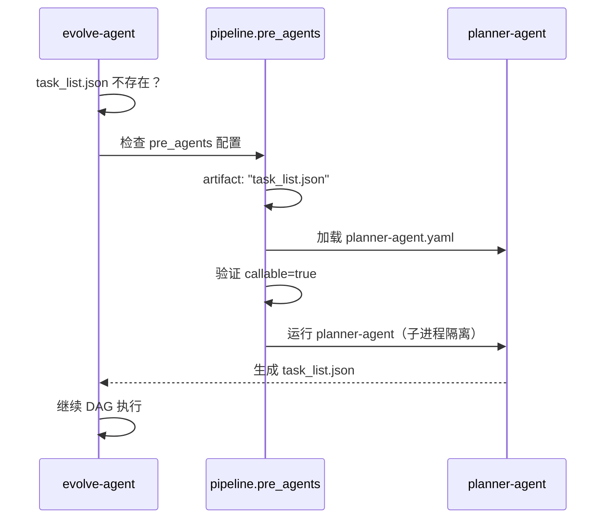

## 7. 安全守卫

### 7.1 Guard Chain

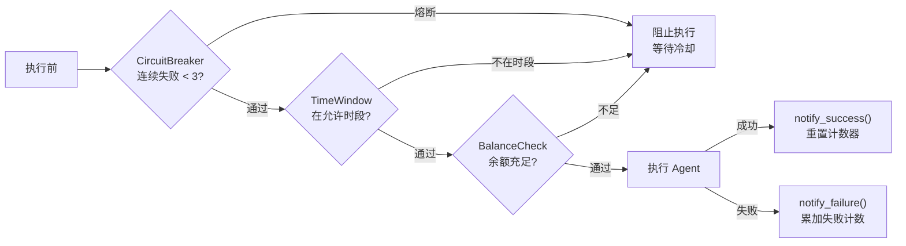

### 7.2 命令安全

```
Agent 发起 Bash 命令
    ↓
security.py 解析命令
    ↓
检查白名单 (allowed_commands)
    ├── 在白名单 → 放行
    ├── 敏感命令 (pkill/chmod) → 额外校验
    └── 不在白名单 → 拦截
```

白名单示例：`ls, cat, grep, git, python, npm, node, pip, uv ...`

## 8. 事件系统

### 8.1 Event 生命周期

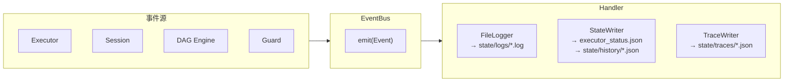

### 8.2 Event 类型一览

| 类别 | Event | 触发时机 |
|------|-------|---------|
| Executor | EXECUTOR_STARTED / STOPPED | 执行器启动/停止 |
| Session | SESSION_STARTED / COMPLETED / ERROR | 会话生命周期 |
| Agent | AGENT_THINKING / TOOL_CALL / TOOL_RESULT | LLM 思考和工具调用 |
| Guard | GUARD_PASSED / BLOCKED | 安全检查结果 |
| DAG | DAG_LOADED / TASK_STARTED / COMPLETED / BLOCKED | Task 执行状态 |
| DAG | DAG_DEADLOCKED / ALL_COMPLETED | DAG 终止条件 |
| Rework | TASK_REWORK_TRIGGERED / COMPLETED / FAILED | 返工流程 |
| Integration Test | INTEGRATION_TEST_STARTED / PASSED / FAILED | 集成测试循环 |
| Vibe | VIBE_SESSION_STARTED / ENDED | VibeCoding 模式 |

## 9. 子进程隔离

multi_round 的每个 session 运行在独立子进程中，避免 Claude SDK 的 `cancel scope` 污染：

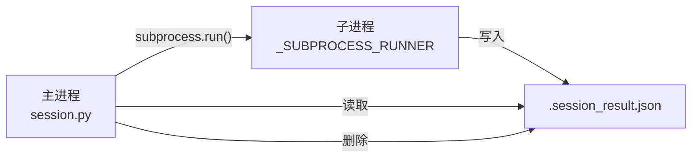

- 子进程通过内联 Python 脚本运行（`_SUBPROCESS_RUNNER` 模板）
- 结果通过 workspace 下的 `.session_result.json` 传递
- 超时限制 600 秒

## 10. CLI 命令

```
nezha
├── run <agent> [--workspace] [--max-iterations] [--feature-id] [--config]    # 运行 Agent（自动/批量）
├── code <agent> [--feature-id] [--config]                                    # 启动 Claude Code（交互式，载入 Agent 上下文）
├── feature create <agent> [--input <file>...]  [--config]                    # 创建 Feature
├── feature list   <agent> [--status <status>] [--config]                     # 列出 Feature
├── feature show   <agent> <feature-id>        [--config]                     # 查看 Feature 详情
├── feature push   <agent> <feature-id>        [--config]                     # 推送分支到远端
├── project init [--config]                                                    # 初始化 workspace/project/ 目录结构
├── vibe <agent> [--workspace] [--feature-id] [--context all|latest|none] [--config]  # VibeCoding REPL（内置 REPL）
├── agent-context init <agent> [--config]                                      # 创建 agent-context.md
├── agent-context show <agent> [--config]                                      # 查看 agent-context.md 内容
├── init <project-dir>                                                         # 脚手架：新建项目目录结构
├── plan <agent> [--config]                                                    # 查看 Task DAG
├── status [--config]                                                          # 查看执行器状态
├── history [--config]                                                         # 查看执行历史
├── logs [-f] [--config]                                                       # 查看/跟踪日志
├── rework <agent> <task_ids> <note> [--config]                                # 标记 Task 返工
├── pause / resume / stop                                                      # （预留）
```

## 11. 设计模式总结

| 模式 | 使用位置 | 说明 |
|------|---------|------|
| **Factory** | GuardFactory, SchedulerFactory | 配置驱动创建实例 |
| **Chain of Responsibility** | GuardChain | 多个 Guard 串行检查，首个失败即停止 |
| **Observer / Pub-Sub** | EventBus → Handlers | 事件驱动，解耦执行与监控 |
| **Template Method** | BaseScheduler, BaseGuard | 抽象基类定义流程，子类实现细节 |
| **Strategy** | Scheduler (manual/continuous/cron) | 同一接口不同调度策略 |
| **Callback** | DAGEngine(run_session_fn) | 解耦 DAG 逻辑与 session 执行 |
| **Port/Adapter** | FeatureQueue Protocol + FileFeatureQueue | 抽象接口与文件系统实现分离，预留 Redis/MQ |
| **Port/Adapter** | BaseTool Protocol + GitTool/TestTool | 确定性工具与 LLM 完全解耦，注册表统一管理 |
| **Subprocess Isolation** | _run_isolated_session() | 避免异步运行时污染 |
| **Two-Tier Verification** | verifier.py | Agent 自报告 + 外部命令双重验证 |
| **Four-Layer Locale Fallback** | resolve_prompt_path() | 项目本地化 → 项目默认 → 内置本地化 → 内置默认，四级查找 |
| **Two-Step I18n Init** | __main__.py | 先用 env var（覆盖 argparse help），再用 yaml config（运行时消息） |
| **Graceful Degradation** | BalanceCheck, stuck detection, FeatureQueue 向后兼容 | 无法获取信息/features/ 不存在时安全降级 |

## 12. 数据流

### 12.1 关键文件流转

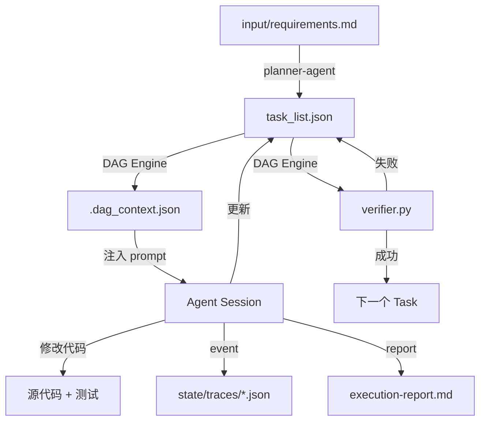

### 12.2 Prompt 注入链

最终 Prompt 由以下内容**从上到下**拼接（越靠上优先级越高）：

```
① project_context   ← workspace/project/（项目级共享知识，最高优先级）
② agent_context     ← workspace/<agent>/agent-context.md（跨任务持久记忆）
③ knowledge         ← cwd/target 下的 CLAUDE.md（代码仓库级知识）
④ Prompt 模板渲染   ← prompts/<agent>/worker.md（任务具体指令）
   ├── {{workspace}}         ← feature_workspace（Feature 元数据目录）
   ├── {{project_name}}      ← cwd.name（target 或 workspace）
   ├── {{input_files}}       ← io.scan_input_files()（从 feature_workspace 读取）
   ├── {{dag_context}}       ← .dag_context.json（DAG Engine 写入）
   └── {{handoff_context}}   ← handoff.py（仅 vibe 模式）
```

**project context（① 层）**由 `knowledge.load_project_context(project_dir)` 生成，包含：
- `workspace/project/project.yaml` — 项目基本信息
- `workspace/project/tech_stack.yaml` — 技术栈
- `workspace/project/standards/*.md` — 编码规范（全部合并）
- `workspace/project/knowledge/CLAUDE.md` — 项目级知识库
- `workspace/project/roadmap.md` — 项目路线图

**agent context（② 层）**由 `knowledge.load_agent_context(agent_workspace)` 生成，详见 [Section 15](#15-agent-memory-跨任务记忆)。

**Prompt 模板四层查找**：项目本地化 → 项目默认 → 内置本地化 → 内置默认，支持 locale 感知，详见 [Section 13](#13-templates-包四层-locale-感知-prompt-查找)。

## 13. Templates 包（四层 Locale 感知 Prompt 查找）

### 13.1 设计目标

让 `pip install agent-executor` 后无需任何 prompt 文件即可运行，同时允许项目覆盖任意 prompt。

### 13.2 四层查找机制（含 Locale 感知）

`resolve_prompt_path(prompts_dir, prompt_path, locale)` 按优先级依次查找，支持语言后缀（如 `worker.zh.md`）：

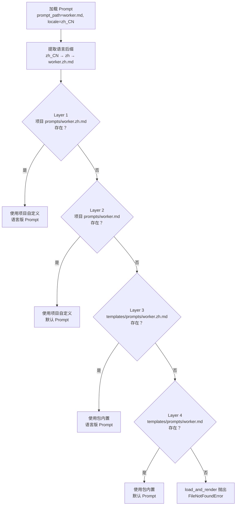

**语言后缀规则**：
- `locale="zh_CN"` → 语言代码 `"zh"` → 查找文件名 `worker.zh.md`
- `locale="en"` 或英文 → 跳过语言后缀查找（不存在 `worker.en.md`）
- 项目自定义优先于包内置；本地化版本优先于默认版本

### 13.3 包内置模板

| 路径（templates/） | 语言 | 用途 |
|--------------------|------|------|
| `prompts/coding/vibe.md` | en | coding agent 通用 vibe-mode prompt 回退 |
| `prompts/coding/fix.md` | en | 集成测试修复 prompt（聚焦模块接线/API 契约/配置问题） |
| `prompts/coding/fix.zh.md` | zh | 同上，中文版 |
| `prompts/java/worker.md` | en | Java/Spring Boot 开发 prompt（TDD 流程 + 测试策略） |
| `prompts/java/worker.zh.md` | zh | 同上，中文版 |
| `prompts/helper/worker.md` | en | 统一控制面板 Helper Agent prompt（9 场景：分析 + 操作） |
| `prompts/frontend/init.md` | en | 前端 Agent 初始化 prompt（框架 scaffold + 测试基础设施） |
| `prompts/frontend/init.zh.md` | zh | 同上，中文版 |
| `prompts/frontend/worker.md` | en | 前端 Agent DAG 驱动开发 prompt（Phase 1/2/3） |
| `prompts/frontend/worker.zh.md` | zh | 同上，中文版 |
| `prompts/frontend/vibe.md` | en | 前端 Agent 交互式 vibe prompt（nezha code 注入） |
| `prompts/frontend/vibe.zh.md` | zh | 同上，中文版 |
| `prompts/planner/worker.md` | en | 规划 Agent prompt（需求 → task_list.json） |
| `prompts/product/worker.md` | en | 产品设计 Agent prompt（需求 → PRD + tech_stack） |
| `prompts/pm/worker.md` | en | 项目管理 Agent prompt（4 场景：初始化/任务/巡检/规范） |
| `prompts/evolve/init.md` | en | 自我演进 Agent 初始化 prompt |
| `prompts/evolve/worker.md` | en | 自我演进 Agent 迭代 prompt |
| `prompts/evolve/vibe.md` | en | 自我演进 Agent vibe 模式 prompt |
| `prompts/db-design/worker.md` | en | 数据库设计 Agent prompt（架构 → DDL） |
| `agents/coding-agent.yaml` | `nezha init` 复制的 starter coding agent 模板 |
| `agents/java-agent.yaml` | Java/Spring Boot Agent 模板（含 post_task_test 配置示例） |
| `agents/frontend-agent.yaml` | 前端开发 Agent 模板（Next.js/Vite + Tailwind） |
| `agents/planner-agent.yaml` | 规划 Agent 模板（callable=true） |
| `agents/pm-agent.yaml` | 项目管理 Agent 模板 |
| `agents/product-agent.yaml` | 产品设计 Agent 模板 |
| `executor.yaml` | `nezha init` 复制的 starter executor 配置 |

### 13.4 Prompt 组合系统 (PromptComposer)

V1 每个 agent 角色有独立的完整 worker.md，内容大量重复。PromptComposer 将 prompt 拆为可组合模块：

- `coding/base.md` — 角色声明 + 变量
- `modules/phases/` — 工作流阶段（context-acquisition, rework, tdd, regression, commit-rules）
- `modules/stacks/` — 技术栈（java-spring, python, frontend, general）
- `modules/concerns/` — 横切关注点（exec-plan, quality-tracking）

Agent YAML 通过 `session.compose` 配置启用组合模式：

```yaml
session:
  compose:
    worker:
      base: "coding/base.md"
      sections:
        - phases/context-acquisition
        - stacks/java-spring
        - phases/tdd
```

无 compose 配置时走原有 `prompts.worker` 路径（向后兼容）。

### 13.5 `nezha init` 脚手架

```bash
nezha init my-project
```

在 `my-project/` 下创建：
```
my-project/
├── executor.yaml                  ← 从 templates/executor.yaml 复制
├── agents/
│   ├── coding-agent.yaml          ← 通用 coding agent 模板
│   ├── frontend-agent.yaml        ← 前端开发 Agent 模板
│   ├── planner-agent.yaml         ← 规划 Agent 模板
│   ├── pm-agent.yaml              ← 项目管理 Agent 模板
│   └── product-agent.yaml         ← 产品设计 Agent 模板
├── prompts/                       ← 空目录（自定义 prompt 覆盖包内置版本）
├── workspace/                     ← Agent 元数据根目录
├── input/                         ← 任务输入文件
└── .gitignore
```

**目标目录规则**：
- 目录不存在 → 新建
- 目录为空 → 允许，在其中创建文件
- 目录非空 → 拒绝，提示用户（防止意外覆盖已有项目）

**初始化时的环境检查**：
- 检查 `nezha` 是否在 PATH 中，若不在则输出警告和 PATH 配置提示
- 检查 `claude` binary 是否可访问（`shutil.which("claude")` 或 `/usr/local/bin/claude`），若不在则输出警告

## 14. Agent Memory（跨任务记忆）

### 14.1 设计目标

解决 coding agent 多任务执行时的"失忆"问题：每个 task 都是独立的子进程，Agent 完成某个 task 后习得的经验（哪些工具有效、项目特殊约定、常见坑）在下一个 task 中无法利用。

`agent-context.md` 是 Agent 在 task 之间持续积累的私有记忆，注入到每次 session 的 prompt 中。

### 14.2 文件位置与职责

```
workspace/
└── <agent-name>/
    ├── agent-context.md       ← 跨任务持久记忆（Agent 读 + 自动更新）
    └── features/
        └── <timestamp>/       ← 单 Feature 元数据（仅本 Feature 可见）
```

`agent-context.md` 与 feature 子目录平级，位于 **agent workspace 根目录**，不随 Feature 切换而切换。

### 14.3 注入方式

由 `knowledge.load_agent_context(agent_workspace)` 读取并包装为 `## AGENT MEMORY` 区块：

```markdown
## AGENT MEMORY

_Source: agent-context.md_

（文件内容）
```

注入在 project_context 之后、CLAUDE.md 之前（第②层，见 Section 12.2）。

截断限制：8000 字符（`MAX_AGENT_CONTEXT_CHARS`），超出时附加截断提示。

### 14.4 agent_workspace vs workspace 参数

在 Feature Queue 模式下两者不同：

| 参数 | 含义 | 示例 |
|------|------|------|
| `workspace` | 当前 Feature 元数据目录 | `workspace/frontend-agent/features/2026-02-19-11-18-53/` |
| `agent_workspace` | Agent 根目录（`agent-context.md` 所在地）| `workspace/frontend-agent/` |

非 Feature Queue 模式下两者相同。`executor.py` 始终将**原始** workspace（feature_id 覆盖之前）作为 `agent_workspace` 传入 session。

### 14.5 CLI 管理命令

```bash
nezha agent-context init <agent>  # 在 agent workspace 创建空 agent-context.md
nezha agent-context show <agent>  # 查看 agent-context.md 当前内容
```

Agent 在 task 完成后可自行更新此文件（写入经验、注意事项、环境信息等）。

## 15. Project Layer（项目级共享知识）

### 15.1 设计目标

解决多 Agent 协作时的上下文孤岛问题：每个 Agent 只知道自身任务，不知道项目全局目标、技术栈约束和规范。Project Layer 作为"项目大脑"，在每次 session 启动时自动注入所有 Agent 的 prompt。

### 15.2 目录结构与初始化

```
workspace/project/              ← nezha project init 创建
├── project.yaml                # 项目名称、描述、仓库地址
├── tech_stack.yaml             # 语言、框架、工具链
├── standards/                  # 编码规范（可多个 .md 文件）
│   └── *.md
├── knowledge/
│   └── CLAUDE.md               # 项目级知识库（优先于 target 中的 CLAUDE.md）
└── roadmap.md                  # 路线图（Current / Backlog）
```

`nezha project init` 创建上述结构（目录已存在时跳过，不覆盖）。

### 15.3 注入流程

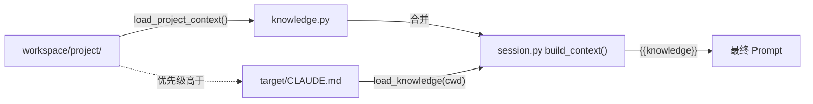

project context 注入顺序：project 层 → target 层（target 层作为补充），确保项目级约束始终生效。

### 15.4 PM Agent 管理 Project Layer

```
pm-agent（category: management）
    ↓ 读取 input/feature.yaml 判断场景
    ├── 场景1：项目初始化 → 填写 project.yaml / tech_stack.yaml / roadmap.md
    ├── 场景2：创建 Agent Feature → nezha feature create + 更新 roadmap.md
    ├── 场景3：进度巡检 → nezha feature list + 输出 progress-report.md
    └── 场景4：规范更新 → 更新 standards/*.md 或 knowledge/CLAUDE.md
```

PM Agent 操作所有文件时使用注入的 `{project_dir}` 绝对路径，执行前先读取现有文件避免覆盖。

## 16. 调度优化

### 16.1 Feature 优先级调度

`Feature` dataclass 新增 `priority: int = 50`（范围 0-100），控制 `get_next()` 的选取顺序。

**排序规则**：`(-priority, created_at)` — 优先级高的先执行，同优先级按 FIFO 排序。

```bash
# 创建高优先级 Feature（0-100，默认 50）
nezha feature create frontend-agent --priority 80 --input hotfix.md

# 不设置优先级 → 默认 50，表现为公平 FIFO 队列
nezha feature create frontend-agent --input spec.md
```

**feature.yaml** 中以 `priority` 字段持久化：
```yaml
id: "2026-02-23-10-30-00_user-auth"
priority: 80
status: "pending"
...
```

### 16.2 自适应退避调度（ContinuousScheduler）

`ContinuousScheduler` 根据 `_execute_once()` 返回值自动调整执行间隔，避免在无任务或持续失败时空转。

**返回值**：
| `_execute_once()` 返回 | 含义 |
|---|---|
| `"success"` | session 正常完成 |
| `"failure"` | session 报错、Guard 拒绝、git 失败等 |
| `"no_task"` | 队列为空或无可执行任务 |

**退避逻辑**：

```
success  → _consecutive_failures = 0，interval 恢复基准值
failure  → _consecutive_failures++，interval = min(base * 2^n, max_backoff)
no_task  → backoff_on_no_task=true 时同 failure；false 时同 success
```

**相关配置**（`executor.yaml`）：
```yaml
scheduler:
  mode: "continuous"
  interval: 3          # 基准间隔（秒）
  max_backoff: 3600    # 最大退避上限（秒）；0 = 无上限
  backoff_on_no_task: true  # 无任务时是否退避（默认 true）
  concurrency: 1       # 并行执行的 feature 数量；1 = 串行（默认）
```

**并行执行**（`concurrency > 1`）：

当 `scheduler.concurrency > 1` 时，executor 使用 `asyncio.Semaphore(concurrency)` + `asyncio.gather()` 并发执行多个 pending features。每个 feature 独立调用 `execute_agent(feature_id=...)`，状态隔离。`concurrency=1` 时走原有串行路径，完全向后兼容。

### 16.3 全局 MCP 配置（mcp_servers）

在 `executor.yaml` 配置一次，所有 Agent 自动共享；Agent YAML 中同名 key 覆盖全局配置。

```yaml
# executor.yaml
mcp_servers:
  filesystem:
    command: "npx"
    args: ["-y", "@modelcontextprotocol/server-filesystem", "/workspace"]
  code-analysis:
    type: "sse"
    url: "http://192.168.2.20:8000/sse"
```

合并优先级：`global mcp_servers` < `agent.engine.mcp_servers`（agent 级覆盖全局）。

---

## 17. Feature Queue 系统

### 17.1 workspace / target 分离

| 概念 | 说明 | 示例 |
|------|------|------|
| **workspace** | 元数据目录（feature.yaml、input/、task_list.json）| `workspace/frontend-agent/features/<id>/` |
| **target** | 代码仓库（LLM 的 cwd，git 操作发生在此）| `/path/to/my-project/` |

design/planning agent 只有 workspace，无 target。

### 17.2 Feature 生命周期

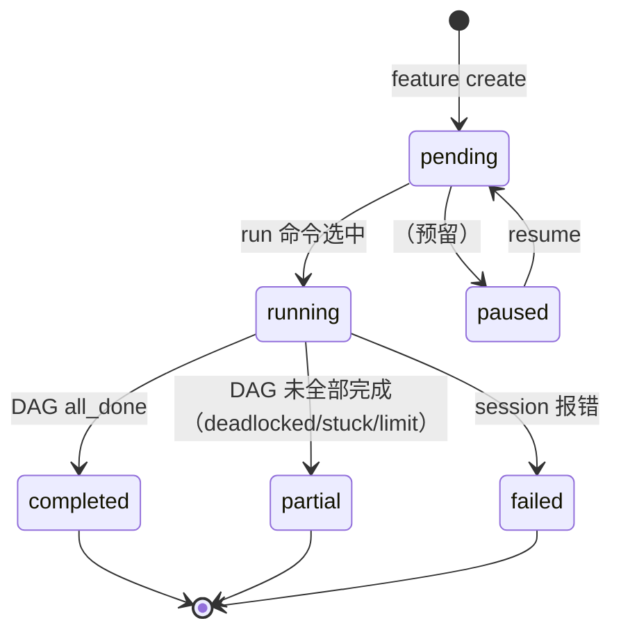

### 17.3 Feature Steps（V2.0 F4）

Feature 可以包含多个审批步骤（`steps`），每个 step 可声明依赖关系形成 DAG：

```yaml
# feature.yaml
steps:
  - id: "design"
    title: "设计方案"
    status: "completed"
  - id: "implement"
    title: "代码实现"
    depends_on: ["design"]
    status: "pending"
  - id: "review"
    title: "代码审查"
    depends_on: ["implement"]
    status: "pending"
```

CLI 操作：
- `nezha feature approve <feature-id> <step-id>` — 标记 step 为 completed
- `nezha feature reject <feature-id> <step-id> --note "reason"` — 标记 step 为 pending 并附加备注

当最后一个 step 被 approve 时，feature 状态自动更新为 completed。

### 17.4 费用统计（V2.0 F5）

`feature show` 自动解析 `execution-report.md` 并显示费用摘要：
- 总费用（`$X.XXXX`）、总 session 数、总时长
- Session Timeline 明细表

`feature list` 增加 COST 列，显示各 feature 的总费用。

### 17.5 Dashboard（V2.1 F2）

`nezha dashboard` 生成自包含静态 HTML 文件（`state/dashboard.html`），包含：
- 概览卡片：总 features、完成率、总费用、总 sessions
- Feature 表格：ID、状态、费用、session 数、时长
- CSS bar chart 费用对比

`--open` 参数可自动打开浏览器。实现在 `interface/dashboard.py`。

### 17.6 Feature Queue 执行流程

```
nezha run frontend-agent
    ↓
features/ 目录存在？
  否 → 旧逻辑（workspace 直接作为 cwd，向后兼容）
  是 → Feature Queue 模式：
        ↓
        get_next(agent_name) → 最早 pending Feature
        ↓
        branch_per_feature=true → git checkout -b feat/<feature-id>（在 target）
        ↓
        update_status(RUNNING)
        ↓
        run_session(workspace=feature_workspace, target=target, agent_workspace=workspace)
        ↓
        session_success → post_tools 执行（git-tool、test-tool 等）
        auto_commit=true → git add -A && git commit（在 target）
        auto_push=true  → git push origin <branch>
        ↓
        update_status(COMPLETED / FAILED)
```

## 18. Post-Tools 系统（确定性工具）

### 20.1 设计目标

在 Agent session 成功结束后，自动执行一组**确定性**操作（非 LLM，无 token 消耗）：运行测试、检查代码质量、提交代码等。与 Agent 的 AI 能力解耦，保证流程可复现。

### 20.2 架构

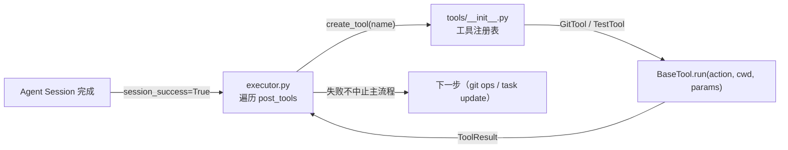

- `BaseTool`：Protocol（`run(action, cwd, params) → ToolResult`）
- `create_tool(name)`：注册表工厂，通过名称实例化工具
- `cwd`：coding agent 用 `target`，其他 agent 用 `feature_workspace`

### 20.3 内置工具

| 工具名 | 类 | action | 功能 |
|--------|-----|--------|------|
| `git-tool` | `GitTool` | `status` | 查看工作区状态 |
| | | `diff` | 查看变更 diff |
| | | `add` | 暂存文件（params: `files: ["."]`）|
| | | `commit` | 提交（params: `message: "..."`, `add_all: true`）|
| | | `push` | 推送远端（params: `branch: "..."`, `remote: "origin"`）|
| | | `log` | 查看提交日志（params: `n: 5`）|
| `test-tool` | `TestTool` | `run` | 运行测试（params: `command: "pytest"`）|
| | | `coverage` | 运行覆盖率（params: `command: "pytest --cov"`）|

### 20.4 配置示例（agents/*.yaml）

```yaml
pipeline:
  post_tools:
    - name: test-tool
      action: run
      params:
        command: "python -m pytest tests/ -q"
    - name: git-tool
      action: commit
      params:
        message: "feat: feature completed"
        add_all: true
```

`post_tools` 按声明顺序执行，单个工具失败不中止后续工具。

## 19. `nezha code` 命令（交互式 Claude Code 启动）

### 20.1 设计目标

`nezha run` 是无人值守的批量执行模式，但对于需要人工介入的场景（调试、返工、功能探索）体验较差。`nezha code` 通过 `os.execvpe` 直接替换进程为 Claude Code，将 Agent 的模型配置、API 凭据和项目上下文**预加载**到 Claude Code 中，提供完整的交互式开发体验。

与 `vibe` 模式（自定义 Python REPL）的对比：

| | `nezha vibe` | `nezha code` |
|--|---|---|
| 底层 | 自定义 Python REPL | 原生 Claude Code |
| 交互体验 | 受限 | 完整（所有 Claude Code 功能可用） |
| 上下文载入 | 是 | 是（以 initial message 形式） |
| 模型配置 | 继承 Agent YAML | 继承 Agent YAML（映射到 Claude Code env vars） |

### 20.2 执行流程

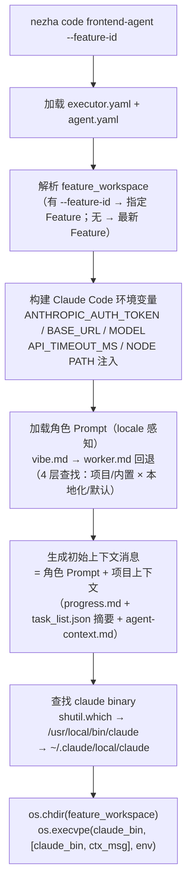

### 20.3 环境变量映射

Claude Code 从以下环境变量读取模型配置（与 `settings.local.json` 等价）：

| Claude Code 环境变量 | 来源（Agent YAML） | 说明 |
|---------------------|-------------------|------|
| `ANTHROPIC_AUTH_TOKEN` | `engine.env.ANTHROPIC_API_KEY` 或 `ANTHROPIC_AUTH_TOKEN` | Claude Code 使用此变量名（非 `ANTHROPIC_API_KEY`） |
| `ANTHROPIC_BASE_URL` | `engine.env.ANTHROPIC_BASE_URL` | 第三方 API 代理（GLM/MiniMax 等） |
| `ANTHROPIC_DEFAULT_SONNET_MODEL` | `engine.model` | Claude Code 默认 Sonnet 模型 |
| `ANTHROPIC_DEFAULT_OPUS_MODEL` | `engine.model` | Claude Code 默认 Opus 模型 |
| `ANTHROPIC_DEFAULT_HAIKU_MODEL` | `engine.model` | Claude Code 默认 Haiku 模型 |
| `API_TIMEOUT_MS` | 固定 `600000` | API 超时（10 分钟，防止 LLM 长时间思考超时） |
| `CLAUDE_CODE_DISABLE_NONESSENTIAL_TRAFFIC` | 固定 `1` | 禁用遥测 / 非必要网络请求 |

**注意**：`ANTHROPIC_API_KEY` 会被**移除**出 env，防止与 `ANTHROPIC_AUTH_TOKEN` 冲突导致 401 认证错误。

### 20.4 初始上下文消息

启动时将以下内容按顺序拼接为一条 initial message 传入 Claude Code：

```
[角色 Prompt 部分]
（vibe.md 或 worker.md 渲染后的内容，含角色定义、执行规则、步骤说明）

---

[项目上下文部分]
## 当前项目上下文（{agent_name}，工作空间：{feature_workspace}）（locale 感知标题）

--- progress.md ---
{progress_md 内容（最多 3000 字符）}

--- task_list.json ---
{task_list 摘要（待完成 / 已完成）}

--- agent-context.md ---
{agent-context.md 内容（最多 2000 字符）}
```

**角色 Prompt 查找顺序**（vibe 优先，找不到回退 worker）：
1. `vibe.md`（交互式角色定义）
2. `worker.md`（DAG 驱动角色定义，作为回退）

两种 prompt 均经过 4 层查找（locale 感知）。Claude Code 收到此消息后同时具备**角色定义**和**任务背景**，无需手动粘贴上下文。

### 20.5 典型使用场景

```bash
# 查看 Feature 列表，确认哪些功能未完成
nezha feature list frontend-agent

# 以交互方式接手指定 Feature，Claude Code 自动载入上下文
nezha code frontend-agent --feature-id 2026-02-19-11-18-53

# 不指定 feature-id：自动选最新 Feature
nezha code frontend-agent
```

## 20. 国际化（i18n）

### 20.1 设计目标

CLI 输出和执行器日志支持多语言，Prompt 模板支持按语言自动选择。底层使用 `python-i18n[YAML]` 库，key-based 查找，支持 `%{var}` 占位符。

### 20.2 模块结构

```
nezha/
├── i18n.py                    # 封装层：setup_locale() / get_locale() / t()
└── locales/
    ├── en.yaml                # 英文（默认，fallback）
    └── zh_CN.yaml             # 简体中文
```

`i18n.py` 公开接口：
- `setup_locale(locale)` — 全局初始化，只需调用一次
- `get_locale() → str` — 获取当前 locale
- `t(key, **vars) → str` — 翻译 + 变量插值（直接透传 `i18n.t`）

### 20.3 locale 优先级

```
AGENT_EXEC_LANG 环境变量      ← 最高优先级（覆盖所有）
    ↓
executor.yaml locale: zh_CN   ← 项目级配置
    ↓
"en"（硬编码默认）             ← 兜底
```

**两步初始化**（解决 argparse 帮助信息的鸡蛋问题）：

```python
# Step 1：main() 开始时，parse_args() 之前
_env_locale = os.environ.get("AGENT_EXEC_LANG")
setup_locale(_env_locale or "en")   # 覆盖 argparse --help 的输出

# Step 2：parse_args() 之后
if not _env_locale and args.config:
    cfg = load_executor_config(args.config)
    if cfg.locale != "en":
        setup_locale(cfg.locale)    # 覆盖运行时输出
```

### 20.4 翻译文件结构

```yaml
# en.yaml / zh_CN.yaml
en:                           # 根键必须匹配 locale 名称
  executor:
    run:
      starting: "Starting agent: %{agent}"
      completed: "Agent completed successfully"
    error:
      task_not_found: "Task not found: %{id}"
  cli:
    code:
      feature_workspace: "[code] Feature workspace: %{path}"
      info:
        context_header: "## Current Project Context (%{agent}, workspace: %{workspace})"
    main:
      not_implemented: "'%{command}' not yet implemented."
```

`en.yaml` 作为 fallback：缺少 zh_CN 翻译的 key 自动降级到英文。

### 20.5 Prompt 模板 locale 感知

`resolve_prompt_path(prompts_dir, prompt_path, locale)` 提取语言代码后缀（`"zh_CN"` → `"zh"`）并按四层顺序查找：

| 层级 | 位置 | 文件 |
|------|------|------|
| 1 | 项目 `prompts/` | `worker.zh.md` |
| 2 | 项目 `prompts/` | `worker.md` |
| 3 | 包内置 `templates/prompts/` | `worker.zh.md` |
| 4 | 包内置 `templates/prompts/` | `worker.md` |

英文 locale 跳过语言后缀查找（不存在 `worker.en.md`），直接查 Layer 2 和 Layer 4。

### 20.6 使用方式

```bash
# 方法一：环境变量（优先级最高，影响所有命令包括 --help）
AGENT_EXEC_LANG=zh_CN nezha run frontend-agent

# 方法二：executor.yaml 配置（项目级持久配置）
# executor.yaml
locale: zh_CN

# Prompt 自动选择（locale=zh_CN 时，vibe.md → vibe.zh.md）
nezha code frontend-agent   # 自动注入中文角色 Prompt
```

## 21. 集成测试自动修复循环 (Post-Task Test Cycle)

### 21.1 设计目标

DAG 引擎逐个完成 Feature 并用 `verification_command` 跑单元测试，但 **DAG 全部通过后缺少集成/E2E 测试环节**。模块各自通过单元测试，不代表组合在一起能工作。

### 21.2 设计决策

**不引入独立 test-agent**。集成测试是确定性命令（如 `./mvnw verify`），不需要 LLM。修复阶段复用 coding-agent + 专用 fix prompt（`coding/fix.md`），避免新 agent 类型的复杂度。

### 21.3 执行流程

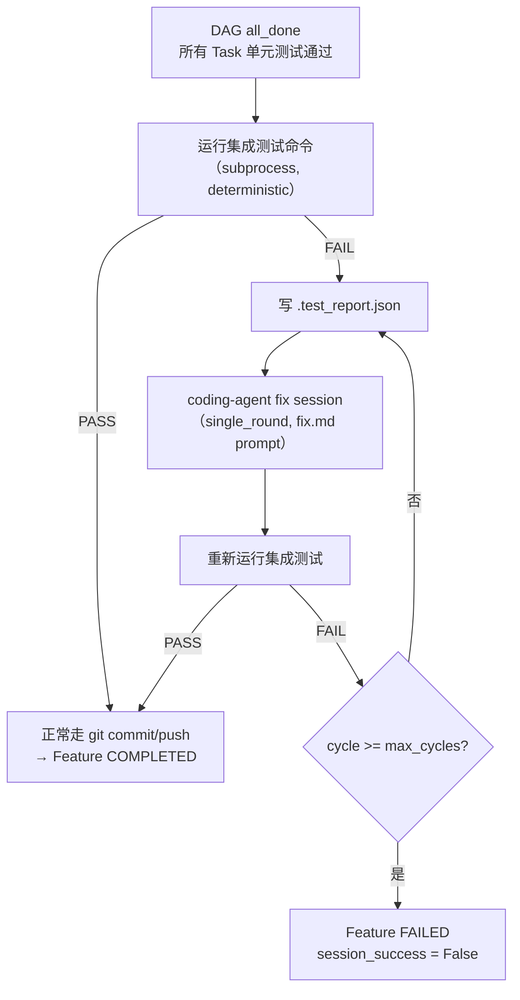

### 21.4 配置

```yaml
# agent.yaml
pipeline:
  post_task_test:
    enabled: true                              # 默认 false，零影响
    command: "./mvnw verify -pl integration-tests"
    max_cycles: 3                              # 最多修复轮数
    timeout: 600                               # 单次测试超时（秒）
```

`PostTaskTestConfig` dataclass（`config.py`）：

```python
@dataclass
class PostTaskTestConfig:
    enabled: bool = False
    command: str = ""
    max_cycles: int = 3
    timeout: int = 600
```

### 21.5 关键模块

| 模块 | 功能 |
|------|------|
| `testing/integration.py` | `run_test_command()` — subprocess 执行测试，截断输出到 3000 字符 |
| | `write_test_report()` — 写 `.test_report.json`（含 output, cycle, previous_fixes） |
| | `RunResult` — 单次测试结果 (passed, exit_code, output, duration_ms) |
| | `CycleResult` — 整个循环结果 (passed, cycles_run, total_cost_usd, exit_reason) |
| `executor.py` | 注入点：multi_round 成功后、git commit 前；调用 `TaskDAG.is_all_done()` 验证 |
| `coding/fix.md` | Fix agent prompt：读 `.test_report.json`，聚焦集成问题，检查 `previous_fixes` 避免重复 |

### 21.6 `.test_report.json` 结构

```json
{
  "cycle": 1,
  "max_cycles": 3,
  "test_command": "./mvnw verify",
  "passed": false,
  "exit_code": 1,
  "output": "...(truncated to 3000 chars)...",
  "duration_ms": 45000,
  "timestamp": "2026-02-25T10:30:00+00:00",
  "previous_fixes": [
    {"cycle": 1, "error_summary": "...", "fix_applied": "..."}
  ]
}
```

`previous_fixes` 字段防止 AI 重复相同的失败方案。

### 21.7 预留扩展

未来可加 `agent: "ops-agent"` + `prompt: "ops/verify.md"` 字段，支持 LLM 驱动的验证模式（遗留代码、无法用确定性命令验证的场景）。当前只实现 `command` 模式。

---

## 22. TDD 策略 — AI 编码代理的测试驱动开发

### 22.1 问题

AI 编码代理如果先写实现再写测试，会出现两个问题：
1. **自己批自己的作业** — AI 只会写通过当前实现的测试，而非验证需求的测试
2. **垃圾测试** — 测试构造函数、getter/setter 等零价值代码，浪费时间和 token

### 22.2 核心原则

**测试必须基于验收标准 (acceptance criteria)，不基于代码结构。**

判断准则："如果这个测试失败了，说明什么业务出了问题？"——答不上来就不要写。

### 22.3 TDD 步骤顺序（所有语言通用）

```
1. Read    — 读取现有代码了解约定
2. RED     — 基于验收标准写失败测试
3. Run     — 确认测试失败（尚无实现）
4. GREEN   — 实现代码让测试通过
5. Run     — 确认测试通过
6. Commit  — 更新状态 + 提交
```

关键：**步骤 2 (测试) 在步骤 4 (实现) 之前**。

### 22.4 后端测试策略（Java/Spring Boot）

**必须测试**：
- 业务规则和领域逻辑（计算、状态流转、有业务含义的校验）
- 边界条件和异常场景（非法输入、边界值、并发访问）
- API 契约（请求/响应格式、状态码、错误响应）
- 包含业务逻辑的数据转换

**禁止测试**：
- 构造函数、getter、setter、toString、equals/hashCode
- 没有业务逻辑的简单 CRUD（仅委托给 repository）
- Spring 框架行为（`@Autowired` 是否生效、`@Transactional` 是否回滚）
- 没有逻辑的 Entity ↔ DTO 映射
- 只声明 Bean 的配置类

**测试分层**：Service（Mockito）→ Controller（`@WebMvcTest`）→ Integration（`@SpringBootTest` 仅关键流程）

### 22.5 前端测试策略（React/Vue）

核心理念（Kent C. Dodds Testing Trophy）：**"Write tests. Not too many. Mostly integration."**

**必须测试**：
- 用户交互流程（"用户点击按钮 → 看到结果"）
- 条件渲染、表单验证、异步操作结果、错误边界

**禁止测试**：
- 组件内部 state 变量、CSS 类名/DOM 结构
- Props 传递、第三方库行为、纯展示组件

**测试方法**：
- 用 `getByRole`/`getByText`/`getByLabelText` 查询元素（用户视角）
- 用 `userEvent` 模拟交互（非 `fireEvent`）
- 用 MSW mock API（网络层拦截，非 mock fetch）
- 以集成测试为主（页面/功能级），不逐个组件写单元测试

**工具栈**：Vitest + Testing Library + MSW + jsdom（init prompt 中自动搭建）

### 22.6 已知限制：上下文污染

同一个 AI session 既写测试又写实现，存在"上下文污染"风险 — 测试编写阶段的分析会渗透到实现阶段，AI 不自觉地"作弊"。

**当前缓解**：通过 prompt 中明确的步骤分离（RED → confirm FAIL → GREEN）来约束。

**未来方向**：可用子代理隔离 RED/GREEN/REFACTOR 三个阶段到不同 session，彻底消除上下文污染。需要 executor 层支持单 Feature 内的多 session 编排。

### 22.7 相关文件

| 文件 | 内容 |
|------|------|
| `prompts/java/worker.md` / `.zh.md` | Java TDD 步骤 + 必须/禁止测试清单 |
| `prompts/frontend/worker.md` / `.zh.md` | 前端 TDD 步骤 + Testing Library 方法论 |
| `prompts/frontend/init.md` / `.zh.md` | 前端测试基础设施搭建（Vitest + Testing Library + MSW） |
| `prompts/coding/fix.md` / `.zh.md` | 集成测试修复 prompt |
