# Agent Executor 长期愿景

> 本文档描述未来演进方向和架构愿景，用于讨论和规划。当前实现见 [architecture.md](architecture.md)。

## 1. 愿景概述

### 一期设计范围

- **运行环境**：单台 Mac / Linux，一个项目对应一个 agent-executor 实例
- **暂不涉及**：项目管理能力、跨项目协调、分布式部署
- **核心目标**：在单机上让多 Agent 协作完成一个项目的开发任务，各种预期可达

### 演进方向

从「单 Agent 跑任务」演进为「多 Agent 协作的项目交付平台」：

- **Agent vs Tool**：AI 推理能力（Agent）与确定性软件能力（Tool）分离
- **三层 Workspace**：project（项目共享）→ agent（Agent 级）→ task（任务隔离）
- **PM Agent**：项目经理 Agent，维护项目元数据和规范，协调各 Agent（远期）
- **Feature Queue**：需求队列管理，每个需求独立追踪，接口预留未来分布式扩展
- **Agent 协作**：callable Agent 自动调用，非 callable 需人工审查

## 2. Agent vs Tool

### 核心区分

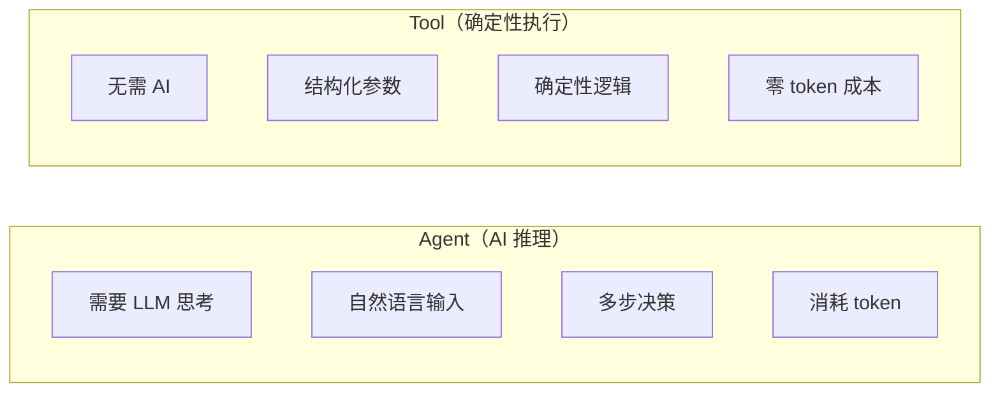
```mermaid
graph LR
    subgraph Agent["Agent（AI 推理）"]
        direction TB
        A1["需要 LLM 思考"]
        A2["自然语言输入"]
        A3["多步决策"]
        A4["消耗 token"]
    end

    subgraph Tool["Tool（确定性执行）"]
        direction TB
        T1["无需 AI"]
        T2["结构化参数"]
        T3["确定性逻辑"]
        T4["零 token 成本"]
    end
```

| | Agent | Tool |
|--|-------|------|
| **本质** | AI 推理能力 | 传统软件能力 |
| **输入** | 自然语言 / 非结构化 | 结构化参数 |
| **过程** | LLM 思考、多步决策 | 确定性执行，无 AI |
| **成本** | 贵（token 消耗） | 免费（本地执行） |
| **举例** | planner: 需求→JSON | git-tool: commit+push |
| **类比** | 人的大脑 | 人手里的工具 |

### Tool 在 Pipeline 中的位置

Tool 运行在 Agent session 之外，由 pipeline 编排调用：

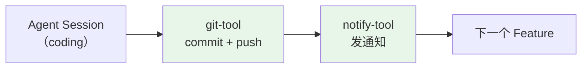
```mermaid
flowchart LR
    A1["Agent Session<br/>（coding）"] --> T1["git-tool<br/>commit + push"]
    T1 --> T2["notify-tool<br/>发通知"]
    T2 --> A2["下一个 Feature"]

    style T1 fill:#e8f5e9
    style T2 fill:#e8f5e9
```

与 MCP 的区别：
- **MCP Tool**：在 LLM session 内部，LLM 决定何时调用（session 内）
- **Executor Tool**：在 pipeline 层面，由编排逻辑决定调用（session 之间）

### Tool 示例

| Tool | 功能 | 触发时机 |
|------|------|---------|
| `git-tool` | commit、push、create PR、create branch | Agent session 完成后 |
| `test-tool` | 跑测试、收集结果 | 验证阶段 |
| `notify-tool` | Slack / 钉钉通知 | 任务完成/失败时 |
| `deploy-tool` | 部署到 staging / prod | 测试通过后 |
| `lint-tool` | 代码格式化、lint 检查 | coding 后、commit 前 |

### Tool 配置（草案）

```yaml
# tools/git-tool.yaml
tool:
  name: "git-tool"
  description: "Git 操作：commit、push、create PR"

actions:
  commit:
    params: [message, files]
    command: "git add {files} && git commit -m '{message}'"
  push:
    params: [branch, remote]
    command: "git push {remote} {branch}"
  create_pr:
    params: [title, body, base]
    command: "gh pr create --title '{title}' --body '{body}' --base {base}"
```

Agent YAML 中声明使用哪些 Tool：

```yaml
# agents/evolve-agent.yaml
pipeline:
  pre_agents:
    - name: "planner-agent"
      artifact: "task_list.json"
  post_tools:                          # Agent session 完成后执行
    - name: "git-tool"
      action: "commit"
    - name: "test-tool"
      action: "run"
```

## 3. 角色体系

### 3.1 角色图谱

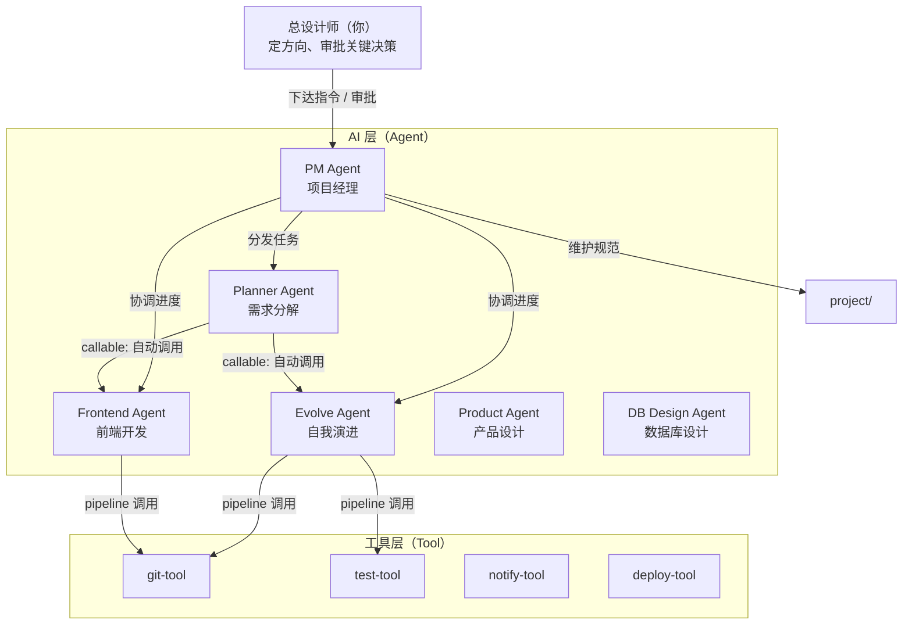
```mermaid
graph TB
    User["总设计师（你）<br/>定方向、审批关键决策"]

    subgraph AI["AI 层（Agent）"]
        PM["PM Agent<br/>项目经理"]
        PL["Planner Agent<br/>需求分解"]
        EV["Evolve Agent<br/>自我演进"]
        FE["Frontend Agent<br/>前端开发"]
        PR["Product Agent<br/>产品设计"]
        DB["DB Design Agent<br/>数据库设计"]
    end

    subgraph Tools["工具层（Tool）"]
        GT["git-tool"]
        TT["test-tool"]
        NT["notify-tool"]
        DT["deploy-tool"]
    end

    User -->|"下达指令 / 审批"| PM
    PM -->|"维护规范"| Project["project/"]
    PM -->|"分发任务"| PL
    PM -->|"协调进度"| EV
    PM -->|"协调进度"| FE
    PL -->|"callable: 自动调用"| EV
    PL -->|"callable: 自动调用"| FE
    EV -->|"pipeline 调用"| GT
    EV -->|"pipeline 调用"| TT
    FE -->|"pipeline 调用"| GT
```

| 角色 | 谁 | 职责 | 管理范围 |
|------|-----|------|---------|
| 总设计师 | 你 | 定方向、审批关键决策 | 全局 |
| PM Agent | AI | 维护 `project/`，协调 Agent，追踪进度，向你汇报 | `project/` 读写 |
| Planner Agent | AI（callable） | 需求 → task_list.json | feature 内写入 |
| 其他 Agent | AI | 执行具体开发任务 | `project/` 只读 + feature 内读写 |
| Tool | 软件 | 确定性操作（git、test、notify） | pipeline 编排调用 |

### 3.2 Agent 三层分类（未实现，打包分发概念）

> ⚠️ **本节描述的是未来的打包/分发概念，目前尚未实现。**
>
> 注意区分两个不同的分类维度：
> - **`category` 字段**（已实现）：YAML 中的 `agent.category: "coding" | "planning" | "design" | ...`，表示 Agent 的**功能角色**，影响运行时行为（如 coding 类用 `target` 作为 cwd）。
> - **内置/模板/自定义**（本节，未实现）：描述 Agent 的**来源和分发方式**，是打包目标（`nezha/templates/`），与 `category` 字段无关。
>
> 目前所有 agent（evolve、frontend、planner 等）都放在项目的 `agents/` 目录，本质上都是"自定义"。

Agent 按来源和维护方分为三类：

| 类型 | 代表 | 维护方 | 分发方式 | upgrade 更新？ |
|------|------|--------|---------|-------------|
| **内置** (internal) | evolve、helper、planner | 框架作者 | pip 包内 | 自动 |
| **模板** (starter) | db-design、pm、frontend、product | 框架作者 | pip 包内（稳定后） | 自动 |
| **自定义** (custom) | 用户自己创建的 agent | 用户 | 项目目录 | 不动 |

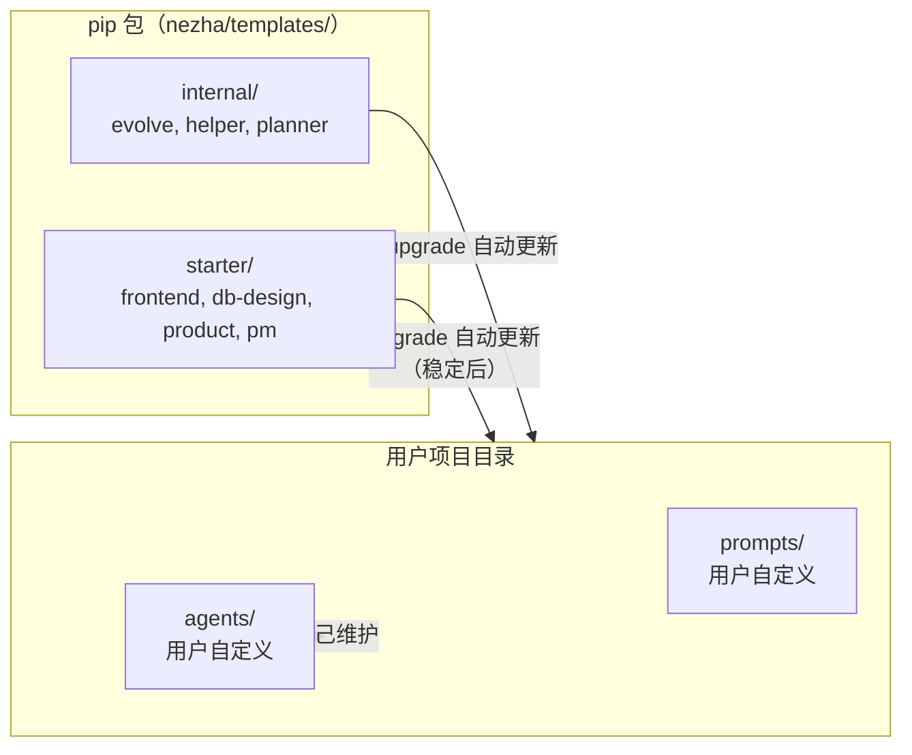
```mermaid
graph LR
    subgraph Pkg["pip 包（nezha/templates/）"]
        I["internal/<br/>evolve, helper, planner"]
        S["starter/<br/>frontend, db-design, product, pm"]
    end

    subgraph Proj["用户项目目录"]
        C["agents/<br/>用户自定义"]
        O["prompts/<br/>用户自定义"]
    end

    I -->|"upgrade 自动更新"| Proj
    S -->|"upgrade 自动更新<br/>（稳定后）"| Proj
    C -->|"用户自己维护"| Proj
```

**内置 Agent**：框架运转的核心（evolve 自我演进、helper 辅助用户、planner 分解任务），现在即可放进 pip 包。

**模板 Agent**：覆盖软件开发常见角色的"开箱即用"起点，目前仍在迭代，**前期直接手动拷贝**，待稳定后迁入 pip 包。

**自定义 Agent**：用户针对具体项目创建，完全用户所有，框架不干预。

### 3.3 Prompt 双层查找

无论是内置还是模板 Agent，prompt 都支持项目级覆盖：

```
查找顺序：
1. 项目目录（用户覆盖）：  my-project/prompts/frontend/worker.md   ← 优先
2. 包内默认：              nezha/templates/prompts/frontend/worker.md  ← fallback
```

这意味着：
- 用户没有自定义 → 跟着 pip upgrade 自动得到改进后的 prompt ✓
- 用户有自定义覆盖 → pip upgrade 不影响，用户版本始终优先 ✓

### 3.4 模板 → 自定义 的转变

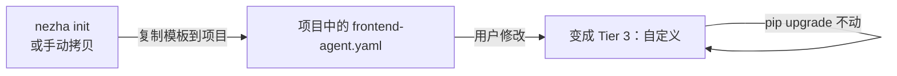
```mermaid
flowchart LR
    A["nezha init<br/>或手动拷贝"] -->|"复制模板到项目"| B["项目中的 frontend-agent.yaml"]
    B -->|"用户修改"| C["变成 Tier 3：自定义"]
    C -->|"pip upgrade 不动"| C
```

这是单向、显式的转变。框架永远不会静默覆盖用户已修改的文件。

### 3.5 分发与安装流程（目标）

#### 新项目起步

```bash
# 1. 安装框架（含内置 agent：evolve、helper、planner）
pip install agent-executor

# 2. 初始化项目（复制 starter agent 到当前目录）
nezha init my-project                            # 全量 starter
nezha init my-project --starter frontend,db      # 只要指定的 starter

# 项目结构生成后：
# agents/evolve-agent.yaml    ← 来自 internal（随 pip 自动更新）
# agents/planner-agent.yaml   ← 来自 internal
# agents/helper-agent.yaml    ← 来自 internal
# agents/frontend-agent.yaml  ← 来自 starter（拷贝到本地，用户可修改）
# prompts/                    ← 覆盖层（空），不影响包内默认 prompt

# 3. 初始化项目知识库
nezha project init
# 生成 workspace/project/（project.yaml、tech_stack.yaml、standards/、roadmap.md）
```

#### 更新框架

```bash
pip upgrade agent-executor

# 效果：
# - evolve/helper/planner 的 yaml + prompt 自动更新（internal）
# - frontend/db-design 等 starter 如果用户未修改 → 也自动更新
# - 用户已修改的 agents/prompts → 不动（用户层优先）
```

#### 查看模板差异 / 手动更新

```bash
nezha template diff frontend-agent               # 查看本地与最新版的差异
nezha template update frontend-agent             # 更新某个模板（有 diff 提示）
```

#### Prompt 双层查找（安装后的运行时行为）

```
查找顺序（每次 session 启动时）：
1. 用户项目目录（优先）：  ./prompts/frontend/worker.md   ← 用户自定义覆盖
2. 包内默认（fallback）：   nezha/templates/prompts/frontend/worker.md
```

这意味着：用户没有自定义 prompt → 跟着 `pip upgrade` 自动得到改进 ✓；用户有覆盖 → 不受影响 ✓。

### 3.6 包内目录结构（目标）

```
nezha/
└── templates/
    ├── internal/                  # Tier 1：随框架发布
    │   ├── agents/
    │   │   ├── evolve-agent.yaml
    │   │   ├── helper-agent.yaml
    │   │   └── planner-agent.yaml
    │   └── prompts/
    │       ├── evolve/worker.md
    │       ├── helper/worker.md
    │       └── planner/worker.md
    └── starter/                   # Tier 2：稳定后迁入
        ├── agents/
        │   ├── frontend-agent.yaml
        │   ├── db-design-agent.yaml
        │   ├── product-agent.yaml
        │   └── pm-agent.yaml
        └── prompts/
            ├── frontend/worker.md
            ├── db-design/worker.md
            ├── product/worker.md
            └── pm/worker.md
```

## 4. 三层 Workspace 模型

### 4.1 目录结构

```
workspace/
├── project/                            # 第一层：项目级（PM Agent 管理）
│   ├── project.yaml                    #   项目元信息（名称、仓库、描述）
│   ├── tech_stack.yaml                 #   技术栈选型
│   ├── standards/                      #   规范文档
│   │   ├── code-style.md              #     代码规范
│   │   ├── architecture.md            #     架构约定
│   │   └── api-conventions.md         #     API 规范
│   ├── knowledge/                      #   知识库
│   │   ├── CLAUDE.md                  #     Agent 共享知识
│   │   └── decisions/                 #     架构决策记录（ADR）
│   └── roadmap.md                      #   路线图 / 里程碑
│
├── product-agent/                      # design/planning 类（产出在 workspace 内）
│   ├── agent-context.md
│   └── features/
│       └── 2026-02-19-11-18-53/
│           ├── feature.yaml
│           ├── input/
│           │   └── requirements.md
│           ├── PRD.md                  #   ← 产出：直接在 feature 目录
│           ├── task_list.json
│           └── tech_stack.yaml
│
├── frontend-agent/                     # coding 类（产出在 target 代码仓库）
│   ├── agent-context.md
│   └── features/
│       └── 2026-02-19-14-30-00/
│           ├── feature.yaml            #   含 branch 信息
│           ├── input/
│           │   └── requirements.md
│           ├── task_list.json
│           └── execution-report.md     #   ← 元数据在这里，代码在 target
│
└── evolve-agent/                       # coding 类（特殊：target = 自身项目）
    ├── agent-context.md
    └── features/
        └── ...

# coding agent 的代码仓库（target）在 workspace 之外：
/Users/glen/projects/my-app/            # frontend-agent 的 target
/Users/glen/.../agent-executor/         # evolve-agent 的 target（就是本项目）
```

### 4.2 三层数据模型

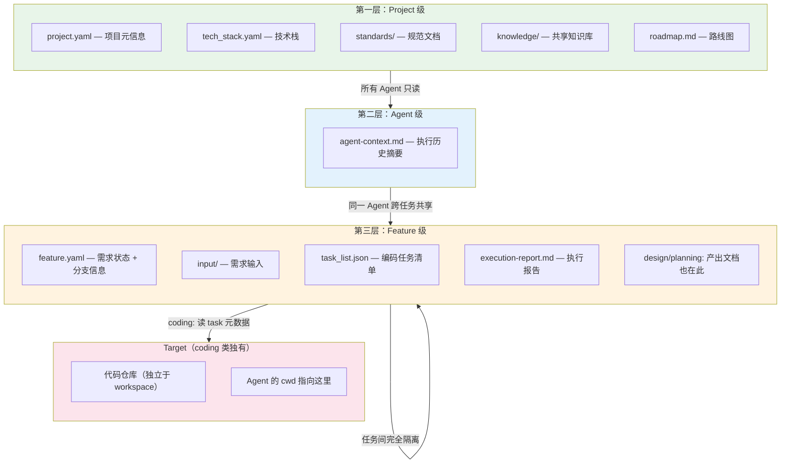
```mermaid
graph TB
    subgraph L1["第一层：Project 级"]
        direction TB
        P1["project.yaml — 项目元信息"]
        P2["tech_stack.yaml — 技术栈"]
        P3["standards/ — 规范文档"]
        P4["knowledge/ — 共享知识库"]
        P5["roadmap.md — 路线图"]
    end

    subgraph L2["第二层：Agent 级"]
        direction TB
        A1["agent-context.md — 执行历史摘要"]
    end

    subgraph L3["第三层：Feature 级"]
        direction TB
        T1["feature.yaml — 需求状态 + 分支信息"]
        T2["input/ — 需求输入"]
        T3["task_list.json — 编码任务清单"]
        T4["execution-report.md — 执行报告"]
        T5["design/planning: 产出文档也在此"]
    end

    subgraph Target["Target（coding 类独有）"]
        direction TB
        TG1["代码仓库（独立于 workspace）"]
        TG2["Agent 的 cwd 指向这里"]
    end

    L1 -->|"所有 Agent 只读"| L2
    L2 -->|"同一 Agent 跨任务共享"| L3
    L3 -->|"coding: 读 task 元数据"| Target
    L3 -->|"任务间完全隔离"| L3

    style L1 fill:#e8f5e9
    style L2 fill:#e3f2fd
    style L3 fill:#fff3e0
    style Target fill:#fce4ec
```

### 4.3 读写权限

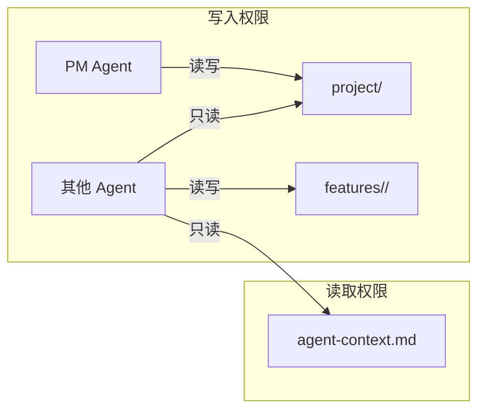
```mermaid
flowchart LR
    subgraph 写入权限
        PM["PM Agent"] -->|"读写"| Project["project/"]
        Agent["其他 Agent"] -->|"读写"| Task["features/<id>/"]
    end

    subgraph 读取权限
        Agent -->|"只读"| Project
        Agent -->|"只读"| AgentCtx["agent-context.md"]
    end
```

| 层级 | PM Agent | 其他 Agent | 说明 |
|------|----------|-----------|------|
| `project/` | 读写 | 只读 | PM 维护规范，其他 Agent 参考 |
| `<agent>/agent-context.md` | 读写 | 只读 | PM 可更新摘要，Agent 读取自身历史 |
| `<agent>/features/<id>/` | 只读 | 读写 | Agent 在自己的需求目录内工作 |

### 4.4 Coding Agent：workspace 与 target 分离

Coding 类 Agent 的特殊之处：**产出是代码，写入的是外部代码仓库，而非 workspace**。

如果把 workspace 直接指向代码仓库，executor 的元数据（input/、task_list.json、feature.yaml、.dag_context.json）会污染代码目录。因此需要分离：

- **workspace** = executor 元数据（feature.yaml、input/、task_list.json、execution-report）
- **target** = Agent 实际工作的代码仓库（cwd 指向这里）

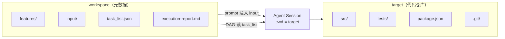
```mermaid
flowchart LR
    subgraph Workspace["workspace（元数据）"]
        W1["features/"]
        W2["input/"]
        W3["task_list.json"]
        W4["execution-report.md"]
    end

    subgraph Target["target（代码仓库）"]
        T1["src/"]
        T2["tests/"]
        T3["package.json"]
        T4[".git/"]
    end

    Agent["Agent Session<br/>cwd = target"] --> Target
    Workspace -->|"prompt 注入 input"| Agent
    Workspace -->|"DAG 读 task_list"| Agent
```

#### Agent 配置示例

```yaml
# coding 类：workspace 和 target 分离
# evolve-agent.yaml
workspace:
  path: "./workspace/evolve-agent"       # 元数据
target: "./"                              # 代码 = agent-executor 自身（固定）

# frontend-agent.yaml
workspace:
  path: "./workspace/frontend-agent"
target: "/Users/glen/projects/my-app"     # 已有代码仓库

# design/planning 类：不需要 target
# product-agent.yaml
workspace:
  path: "./workspace/product-agent"       # 产出就在 workspace 里
# target: 不配置
```

#### 按 category 的行为差异

| category | workspace 存什么 | target | Agent cwd |
|----------|----------------|--------|-----------|
| design / planning | 元数据 + 产出文档 | 不需要 | workspace/features/\<id\>/ |
| coding | 仅元数据 | 代码仓库（必配） | target 目录 |
| management | 元数据 + 管理文档 | 不需要 | workspace |

### 4.5 Git 策略

当前 `output.git_commit: true` 粒度太粗。需要拆细为独立的 git 配置块：

```yaml
# agent YAML 中
git:
  auto_commit: true           # 每轮/每任务自动 commit
  auto_push: false            # 默认不 push（公司项目安全）
  branch_per_task: true       # 每个 task 自动创建分支
  branch_prefix: "feat/"      # 分支名前缀
  base_branch: "main"         # 基于哪个分支创建
```

| 场景 | auto_commit | auto_push | branch_per_task |
|------|------------|-----------|-----------------|
| 个人项目 | true | true | true |
| 公司项目 | true | **false** | true |
| 自我演进（evolve-agent） | true | false | false（在当前分支） |

Push 变为显式操作：

```bash
nezha feature push <agent-name> <feature-id>    # 手动 push 某个需求的分支
```

#### feature.yaml 中记录分支信息

```yaml
id: "2026-02-19-11-18-53"
agent_name: "frontend-agent"
status: "completed"
branch: "feat/user-auth"            # 需求分支
base_branch: "main"                 # 基于哪个分支
created_at: "2026-02-19T11:18:53+08:00"
completed_at: "2026-02-19T15:30:00+08:00"
```

### 4.6 Coding Feature 串行与分支管理

Coding 类 Agent 天然串行：多个需求共享同一个代码仓库（target），必须逐个执行。

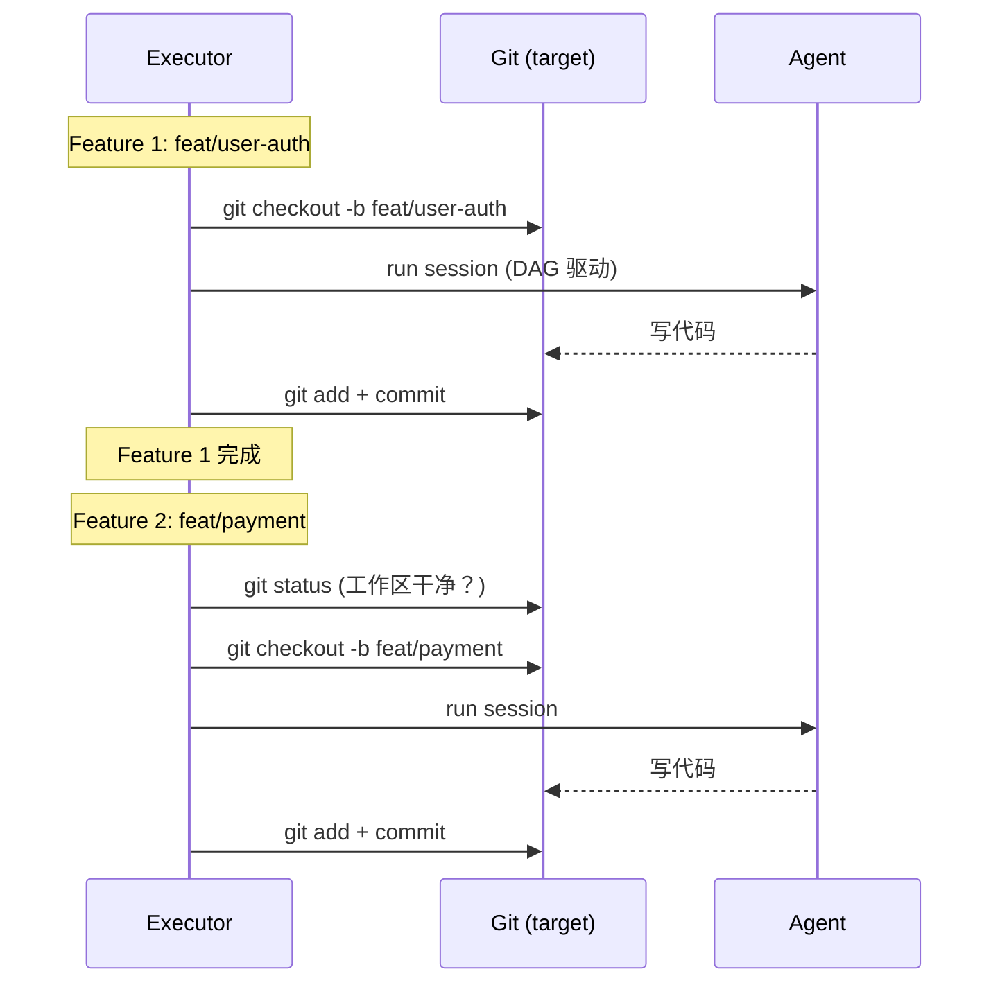
```mermaid
sequenceDiagram
    participant Exec as Executor
    participant Git as Git (target)
    participant Agent

    Note over Exec: Feature 1: feat/user-auth
    Exec->>Git: git checkout -b feat/user-auth
    Exec->>Agent: run session (DAG 驱动)
    Agent-->>Git: 写代码
    Exec->>Git: git add + commit
    Note over Exec: Feature 1 完成

    Note over Exec: Feature 2: feat/payment
    Exec->>Git: git status (工作区干净？)
    Exec->>Git: git checkout -b feat/payment
    Exec->>Agent: run session
    Agent-->>Git: 写代码
    Exec->>Git: git add + commit
```

#### 安全检查（切需求前）

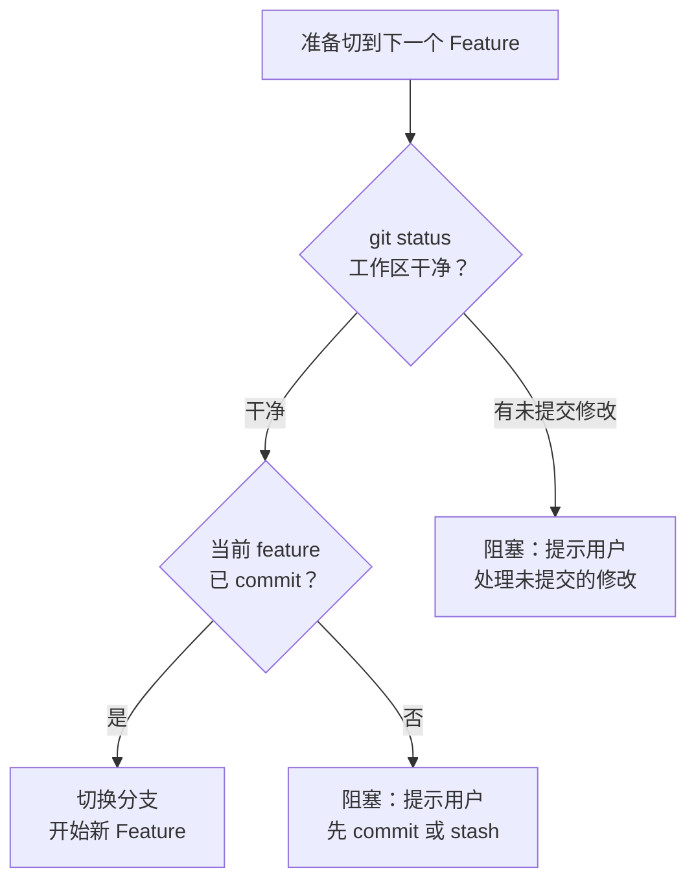
```mermaid
flowchart TD
    Start["准备切到下一个 Feature"] --> Check1{"git status<br/>工作区干净？"}
    Check1 -->|"干净"| Check2{"当前 feature<br/>已 commit？"}
    Check1 -->|"有未提交修改"| Block1["阻塞：提示用户<br/>处理未提交的修改"]
    Check2 -->|"是"| Switch["切换分支<br/>开始新 Feature"]
    Check2 -->|"否"| Block2["阻塞：提示用户<br/>先 commit 或 stash"]
```

Design/planning 类不受此限制——它们的产出在各自的 task 目录内，天然隔离，可以并行。

## 5. Feature Queue

### 5.1 核心概念

每个需求提交 = 一个 Feature。Feature 有独立的生命周期，互不干扰。

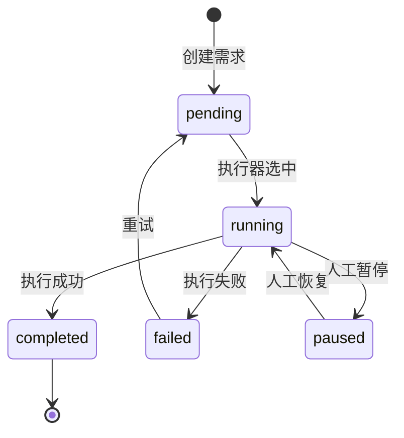
```mermaid
stateDiagram-v2
    [*] --> pending: 创建需求
    pending --> running: 执行器选中
    running --> completed: 执行成功
    running --> failed: 执行失败
    running --> paused: 人工暂停
    paused --> running: 人工恢复
    failed --> pending: 重试
    completed --> [*]
```

### 5.2 FeatureQueue 抽象

Port/Adapter 模式，与 design-notes.md 中 ArtifactStore 思路一致：

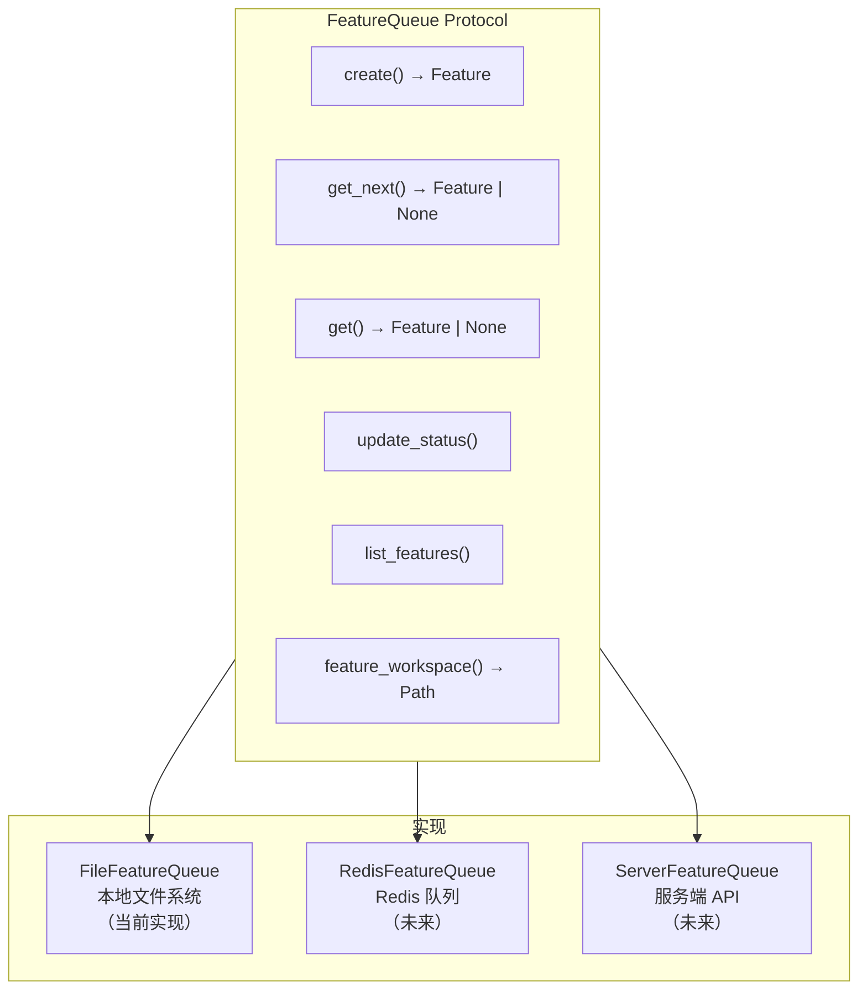
```mermaid
graph TB
    subgraph Protocol["FeatureQueue Protocol"]
        M1["create() → Feature"]
        M2["get_next() → Feature | None"]
        M3["get() → Feature | None"]
        M4["update_status()"]
        M5["list_features()"]
        M6["feature_workspace() → Path"]
    end

    subgraph Impl["实现"]
        F["FileFeatureQueue<br/>本地文件系统<br/>（当前实现）"]
        R["RedisFeatureQueue<br/>Redis 队列<br/>（未来）"]
        S["ServerFeatureQueue<br/>服务端 API<br/>（未来）"]
    end

    Protocol --> F
    Protocol --> R
    Protocol --> S
```

### 5.3 执行器集成

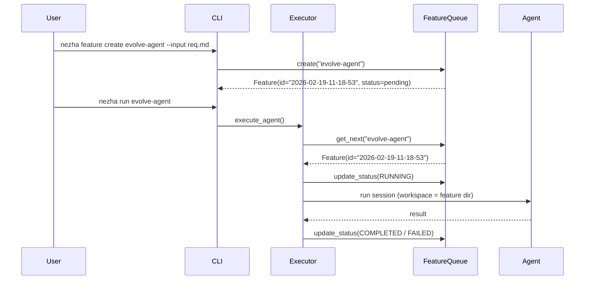
```mermaid
sequenceDiagram
    participant User
    participant CLI
    participant Exec as Executor
    participant FQ as FeatureQueue
    participant Agent

    User->>CLI: nezha feature create evolve-agent --input req.md
    CLI->>FQ: create("evolve-agent")
    FQ-->>CLI: Feature(id="2026-02-19-11-18-53", status=pending)

    User->>CLI: nezha run evolve-agent
    CLI->>Exec: execute_agent()
    Exec->>FQ: get_next("evolve-agent")
    FQ-->>Exec: Feature(id="2026-02-19-11-18-53")
    Exec->>FQ: update_status(RUNNING)
    Exec->>Agent: run session (workspace = feature dir)
    Agent-->>Exec: result
    Exec->>FQ: update_status(COMPLETED / FAILED)
```

### 5.4 向后兼容

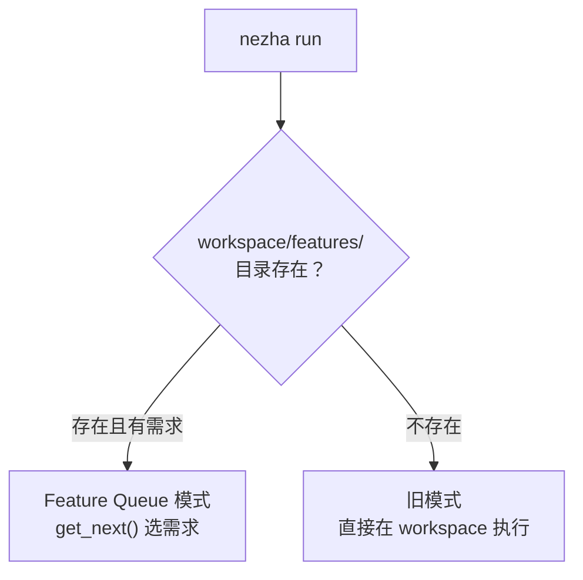
```mermaid
flowchart TD
    Start["nezha run"] --> Check{"workspace/features/<br/>目录存在？"}
    Check -->|"存在且有需求"| Queue["Feature Queue 模式<br/>get_next() 选需求"]
    Check -->|"不存在"| Legacy["旧模式<br/>直接在 workspace 执行"]
```

## 6. Agent 三通道：执行 + 对话 + 交互式 IDE

每个 Agent 具备三种交互模式，共享同一份配置（model、env、tools、security），但进程独立、互不阻塞。

### 三通道模型

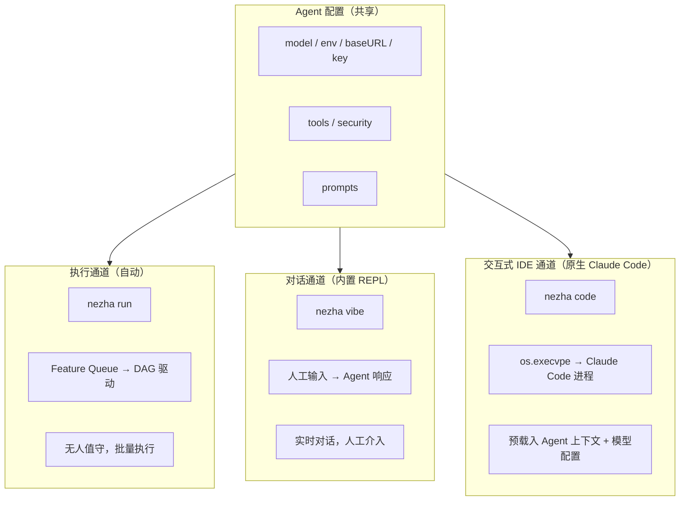
```mermaid
graph TB
    subgraph Config["Agent 配置（共享）"]
        C1["model / env / baseURL / key"]
        C2["tools / security"]
        C3["prompts"]
    end

    subgraph Run["执行通道（自动）"]
        R1["nezha run"]
        R2["Feature Queue → DAG 驱动"]
        R3["无人值守，批量执行"]
    end

    subgraph Vibe["对话通道（内置 REPL）"]
        V1["nezha vibe"]
        V2["人工输入 → Agent 响应"]
        V3["实时对话，人工介入"]
    end

    subgraph Code["交互式 IDE 通道（原生 Claude Code）"]
        CC1["nezha code"]
        CC2["os.execvpe → Claude Code 进程"]
        CC3["预载入 Agent 上下文 + 模型配置"]
    end

    Config --> Run
    Config --> Vibe
    Config --> Code
```

```
终端 1:  nezha run evolve-agent       → 自动跑任务（进程 A）
终端 2:  nezha vibe evolve-agent      → 内置 REPL 对话（进程 B）
终端 2:  nezha code evolve-agent      → 原生 Claude Code（进程替换，功能更完整）
                                              共享 workspace，各自独立进程
```

### `vibe` vs `code` 对比

| | `nezha vibe` | `nezha code` |
|--|---|---|
| 底层 | 自定义 Python REPL | 原生 Claude Code（`os.execvpe`） |
| 交互体验 | 受限（无工具预览、无历史等） | 完整（所有 Claude Code 功能） |
| 上下文载入 | 是（handoff context） | 是（initial message 形式） |
| 模型配置 | 继承 Agent YAML | 继承 Agent YAML → Claude Code env vars |
| 适合场景 | 轻量问答、快速调整 | 深度调试、返工、功能探索 |

推荐在需要深度人工介入时优先使用 `nezha code`，体验与直接使用 Claude Code 相同，但无需手动粘贴上下文或配置模型。

### 上下文加载策略

Vibe 模式的核心逻辑：**调整 Agent 的产出（输出），而非输入**。输入在上一步（上一个 Agent 或人工）已经确认，vibe 对话相当于对当前 Agent 的输出做「返工」。

默认上下文范围跟 Agent category 挂钩：

| category | 默认上下文 | vibe 调整的是 | 理由 |
|----------|----------|-------------|------|
| design / planning | `project/` 全量 + 当前产出 | 产出文档（设计稿、架构方案） | 输入需求已由上一步确认 |
| coding | 最近一次 feature 的上下文 | 代码产出（类似 rework） | 聚焦当前需求 |
| management | `project/` + 各 agent 进度 | 管理文档（roadmap、规范） | PM 要看全局 |

通过参数覆盖默认行为：

```bash
nezha vibe evolve-agent                      # 默认：最近 task 上下文
nezha vibe evolve-agent --feature 2026-02-19  # 指定某次 feature
nezha vibe evolve-agent --context all        # 全量上下文
nezha vibe db-design-agent                   # 默认：project/ 全量
```

### 典型场景

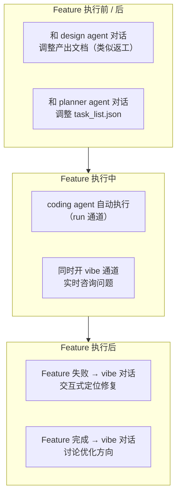
```mermaid
flowchart TD
    subgraph Before["Feature 执行前 / 后"]
        B1["和 design agent 对话<br/>调整产出文档（类似返工）"]
        B2["和 planner agent 对话<br/>调整 task_list.json"]
    end

    subgraph During["Feature 执行中"]
        D1["coding agent 自动执行<br/>（run 通道）"]
        D2["同时开 vibe 通道<br/>实时咨询问题"]
    end

    subgraph After["Feature 执行后"]
        A1["Feature 失败 → vibe 对话<br/>交互式定位修复"]
        A2["Feature 完成 → vibe 对话<br/>讨论优化方向"]
    end

    Before --> During --> After
```

| 场景 | 何时用 | 做什么 |
|------|-------|--------|
| 产出调整 | agent 执行后 | 和 design agent 对话调整产出文档（输入已由上一步确认，vibe 调整的是输出，类似 coding 返工） |
| 方案评审 | planner 产出后 | 和 planner 讨论并调整 task_list.json |
| 交互式修复 | feature 失败后 | 和 coding agent 对话定位问题、手动修复 |
| 实时咨询 | feature 执行中 | coding agent 在跑，同时开 vibe 问问题 |

### 与当前 Vibe 的区别

| | 当前 vibe | 增强后 vibe |
|--|----------|-----------|
| 上下文 | 固定（整个 workspace） | 按 category 自动选择 + 参数覆盖 |
| Feature 关联 | 无 | 可指定 feature，默认最近 feature |
| 并行执行 | 不能和 run 同时用 | 独立进程，可并行 |
| 配置加载 | 部分 | 完整（model、env、baseURL、key、security） |

## 7. PM Agent

### 7.1 职责

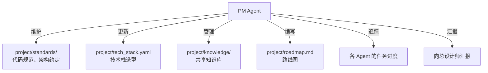
```mermaid
graph TB
    PM["PM Agent"]

    PM -->|"维护"| Standards["project/standards/<br/>代码规范、架构约定"]
    PM -->|"更新"| TechStack["project/tech_stack.yaml<br/>技术栈选型"]
    PM -->|"管理"| Knowledge["project/knowledge/<br/>共享知识库"]
    PM -->|"编写"| Roadmap["project/roadmap.md<br/>路线图"]
    PM -->|"追踪"| Progress["各 Agent 的任务进度"]
    PM -->|"汇报"| User["向总设计师汇报"]
```

### 7.2 PM Agent 定位

```yaml
agent:
  name: "pm-agent"
  category: "management"
  callable: false          # 需要人工触发，不能被自动调用
  description: "项目经理：维护规范、协调 Agent、追踪进度"

session:
  mode: "single_round"    # 每次执行一项管理任务

# PM Agent 的 workspace 指向 project/ 目录
workspace:
  path: "./workspace/project/"
```

### 7.3 PM Agent 的工作场景

| 场景 | 触发方式 | PM 做什么 |
|------|---------|----------|
| 项目初始化 | 人工 | 创建 project.yaml、tech_stack.yaml、初始规范 |
| 新需求进入 | 人工 | 评审需求，创建 Feature，更新 roadmap |
| 任务完成后 | 人工 | 审查产出，更新知识库，总结经验 |
| 定期巡检 | 人工/定时 | 检查各 Agent 进度，生成状态报告 |
| 规范更新 | 人工 | 根据项目演进更新代码规范、架构约定 |

## 8. Helper Agent

### 8.1 职责定位

Helper Agent 是面向**用户的交互式顾问**，弥补 evolve-agent（改代码）和 planner-agent（拆需求）之间的空白：用户有问题、有疑惑、或需要建议时，直接和 helper 对话。

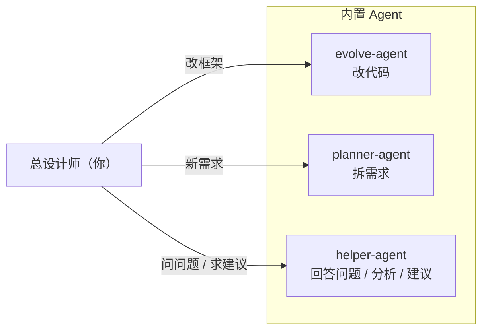
```mermaid
graph LR
    User["总设计师（你）"]

    subgraph Internal["内置 Agent"]
        EV["evolve-agent<br/>改代码"]
        PL["planner-agent<br/>拆需求"]
        HL["helper-agent<br/>回答问题 / 分析 / 建议"]
    end

    User -->|"新需求"| PL
    User -->|"改框架"| EV
    User -->|"问问题 / 求建议"| HL
```

| | evolve-agent | helper-agent |
|--|-------------|-------------|
| **有无 target** | 有（`"./"` 自身代码） | 无 |
| **会改代码吗** | 会（写代码、跑测试） | 不会 |
| **session 模式** | multi_round（DAG 驱动） | single_round |
| **典型触发** | 实现新 task | 问问题、看分析报告 |

### 8.2 工作场景

| 场景 | 触发方式 | Helper 做什么 |
|------|---------|--------------|
| 架构咨询 | 人工触发 | 解读 project/，输出架构建议 |
| 错误分析 | 人工触发 | 读取 execution-report.md，定位失败原因，给出修复建议 |
| 代码解读 | 人工触发 | 读取指定文件，解释实现逻辑 |
| 规范建议 | 人工触发 | 结合 project/ 和现有代码，建议规范更新点 |
| 进度总结 | 人工触发 | 汇总各 Agent 任务状态，输出可读报告 |

### 8.3 与 PM Agent 的区别

| | PM Agent | Helper Agent |
|--|---------|-------------|
| **主要操作** | 写文件（project/、roadmap、input/） | 读文件 + 输出分析 |
| **副作用** | 有（创建任务、更新规范） | 基本无（不修改项目文件） |
| **适合场景** | 执行管理动作 | 回答问题、给出建议 |
| **调用方式** | 人工触发 | 人工触发（可扩展为 vibe 模式） |

### 8.4 配置草案（未实现）

```yaml
agent:
  name: "helper-agent"
  category: "management"   # 无 target，无代码仓库
  callable: false
  description: "项目顾问：回答问题、分析问题、给出建议"

engine:
  model: "claude-opus-4-6"
  tools: [Read, Glob, Grep, Bash]   # 只读为主，Bash 用于 nezha feature list 等查询命令
  security:
    allowed_commands: [ls, cat, nezha]

session:
  mode: "single_round"
  prompts:
    worker: "helper/worker.md"

workspace:
  path: "./workspace/helper-agent"

input:
  type: "file"
  path: "./input/"
  files: ["task.md"]    # 用户用 task.md 描述问题
```

> **当前状态**（2026-03-08）：helper-agent.yaml 和 prompts/helper/worker.md 已实现。Helper 已升级为统一控制面板（9 场景：5 分析 + 4 操作），callable=true，支持通过 nezha CLI 执行管理操作。

## 9. Agent 协作流程

### 9.1 完整协作链路

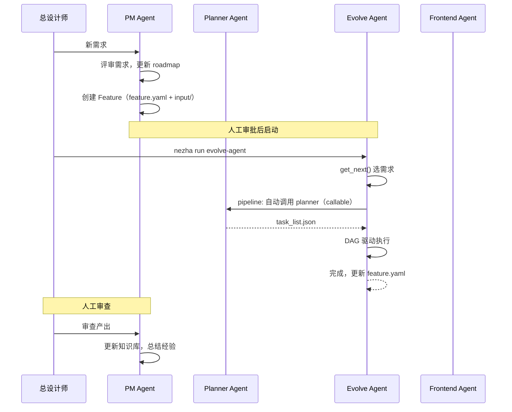
```mermaid
sequenceDiagram
    participant User as 总设计师
    participant PM as PM Agent
    participant PL as Planner Agent
    participant EV as Evolve Agent
    participant FE as Frontend Agent

    User->>PM: 新需求
    PM->>PM: 评审需求，更新 roadmap
    PM->>PM: 创建 Feature（feature.yaml + input/）

    Note over PM,EV: 人工审批后启动

    User->>EV: nezha run evolve-agent
    EV->>EV: get_next() 选需求
    EV->>PL: pipeline: 自动调用 planner（callable）
    PL-->>EV: task_list.json
    EV->>EV: DAG 驱动执行
    EV-->>EV: 完成，更新 feature.yaml

    Note over User,PM: 人工审查

    User->>PM: 审查产出
    PM->>PM: 更新知识库，总结经验
```

### 9.2 数据流转

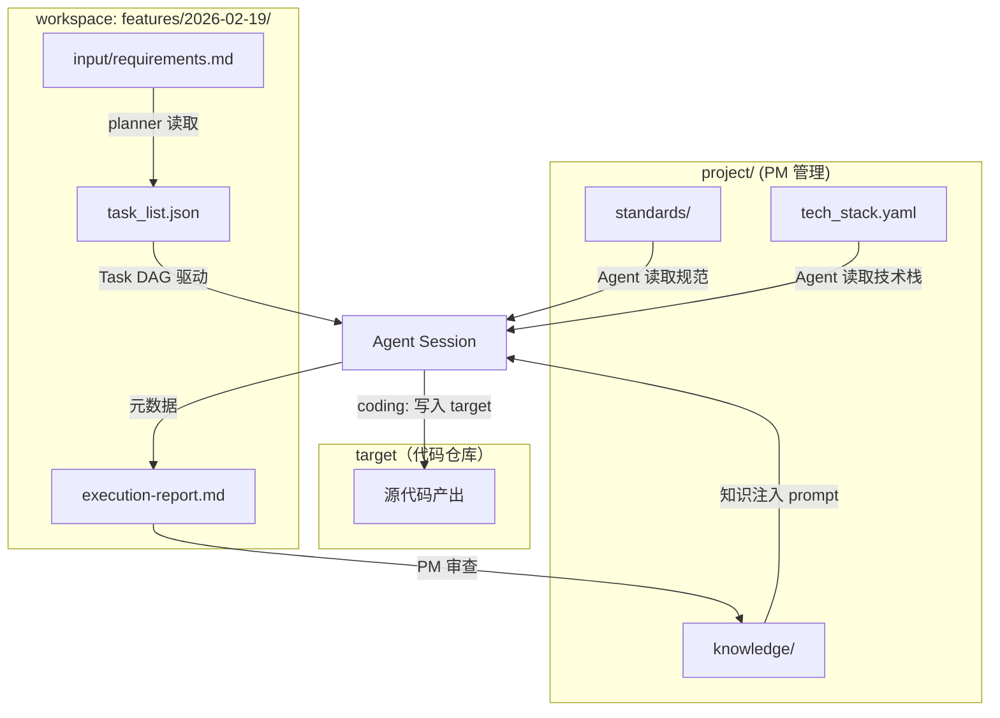
```mermaid
flowchart TD
    subgraph Project["project/ (PM 管理)"]
        STD["standards/"]
        TS["tech_stack.yaml"]
        KN["knowledge/"]
    end

    subgraph Task["workspace: features/2026-02-19/"]
        IN["input/requirements.md"]
        FL["task_list.json"]
        RPT["execution-report.md"]
    end

    subgraph Target["target（代码仓库）"]
        CODE["源代码产出"]
    end

    STD -->|"Agent 读取规范"| Agent["Agent Session"]
    TS -->|"Agent 读取技术栈"| Agent
    KN -->|"知识注入 prompt"| Agent

    IN -->|"planner 读取"| FL
    FL -->|"Task DAG 驱动"| Agent
    Agent -->|"coding: 写入 target"| CODE
    Agent -->|"元数据"| RPT

    RPT -->|"PM 审查"| KN
```

## 10. 演进路线

### 阶段概览

```mermaid
graph LR
    S1["阶段 1<br/>当前实现"] --> S2["阶段 2<br/>Feature Queue<br/>+ 三层 Workspace"]
    S2 --> S3["阶段 3<br/>PM Agent<br/>+ 项目管理"]
    S3 --> S35["阶段 3.5<br/>开发者体验"]
    S35 --> S4["阶段 4<br/>国际化"]
    S4 --> S5["阶段 5<br/>分布式<br/>+ 服务端"]

    style S1 fill:#c8e6c9
    style S2 fill:#c8e6c9
    style S3 fill:#c8e6c9
    style S35 fill:#c8e6c9
    style S4 fill:#fff9c4
    style S5 fill:#e1bee7
```

### 详细路线

| 阶段 | 内容 | 核心变化 | 状态 |
|------|------|---------|------|
| **1. 基础** | 单层 workspace，手动执行，DAG 驱动 | 已实现 | ✅ 完成 |
| **2. Feature Queue** | workspace/target 分离 + FileFeatureQueue + Git 策略 + CLI 需求管理 | 需求隔离，264 测试通过 | ✅ 完成 |
| **3. PM Agent** | PM Agent + `project/` 目录 + 规范管理 + Project context 注入 | 333 测试通过 | ✅ 完成 |
| **3.5. 开发者体验** | `nezha code`（Claude Code 集成）+ 包内置全量 prompt 模板 + `init` 脚手架增强 | 交互式入口对齐，项目开箱即用 | ✅ 完成 |
| **4. 国际化（i18n）** | CLI 消息 + 日志 + Prompt 模板多语言支持（python-i18n，YAML key-based）| 中英文均可开箱即用，4 层 Locale 感知 Prompt 查找 | ✅ 完成 |
| **5. Harness 质量增强** | 结构化 rework_note、quality.md、exec-plan、git worktree、evolve-agent 文档园丁模式、pm-agent 跨 Agent 协调 | Harness Engineering 原则落地，Application Legibility 提升 | 🔲 规划中 |
| **6. 调度优化 + 并行** | Task 优先级调度、调度器退避感知、并发执行（`concurrency` 配置 + worktree 隔离）、Agent Pipeline 编排 | 从串行到并行，从人肉顺序到自动流水线 | 🔲 规划中 |
| **7. 生态扩展** | 代码分析系统桥接（legacy code → knowledge_source）、reviewer-agent、browser-tool / log-tool | 遗留代码接入，Agent 到 Agent review 闭环，可观测性工具 | 🔲 远期 |
| **8. 分布式** | FeatureQueue → Redis/MQ，ArtifactStore → S3 | 上层代码不变，只换适配器 | 🔲 远期 |

> **一期目标 = 阶段 1 ~ 4**：单台 Mac/Linux 上跑通全部能力，多语言支持开箱即用。一个项目一个 agent-executor 实例，暂不做跨项目/跨机器。

### 阶段 2 交付物（已完成）

```
新增/修改（阶段 2 已落地）：
├── nezha/feature_queue.py    # FeatureQueue Protocol + FileFeatureQueue ✅
├── nezha/config.py           # GitConfig + AgentConfig.target ✅
├── nezha/executor.py         # 集成 FeatureQueue + git 操作 + 安全检查 ✅
├── nezha/__main__.py         # feature create/list/show/push + --feature-id ✅
├── nezha/interface/cli.py    # CLI 实现 ✅
├── tests/test_feature_queue.py        # 需求队列测试 ✅
└── tests/test_git_strategy.py         # Git 策略测试 ✅
```

### 阶段 3 交付物（已完成）

```
新增/修改（阶段 3 已落地）：
├── nezha/pipeline/knowledge.py  # load_project_context() ✅
├── nezha/executor.py            # 解析 project_dir，传入 session ✅
├── nezha/pipeline/session.py    # project_dir 参数 + build_context() 注入 ✅
├── nezha/__main__.py            # project init 子命令 ✅
├── nezha/interface/cli.py       # cmd_project_init 实现 ✅
├── agents/pm-agent.yaml                  # PM Agent（management 类）✅
├── prompts/pm/worker.md                  # 4 场景 worker prompt ✅
├── tests/test_project_context.py         # project context 测试 ✅
├── tests/test_project_init.py            # project init 命令测试 ✅
└── tests/test_pm_agent.py               # pm-agent 配置测试 ✅
```

### 阶段 3.5 交付物（已完成）

```
新增/修改（开发者体验增强已落地）：
├── nezha/interface/cli.py       # cmd_code() — nezha code 命令 ✅
│                                         # cmd_init() 增强：空目录支持 + 环境检查 ✅
├── nezha/__main__.py            # code 子命令 + 参数解析 ✅
├── nezha/templates/agents/      # 新增 4 个 Agent 模板 ✅
│   ├── frontend-agent.yaml
│   ├── planner-agent.yaml
│   ├── pm-agent.yaml
│   └── product-agent.yaml
└── nezha/templates/prompts/     # 全量 prompt 迁入包（两层查找 fallback）✅
    ├── frontend/init.md + worker.md
    ├── planner/worker.md
    ├── product/worker.md
    ├── pm/worker.md
    ├── evolve/init.md + worker.md + vibe.md
    └── db-design/worker.md
```

## 11. CLAUDE.md — 项目自描述文件

### 为什么 agent-executor 自身需要 CLAUDE.md

evolve-agent 和 helper-agent 的 `target = "./"` 或读取 agent-executor 代码仓库，但它们对框架架构的了解完全依赖 `project/` 注入和代码内容本身。一份 `CLAUDE.md` 放在 agent-executor 根目录，可以让这两个内置 Agent：

- 知道哪些文件是入口、哪些是关键路径
- 了解设计决策（如子进程隔离的原因、Port/Adapter 的约定）
- 避免反复"重新发现"架构规律
- 在 helper-agent 回答问题时，直接引用正确的模块位置

### CLAUDE.md 应包含的内容

```markdown
# Agent Executor — 项目知识库

## 目录结构
- nezha/executor.py       主执行器入口
- nezha/pipeline/         Session 管道（session、io、knowledge、security）
- nezha/dag/              DAG 子系统（graph、engine、verifier）
- nezha/feature_queue.py  FeatureQueue Protocol + FileFeatureQueue
- nezha/config.py         配置 dataclass（AgentConfig、GitConfig 等）
- agents/                          Agent YAML 配置
- prompts/                         Prompt 模板

## 关键设计决策
- 子进程隔离：每个 multi_round session 跑在独立子进程，避免 claude-code-sdk cancel scope 污染
- Port/Adapter：FeatureQueue、BaseTool、ArtifactStore 均为 Protocol，当前只有文件系统实现
- workspace/target 分离：workspace = 元数据目录；target = 代码仓库（LLM 的 cwd）
- category 字段：coding 类用 target 作 cwd；planning/design/management 类用 feature_workspace

## 测试运行
python -m pytest tests/ -v

## 常用命令
nezha run evolve-agent            # 运行 evolve-agent
nezha feature create evolve-agent --input <file>
nezha feature list evolve-agent
```

### 行动项

> 当前 agent-executor 根目录**尚无 CLAUDE.md**，这是一个待完成的手动任务：
>
> 1. 在项目根目录创建 `CLAUDE.md`，内容参考上述模板
> 2. 内容随架构演进持续维护（evolve-agent 执行后可自动更新）
> 3. 考虑在 `nezha project init` 时也提示用户为 target 仓库创建 CLAUDE.md

## 12. 抽象接口汇总

当前和未来的 Protocol 抽象，统一 Port/Adapter 模式：

```mermaid
graph TB
    subgraph Protocols["Protocol 接口"]
        TQ["FeatureQueue<br/>需求队列"]
        TL["BaseTool<br/>确定性工具"]
        AS["ArtifactStore<br/>交付物存储"]
        SCH["BaseScheduler<br/>调度策略"]
        GD["BaseGuard<br/>安全守卫"]
        EH["EventHandler<br/>事件处理"]
    end

    subgraph Current["当前 / 近期实现"]
        FTQ["FileFeatureQueue"]
        GT["git-tool / test-tool / notify-tool"]
        FS["文件系统<br/>(散落各模块)"]
        MS["Manual/Continuous/Cron"]
        CB["CircuitBreaker/TimeWindow/Balance"]
        FL["FileLogger/StateWriter/TraceWriter"]
    end

    subgraph Future["未来实现"]
        RTQ["RedisFeatureQueue"]
        CT["自定义 Tool"]
        S3["S3Store / RedisStore"]
        KS["K8s CronJob"]
        CG["自定义 Guard"]
        WH["Webhook / Slack Handler"]
    end

    TQ --> FTQ
    TQ --> RTQ
    TL --> GT
    TL --> CT
    AS --> FS
    AS --> S3
    SCH --> MS
    SCH --> KS
    GD --> CB
    GD --> CG
    EH --> FL
    EH --> WH
```

## 13. 国际化（i18n）— 已实现（阶段 4）

### 13.1 三层国际化范围

| 层 | 位置 | 已实现 |
|----|------|--------|
| **CLI 消息** | `interface/cli.py`，~489 处 `t()` 调用 | ✅ |
| **日志** | `events/file_logger.py`、`executor.py` 等 | ✅ |
| **Prompt 模板** | `templates/prompts/**/*.md`，4 层 locale 感知查找 | ✅ |

### 13.2 实现方案：python-i18n（YAML key-based）

采用 **python-i18n** 库，YAML 文件存储翻译键值对，非 gettext `.po` 文件。

```
nezha/
├── i18n.py                    # init_i18n() + t() 工具函数
└── locales/
    ├── en.yaml                # 英文翻译（key-value）
    └── zh_CN.yaml             # 中文翻译（key-value）
```

**核心 API**：

```python
# nezha/i18n.py
from i18n import t            # t() 为 python-i18n 的全局翻译函数

def init_i18n(locale: str | None = None) -> None:
    """两步初始化：env var 阶段（argparse 之前）+ yaml config 阶段（argparse 之后）"""
    i18n.set("file_format", "yaml")
    i18n.set("filename_format", "{locale}.{format}")
    i18n.set("load_path", [str(LOCALES_DIR)])
    i18n.set("fallback", "en")         # 任何找不到的 key 回退到英文
    effective_locale = locale or os.getenv("AGENT_EXEC_LANG") or "zh_CN"
    i18n.set("locale", effective_locale)
```

**两步 I18n 初始化**（保证 argparse help 也国际化）：

```python
# __main__.py
# Step 1: env var 阶段 — argparse 初始化前
init_i18n(locale=os.getenv("AGENT_EXEC_LANG"))

# argparse 初始化（help 字符串此时已能用 t()）
parser = create_parser()
args = parser.parse_args()

# Step 2: yaml config 阶段 — 读取 executor.yaml 后
executor_config = load_executor_config(args.config)
if executor_config.locale:
    init_i18n(locale=executor_config.locale)
```

**YAML 结构**（以 CLI 消息为例）：

```yaml
# locales/zh_CN.yaml
zh_CN:
  cli:
    run:
      info:
        agent_not_found: "Agent '%{name}' 不存在"
        no_task: "没有 pending 任务，请先创建任务："
      success:
        completed: "任务完成 ✓"
    code:
      info:
        context_header: "## 当前项目上下文（%{agent}，工作空间：%{workspace}）"
```

### 13.3 四层 Locale 感知 Prompt 查找

Prompt 模板查找从两层（项目/包内）扩展为**四层**，同时考虑语言：

```
查找顺序（以 frontend/worker.md，locale=en 为例）：

① 项目自定义英文版：  ./prompts/frontend/worker.en.md   ← 最高优先级
② 项目自定义默认版：  ./prompts/frontend/worker.md
③ 包内置英文版：      templates/prompts/frontend/worker.en.md
④ 包内置默认版：      templates/prompts/frontend/worker.md   ← 兜底
```

实现在 `resolve_prompt_path()` 中：

```python
def resolve_prompt_path(prompts_dir: Path, prompt_path: str, lang: str = "zh_CN") -> Path:
    stem, suffix = prompt_path.rsplit(".", 1)      # "frontend/worker", "md"
    lang_code = lang[:2]                           # "en" / "zh"
    candidates = [
        prompts_dir / f"{stem}.{lang_code}.{suffix}",         # 项目英文版
        prompts_dir / f"{stem}.{suffix}",                     # 项目默认版
        _TEMPLATES_PROMPTS / f"{stem}.{lang_code}.{suffix}",  # 包英文版
        _TEMPLATES_PROMPTS / f"{stem}.{suffix}",              # 包默认版
    ]
    return next((p for p in candidates if p.exists()), candidates[-1])
```

当前已内置的多语言 prompt：

| Agent | 中文（默认） | 英文版 |
|-------|------------|--------|
| java | `worker.md` `vibe.md` | `worker.zh.md` `vibe.zh.md` |
| python | `worker.md` `vibe.md` | `worker.zh.md` `vibe.zh.md` |
| frontend | `worker.md` `init.md` `vibe.md` | `worker.zh.md` `init.zh.md` `vibe.zh.md` |
| evolve | `worker.md` `init.md` | — |
| planner | `worker.md` | — |

### 13.4 配置方式

```bash
# 环境变量（最高优先级，连 argparse help 都国际化）
AGENT_EXEC_LANG=en nezha run frontend-agent

# executor.yaml（全局默认）
locale: "en"   # 或 "zh_CN"

# 跟随系统（默认行为，不配置则自动检测系统 LANG，fallback 到 zh_CN）
```

### 13.5 nezha code 角色 Prompt 注入

`nezha code` 在启动 Claude Code 前，将 Agent 的角色 prompt 作为初始消息注入：

```
# Initial context message 结构
[role prompt 内容（locale 感知查找）]

---

## 当前项目上下文（%{agent}，工作空间：%{workspace}）

[project/ 知识库内容]
[agent-context.md 内容]
[最近 task 内容]
```

角色 prompt 也遵循四层 locale 感知查找，优先使用对应语言版本。

## 14. Harness 质量增强（阶段 5 规划）

> 基于 OpenAI Harness Engineering 原则：**环境可读性（Application Legibility）**、**Agent 可观测性**、**结构化质检流转**。

### 14.1 背景：Harness Engineering 核心原则

OpenAI 在大规模 AI 编码实验中得出：
- **人类工程师设计环境 + 反馈循环，Agent 执行代码** — "Humans steer, Agents execute"
- **环境可读性（Legibility）** 是 Agent 质量的关键瓶颈：Agent 能读懂 UI、日志、指标时，诊断和修复效率大幅提升
- **Garbage Collection（文档园丁）**：自动扫描陈旧文档、技术债，开 PR 修复，避免"文档腐烂"
- **Repository as System of Record**：结构化产出物（任务元数据、质检报告）与代码同仓库

agent-executor 与 Harness Engineering 自然对齐：task_list.json = 结构化执行计划，DAG 引擎 = 有序任务编排，evolve-agent = 比 OpenAI 文档园丁更进一步（可递归自我改进）。

### 14.2 结构化 rework_note（P1）

**现状**：rework 时，Agent 的重做说明是自由文本，下一轮 Agent 无法结构化理解。

**改进**：`rework_note` 从字符串升级为结构化 JSON：

```json
{
  "attempt": 2,
  "tried": [
    "在 UserService 中加 validate() 方法",
    "修改 AuthController 返回 403"
  ],
  "not_tried": [
    "检查 JWT token 过期时间配置",
    "前端 interceptor 是否正确处理 401"
  ],
  "related_files": [
    "src/service/UserService.ts",
    "src/controller/AuthController.ts"
  ],
  "block_reason": "validate() 方法被调用但 token 仍失效，怀疑前端未刷新 token"
}
```

注入到 Agent prompt 的格式：

```
## 返工上下文（第 2 轮）

**已尝试**：
- 在 UserService 中加 validate() 方法
- 修改 AuthController 返回 403

**尚未尝试**：
- 检查 JWT token 过期时间配置
- 前端 interceptor 是否正确处理 401

**相关文件**：src/service/UserService.ts, src/controller/AuthController.ts

**阻塞原因**：validate() 方法被调用但 token 仍失效，怀疑前端未刷新 token
```

**实现位置**：`feature.yaml` 新增 `rework_note` 字段（替换旧的自由文本），`pipeline/session.py` 中 `build_context()` 读取并格式化注入。

### 14.3 exec-plan.md 作为一等交付物（P1）

**现状**：`task_list.json` 是 Agent 内部消费的 JSON，对人不友好，难以追溯执行过程。

**改进**：在 feature 目录增加 `exec-plan.md`，由 planner-agent 在生成 `task_list.json` 时同步生成：

```markdown
# 执行计划（2026-02-19-11-18-53）

## 需求：用户认证模块

| # | Task | 状态 | 备注 |
|---|------|------|------|
| 1 | JWT token 生成 | ✅ 完成 | |
| 2 | 登录 API | ✅ 完成 | |
| 3 | token 刷新逻辑 | 🔄 执行中 | |
| 4 | 权限守卫装饰器 | 🔲 待执行 | |
| 5 | 前端 interceptor | 🔲 待执行 | |

## 变更摘要
- 修改文件：src/service/AuthService.ts, src/controller/AuthController.ts
- 新增文件：src/guards/JwtGuard.ts
```

Agent 执行过程中可直接更新此 Markdown，让执行进度对人完全透明。

### 14.4 quality.md — 代码质量评分（P2）

受 OpenAI QUALITY_SCORE.md 启发，evolve-agent 维护 `workspace/project/quality.md`：

```markdown
# 代码质量评分（2026-02-22）

## 各模块评分（1-10 分）

| 模块 | 评分 | 上次评分 | 说明 |
|------|------|---------|------|
| FeatureQueue | 9 | 8 | 协议抽象清晰，FileFeatureQueue 实现完整 |
| Executor | 7 | 7 | 流程正确，git 操作分支处理可优化 |
| Pipeline/Session | 8 | 7 | context 注入链路清晰，rework 改进后提升 |
| CLI | 6 | 5 | i18n 完成后可读性提升，参数组织仍可优化 |
| DAG Engine | 9 | 9 | 稳定，无明显技术债 |

## 技术债记录

- [ ] Executor git 操作未处理 rebase conflict 场景 [medium]
- [ ] CLI 参数解析与业务逻辑未完全分离 [low]
- [x] CLI 消息硬编码中文 → 已通过 i18n 解决 ✅
```

evolve-agent 在每次执行后（或定期）更新此文件，给人和 AI 提供持续质量基线。

### 14.5 Git Worktree（P2）

**现状**：coding agent 共享同一代码目录（target），任务串行、切任务前需安全检查。

**问题**：
- 无法并行执行多个 coding task
- `_check_coding_safety()` 会因未提交修改而阻塞
- 单个目录下 `git checkout` 需要工作区干净

**改进**：使用 `git worktree` 为每个 task 创建独立 checkout：

```bash
# Task 启动时
git worktree add ../my-app-feat-user-auth feat/user-auth

# Agent 在隔离的目录工作
# cwd = ../my-app-feat-user-auth

# Task 完成后
git worktree remove ../my-app-feat-user-auth
```

```mermaid
graph LR
    subgraph Repo["代码仓库（.git 共享）"]
        GIT[".git/objects/<br/>.git/refs/"]
    end

    subgraph WT1["worktree: feat/user-auth"]
        W1["src/ tests/<br/>（task 1 独立 checkout）"]
    end

    subgraph WT2["worktree: feat/payment"]
        W2["src/ tests/<br/>（task 2 独立 checkout）"]
    end

    GIT --> WT1
    GIT --> WT2
```

**收益**：
- 消除 `_check_coding_safety()`（每个 worktree 天然隔离）
- 未来支持多 task 并行执行（配合 concurrency 配置）
- worktree 路径记录在 `feature.yaml` 的 `metadata.worktree_path`

**实现**：`GitConfig` 增加 `use_worktree: bool = False`，executor 在 `branch_per_task=True` 且 `use_worktree=True` 时自动创建 worktree。

### 14.6 evolve-agent 文档园丁模式（P2）

受 OpenAI "Garbage Collection" 模式启发，evolve-agent 新增 **gardening mode**：

```yaml
# 触发方式（计划中）
nezha run evolve-agent --mode gardening
```

**gardening mode 职责**：

| 检查项 | 做什么 |
|--------|--------|
| **文档陈旧检测** | 扫描 `design/*.md`，对比代码实现，标记与当前不符的内容 |
| **技术债追踪** | 读取 `quality.md`，为高优先级债务创建 task |
| **架构约定核查** | 检查 `project/standards/` 中的规范是否被违反（新增文件是否符合命名约定等） |
| **测试覆盖率** | 运行 `pytest --cov`，在 `quality.md` 更新覆盖率指标 |
| **CLAUDE.md 同步** | 对比实际目录结构，更新项目 CLAUDE.md |

**触发时机**：
- 手动触发（`--mode gardening`）
- cron 调度（如每日凌晨 2 点）
- 每 N 个 coding task 完成后自动触发一次

### 14.7 pm-agent 跨 Agent 协调（P2）

扩展现有 pm-agent 的工作场景（补充 Section 7.3）：

| 场景 | 触发方式 | PM 做什么 |
|------|---------|----------|
| 跨 Agent 进度协调（场景 5）| 人工 / 定时 | 读取各 Agent 的 feature 状态，检测上游 feature 完成后自动为下游 Agent 创建 feature（如 product-agent PRD 完成 → 为 frontend-agent 创建实现需求）|
| 质量仲裁（场景 6）| feature FAILED 触发 | 读取 `execution-report.md` + `rework_note`，判断是重试（retry）还是需要人工介入（escalate），更新 `roadmap.md` 中的风险项 |
| 健康巡检（场景 7）| 定时（每日）| 统计各 Agent 成功率、平均耗时、rework 次数，生成健康报告，发现异常时通知 |

场景 5 的数据流：

```mermaid
sequenceDiagram
    participant PM as PM Agent
    participant PD as product-agent（已完成）
    participant FE as frontend-agent（等待）

    Note over PD: feature COMPLETED
    PM->>PD: 读取 feature.yaml + PRD.md
    PM->>PM: 评审产出质量
    PM->>FE: nezha feature create frontend-agent --input PRD.md
    Note over FE: 新 pending feature 创建
    PM->>PM: 更新 roadmap.md 进度
```

## 15. 调度与并行演进（阶段 6 规划）

### 15.1 现状分析

```mermaid
graph LR
    subgraph Current["当前调度模型"]
        S["Scheduler<br/>（Manual / Continuous / Cron）"]
        Q["FileFeatureQueue<br/>get_next()"]
        E["execute_agent()<br/>（单次执行）"]
        S --> Q --> E
    end
```

**当前限制**：
1. **Agent 级调度，非项目级**：每个 nezha 实例只管一个 Agent 的任务队列，无法感知其他 Agent 的状态
2. **完全串行**：一次只能执行一个 task，即使 target 不冲突
3. **调度器盲目重试**：连续失败时以固定间隔无脑重试，没有退避
4. **get_next() 只按时间排序**：无优先级感知，无依赖感知

### 15.2 Feature 优先级调度（P1）

**`feature.yaml` 新增 `priority` 字段**：

```yaml
id: "2026-02-19-11-18-53"
agent_name: "frontend-agent"
status: "pending"
priority: 80          # 0-100，默认 50，数值越高越优先
created_at: "..."
```

**`get_next()` 修改**：先按 priority 降序，再按 created_at 升序（同优先级按先进先出）：

```python
def get_next(self, agent_name: str | None = None) -> Feature | None:
    features = self.list_features(agent_name=agent_name, status=FeatureStatus.PENDING)
    return min(features, key=lambda f: (-f.priority, f.created_at), default=None)
```

**CLI 创建需求时指定优先级**：

```bash
nezha feature create frontend-agent --input requirements.md --priority 90
```

### 15.3 调度器自适应退避（P1）

**问题**：连续失败时，固定间隔重试会在已知失败场景下浪费资源。

**改进**：调度器跟踪执行结果，连续失败时指数退避：

```python
class ContinuousScheduler:
    def __init__(self, interval: int, max_backoff: int = 3600):
        self._interval = interval
        self._max_backoff = max_backoff
        self._consecutive_failures = 0

    def _compute_wait(self) -> int:
        if self._consecutive_failures == 0:
            return self._interval
        backoff = self._interval * (2 ** self._consecutive_failures)
        return min(backoff, self._max_backoff)

    async def _after_execute(self, success: bool) -> None:
        if success:
            self._consecutive_failures = 0
        else:
            self._consecutive_failures += 1
        await asyncio.sleep(self._compute_wait())
```

**退避表（interval=60s）**：

| 连续失败次数 | 等待时间 |
|------------|---------|
| 0 | 60s（正常） |
| 1 | 120s |
| 2 | 240s |
| 3 | 480s |
| 5+ | 3600s（上限 1 小时） |

`ExecutorConfig` 新增：

```yaml
# executor.yaml
scheduler:
  interval: 60
  max_backoff: 3600    # 最大退避时间（秒）
  backoff_on_no_task: false  # 无任务时是否退避（默认否）
```

### 15.4 并行执行（P2）✅ 已实现（V2.1 F3）

配合 git worktree，允许同一 Agent 的多个 feature 并行执行。实现：`asyncio.Semaphore(concurrency)` + `asyncio.gather()`，`concurrency=1` 时完全向后兼容。

```yaml
# executor.yaml
scheduler:
  concurrency: 3       # 最多同时运行 3 个 task（需 worktree 支持）
```

```mermaid
graph LR
    subgraph Parallel["并行执行（concurrency=3）"]
        T1["task 1<br/>worktree: feat/user-auth<br/>（running）"]
        T2["task 2<br/>worktree: feat/payment<br/>（running）"]
        T3["task 3<br/>worktree: feat/dashboard<br/>（running）"]
    end

    Q["FileFeatureQueue<br/>get_next() × 3"] --> T1
    Q --> T2
    Q --> T3
```

**前提**：
- `git.use_worktree: true`（保证目录隔离）
- coding agent 的 target 是同一代码仓库（worktree 共享 `.git`）
- design/planning agent 天然可并行（产出在各自 task 目录）

### 15.5 Agent Pipeline 编排（P3）

**问题**：当前各 Agent 独立运行，无项目级流水线。需要人工知道"product-agent 完成了，可以启动 frontend-agent"。

**路径 A：pm-agent 轻量编排**（见 14.7 场景 5，近期可实现）

pm-agent 作为"胶水层"：读取上游 task 状态，自动为下游 Agent 创建 task。

**路径 B：PipelineScheduler Agent DAG**（远期）

将 task-level DAG 扩展到 Agent-level：

```yaml
# pipeline.yaml（概念草案）
pipeline:
  name: "product-development"
  stages:
    - agent: product-agent      # 阶段 1：产品设计
      output: "PRD.md"
    - agent: planner-agent      # 阶段 2：需求拆分（依赖 PRD.md）
      input_from: product-agent
      output: "task_list.json"
    - agent: frontend-agent     # 阶段 3：前端开发（依赖 task_list.json）
      input_from: planner-agent
      parallel: true            # 与其他 coding agent 并行
    - agent: evolve-agent       # 阶段 3（并行）：后端开发
      input_from: planner-agent
      parallel: true
```

```mermaid
graph LR
    PA["product-agent<br/>→ PRD.md"] --> PL["planner-agent<br/>→ task_list.json"]
    PL --> FE["frontend-agent<br/>（并行）"]
    PL --> EV["evolve-agent<br/>（并行）"]
    FE --> PM["pm-agent<br/>质检 + 汇报"]
    EV --> PM
```

**PipelineScheduler**：
- 读取 `pipeline.yaml`，构建 Agent 依赖图
- 监听各 Agent 的 task 完成事件，自动触发下游
- 支持条件触发（如质量评分达标才继续）

### 15.6 演进优先级

| 优先级 | 改进项 | 依赖 | 实现难度 |
|--------|-------|------|---------|
| **P1** | Feature 优先级（`priority` 字段 + `get_next()` 修改）| 无 | 低 |
| **P1** | 调度器自适应退避（指数退避 + executor.yaml 配置）| 无 | 低 |
| **P2** | pm-agent 跨 Agent 协调（场景 5/6/7）| 14.7 | 中 |
| **P2** | git worktree 集成（`use_worktree` 配置）| 无 | 中 |
| **P2** | 并行执行（`concurrency` 配置 + worktree）| worktree | 中 |
| **P3** | PipelineScheduler Agent DAG | worktree + 并行 | 高 |

## 16. Direct API 模式（规划中）

> 核心思路：对于"输入 → 结构化输出"的 Agent，绕过 claude_code_sdk + claude CLI 层，直接调用 Anthropic API，省去 2-4s 的进程开销。

### 16.1 两种 Agent 执行模式对比

```
Session 模式（当前所有 Agent）：
  Python → subprocess → claude_code_sdk.query()
         → claude CLI 进程 → 工具调用（Read/Write/Bash）→ API

Direct 模式（新）：
  Python 读文件 → Anthropic API（单次调用）→ 解析输出 → Python 写文件
```

| | Session 模式 | Direct 模式 |
|---|---|---|
| **进程开销** | subprocess + claude CLI，~2-4s | 无，~0s |
| **工具调用** | Read/Write/Bash 等，N 次往返 | 无，Python 负责 I/O |
| **适合场景** | 需要读写代码、运行命令 | 纯文本输入 → 结构化输出 |
| **实现复杂度** | 当前实现 | 新增约 50 行 |

### 16.2 适用 Agent

| Agent | 适合 Direct？ | 原因 |
|-------|-------------|------|
| **planner-agent** | ✅ 最适合 | requirements.md → task_list.json，纯文本进出 |
| **product-agent** | ✅ 适合 | 需求 → PRD.md，大段文字生成 |
| **pm-agent**（报告类场景）| ✅ 部分适合 | 读多个 feature.yaml → 健康报告，Python 读文件后传给 API |
| **evolve-agent** | ❌ 不适合 | 需要读代码、跑测试、写多文件，必须有工具 |
| **frontend-agent** | ❌ 不适合 | 同上 |

### 16.3 配置与实现

Agent YAML 新增 `mode` 字段：

```yaml
# agents/planner-agent.yaml
session:
  mode: "direct"     # 直接 API 调用，不走 claude_code_sdk
  # mode: "session"  # 默认：走 claude_code_sdk（有工具访问）
```

`run_direct_api()` 核心实现（约 50 行）：

```python
import anthropic

def run_direct_api(
    agent_config: AgentConfig,
    workspace: Path,
    env: dict[str, str] | None = None,
) -> SessionResult:
    """Direct Anthropic API call — no subprocess, no claude CLI, no tool calls."""
    # Python 直接读取输入文件
    input_files = scan_input_files(agent_config, workspace)
    user_content = build_input_context(input_files, workspace)

    # 读取 system prompt（模板渲染）
    system_prompt = load_and_render(template_path, variables)

    # 直接调用 Anthropic API
    client = anthropic.Anthropic(api_key=env.get("ANTHROPIC_API_KEY", ""))
    response = client.messages.create(
        model=agent_config.engine.model,
        max_tokens=agent_config.engine.max_turns * 1000,  # 估算
        system=system_prompt,
        messages=[{"role": "user", "content": user_content}],
    )

    output_text = response.content[0].text

    # Python 直接写入结果文件（artifact）
    artifact = agent_config.pipeline.pre_agents[0].artifact  # e.g., "task_list.json"
    (workspace / artifact).write_text(output_text)

    return SessionResult(
        status="completed",
        num_turns=1,
        cost_usd=_calc_cost(response.usage, agent_config.engine.model),
    )
```

executor 分支：

```python
if agent_config.session.mode == "direct":
    result = run_direct_api(agent_config, workspace, env=env)
else:
    result = await run_multi_round(...)   # 原有路径
```

### 16.4 预期收益

以 planner-agent 为例：

| 阶段 | 当前耗时 | Direct 模式耗时 |
|------|---------|----------------|
| subprocess 启动 | ~1-2s | 0s |
| claude CLI 启动 | ~0.5-1s | 0s |
| Read 工具调用 | ~1-2s（含网络往返）| 0s（Python 读）|
| Write 工具调用 | ~1-2s | 0s（Python 写）|
| LLM 推理 | ~3-8s | ~3-8s（不变）|
| **合计** | **~7-15s** | **~3-8s** |

省去约 50% 的总执行时间，且 planner 往往是 evolve-agent 的前置步骤，整条 pipeline 都受益。

### 16.5 与 LangChain 的关系

Direct 模式用 `anthropic` 官方 SDK 直接调用即可，**无需引入 LangChain**。LangChain 适合需要切换多个模型提供商的场景；如果只用 Claude，官方 SDK 更轻量、维护成本更低。未来如果需要多模型路由（如某类任务用 GPT），再考虑接入 LangChain 做路由层。

---

# V2 架构愿景 — 从角色模拟到上下文拓扑

> 以下为 V2 架构演进方向。V1（Section 1-16）是当前运行的系统，V2 在 V1 基础上渐进式演进，**不做大爆炸重写**。
>
> 理论基础和研究证据见 [design-notes.md §5](../docs/design-notes.md)。

## 17. V2 核心理念

### 17.1 问题：角色模拟 = 人月神话的 AI 翻版

V1 的 Agent 体系（product-agent → planner-agent → coding-agent → pm-agent）本质是将人类团队组织架构映射到 AI 系统。但 AI 的瓶颈与人类完全不同：

| 人类瓶颈 | AI 瓶颈 |
|---------|---------|
| 个体认知带宽有限 → 需要专业化分工 | 上下文窗口有限 → 需要信息管理 |
| 沟通成本 → 需要减少人际交互 | Token 成本 → 需要减少冗余调用 |
| 学习曲线 → 需要角色专注 | 错误传播 → 需要减少 Agent 间传递 |

**核心转变**：从"谁做什么"（角色）转向"什么信息该在什么时候可见"（上下文拓扑）。

### 17.2 三层架构

```
┌─────────────────────────────────────────┐
│  Human                                  │
│    ↕ 对话                                │
│  Helper Agent（控制面）                   │
│    - 创建/修改 Task                      │
│    - 审核 approve/reject                 │
│    - 查询状态、调整优先级                  │
└────────────┬────────────────────────────┘
             │ 读写任务状态（文件 / 未来 API）
             ▼
┌─────────────────────────────────────────┐
│  Feature Queue + Feature DAG            │
│  ┌─ Feature A: [design✅]→[backend🔄]→...│
│  ├─ Feature B: [backend⏸]→[test⏳]     │
│  └─ Feature C: [review🔒 等人审]        │
└────────────┬────────────────────────────┘
             │ Daemon pull (ready steps)
             ▼
┌─────────────────────────────────────────┐
│  Worker Pool (N 个并发 daemon)           │
│    每个 worker = 通用 agent              │
│    上下文 = phase + stack + concerns 组合 │
└─────────────────────────────────────────┘
```

三层各司其职：
- **Helper**：人的意图 → 系统操作（对话式 kubectl）
- **Feature Queue**：状态管理 + 两层 DAG 调度
- **Worker Pool**：无状态拉取 + 上下文组合执行

### 17.3 两层 DAG

```
Feature DAG（大需求，人定义/审核）
  ├─ design → architecture → backend → frontend → e2e-test
  │                            │           │
  │                            ▼           ▼
  │                        Task DAG    Task DAG
  │                       (AI 自己规划)  (AI 自己规划)
  │
  └─ 人审核节点：design 产出物、task list 自然语言描述
```

| | Feature DAG | Task DAG |
|--|-------------|----------|
| **谁定义** | 人（或人审核 AI 建议） | AI 自动生成 |
| **粒度** | 阶段（design, backend, frontend...） | 具体功能（登录页、购物车...） |
| **依赖** | 人决定先后顺序 | AI 根据代码依赖自己排 |
| **审核** | 每个阶段的产出物 | 只审 task list 自然语言 |
| **对应 V1 概念** | 新增 | 就是现在的 `task_list.json` |

**原则**：人只管"做什么"（审核自然语言），AI 自己管"怎么做"（依赖分析、执行顺序、并行策略）。

### 17.4 上下文组合（替代角色 Prompt）

**V1**：每个 Agent 有完整的角色 Prompt

```
prompts/java/worker.md     ← 身份 + 领域约束 + 流程步骤 混在一起
prompts/frontend/worker.md
```

**V2**：拆成可组合的模块

```
prompts/
  phases/                  # 做什么阶段
    init.md                # 项目初始化
    red.md                 # 写测试（TDD RED）
    green.md               # 写实现（TDD GREEN）
    fix.md                 # 修复失败
    review.md              # 代码审查
  stacks/                  # 什么技术栈
    java-spring.md         # Java 约束、测试分层
    react.md               # Testing Library、MSW
    vue.md                 # Vue 特有约束
  concerns/                # 横切关注点
    tdd.md                 # TDD 方法论
    a11y.md                # 无障碍
    security.md            # 安全
```

运行时按需组合：
- Java feature 测试阶段 = `phases/red.md` + `stacks/java-spring.md` + `concerns/tdd.md`
- React feature 实现阶段 = `phases/green.md` + `stacks/react.md`
- 集成测试修复 = `phases/fix.md` + `stacks/java-spring.md`

**优势**：
- 新增技术栈只加一个 `stacks/xxx.md`，不用新建 Agent
- TDD 规则改了只改一处 `concerns/tdd.md`
- 同一 feature 跨前后端：同一 session，切换 stack 模块
- 全栈项目不需要 java-agent + frontend-agent 两个 Agent

### 17.5 上下文隔离（替代角色隔离）

不是"不同角色的 Agent"提供隔离，而是"同一 Worker 的不同 Session"提供隔离。

```
需要隔离的：信息流方向必须单向
  - TDD: 测试 → 实现（测试不能看到实现思路）
  - Review: 不能自己批自己作业
  - 多路径探索: 路径 A 不应受路径 B 影响

不需要隔离的：需要完整上下文
  - 理解需求 + 写代码（同一个人做更好）
  - Debug（需要看到全貌）
  - 重构（需要理解整体架构）
```

TDD 示例：
```
session 1: 需求分析 → 写测试（RED）           ← 不知道实现方案
session 2: 读测试结果 → 写实现（GREEN）        ← 只看测试，看不到 session 1 的思考
session 3: 读全部代码 → review / refactor
```

### 17.6 Helper 作为控制面

V1 的 Helper 是 pipeline 中的一个"顾问角色"。V2 的 Helper 是**站在系统外面的操控台**。

```
你：创建一个需求，电商后台，先后端再前端
helper → 创建 Feature + Feature DAG，写入需求队列

你：backend 的 task list 我看了没问题，通过
helper → 标记 review gate approved，daemon 自动继续

你：Feature-042 什么状态？
helper → 读取状态，汇报进度

你：把 T-003 优先级提到最高
helper → 修改 Task DAG 优先级

你：后端做完了先别做前端，我要改需求
helper → 暂停 Feature DAG 的 frontend step
```

| | V1 Helper | V2 Helper |
|--|-----------|-----------|
| 定位 | Pipeline 中的顾问角色 | 系统控制面（kubectl） |
| 做什么 | 读文件 + 输出分析 | 操作系统本身 |
| 上下文 | 代码、需求 | 任务状态、DAG、审核流 |
| 可替代 | 可被通用 worker 替代 | 不可替代，是人的入口 |

### 17.7 Step 状态机

```
pending → ready(依赖满足) → running → completed
                ↓                ↓
          needs_review      failed → ready(自动重试/修复)
                ↓
          approved → ready
```

### 17.8 与 Claude Agent Teams 的结合策略

> Agent Teams 是 Anthropic 随 Opus 4.6 发布的实验性功能（`CLAUDE_CODE_EXPERIMENTAL_AGENT_TEAMS=1`，2026.2.6），定位为研究预览。
> 底层是 `TeammateTool`（13 个操作），支持 Team Lead + Teammates 共享任务板 + 邮箱消息通信，运行在 tmux/iTerm2 分屏面板。

#### 层次关系：互补而非竞争

```
┌──────────────────────────────────────────┐
│  agent-executor（Harness / OS 层）        │
│  - 跨 session 状态持久化 + 恢复           │
│  - 两层 DAG + 人工审核门                  │
│  - 上下文工程 + 项目知识管理               │
│  - Daemon 调度                            │
│                                          │
│  ┌──────────────────────────────────┐    │
│  │  Claude Code（执行引擎）          │    │
│  │  ┌──────────────────────────┐    │    │
│  │  │  Agent Teams（协作机制）   │    │    │
│  │  │  多实例并行 + 共享任务板   │    │    │
│  │  └──────────────────────────┘    │    │
│  └──────────────────────────────────┘    │
└──────────────────────────────────────────┘
```

- **Agent Teams** = 多核 CPU（Session 内多实例并行）
- **agent-executor** = 操作系统（跨 Session 生命周期管理）

Agent Teams 不具备：状态持久化、跨 session 恢复、人工审核门、项目知识沉淀、TDD 质量工程。这些是 agent-executor 的核心价值。

#### 结合点

**1. Worker 执行策略抽象（Phase B 预留）**

```yaml
# feature.yaml step 配置
dag:
  steps:
    - id: backend
      execution: single       # 默认：单 Claude Code 实例
    - id: research
      execution: team          # Agent Teams 多实例并行
      team_size: 3
```

```python
class ExecutionStrategy(Protocol):
    async def execute(self, step: TaskStep, context: ComposedPrompt) -> StepResult: ...

class SingleInstanceStrategy:    # 当前实现，稳定
    ...
class AgentTeamsStrategy:        # 未来，等 API 稳定后接入
    ...
```

**2. TDD 上下文物理隔离（最有价值的结合点）**

Agent Teams 每个 Teammate 有独立上下文窗口，可彻底解决"上下文污染"：

```
Team Lead: "实现 T-003 权限守卫"
  ├─ Teammate A（RED）: phases/red.md + stacks/java.md → 只看需求，写测试
  ├─ Teammate B（GREEN）: phases/green.md → 只看测试文件，写实现（看不到 A 的思考）
  └─ Team Lead: 汇总，跑测试，验证
```

**3. Task DAG → Agent Teams 任务板映射**

```
Task DAG (agent-executor)        Agent Teams 共享任务板
T-001: 用户模型  ✅    ──→     Task: 用户模型  done
T-002: 登录 API  🔄    ──→     Task: 登录 API  active
T-003: 权限守卫  ⏳    ──→     Task: 权限守卫  todo
```

agent-executor 管状态持久化 + 跨 session 恢复；Agent Teams 管 session 内并行协作。

#### 适合 team 模式的场景

| 场景 | 原因 |
|------|------|
| 多路径竞争 | N 个实例同时尝试不同方案，选最优 |
| 大型重构 | 独立模块并行改 |
| 研究/分析 | 并行信息收集（Anthropic 验证最有效） |
| TDD 隔离 | RED/GREEN 物理隔离上下文窗口 |

#### 实施原则：预留接口，不急着集成

| 时机 | 做什么 |
|------|--------|
| **现在（V2 开发时）** | 抽象 `ExecutionStrategy` 接口；Step 配置预留 `execution` 字段；默认 `SingleInstanceStrategy` |
| **Agent Teams 稳定后** | 实现 `AgentTeamsStrategy`；TDD 上下文隔离用 Teammates 物理隔离；大型任务自动选择 team 模式 |

符合 Phil Schmid "为删除而构建"原则 — 如果 Agent Teams API 变了，只换一个 Strategy 实现，harness 层不受影响。

### 17.9 外部记忆系统（预留）

> Agent 跨 Task 的经验积累（失败模式、代码偏好、项目潜规则）是提升长期质量的关键。当前文件系统已覆盖 80% 场景，剩余 20% 需要结构化检索能力。

#### 现状分析：文件系统即 L0 记忆

V1 已有的记忆机制全部基于文件系统：

| 记忆载体 | 内容 | 生命周期 |
|---------|------|---------|
| `CLAUDE.md` | 项目约定、编码规范 | 永久，手动维护 |
| `project/standards/` | 架构规范、技术约束 | 永久，evolve-agent 维护 |
| `project/knowledge/` | 共享知识库 | 永久 |
| `progress.md` | 单 task 执行进度 | task 级 |
| `rework_note` | 失败原因 + 已尝试方案 | task 级（结构化 JSON） |
| `execution-report.md` | 执行结果报告 | task 级 |

**优势**：零依赖、可读、可 git 追踪、AI 天然能读写。

**缺口**：
- **跨 Task 经验**：Task A 踩过的坑，Task B 不知道（progress.md 是 task 级的）
- **失败模式积累**：相同类型的错误反复出现，没有学习机制
- **代码偏好**：AI 不记得"上次用户说过不喜欢这个写法"
- **项目潜规则**：不在 standards/ 里但实际存在的隐性约束

#### 三层记忆架构：L0 → L1 → L2

```
L0（当前）：文件系统
  CLAUDE.md, project/, rework_note
  ↓ 够用就不升级

L1（轻量级）：结构化失败日志 + 简单检索
  failure_log.jsonl — 每次 task 失败追加一条
  workspace/.memory/ — 按主题分类的经验文件
  检索：关键词匹配 / 简单向量搜索
  ↓ 不够用再升级

L2（外部系统）：EverMemOS / Mem0 / 自建
  通过 MCP Server 接入
  语义检索、自动归纳、遗忘机制
  agent-executor 只调接口，不管实现
```

#### MemoryStore 协议接口（预留）

```python
class MemoryStore(Protocol):
    """跨 task 记忆存储。L0 用文件实现，L2 用外部系统实现。"""

    def remember(self, key: str, content: str, metadata: dict) -> None:
        """存储一条记忆。metadata 包含 task_id, agent, tags 等。"""
        ...

    def recall(self, query: str, limit: int = 5) -> list[MemoryEntry]:
        """根据查询检索相关记忆。"""
        ...

    def forget(self, key: str) -> None:
        """删除一条记忆（或标记过期）。"""
        ...
```

实现层次：

| 层次 | 实现 | 依赖 |
|------|------|------|
| L0 | `FileMemoryStore` — 读写 workspace 文件 | 无 |
| L1 | `JsonlMemoryStore` — failure_log.jsonl + 关键词检索 | 无 |
| L2 | `McpMemoryStore` — 代理到 EverMemOS / Mem0 的 MCP Server | 外部服务 |

#### 注入点

记忆在 session 启动时注入到上下文（与 project/ 知识类似）：

```python
# pipeline/session.py — build_context() 中
if memory_store:
    relevant = memory_store.recall(
        query=f"{task.name} {task.acceptance_criteria}",
        limit=5,
    )
    if relevant:
        context_parts.append(format_memories(relevant))
```

#### 候选外部系统

| 系统 | 特点 | 接入方式 |
|------|------|---------|
| [EverMemOS](https://github.com/EverMemOS/EverMemOS) | 多层记忆（感知/短期/长期/元认知）、自动归纳 | MCP Server |
| [Mem0](https://github.com/mem0ai/mem0) | 轻量级、支持向量搜索、SaaS + 自托管 | REST API / MCP |
| 自建 | JSONL + 嵌入向量 + SQLite | 内置 |

#### 实施原则

| 时机 | 做什么 |
|------|--------|
| **现在** | 不动。L0 够用，文件系统覆盖主要场景 |
| **Phase B（Daemon）之后** | 评估 L1 需求 — Daemon 长时间运行后，跨 task 经验积累的价值凸显 |
| **L1 不够用时** | 定义 `MemoryStore` 协议，实现 `FileMemoryStore`（L0 兼容层）+ `JsonlMemoryStore`（L1） |
| **需要语义检索时** | 实现 `McpMemoryStore`，接入 EverMemOS 或 Mem0 |

与 Agent Teams 策略一致：**预留接口，不急着集成**。当前文件系统就是最好的记忆系统 — 简单、可读、可追踪。只在复杂度确实需要时才引入外部系统。

---

## 18. V1 → V2 渐进式迭代计划

> **核心原则**：每一步都向后兼容，`nezha run coding-agent` 始终可用。新能力增量叠加，不破坏现有工作流。

### 总览

```mermaid
graph LR
    V1["V1 当前系统<br/>角色 Agent + 手动执行"]
    P1["Phase A<br/>Prompt 模块化 ✅"]
    P2["Phase B<br/>Daemon 模式"]
    P3["Phase C<br/>两层 DAG"]
    P4["Phase D<br/>Helper 控制面"]

    V1 --> P1 --> P2 --> P3 --> P4

    style V1 fill:#c8e6c9
    style P1 fill:#c8e6c9
    style P2 fill:#e3f2fd
    style P3 fill:#fff3e0
    style P4 fill:#fff3e0
```

### Phase A：Prompt 模块化 + 组合器 ✅ 已完成

**目标**：将现有角色 Prompt 拆为可组合模块，但保持 Agent YAML 不变。

**改动范围**：Prompt 模板目录 + 新增 PromptComposer

**向后兼容**：现有 `session.prompts.worker: "java/worker.md"` 继续工作（fallback 到完整 prompt）。

```
步骤（已完成）：
1. 从现有 worker.md 中提取公共部分：
   - TDD 流程 → phases/context-acquisition.md, phases/rework.md, phases/tdd.md, phases/regression.md, phases/commit-rules.md
   - Java 约束 → stacks/java-spring.md
   - Python 约束 → stacks/python.md
   - 前端约束 → stacks/frontend.md
   - 通用约束 → stacks/general.md
   - 横切关注点 → concerns/exec-plan.md, concerns/quality-tracking.md

2. 新增 PromptComposer：
   - 输入：base + sections 列表
   - 输出：组合后的完整 prompt
   - Agent YAML 可选配置：
     session:
       prompts:
         worker: "java/worker.md"         # V1 方式（兼容）
       # 或 V2 方式：
       compose:
         worker:
           base: "coding/base.md"
           sections:
             - phases/context-acquisition
             - stacks/java-spring
             - phases/tdd

3. 保留原有 worker.md 不删除（双轨运行）
```

**Phase A 交付物**：
- `pipeline/prompt_composer.py` — `compose_prompt()` 基于 base + sections 组装 prompt
- `config.py` — `ComposeConfig` + `SessionConfig.compose`
- `templates/prompts/modules/` — phases(5) + stacks(4) + concerns(2) = 11 个模块
- `templates/prompts/coding/base.md` — 通用角色声明
- 28 个测试，780 测试全通过
- 向后兼容：无 `session.compose` 配置走原有 `session.prompts.worker` 路径

**验证**：现有 nezha run 行为不变；新增 compose 配置能正确组合 prompt。✅ 780 测试通过

### Phase B：Daemon 模式 + Worker Pool

**目标**：支持 `nezha daemon` 命令，后台持续拉取 ready 任务执行。

**改动范围**：新增 daemon 命令 + Worker 进程管理

**向后兼容**：`nezha run` 保持不变（单次执行）。Daemon 是新增入口。

```
步骤：
1. 新增 nezha daemon 命令：
   nezha daemon --workers 2    # 启动 2 个 worker

2. Worker 逻辑：
   while True:
     step = feature_queue.get_next_ready()  # 跨 Agent 扫描
     if step is None:
       sleep(interval)
       continue
     if step.needs_review:
       skip  # 人审核的跳过
       continue
     compose_context(step)  # 根据 step 类型组合 prompt
     execute(step)          # 复用现有 _execute_once 逻辑
     mark_completed(step)

3. Worker 使用 step 上的 tech_stack 信息自动选择 prompt 模块：
   - step.type == "backend" + tech_stack.backend == "java"
     → phases/green.md + stacks/java-spring.md
   - step.type == "frontend" + tech_stack.frontend == "react"
     → phases/green.md + stacks/react.md

4. 文件扫描方式拉取（现有 FileFeatureQueue 扩展）：
   - 扫描所有 agent 的 tasks/ 目录
   - 或扫描共享 workspace（shared mode）

5. 预留未来：get_next_ready() 接口可以对接 Redis / API
```

**验证**：启动 daemon，创建 task，观察自动拾取执行。`nezha run` 仍可单独使用。

**预计工作量**：~3 天

### Phase C：两层 DAG（Feature DAG + Task DAG）

**目标**：在 Task DAG（现有，小编码任务）之上引入 Feature DAG（大需求阶段），支持阶段依赖和人工审核门。

**改动范围**：新增 FeatureDAG 模型 + Feature 状态扩展 + Review Gate

**向后兼容**：不配置 Feature DAG 时，行为与 V1 完全一致（单 Agent 直接执行 Task DAG）。

```
步骤：
1. Feature YAML 新增 dag 字段：
   # feature.yaml
   id: "2026-03-01"
   dag:
     steps:
       - id: design
         type: design
         status: completed
       - id: backend
         type: coding
         stack: java-spring
         depends_on: [design]
         status: ready
         review_gate: false     # 不需要人审
       - id: frontend
         type: coding
         stack: react
         depends_on: [design]
         status: pending
         review_gate: true      # 需要人审 task list
       - id: e2e-test
         type: testing
         depends_on: [backend, frontend]

2. 每个 coding step 执行时自动生成 Task DAG：
   step "backend" → AI 读需求 → 生成 task_list.json → Task DAG 自动执行

3. review_gate 处理：
   - step 完成后 → 状态变 needs_review → daemon 跳过
   - 人通过 helper 或 CLI 审核 → 状态变 approved → daemon 拾取

4. 不配置 dag 字段时：整个 feature 就是一个 step（V1 行为）

5. Helper / CLI 命令：
   nezha feature approve <feature-id> <step-id>
   nezha feature reject <feature-id> <step-id> --note "需要改..."
```

**验证**：单 step feature 行为不变；多 step feature 能按依赖顺序执行，review gate 能暂停。

**预计工作量**：~4 天

### Phase D：Helper 控制面

**目标**：Helper Agent 从"顾问角色"升级为系统操控台，支持对话式任务管理。

**改动范围**：Helper Prompt 重写 + 新增系统操作 MCP Tools

**向后兼容**：现有 helper-agent 仍可作为普通顾问使用。

```
步骤：
1. 为 Helper 提供系统操作能力（MCP Tools 或 Bash 命令）：
   - task_create(description, dag_template)  → 创建 Task
   - task_approve(task_id, step_id)          → 审核通过
   - task_reject(task_id, step_id, note)     → 驳回
   - task_status(task_id?)                   → 查询状态
   - task_pause(task_id, step_id?)           → 暂停
   - task_priority(task_id, priority)        → 调整优先级
   - daemon_status()                         → 查看 worker 状态

2. Helper Prompt 重写：
   - 从"项目顾问"变为"系统操控台 + 项目顾问"
   - 能理解用户自然语言意图并映射到系统操作
   - 保留代码分析、架构咨询能力

3. 对话式工作流：
   用户: "帮我创建一个用户认证的需求，先后端再前端"
   helper: 解析意图 → feature_create + 生成 Feature DAG
   helper: "已创建 Feature-058，包含 backend → frontend 两个阶段。需要我启动执行吗？"

4. 实现方式：
   - 短期：Helper 通过 nezha CLI 命令操作（Bash 工具）
   - 中期：Helper 通过 MCP Server 直接调用 Python API
```

**验证**：通过对话创建 task、审核、查询状态，全流程跑通。

**预计工作量**：~3 天

> **当前状态**（2026-03-08）：V2.1 F1 已完成 Helper 控制面的短期方案（通过 nezha CLI 命令操作）。Helper 已从 5 场景扩展为 9 场景（分析 + 操作），callable=true。中期方案（MCP Server 直接调用 Python API）待后续实现。

### 迭代顺序和依赖关系

```mermaid
graph TD
    A["Phase A: Prompt 模块化<br/>~2 天"] --> B["Phase B: Daemon 模式<br/>~3 天"]
    A --> C["Phase C: 两层 DAG<br/>~4 天"]
    B --> D["Phase D: Helper 控制面<br/>~3 天"]
    C --> D

    style A fill:#e3f2fd
    style B fill:#e3f2fd
    style C fill:#fff3e0
    style D fill:#fff3e0
```

- **A → B**：Daemon 需要 Prompt 组合器来根据 step 类型自动选择 prompt
- **A → C**：Feature DAG 的 step 需要知道用什么 prompt 模块
- **B + C → D**：Helper 控制面需要 Daemon 和两层 DAG 都就位

### 每阶段的兼容性保证

| Phase | 现有命令 | 新增命令 | 破坏性变更 |
|-------|---------|---------|-----------|
| A | `nezha run` ✅ 不变 | 无 | 无 |
| B | `nezha run` ✅ 不变 | `nezha daemon` | 无 |
| C | `nezha run` ✅ 不变 | `nezha feature approve/reject` | 无 |
| D | `nezha run` ✅ 不变 | Helper 对话式操作 | 无 |

**始终成立**：
- `nezha run coding-agent` = 手动执行一个 feature（V1 模式）
- `nezha code coding-agent` = 交互式 Claude Code（V1 模式）
- 不配置 Feature DAG = Task DAG 直接执行（V1 行为）
- 不配置 compose = 使用完整 worker.md（V1 行为）

### 与 V1 路线图的关系

V2 Phase A-D 插入到 V1 路线图的阶段 5-6 之间：

```
V1 阶段 1-4 ✅ 完成
V1 阶段 5 (Harness 质量增强) → 继续推进，不受 V2 影响
V2 Phase A (Prompt 模块化) ✅ 完成
V2.0 F1-F5 ✅ 完成（链式分支、per-Task model、集成验证、Feature Steps、费用统计）
V2.1 F1-F3 ✅ 完成（Helper 全能化、Dashboard、并行执行），844 测试通过
V2 Phase B (Daemon)
V1 阶段 6 (调度优化 + 并行) → 并行执行已在 V2.1 F3 完成
V2 Phase C (两层 DAG)
V1 阶段 7-8 (生态扩展 + 分布式) → 在 V2 基础上继续
```
