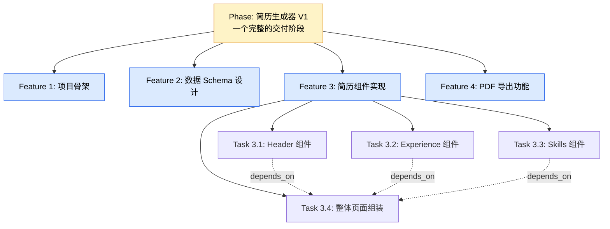
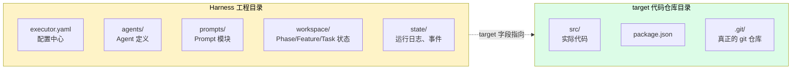

# 三个必懂概念

5 分钟搞清三件事，后面就顺了：

1. **Phase / Feature / Task** 是什么、什么关系
2. **Harness 工程 vs target 仓库** 为什么要分开
3. **几个名词的对应关系**（PM 的"需求"对应 Nezha 的什么）

## Phase / Feature / Task



### 三个层级的定义

| 层级 | 大小 | 谁写 | 例子 |
|------|------|------|------|
| **Phase** | 一次完整的交付阶段 | 你 + 对话定 | "简历生成器 V1"、"加入 PDF 导出" |
| **Feature** | Phase 内的大需求 | AI 写 PRD | "数据 Schema 设计"、"Header 组件" |
| **Task** | Feature 内的小编码任务 | Planner 自动拆 | "实现 Skills 组件的 props 类型" |

### 类比 PM 的语言

如果你是产品经理出身：

```
产品迭代 (Sprint)  →  Phase
   ├─ 用户故事     →  Feature
   │   └─ 子任务   →  Task
```

如果你是开发出身：

```
Milestone        →  Phase
   ├─ Issue/PR   →  Feature
   │   └─ Commit →  Task
```

### 三者的存储位置

```
workspace/
├── phases/
│   └── <phase-id>/
│       └── phase.yaml          ← Phase 元数据：base 分支、feature 列表
└── features/
    └── <feature-id>/
        ├── feature.yaml        ← Feature 元数据：标题、状态、关联 Phase
        ├── input/              ← PRD 等输入文档
        └── task_list.json      ← Planner 拆出的 Task 列表
```

## Harness 工程 vs target 仓库

这是 Nezha **最重要的一个分离**。新手最容易搞混的就是这个。



### 两个目录各自的职责

| 目录 | 职责 | 是否需要 git 跟踪 |
|------|------|-------------------|
| **Harness 工程目录** | 管任务、配置、流程、状态 | 可以独立 git 仓库（也可以不） |
| **target 代码仓库目录** | 实际代码所在地、Agent 的 cwd、git 操作发生地 | 必须是你的代码 git 仓库 |

### 为什么要分开

如果不分开（很多框架的做法），Nezha 的配置和运行状态会污染你的代码仓库：

```
my-resume-app/
├── src/                ← 你的代码
├── package.json
├── workspace/          ← ❌ Nezha 状态文件
├── state/              ← ❌ 日志、事件
├── agents/             ← ❌ Agent 配置
└── executor.yaml       ← ❌ Nezha 配置
```

**分开之后**，代码仓库是干净的：

```
my-resume-harness/      ← Harness 工程（专管流程）
├── executor.yaml
├── agents/
├── prompts/
├── workspace/
└── state/

my-resume-app/          ← target 仓库（专管代码）
├── src/
├── package.json
└── .git/
```

`executor.yaml` 里通过 `target` 字段指向代码仓库：

```yaml
# my-resume-harness/executor.yaml
target: "/path/to/my-resume-app"   # ← 指向代码仓库
```

### 一个简单记忆

| 你想做的事 | 操作哪个目录 |
|-----------|-------------|
| 改 Nezha 配置、看任务状态 | Harness 工程 |
| 看代码、跑测试、git commit | target 仓库 |
| 跑 `nezha run` 命令 | Harness 工程（cd 进去执行） |

## 几个其他常见词的对应

| 你听到的词 | Nezha 里叫什么 |
|-----------|---------------|
| 需求 / 用户故事 | Feature |
| 任务卡片 / Ticket | Task |
| Sprint / 迭代 | Phase |
| PRD 文档 | Feature 的 `input/` 输入 |
| 待办列表 | `task_list.json` |
| Backlog | `feature list --status pending` |
| 提交记录 | `feat/<feature-id>` 分支的 commits |

## 自测理解

读完这篇后，先答这几个问题再往下：

1. ❓ 一个 Phase 里有几个 Feature，几个 Feature 里有几个 Task？
2. ❓ 我执行 `nezha run` 时，AI 的 cwd 是 Harness 工程目录还是 target 仓库目录？
3. ❓ 我修改 `executor.yaml` 后，是放在 Harness 工程目录还是 target 仓库目录？

<details>
<summary>展开答案</summary>

1. 一个 Phase 通常有 2-10 个 Feature，每个 Feature 通常拆出 5-30 个 Task（视复杂度而定）
2. **target 仓库目录**（Agent 的 cwd 是 target，git 操作也发生在 target）
3. **Harness 工程目录**——所有配置都在 Harness 里，target 仓库保持干净

</details>

理解了？下一步去 [02 - 安装与初始化](02-install.md)。
