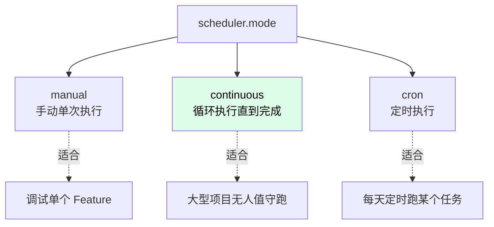
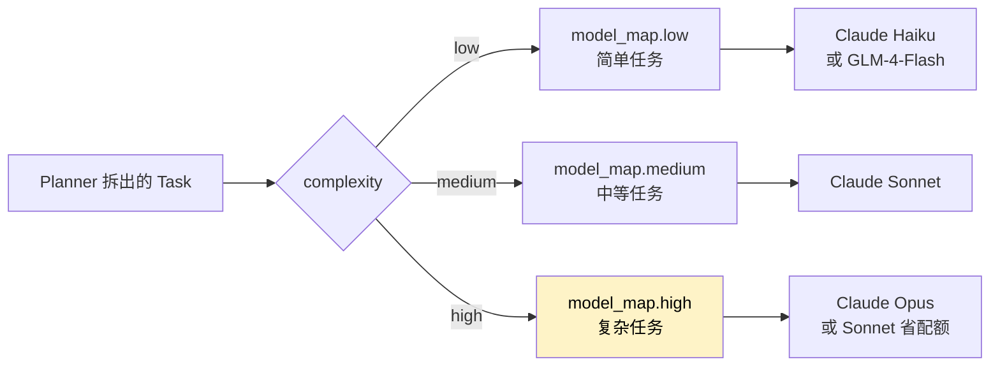

# 配置 executor.yaml

`executor.yaml` 是 Harness 工程的大脑——项目名、调度模式、模型路由、心跳、target 路径全在这里。

不需要全看完，**5 分钟改 4 个关键字段**就能跑：

1. 项目名 `executor.name`
2. 调度模式 `scheduler.mode`
3. 模型路由 `model_map`
4. 代码仓库路径 `target`

## 项目名

```yaml
executor:
  name: "my-resume-harness"        # 改成你的项目名
  description: "HTML 简历生成器"     # 可选
```

## 调度模式（scheduler）

Nezha 三种调度模式：



视频案例里用的是 **continuous**（连续执行模式）：

```yaml
scheduler:
  mode: "continuous"
  interval: 60                # 每个 feature 之间间隔 60 秒
  failure_strategy: "ai_judge" # 失败时让 AI 判断是否继续
  stop_on_empty: true         # 没有 pending feature 时自动停止
  concurrency: 1              # 1 = 串行，>1 = 并行执行多个 feature
```

`failure_strategy` 三个选项：

| 值 | 行为 |
|----|------|
| `stop` | 一失败就停 |
| `continue` | 一直跑，失败也不管 |
| `ai_judge` | **推荐**：调用 AI 判断"下一个 feature 能不能独立执行" |

## 心跳保活（heartbeat，可选）

长时间执行任务时，给你留人工介入的机会。每隔 N 小时 ping 一次模型，保证认证状态正常：

```yaml
heartbeat:
  interval: 18000              # 5 小时（秒）
  models:
    - model: claude-haiku-4-5-20251001    # Claude 自动用登录态
    # - model: glm-4-flash                 # 三方模型需要配 env
    #   env:
    #     OPENAI_API_KEY: "your-key"
    #     OPENAI_BASE_URL: "https://open.bigmodel.cn/api/paas/v4"
```

命令：

```bash
nezha heartbeat start     # 后台启动
nezha heartbeat test      # 立即 ping 一次测试
nezha heartbeat stop      # 停止
```

## 模型路由（model_map）

**核心配置**。Nezha 把任务按难度分三档，自动路由到不同模型：



### 默认配置（全 Claude）

```yaml
model_map:
  low: claude-haiku-4-5-20251001
  medium: claude-sonnet-4-6
  high: claude-opus-4-6
```

### 省配额配置

视频里说：如果想省配额，把高难度也用 Sonnet：

```yaml
model_map:
  low: claude-haiku-4-5-20251001
  medium: claude-sonnet-4-6
  high: claude-sonnet-4-6        # ← 省钱
```

### 求稳定配置

如果担心 Haiku 代码质量，全部用 Sonnet：

```yaml
model_map:
  low: claude-sonnet-4-6
  medium: claude-sonnet-4-6
  high: claude-sonnet-4-6
```

### 接入国产模型

```yaml
model_map:
  low:
    model: glm-4.7
    env:
      OPENAI_API_KEY: "${GLM_API_KEY}"
      OPENAI_BASE_URL: "https://open.bigmodel.cn/api/paas/v4"
  medium: claude-sonnet-4-6      # 中等任务还是用 Claude 保质量
  high: claude-opus-4-6
```

更多三方模型配置参见 [How-To: 接入第三方模型](../03-howto/third-party-models.md)。

### task_factor（高级）

每个 entry 可以配 `task_factor`，控制 Planner 拆 task 的粒度。弱模型自动拆细，强模型拆粗：

```yaml
model_map:
  low:
    model: glm-4.7
    task_factor: 1.5              # 拆得更细，每个 task 更小
  high:
    model: claude-opus-4-6
    task_factor: 0.8              # 拆得更粗，每个 task 更大
```

默认值：`low=1.2, medium=1.0, high=0.8`。

## target：代码仓库路径

**最关键的一项**。指向真正的代码仓库：

```yaml
target: "/Users/you/code/my-resume-app"
```

> ⚠️ 没配 `target` 的话，coding agent 不知道往哪里写代码。

如果 target 还不存在，先建空仓库：

```bash
mkdir -p /Users/you/code/my-resume-app
cd /Users/you/code/my-resume-app
git init
git commit --allow-empty -m "init"
```

## 完整最小配置示例

视频案例里的完整 `executor.yaml`：

```yaml
executor:
  name: "my-resume-harness"
  description: "HTML 简历生成器"

workspace:
  base: "./workspace"

scheduler:
  mode: "continuous"
  interval: 60
  failure_strategy: "ai_judge"
  stop_on_empty: true

heartbeat:
  interval: 18000
  models:
    - model: claude-haiku-4-5-20251001

model_map:
  low: claude-haiku-4-5-20251001
  medium: claude-sonnet-4-6
  high: claude-sonnet-4-6          # 省配额：高难度也用 Sonnet

target: "/Users/you/code/my-resume-app"

agents_dir: "./agents"
prompts_dir: "./prompts"
state_dir: "./state"
locale: "zh_CN"                    # 中文
```

## 还可以配置的（用到再说）

| 字段 | 用途 | 详见 |
|------|------|------|
| `guards` | 守卫链（熔断、时间窗口、预算） | [How-To: 费用控制](../03-howto/cost-budget.md) |
| `event_handlers` | 事件订阅（日志、追踪） | [Reference](../02-cheatsheet/executor-yaml.md) |
| `mcp_servers` | 全局 MCP 服务器 | [Reference](../02-cheatsheet/executor-yaml.md) |
| `env` | 全局环境变量 | [How-To: 环境变量](../03-howto/) |

## 全局用户配置（可选）

如果有些配置在所有项目里都一样（比如 locale、API Key），写到 `~/.nezha/config.yaml`：

```yaml
# ~/.nezha/config.yaml
locale: "zh_CN"
timezone: "Asia/Shanghai"
env:
  ANTHROPIC_API_KEY: "${ANTHROPIC_API_KEY}"
model_map:
  low: claude-haiku-4-5-20251001
  medium: claude-sonnet-4-6
  high: claude-sonnet-4-6
```

这些会自动 merge 进每个项目的 `executor.yaml`，项目级配置优先。

---

配置好了？下一步去 [04 - nezha project init](04-project-init.md)。
