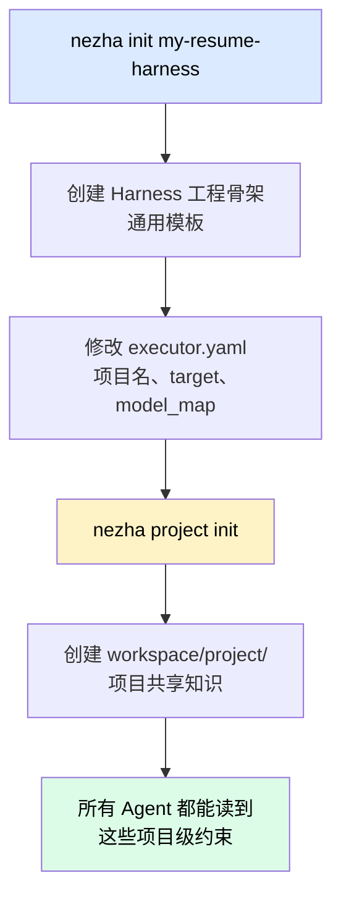
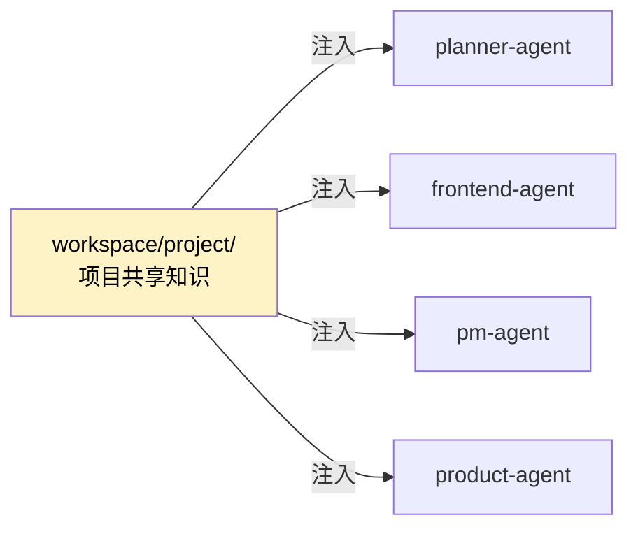
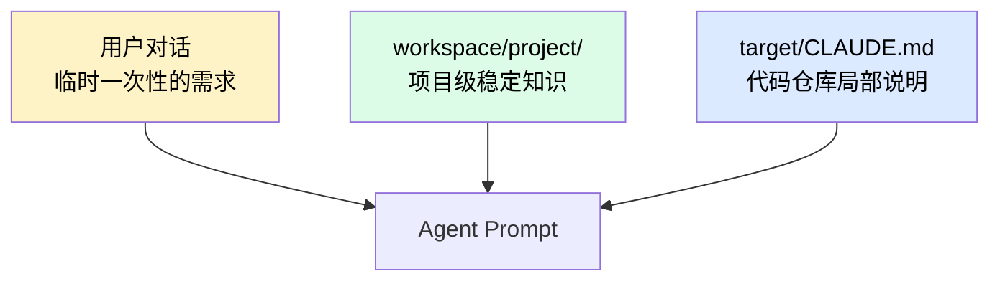

# nezha project init：二次初始化

`nezha init` 创建的是 **Harness 工程骨架**——通用模板。但每个项目都有自己的上下文：技术栈是什么、领域术语怎么定义、有什么硬性约束。

`nezha project init` 就是把这些项目级共享知识落地到 `workspace/project/` 目录的过程，所有 Agent 都会读到。

## 两次 init 的区别



| 命令 | 干什么 | 跑几次 |
|------|--------|--------|
| `nezha init <name>` | 创建 Harness 工程目录 | 一次 |
| `nezha project init` | 创建项目共享知识库 | 一次（配完 executor.yaml 之后） |

## 执行二次初始化

确保你已经 `cd` 进 Harness 工程目录：

```bash
cd my-resume-harness
nezha project init
```

执行后会生成：

```
my-resume-harness/
└── workspace/
    └── project/                ← 新增
        ├── overview.md         项目定位、目标、非目标
        ├── glossary.md         术语表
        ├── constraints.md      硬性约束（必须用 X、不能用 Y）
        ├── conventions.md      命名、风格、组织规范
        └── stakeholders.md     谁是用户、谁来评审
```

这些文件初始是模板，后面你和 PM Agent 一起对话补完它们。

## workspace/project/ 的作用



所有 Agent 在执行任务前，都会自动加载 `workspace/project/` 下的内容到 prompt 里——优先级**高于** target 仓库下的 `CLAUDE.md`。

这意味着：

- **项目级约束**（用 React 不用 Vue）→ 放 `workspace/project/constraints.md`
- **代码风格**（驼峰还是下划线）→ 放 `workspace/project/conventions.md`
- **target 仓库局部说明**（某个 module 怎么用）→ 放 `target/CLAUDE.md`

## 三种知识层次



优先级：**用户对话 > project 共享知识 > target CLAUDE.md**

## 什么时候 project init 后还要改？

- 项目大方向变了（从 "HTML 简历" 改成 "在线简历平台"）→ 改 `overview.md`
- 新增硬性约束（必须支持移动端）→ 改 `constraints.md`
- 引入新术语 → 改 `glossary.md`

这些修改可以手动改，也可以让 `pm-agent` 帮你维护：

```bash
nezha run pm-agent
```

## 可以跳过这一步吗？

**短期可以**——`nezha project init` 不是强制的，跳过也能跑。

**但建议做**——以下场景会出问题：

| 场景 | 不做 project init 的后果 |
|------|-------------------------|
| 多个 Feature 跨多天执行 | AI 容易"忘"约束，写出风格不一致的代码 |
| 想让 AI 用某个特定库 | 每个 Feature 都要在 PRD 里强调 |
| 团队多人共用一个 Harness | 别人不知道项目约束 |

## 跑完之后

你的 Harness 工程现在准备就绪：

```
my-resume-harness/
├── executor.yaml              ✓ 已配
├── .env                       ✓ 已配
├── agents/                    ✓ Agent 定义
├── prompts/                   ✓ Prompt 模板
├── workspace/
│   └── project/               ✓ 项目知识（刚 init）
└── state/
```

下一步去 [05 - 对话定架构](05-design-with-claude.md)，开始让 Claude 写架构文档。
