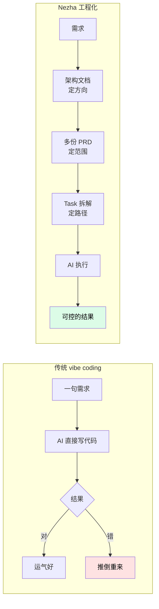
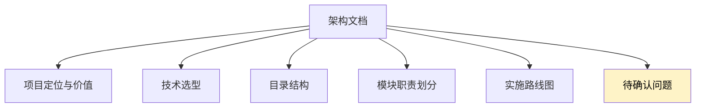

# 对话定架构

从这一步开始，你**不再写代码也不再改配置**。打开 Claude Code，让它根据你的需求把架构文档写出来。

这一步的核心价值是：**在写一行代码之前，把方向定清楚**。

## 为什么先定架构



很多风险在架构阶段就能暴露出来——错过的代价远小于代码写完再发现。

## 启动 Claude Code

在 Harness 工程目录下启动 Claude Code：

```bash
cd my-resume-harness
claude
```

Claude Code 启动后会自动加载：

- `CLAUDE.md`——`nezha init` 生成的项目说明，告诉 Claude 这是个 Nezha 项目
- `.claude/skills/`——17 个内置 skill（`/overview`、`/architecture`、`/prd`、`/phase-plan` 等）
- `.claude/settings.json`——已经预授权 `nezha *`、`cat *`、`ls *` 等命令，不用每次问

输入 `/` 可以看到所有可用 skill。

## 描述需求

直接对 Claude 说话即可。视频里的提示词大致是：

> 我要做一个 HTML 简历制作器：
>
> - 使用者可以通过 Claude 或 Codex 对话来创建简历
> - 可以导入 Stitch 等第三方设计稿作为视觉参考
> - 简历内容不写死在页面里，而是用结构化数据（JSON）管理
> - 用户修改简历信息时只改 JSON，不改 HTML
> - 满意后可一键导出 PDF
> - 技术选型偏向直接使用 React

把这些**关键约束**讲清楚比写得长更重要。

## 让 Claude 写架构文档

让它调用架构 skill：

```
/architecture
```

或者直接说"帮我写一份架构文档"。Claude 会调用 `architecture` skill，按模板生成 `workspace/project/architecture.md`，包含：



**「待确认问题」很重要**——AI 会主动列出它不确定的点，你逐个回答或者说"先忽略"。

## 一个真实例子

视频里这一阶段的对话节奏：

```
你：    /architecture
Claude: [生成架构文档]
你：    页面渲染要强调 A4 大小
Claude: [更新架构文档]
你：    schema 结构化数据要灵活，用户改 JSON 不改页面
Claude: [继续更新]
你：    很好，架构没问题
```

每轮对话 Claude 都会真的去改文件——它不只是回复你，而是把变更落到 `workspace/project/architecture.md` 里。

## 架构文档定下来之后

架构 OK 了，**先 commit 一下**：

```bash
cd my-resume-harness
git add workspace/project/architecture.md
git commit -m "docs: define architecture for resume generator"
```

这样后面 AI 在 PRD 阶段写错了，能随时回到这个架构基线。

## 这一步常见疑问

**Q: Claude 写的架构文档我不满意，能完全推翻吗？**

可以，直接说"重新写"。但更好的做法是**指出具体问题**让它改：「技术选型里别用 Vite，用 Next.js」、「目录结构这里太深，扁平化」。这样 AI 学到了，后续的 PRD 也会跟着调整。

**Q: 架构里写"待确认问题"我都不懂怎么办？**

让 Claude 解释：「`SSR vs CSR` 这个我不懂，分别讲讲，再推荐一个」。它会用通俗语言解释并给推荐。

**Q: 架构文档放哪儿？**

`workspace/project/` 下，所有 Agent 都会自动读到（参见 [04-project-init](04-project-init.md#三种知识层次)）。

**Q: 必须用 Claude Code 吗？换其他 IDE 行吗？**

短期内推荐 Claude Code，因为 `nezha init` 生成的 skill 和 settings 都是给它用的。其他工具（Cursor、Codex 等）可以但需要手动配置。

## 这一步的价值

| 没做架构定义 | 做了架构定义 |
|------------|------------|
| AI 凭直觉选技术栈 | 明确用 React + Tailwind + Tiptap |
| 每个 Feature 都要重复说一遍 | 一次定下来，所有 Feature 自动遵守 |
| 风险等代码写到一半才暴露 | 架构阶段就发现并修正 |
| 改方向意味着大量返工 | 改方向只需要改架构文档 |

---

架构稳了？下一步去 [06 - 写 PRD 文档](06-write-prd.md)——**Nezha 的灵魂章节**。
