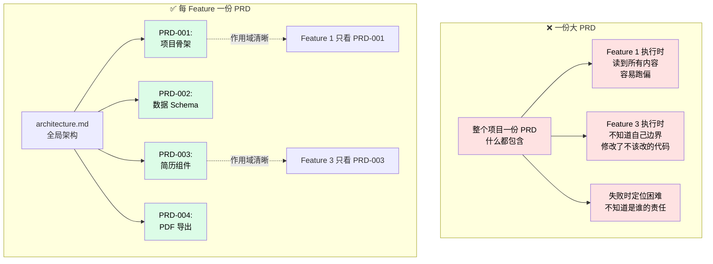
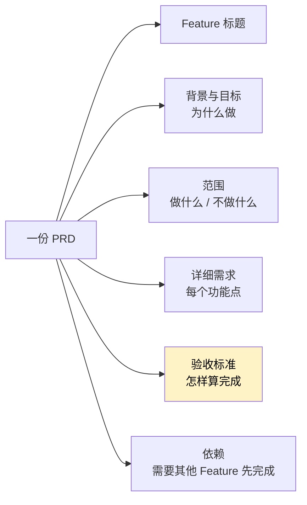

# 写 PRD：每个 Feature 一份

这是 Nezha **区别于普通 vibe coding 的灵魂章节**。

视频里特别强调过：**一开始让 Claude 写 PRD，它只给一份；但我实际想要的是每个 Feature 都对应一份独立 PRD**。

为什么这么坚持？因为这直接决定后续整个执行流程的稳定性。

## 一份 PRD vs 多份 PRD



## 多份 PRD 的三个核心好处

| 好处 | 详细说明 |
|------|----------|
| **范围清晰** | Feature 3 的 AI 只看 PRD-003，不会被其他需求干扰 |
| **易于隔离** | Feature 2 失败了，Feature 3、4 可以独立执行 |
| **追溯方便** | 出 bug 时直接看对应 PRD，知道当初要做什么 |

## 让 Claude 写 PRD

继续在 Claude Code 对话里：

```
基于刚刚的架构文档，帮我写 PRD。
每个 Feature 一份独立的 PRD 文档。
```

或者用 skill：

```
/prd
```

Claude 会根据架构文档识别出有几个 Feature，然后每个 Feature 写一份 PRD，落到 Harness 工程的 `input/` 目录：

```
my-resume-harness/
└── input/                              ← Claude 写到这里
    ├── PRD-001-project-skeleton.md
    ├── PRD-002-data-schema.md
    ├── PRD-003-resume-components.md
    └── PRD-004-pdf-export.md
```

## 一份好 PRD 应该包含什么



**「不做什么」和「验收标准」最关键**——这两项决定了 AI 跑偏的概率。

## 一个 PRD 示例（简化版）

```markdown
# PRD-003: 简历组件实现

## 背景
基于 PRD-002 定义的数据 Schema，实现可复用的简历区块组件。

## 范围
**做**：
- Header（个人信息）组件
- Experience（工作经验）组件
- Skills（技能）组件
- Education（教育）组件
- 整体页面组装（按 A4 大小渲染）

**不做**：
- PDF 导出功能（属于 PRD-004）
- 数据 schema 定义（属于 PRD-002）
- 设计稿还原（属于后续 Phase）

## 详细需求
### 3.1 Header 组件
- 输入：`HeaderData` 类型的 props（已在 PRD-002 定义）
- 渲染：姓名、职位、联系方式（电话、邮箱、地址）
- 样式：左对齐、字体大小符合简历常规
- ...

## 验收标准
- 所有组件能在 Storybook 中独立预览
- TypeScript 类型 0 错误
- 在 1024px 宽度浏览器中页面按 A4 比例正确渲染
- `pnpm test` 全部通过

## 依赖
- PRD-001（项目骨架）必须先完成
- PRD-002（数据 Schema）必须先完成
```

## 写完 PRD 之后

视频里这一阶段大概的对话节奏：

```
你：    /prd
Claude: [生成 1 份大 PRD]
你：    每个 Feature 一份独立 PRD，拆成多份
Claude: [拆出 4 份 PRD-001 ~ PRD-004]
你：    PRD-002 里的 schema 字段再详细一点
Claude: [更新 PRD-002]
你：    OK，可以下一步
```

确认所有 PRD 没问题，**commit 一下**：

```bash
cd my-resume-harness
git add input/
git commit -m "docs: add per-feature PRDs"
```

## 这一步常见疑问

**Q: PRD 写得越细越好吗？**

不是。PRD 应该回答**「做什么、不做什么、什么算完成」**，但**不应该规定怎么做**（那是 Task 阶段的事）。比如：

- ✅ "Header 组件渲染姓名、职位、联系方式"
- ❌ "Header 组件应该用 `useState` 管理状态，文件路径 `src/components/Header.tsx`"

后者越细越限制 AI 的发挥空间，反而容易出问题。

**Q: 我项目就一个 Feature，还需要拆 PRD 吗？**

不需要。一个 Feature 就写一份 PRD，简单直接。

**Q: 已经有现成的 PRD 文档怎么办？**

太好了，直接放到 `input/` 目录就行。Nezha 不强制用 Claude 写 PRD——只要每个 Feature 有对应的输入文档即可。

**Q: 怎么决定项目要拆几个 Feature？**

经验法则：

| 项目规模 | 推荐 Feature 数 |
|---------|----------------|
| 简单工具（几百行代码） | 1-2 个 |
| 中型项目（几千行） | 3-6 个 |
| 大型项目（万行以上） | 6-15 个 |

太多 Feature 会让 phase 变笨重，太少会让 PRD 失去作用。

**Q: PRD 之间的依赖怎么写？**

在 PRD 末尾的「依赖」段落里写「PRD-001 必须先完成」。这只是给人看的——真正的依赖关系会在 [下一步创建 Phase](07-create-phase.md) 时通过 `depends_on` 字段定义。

## 这一步的价值

| 没做多份 PRD | 做了多份 PRD |
|------------|------------|
| AI 跑 Feature 时上下文混乱 | 每个 Feature 只关注自己的 PRD |
| 失败时整个项目卡住 | Feature 间独立执行，故障隔离 |
| Bug 定位要翻整个对话 | 直接看对应 PRD 即可 |
| 改一个 Feature 影响所有 | 改一份 PRD 不影响其他 Feature |

---

PRD 写好了？下一步去 [07 - 创建 Phase](07-create-phase.md)，把 PRD 批量转成 Feature + Task。
