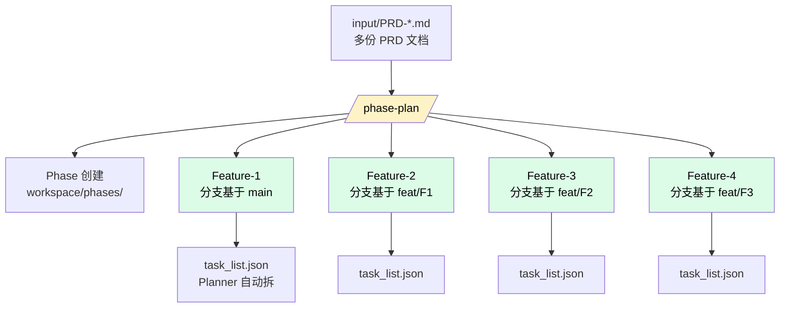
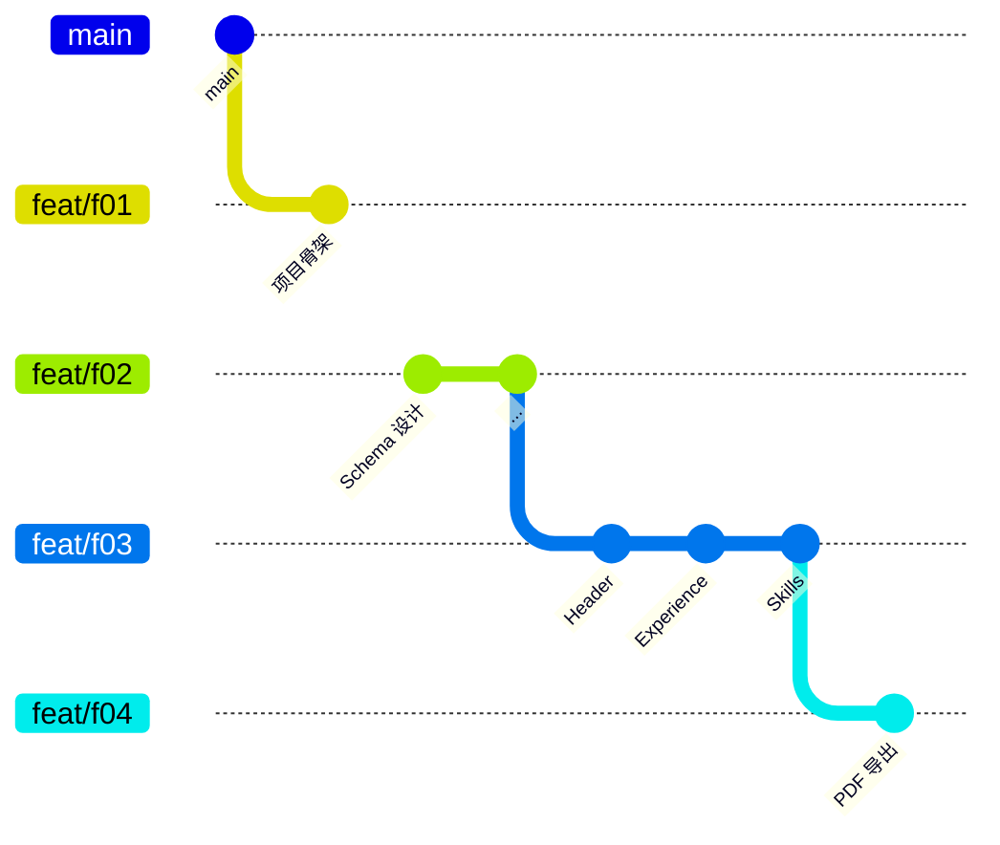

# 创建 Phase

PRD 已经写好了，现在让 Nezha 根据 PRD 自动：

1. 创建一个 **Phase**
2. 为每个 PRD 创建对应的 **Feature**
3. 规划 Feature 之间的**分支链 + 执行依赖**
4. 调 **Planner** 把每个 Feature 拆成具体的 **Task 列表**

一条命令搞定。

## 一条命令的全貌



## 在 Claude Code 里执行

在 Claude Code 对话中：

```
/phase-plan
```

或者直接说"根据 input/ 下的 PRD 创建 phase 和 feature"。

Claude 会：

1. 扫描 `input/` 下所有 PRD 文档
2. 自动生成 `phase.yaml`（你也可以手动写）
3. 调用 `nezha phase plan phase.yaml` 创建 Phase 和 Feature
4. 为每个 Feature 自动跑 planner 生成 task_list.json

## phase.yaml 长什么样

自动生成的 `phase.yaml` 类似：

```yaml
title: "简历生成器 V1"
base_branch: main
agent: frontend-agent       # 用哪个 agent 执行
features:
  - id: f01
    title: "项目骨架搭建"
    priority: 100
    input:
      - PRD-001-project-skeleton.md
  - id: f02
    title: "数据 Schema 设计"
    priority: 90
    depends_on: [f01]
    input:
      - PRD-002-data-schema.md
  - id: f03
    title: "简历组件实现"
    priority: 80
    depends_on: [f02]
    input:
      - PRD-003-resume-components.md
  - id: f04
    title: "PDF 导出功能"
    priority: 70
    depends_on: [f03]
    input:
      - PRD-004-pdf-export.md
```

## 链式分支：每个 Feature 在上一个的基础上

视频里特别强调过：**第一个 Feature 的分支基于 main，后续 Feature 都基于前一个**。



这样做的好处：

| 场景 | 链式分支的好处 |
|------|---------------|
| Feature 4 需要 Feature 3 的组件代码 | 已经在分支里，直接用 |
| 多个 Feature 修改了同一个文件 | 按顺序合并，无冲突 |
| 中途想 review 某个 Feature | 切到对应分支独立验证 |
| Phase 结束后合并 | 只需合并最后一个分支 |

## DAG 元数据：task_list.json

每个 Feature 创建后，Planner 自动生成 `task_list.json`，定义内部 Task 的执行 DAG：

```json
[
  {
    "id": "t01",
    "description": "安装 react-resizable-panels 依赖并验证类型",
    "complexity": "low",
    "depends_on": [],
    "passes": false,
    "rework": false
  },
  {
    "id": "t02",
    "description": "创建 ResumeContainer 组件骨架",
    "complexity": "medium",
    "depends_on": ["t01"],
    "passes": false,
    "rework": false
  },
  {
    "id": "t03",
    "description": "实现 Header 组件并添加单元测试",
    "complexity": "medium",
    "depends_on": ["t02"],
    "passes": false,
    "rework": false
  }
]
```

每条 Task 的字段：

| 字段 | 含义 |
|------|------|
| `id` | Task 唯一标识 |
| `description` | 描述，喂给 LLM 的 prompt |
| `complexity` | 难度（low/medium/high）→ 通过 [model_map](03-configure.md#模型路由model_map) 选模型 |
| `depends_on` | 前置任务，控制执行顺序 |
| `passes` | 是否通过验证（Agent 自报告） |
| `rework` | 是否需要返工 |

## 查看创建结果

在终端跑：

```bash
nezha phase list           # 列出所有 Phase
nezha phase show <id>      # 看某个 Phase 的状态
nezha feature list         # 列出所有 Feature
nezha feature show <id>    # 看某个 Feature 详情
```

或用 skill：

```
/feature-list
/feature-show <id>
```

会看到类似输出：

```
Phase: 简历生成器 V1
  ├─ ✓ f01 项目骨架搭建 (pending)
  ├─ ✓ f02 数据 Schema 设计 (pending)
  ├─ ✓ f03 简历组件实现 (pending)
  └─ ✓ f04 PDF 导出功能 (pending)
```

## 视频里的实际节奏

```
你：    /phase-plan
Claude: [生成 phase.yaml，调 nezha phase plan]
        [创建 4 个 Feature]
        [为每个 Feature 跑 planner 生成 task_list.json]
Claude: Phase 创建完成，task_list.json 已生成
你：    [打开看一下 f01 的 task_list.json，确认无误]
你：    OK，可以开跑了
```

## 这一步常见疑问

**Q: 我能跳过 Claude 直接命令行创建吗？**

可以。手写一个 `phase.yaml`，然后：

```bash
nezha phase plan phase.yaml
```

或者跳过 planner：

```bash
nezha phase plan phase.yaml --skip-planner
```

后者只创建 Feature 不拆 Task（适合自己写 task_list.json）。

**Q: task_list.json 我觉得拆得不好，能改吗？**

可以。直接编辑 `workspace/features/<id>/task_list.json`，加 task、改 description、改 depends_on 都行。

**Q: 想让某个 Task 用特定模型，不走 model_map？**

在 task_list.json 里直接指定 `model` 字段，优先级最高：

```json
{
  "id": "t05",
  "description": "实现复杂的 PDF 分页逻辑",
  "complexity": "high",
  "model": "claude-opus-4-6"
}
```

**Q: Feature 之间能并行执行吗？**

可以——`executor.yaml` 里设 `scheduler.concurrency: 2`（或更高）。但**前提是没有 `depends_on` 约束**。视频案例是串行的（每个 feature 都依赖前一个），所以并行没用上。

**Q: 我想跳过某个 Feature 怎么办？**

执行前：直接编辑 `phase.yaml` 删掉。

执行后：手动改 `feature.yaml` 把状态设成 `completed`。

## 这一步的价值

| 没用 Phase | 用了 Phase |
|------------|------------|
| 手动一个个创建 Feature | 一条命令批量创建 |
| 手动写每个 task_list.json | Planner 自动拆 |
| 分支管理混乱 | 自动链式分支 |
| 不知道 Feature 执行顺序 | DAG 自动调度 |

---

Phase 创建好了，所有 Feature 和 Task 都就位了。下一步去 [08 - nezha run](08-run.md) 启动持续执行。
