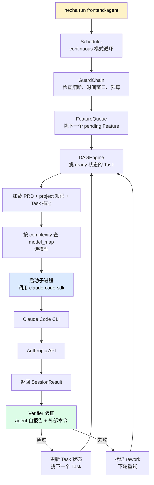
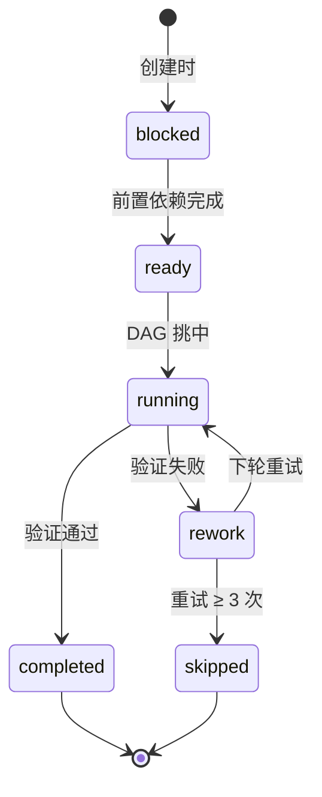

# nezha run：启动持续执行

前面所有准备工作都是为了这一步——按下回车，AI 开始真正写代码。

```bash
nezha run frontend-agent
```

从这里开始 AI 不再只是写文档，而是进入**持续执行状态**：连续不断地跑 task，调模型、写代码、commit、跑测试、修问题。

## 执行时的完整链路



## 终端会看到什么

启动后控制台开始持续滚动：

```
[scheduler] continuous mode, interval=60s
[executor] Picked feature: 2026-06-04-001 (项目骨架搭建)
[executor] Worktree: /Users/.../my-resume-app on feat/2026-06-04-001
[DAG] Loaded 8 tasks, 1 ready

============================================================
  SESSION 1: TASK — t01
  安装 react-resizable-panels 依赖并验证 TypeScript 类型可用
============================================================

[Tool: Bash] → pnpm add react-resizable-panels
  [成功] → installed 1 package
[Tool: Read] → /Users/.../package.json
  [成功]
...
[DAG] Verification passed for t01

[DAG] Next session in 3s... (7 tasks remaining)
```

读懂这几个标志：

- `[scheduler]` — 调度器在循环
- `[executor]` — 执行器挑选 Feature
- `[DAG]` — DAG 引擎在调度 Task
- `SESSION N: TASK — tXX` — 正在跑某个 Task
- `[Tool: ...]` — Agent 调用了某个工具

## 实时监控

**另开一个终端**，几个常用命令：

| 命令 | 看什么 |
|------|--------|
| `nezha status` | 当前执行状态、最近 session 费用 |
| `nezha feature list` | 所有 Feature 状态 + 费用 |
| `nezha feature show <id>` | 某个 Feature 详情 |
| `nezha logs -f` | 实时 tail 日志 |
| `nezha dashboard --open` | 浏览器打开可视化面板 |

或者直接在 Claude Code 里用 skill：

```
/overview            # 项目执行状态
/feature-list        # Feature 概览
/feature-show <id>   # 某个 Feature 详情
/dashboard           # 打开可视化面板
```

## 状态机：Task 怎么在 DAG 里流转



| 状态 | 含义 |
|------|------|
| `blocked` | 依赖未完成，等着 |
| `ready` | 依赖都完成了，可以执行 |
| `running` | 正在执行 |
| `completed` | 通过验证 |
| `rework` | 失败，等下轮重试 |
| `skipped` | 重试次数超限，放弃 |

> **重要**：DAG 状态是**动态计算**的，不存储在 Task 上，所以不会有状态不一致问题。

## 中途要停下来怎么办

| 场景 | 命令 |
|------|------|
| 跑完当前 Feature 再停 | `nezha stop`（优雅停止，推荐） |
| 立即强制停 | `nezha stop --force`（会中断当前 session） |
| 心情乱了想暂停一下 | `Ctrl + C`（会让 feature 卡在 `running` 状态，需要手动改回 `pending`） |

`nezha stop` 写一个 `.stop` 信号文件到 `state/`，scheduler 在 Feature 之间检查这个文件，看到就退出。

## 自动停机的情况

不需要你手动停，Nezha 自己也会在这些情况下停：

| 情况 | 行为 |
|------|------|
| 所有 Feature 都 completed | scheduler 检测到空队列，自动退出 |
| 触发 API 限流（429/529） | 写 `.stop` 信号文件，跑完当前 Task 退出 |
| 认证失败（401） | 同上，避免无意义空跑 |
| Feature 失败 + `failure_strategy=stop` | 立即停 |
| Feature 失败 + `failure_strategy=ai_judge` | AI 判断"下个 Feature 能不能独立执行"，能就继续，不能就停 |
| 触发 Guard 守卫 | 比如时间窗口外、超出预算 |

## 一个真实长跑案例

视频里这一阶段大致就是按下回车，然后等：

```
你：    nezha run frontend-agent
[滚动几十分钟到几小时不等]
Nezha:  All features completed, scheduler exits
你：    nezha feature list
        [看到所有 4 个 Feature 都是 completed 状态]
你：    cd /Users/you/code/my-resume-app && pnpm dev
        [打开浏览器看效果]
```

## 这一步常见疑问

**Q: 跑到一半 Task 失败了怎么办？**

不用管。Nezha 会：

1. 标记 Task 为 `rework`
2. 下轮重新执行（带上失败原因作为 rework_note）
3. 如果重试 ≥ 3 次还失败，标记 `skipped`，继续跑下一个 Task

最坏情况整个 Feature 卡死，触发 AI Judge 判断要不要停。详见 [How-To: 失败处理](../03-howto/failure-handling.md)。

**Q: 怎么估算要跑多久？**

经验值：

| 项目规模 | Task 数 | 跑完时间（粗估） |
|---------|---------|----------------|
| 小工具 | 5-20 | 30 分钟 - 2 小时 |
| 中型项目 | 20-80 | 2 - 8 小时 |
| 大型项目 | 80-200 | 8 - 24 小时 |

跑得快慢主要看：模型响应速度、Task 复杂度、网络状况。

**Q: 中途没盯着会不会跑歪？**

会有这个风险，所以 Nezha 设计了几道防线：

1. **PRD 作用域** — 每个 Feature 只看自己的 PRD（[06-write-prd](06-write-prd.md)）
2. **Verifier 验证** — Agent 自报告 + 外部测试命令
3. **rework 循环** — 失败自动返工，不靠运气
4. **AI Judge** — 失败时判断要不要停
5. **限流自动停** — 异常情况立即写 `.stop`
6. **心跳保活** — `nezha heartbeat start` 长期项目用得上

**Q: 跑完之后 PR 自动创建吗？**

如果 `agent.git` 里配了 `auto_push: true` 会自动推到远程；`gh` 已登录的话还会自动 create-pr。

视频案例里没自动推（默认关），跑完之后手动 push + 创建 PR。

## 这一步的价值

| 普通开发流程 | Nezha 的执行流程 |
|------------|-----------------|
| 写一段代码就要 review | 长跑无人值守 |
| 失败需要手动重启 | rework 自动循环 |
| 多任务靠记性 | DAG 调度 |
| 改动靠提交 | 每个 Task 独立 commit |

---

跑完了？下一步去 [09 - 迭代与修复](09-iterate.md)——验收、修 bug、加 Feature 优化。
