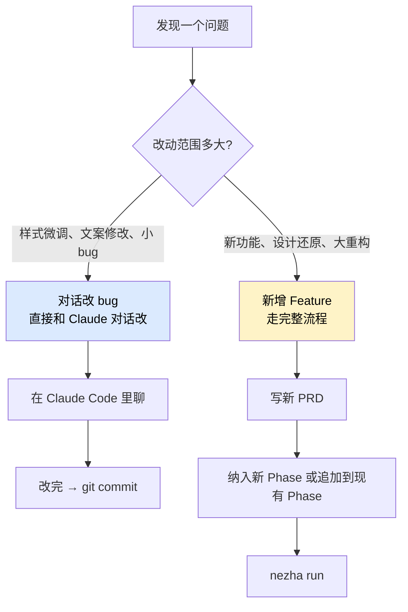
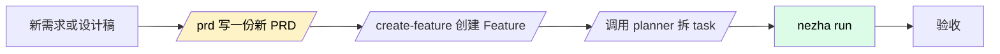
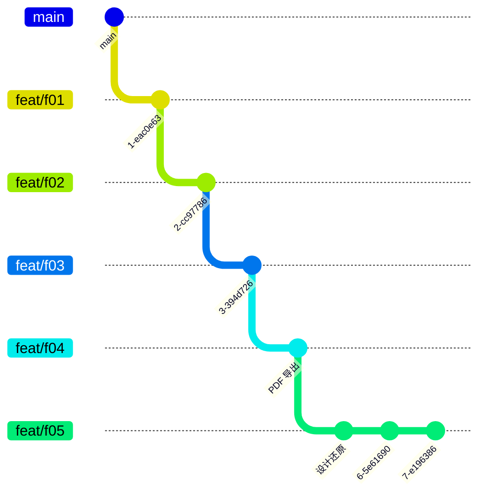
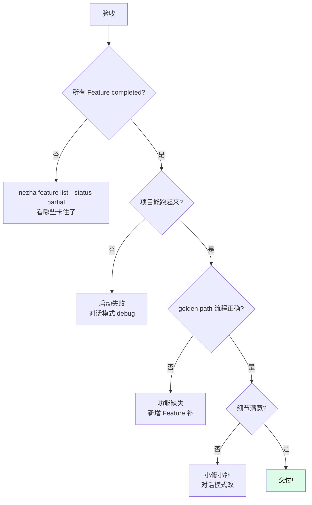
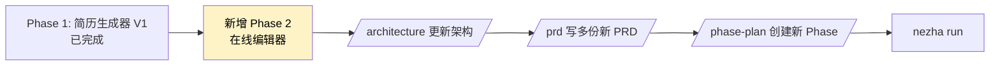

# 迭代与修复

`nezha run` 跑完不是终点。和真实开发一样，会有：

- **细节 bug**——边距、样式、文案这类小问题
- **优化需求**——某个组件要重写、要加新功能
- **设计变更**——想换更好看的视觉风格

Nezha 给了两种应对模式，分别处理"小修小补"和"较大改动"。

## 改 bug vs 新增 Feature：怎么选



| 模式 | 适合 | 工作流 | 时间 |
|------|------|--------|------|
| **对话改 bug** | 小问题、临时调整 | Claude Code 对话直接改 | 5 分钟 - 30 分钟 |
| **新增 Feature** | 大改动、新功能 | 重走 PRD → Phase → run | 几小时 |

## 模式一：对话改 bug

跟普通 vibe coding 一样直接：

```bash
cd my-resume-harness
claude
```

直接说：

> 现在简历页面 Header 区域的姓名字体太小了，改成 32px。

或者：

> Skills 区块的项目符号显示有点问题，第二行没对齐，帮我看一下。

Claude Code 会：

1. 读 target 仓库的代码
2. 定位问题
3. 直接 edit 文件
4. 跑测试验证

视频里就是这么做的——「这类细节问题，我直接通过对话让它继续修改了，过程和大家平时用 vibe coding 调样式差不多。」

### 改完之后 commit

```bash
cd /Users/you/code/my-resume-app
git add .
git commit -m "fix: adjust header font size"
```

## 模式二：新增 Feature

适合「我想用 GPT 的 image2 设计两个新页面，让 AI 按设计稿重新实现」这种较大改动。

### 完整流程



### 视频里的实际操作

第一阶段（4 个 Feature）跑完后，用户想用 GPT 的 image2 设计两个更好看的页面，让 AI 重新实现。视频里的对话节奏：

```
你：    我用 GPT image2 设计了两个新页面，差异比较大，能否新建一个 Feature 处理设计还原？
Claude: 好，先定义 Feature → 写 PRD → 创建 Feature → 调 planner
        [PRD 写好]
        [创建 Feature]
        [task_list.json 跑出来，拆了 20 多个小 task]
你：    OK 开始跑
你：    nezha run frontend-agent
        [跑完]
你：    [打开看，发现还有几个样式细节问题]
你：    [切回对话改 bug 模式]
```

注意这里是**两种模式组合使用**：

- 大改用 Feature 模式（设计还原）
- 小修用对话模式（剩余样式 bug）

### 加 Feature 时的依赖关系

新 Feature 默认基于上一个 Feature 的分支（链式继续）：



也可以指定基于其他分支：

```bash
nezha feature create --title "设计还原" --base-branch main
```

## 验收清单

跑完之后，按这个清单验证：



## 常见迭代场景速查

| 场景 | 用哪种模式 | 命令/技巧 |
|------|----------|-----------|
| 改文案错别字 | 对话 | "把 Resume 改成 简历" |
| 调样式（颜色、字体、间距） | 对话 | "header 高度太高，改成 80px" |
| 修一个具体 bug | 对话 | "点击导出按钮没反应，帮我看一下" |
| 加一个完整新功能 | Feature | `/prd` 写新 PRD |
| 设计稿还原 / 大改 UI | Feature | `/prd` + 附设计图引用 |
| 重构现有模块 | Feature | `/prd` 写明重构目标和约束 |
| 升级依赖 / 改框架 | Feature | `/prd` 写明升级范围和回滚策略 |

## Phase 间的迭代

如果项目已经做完了 Phase 1（"简历生成器 V1"），现在想做 Phase 2（"加入在线编辑器"）：



每个 Phase 独立管理，Phase 2 可以重新选 `base_branch`（基于 Phase 1 的最后一个 Feature，或者基于 main 干净起步）。

## 这一步常见疑问

**Q: 对话改了 bug，但我想保留为正式 Task 记录怎么办？**

可以追加到对应 Feature 的 task_list.json，手动加一条 Task 记录改动。或者建一个小 Feature 专门记录这些修复。

**Q: 新增 Feature 时能复用现有架构文档吗？**

可以，而且应该。新 PRD 里引用 `workspace/project/architecture.md`，Claude 会自动加载到上下文。

**Q: 改 bug 改飞了，想回到之前的状态？**

```bash
cd /Users/you/code/my-resume-app
git log --oneline -20    # 看最近 commit
git reset --hard <某个 commit>
```

每个 Task 都是独立 commit，回滚粒度很细。或者用 skill：

```
/rollback <feature-id>
```

**Q: 新增 Feature 后想跑特定 Feature，不要从头跑？**

```bash
nezha run frontend-agent --feature-id 2026-06-04-005
```

只跑指定 Feature。

**Q: AI 修着修着上下文乱了怎么办？**

清空对话开新会话。重要约束都在 `workspace/project/` 里，AI 重新启动会自动加载。

## 一些工程化习惯

| 习惯 | 为什么 |
|------|--------|
| 每次 commit 前自己 review | AI 的代码也要看 |
| 小问题对话改 + 立即 commit | 避免一次性堆几十个改动 |
| 大改动开新 Feature 走完整流程 | 保留 PRD 和 task 追溯 |
| 重要节点打 git tag | 方便回滚到稳定版本 |
| 定期 `nezha dashboard` 看费用 | 控制成本 |

## 项目走完一轮之后

你应该已经能熟练做这几件事：

- ✅ 创建 Harness 工程 + 配置 executor.yaml
- ✅ 让 Claude 写架构文档和 PRD
- ✅ 用 `phase-plan` 批量创建 Feature
- ✅ `nezha run` 启动持续执行
- ✅ 对话改 bug + 新增 Feature 优化
- ✅ 验收清单走一遍

接下来推荐的方向：

| 想做的事 | 去这里 |
|---------|--------|
| 命令和字段速查 | [02-cheatsheet](../02-cheatsheet/) |
| 接入 GLM/Kimi 国产模型 | [How-To: 第三方模型](../03-howto/third-party-models.md) |
| 控制费用预算 | [How-To: 费用控制](../03-howto/cost-budget.md) |
| 失败的 Task 怎么处理 | [How-To: 失败处理](../03-howto/failure-handling.md) |
| 理解 DAG 引擎设计 | [内部架构: DAG 引擎](../04-internals/dag-engine.md) |
| 新增自己的 Agent | [开发扩展: 新增 Agent](../05-extend/adding-an-agent.md) |

---

恭喜你完成了 Nezha 的快速开始！🎉

接下来根据自己的需要，选择性地深入各个章节。
