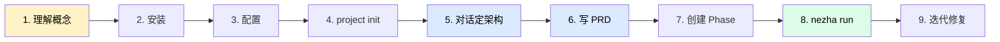

# 快速开始

这一章会带你**从零跑通一个完整项目**。我们用一个真实案例：用 AI 做一个 HTML 简历生成器，导出成 PDF。

为什么选这个例子？

因为它**完美体现了 AI 工程化的价值**：让 AI 改 Word 很难，但让 AI 改 React + JSON 很顺。把简历做成结构化数据驱动的 HTML，渲染成 A4 页面再导出 PDF——既能投递使用，又能让 AI 持续维护。

## 跑完这一章你会得到

- 一个能跑的 HTML 简历生成器项目
- 对 Nezha **完整工作流**的肌肉记忆
- 后续做自己项目时的清晰路径

## 阶段全景

> 🔵 蓝色 = 与 AI 对话产出文档的阶段
> 🟢 绿色 = AI 自动执行的阶段
> 🟡 黄色 = 准备阶段

## 章节导航

| 步骤 | 内容 | 时间 |
|------|------|------|
| [01 - 三个必懂概念](01-concepts.md) | Phase / Feature / Task + Harness vs target | 5 分钟 |
| [02 - 安装与初始化](02-install.md) | pipx 安装 + nezha init | 3 分钟 |
| [03 - 配置 executor.yaml](03-configure.md) | 项目名、scheduler、model_map、target | 5 分钟 |
| [04 - nezha project init](04-project-init.md) | 二次初始化的意义 | 2 分钟 |
| [05 - 对话定架构](05-design-with-claude.md) | 从需求到架构文档 | 10 分钟 |
| [06 - 写 PRD 文档](06-write-prd.md) | **每个 Feature 一份 PRD（关键）** | 10 分钟 |
| [07 - 创建 Phase](07-create-phase.md) | phase plan + planner 拆 task | 5 分钟 |
| [08 - nezha run](08-run.md) | 启动持续执行 | 视项目大小 |
| [09 - 迭代与修复](09-iterate.md) | 改 bug + 新增 Feature 优化 | 持续 |

## 关键心法（先记住，后理解）

读完这一章之前，先记住这几句：

1. **AI 不是越聊越神奇，是越有章法越稳**——先架构再 PRD 再 task，每一步都可控
2. **Harness 工程 ≠ target 仓库**——Nezha 的配置和代码仓库严格分开（在 [01-concepts](01-concepts.md) 详解）
3. **每个 Feature 一份 PRD**——这是 Nezha 区别于普通 vibe coding 的灵魂（在 [06-write-prd](06-write-prd.md) 详解）
4. **Phase 不是 Feature 的简单堆叠**——Phase 控制分支链 + 依赖 DAG，让多 Feature 像流水线一样推进
5. **失败不可怕**——`rework` 机制 + AI Judge 会让流程自愈，最坏情况触发优雅停止等你介入

准备好了？从 [01 - 三个必懂概念](01-concepts.md) 开始。
