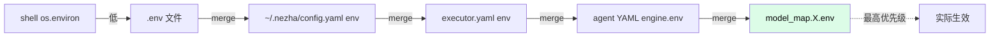

# 环境变量速查

所有 Nezha 用到的环境变量。可以放在 `.env`、`~/.nezha/config.yaml` 的 `env`、`executor.yaml` 的 `env`，或者 agent YAML 的 `engine.env`。

## 优先级



## 模型相关

| 变量 | 用途 | 何时配 |
|------|------|--------|
| `ANTHROPIC_API_KEY` | Anthropic API Key | 不用 Claude Code 登录态时 |
| `ANTHROPIC_BASE_URL` | Anthropic API Base URL | 用第三方 Anthropic 兼容代理 |
| `ANTHROPIC_ADMIN_KEY` | 组织管理 API Key（查用量） | 想查用量统计时 |
| `OPENAI_API_KEY` | OpenAI 兼容 API Key | 接入 GLM/Kimi/DeepSeek 等 |
| `OPENAI_BASE_URL` | OpenAI 兼容 Base URL | 接入第三方模型 |

## Git 相关

| 变量 | 用途 | 何时配 |
|------|------|--------|
| `GH_TOKEN` | GitHub Token | 用 `nezha run` 自动 create-pr 到 GitHub |
| `GITEE_TOKEN` | Gitee Token | 用 `nezha run` 自动 create-pr 到 Gitee |

> create-pr 时 Nezha 自动从 `git remote get-url origin` 检测平台：
> - `github.com` → 用 `GH_TOKEN` + `gh` CLI
> - `gitee.com` → 用 `GITEE_TOKEN` + REST API

## 语言 / 区域

| 变量 | 用途 | 默认值 |
|------|------|--------|
| `AGENT_EXEC_LANG` | 强制语言（覆盖 `locale` 配置） | 无 |

例：

```bash
AGENT_EXEC_LANG=zh_CN nezha run frontend-agent
```

## .env 文件示例

```bash
# ============= 模型 =============
# 如果你用 Claude Code 登录态，可以不配 ANTHROPIC_API_KEY
ANTHROPIC_API_KEY=sk-ant-xxxxxxxxxxxxxxxx

# 接入 GLM
GLM_API_KEY=your_glm_key

# 接入 Kimi
KIMI_API_KEY=your_kimi_key

# 接入 MiniMax
MINIMAX_API_KEY=your_minimax_key

# ============= Git =============
GH_TOKEN=ghp_xxxxxxxxxxxx
GITEE_TOKEN=your_gitee_token

# ============= 其他 =============
# AGENT_EXEC_LANG=zh_CN
```

## 在配置里引用 .env

`${VAR}` 语法：

```yaml
# executor.yaml
env:
  ANTHROPIC_API_KEY: "${ANTHROPIC_API_KEY}"
  GH_TOKEN: "${GH_TOKEN}"

model_map:
  low:
    model: glm-4-flash
    env:
      OPENAI_API_KEY: "${GLM_API_KEY}"
      OPENAI_BASE_URL: "https://open.bigmodel.cn/api/paas/v4"
```

## 全局用户配置 `~/.nezha/config.yaml`

跨项目共用的配置可以放这里，会自动 merge 到每个项目：

```yaml
# ~/.nezha/config.yaml
locale: "zh_CN"
timezone: "Asia/Shanghai"

env:
  ANTHROPIC_API_KEY: "${ANTHROPIC_API_KEY}"
  GH_TOKEN: "${GH_TOKEN}"

model_map:
  low: claude-haiku-4-5-20251001
  medium: claude-sonnet-4-6
  high: claude-sonnet-4-6
```

> `~/.nezha/config.yaml` 也支持 `${VAR}` 引用 shell 环境变量。

## 安全建议

| 建议 | 为什么 |
|------|--------|
| ❌ 不要把 API key 直接写在 `executor.yaml` | 容易被 commit 到 git 仓库 |
| ✅ 放 `.env`（已默认 `.gitignore`） | 隔离敏感信息 |
| ✅ 团队共享放 `~/.nezha/config.yaml` | 每人本地配置，不进仓库 |
| ✅ CI 环境用环境变量注入 | 不依赖文件 |
| ✅ 用 `${VAR}` 引用 | 配置文件不暴露明文 |

## 常见问题

**Q: `.env` 不生效？**

确认 `.env` 在 `executor.yaml` **同目录**。Nezha 只读这个位置的 `.env`。

**Q: `${VAR}` 没替换？**

检查变量是否真的在 `.env` 或 shell 环境里。`${VAR}` 找不到时**保留原文**（不报错）。

**Q: 改了 `.env` 后要重启吗？**

要。`.env` 在 nezha 启动时加载，运行中改不会生效。`nezha stop` 后再启动即可。

**Q: 怎么验证当前 env 配置？**

```bash
nezha status --config executor.yaml
```

会显示当前生效的关键 env 变量（敏感字段会脱敏）。

或者：

```bash
nezha heartbeat test
```

如果 API key 配错了，这里会直接报错。
