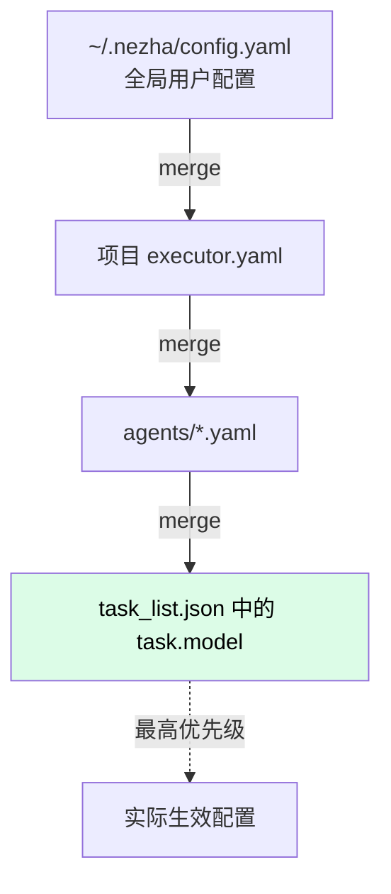

# executor.yaml 字段速查

Harness 工程的全局配置。所有字段都有默认值，最小可用配置只需要 4-5 行。

## 最小配置

```yaml
executor:
  name: "my-project"
target: "/path/to/code-repo"
model_map:
  low: claude-haiku-4-5-20251001
  medium: claude-sonnet-4-6
  high: claude-sonnet-4-6
```

## 完整字段一览

```yaml
# ============ 项目元信息 ============
executor:
  name: "my-project"           # 项目名（必填）
  description: ""              # 描述（可选）

# ============ 工作空间 ============
workspace:
  base: "./workspace"          # workspace 根目录
  strategy: "per_agent"        # per_agent | shared

# ============ 目录路径 ============
agents_dir: "./agents"          # agent YAML 所在目录
prompts_dir: "./prompts"        # prompt 模板所在目录
state_dir: "./state"            # 状态文件目录（日志、PID、stop 信号）

# ============ 代码仓库 ============
target: "/path/to/code-repo"    # target 代码仓库路径（agent 的 cwd）

# ============ 语言 / 时区 ============
locale: "zh_CN"                 # "en" | "zh_CN"
timezone: "Asia/Shanghai"       # 用于 cron、time_window guard、日志时间戳

# ============ 调度器 ============
scheduler:
  mode: "continuous"            # manual | continuous | cron
  interval: 60                  # 秒，循环间隔
  cron: ""                      # cron 表达式（mode=cron 时）
  timezone: "Asia/Shanghai"
  max_backoff: 3600             # 退避上限（秒），0 = 不退避
  backoff_on_no_task: true      # 队列为空时是否退避
  concurrency: 1                # 并发 feature 数，1 = 串行
  failure_strategy: "ai_judge"  # stop | continue | ai_judge
  stop_on_empty: true           # 没有 pending feature 时是否退出
  judge_model: "claude-haiku-4-5-20251001"  # ai_judge 用的模型
  judge_api_type: "anthropic"   # anthropic | openai
  judge_env: {}                 # judge 的 env 覆盖

# ============ 心跳 ============
heartbeat:
  interval: 18000               # 秒（默认 5 小时）
  models:
    - model: claude-haiku-4-5-20251001
    # - model: glm-4-flash
    #   env:
    #     OPENAI_API_KEY: "${GLM_API_KEY}"
    #     OPENAI_BASE_URL: "https://open.bigmodel.cn/api/paas/v4"

# ============ 模型路由 ============
model_map:
  low:                          # 低难度任务
    model: claude-haiku-4-5-20251001
    env: {}                     # 模型 env 覆盖（API key、base URL）
    task_factor: 1.2            # planner 拆 task 粒度系数（默认 low=1.2）
  medium:                       # 中难度
    model: claude-sonnet-4-6
    task_factor: 1.0
  high:                         # 高难度
    model: claude-opus-4-6
    task_factor: 0.8

# 简写形式（只指定模型，env 用默认）
# model_map:
#   low: claude-haiku-4-5-20251001
#   medium: claude-sonnet-4-6
#   high: claude-opus-4-6

# ============ 全局环境变量 ============
env:
  # ANTHROPIC_API_KEY: "${ANTHROPIC_API_KEY}"     # 引用 .env
  # GH_TOKEN: "${GH_TOKEN}"
  # GITEE_TOKEN: "${GITEE_TOKEN}"

# ============ MCP 服务器（全局） ============
mcp_servers:
  # filesystem:
  #   command: "npx"
  #   args: ["-y", "@modelcontextprotocol/server-filesystem", "/workspace"]
  # my-remote:
  #   url: "http://localhost:8080/sse"

# ============ 守卫链 ============
guards:
  - type: circuit_breaker       # 熔断
    enabled: true
    params:
      failure_threshold: 5      # 连续失败次数
      cooldown_seconds: 600     # 冷却时间
  - type: time_window           # 时间窗口
    enabled: false
    params:
      start: "09:00"
      end: "23:00"
  - type: balance_check         # 费用预算
    enabled: false
    params:
      max_cost_usd: 50.0        # 累计费用上限
      check_interval: 300

# ============ 事件处理器 ============
event_handlers:
  - type: file_logger           # 日志写文件
    enabled: true
    params:
      path: "./state/logs/"
  - type: state_writer          # 实时状态写 JSON
    enabled: true
    params:
      path: "./state/executor_status.json"
  - type: trace_writer          # 链路追踪
    enabled: true
    params:
      path: "./state/trace.jsonl"
```

## 字段优先级



| 来源 | 例子 | 优先级 |
|------|------|--------|
| `~/.nezha/config.yaml` | locale、timezone、默认 model_map | 最低 |
| `executor.yaml` | 项目级配置 | 中 |
| `agents/<name>.yaml` | agent 级配置 | 高 |
| `task_list.json` 中的 `task.model` | 单个 task 写死的模型 | 最高 |

## ${VAR} 引用

配置里可以引用 `.env` 中的变量：

```yaml
# .env
ANTHROPIC_API_KEY=sk-ant-xxx
GLM_API_KEY=glm-xxx

# executor.yaml
env:
  ANTHROPIC_API_KEY: "${ANTHROPIC_API_KEY}"
model_map:
  low:
    model: glm-4-flash
    env:
      OPENAI_API_KEY: "${GLM_API_KEY}"
```

`${VAR}` 在加载时解析，找不到时保留原文（不报错）。

## 字段速查表（按字母排序）

| 字段路径 | 类型 | 默认值 | 说明 |
|---------|------|--------|------|
| `agents_dir` | str | `./agents` | agent YAML 目录 |
| `env` | dict | `{}` | 全局环境变量 |
| `event_handlers[]` | list | `[]` | 事件处理器 |
| `executor.description` | str | `""` | 项目描述 |
| `executor.name` | str | `"nezha"` | 项目名 |
| `guards[]` | list | `[]` | 守卫链 |
| `heartbeat.interval` | int | `18000` | 心跳间隔（秒） |
| `heartbeat.models[]` | list | `[]` | 心跳模型列表 |
| `locale` | str | `"en"` | 语言 |
| `mcp_servers` | dict | `{}` | MCP 服务器 |
| `model_map.{low,medium,high}.env` | dict | `{}` | 模型 env 覆盖 |
| `model_map.{low,medium,high}.model` | str | - | 模型 ID |
| `model_map.{low,medium,high}.task_factor` | float | `1.2/1.0/0.8` | 拆 task 粒度 |
| `prompts_dir` | str | `./prompts` | prompt 目录 |
| `scheduler.concurrency` | int | `1` | 并发数 |
| `scheduler.failure_strategy` | str | `ai_judge` | stop\|continue\|ai_judge |
| `scheduler.interval` | int | `3` | 循环间隔（秒） |
| `scheduler.mode` | str | `manual` | manual\|continuous\|cron |
| `scheduler.stop_on_empty` | bool | `true` | 队列空时退出 |
| `state_dir` | str | `./state` | 状态目录 |
| `target` | str/null | `null` | target 代码仓库路径 |
| `workspace.base` | str | `./workspace` | workspace 根目录 |
| `workspace.strategy` | str | `per_agent` | per_agent\|shared |
