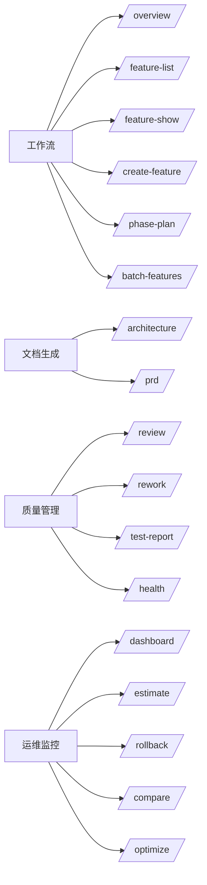

# Skills 列表

`nezha init` 时自动在 `.claude/skills/` 下生成 17 个 skill，给 Claude Code 用。在 Claude 对话里输入 `/` 即可调用。

## 按场景分组



## 核心工作流（最常用）

| Skill | 用途 | 典型触发场景 |
|-------|------|--------------|
| `/overview` | 查看项目整体执行状态 + Feature 概览 | 一打开 Claude Code 就用 |
| `/feature-list` | 列出所有 Feature 及状态、费用 | 想了解项目进度 |
| `/feature-show <id>` | 看某个 Feature 详细信息 | 排查某个 Feature 状态 |
| `/create-feature <title>` | 创建单个 Feature | 临时加一个小需求 |
| `/phase-plan` | 从 PRD 批量创建 Phase + Feature | **主流程**：写完 PRD 后调用 |
| `/batch-features` | 链式创建多个 Feature | 不需要 Phase 也能批量建 |

## 文档生成

| Skill | 用途 | 典型触发场景 |
|-------|------|--------------|
| `/architecture` | 生成架构文档 → `workspace/project/architecture.md` | 项目启动初期，[05-design-with-claude](../01-quickstart/05-design-with-claude.md) |
| `/prd <feature>` | 生成 PRD 文档 → `input/PRD-*.md` | 架构定下来后，[06-write-prd](../01-quickstart/06-write-prd.md) |

## 质量管理

| Skill | 用途 | 典型触发场景 |
|-------|------|--------------|
| `/review <feature-id>` | 对某个 Feature 做 code review | Feature 跑完后人工 review 之前 |
| `/rework <task-id> "原因"` | 标记某个 task 重做 | 发现某个 task 没做好 |
| `/test-report` | 生成测试报告 | 验收阶段 |
| `/health` | 项目健康度检查 | 长跑后想了解整体质量 |

## 运维监控

| Skill | 用途 | 典型触发场景 |
|-------|------|--------------|
| `/dashboard` | 生成 HTML dashboard | 看费用、进度可视化 |
| `/estimate` | 估算费用、时间 | 跑之前预估成本 |
| `/rollback <feature-id>` | 回滚某个 Feature | 改飞了想回到稳定版 |
| `/compare <feature-id>` | 对比 Feature 前后变化 | 想知道改了什么 |
| `/optimize` | 优化建议 | 想看哪里能调优 |

## 跨章节常用 Skill 推荐路径

第一次跑通项目：

```
/overview              查看项目状态
   ↓
/architecture          先定架构（如果还没定）
   ↓
/prd                   写 PRD（多份）
   ↓
/phase-plan            批量创建 Feature
   ↓
[ 终端: nezha run ]
   ↓
/feature-list          看跑得怎么样
   ↓
/dashboard             看可视化
```

调试 / 优化 Feature：

```
/feature-show <id>     看具体状态
   ↓
/review <id>           review 代码
   ↓
/rework <task-id>      标记重做
   ↓
[ 终端: nezha run ]    重新执行
```

应对失败：

```
/health                看整体状况
   ↓
/feature-list --status partial   找出失败的
   ↓
/rollback <id>         回滚
   ↓
/rework <task-id>      重做
```

## Skill 在哪里？

```
my-harness/
└── .claude/
    └── skills/
        ├── overview/SKILL.md
        ├── feature-list/SKILL.md
        ├── ...
        └── phase-plan/SKILL.md
```

每个 skill 就是一个 markdown 文件，简单的甚至只有几行：

```markdown
---
name: overview
description: View nezha project execution status and feature overview
user-invocable: true
---

## Execution Status

!`nezha status`

## Feature Overview

!`nezha feature list`
```

`!\`cmd\`` 是 Claude Code 的语法，会在调用时执行命令并把输出注入到上下文。

## 自定义 Skill

想加自己的 skill？直接在 `.claude/skills/` 下建目录：

```bash
mkdir -p .claude/skills/my-skill
```

写 `SKILL.md`：

```markdown
---
name: my-skill
description: 我的自定义技能
user-invocable: true
argument-hint: [参数提示]
---

执行步骤：

1. !`nezha feature list`
2. 分析输出，根据用户的 $ARGUMENTS 推荐操作
```

下次启动 Claude Code 输入 `/` 就能看到。

> ⚠️ 注意：`!\`cmd\`` 注入的命令必须是**单条命令**，不能用 `||`、`for` 循环、管道链等复合 shell 语句（Claude Code 权限检查器会拒绝）。

## 完整 Skill 列表（按字母排序）

| Skill | 是否可用户调用 | 用途 |
|-------|--------------|------|
| `/architecture` | ✅ | 生成架构文档 |
| `/batch-features` | ✅ | 批量创建链式 Feature |
| `/compare` | ✅ | 对比 Feature 变化 |
| `/create-feature` | ✅ | 创建单个 Feature |
| `/dashboard` | ✅ | 生成 HTML dashboard |
| `/estimate` | ✅ | 估算费用 / 时间 |
| `/feature-list` | ✅ | 列出 Feature |
| `/feature-show` | ✅ | Feature 详情 |
| `/health` | ✅ | 健康度检查 |
| `/optimize` | ✅ | 优化建议 |
| `/overview` | ✅ | 项目状态总览 |
| `/phase-plan` | ✅ | 创建 Phase + 批量 Feature |
| `/prd` | ✅ | 生成 PRD |
| `/review` | ✅ | Code review |
| `/rework` | ✅ | 标记 task 重做 |
| `/rollback` | ✅ | 回滚 Feature |
| `/test-report` | ✅ | 测试报告 |
