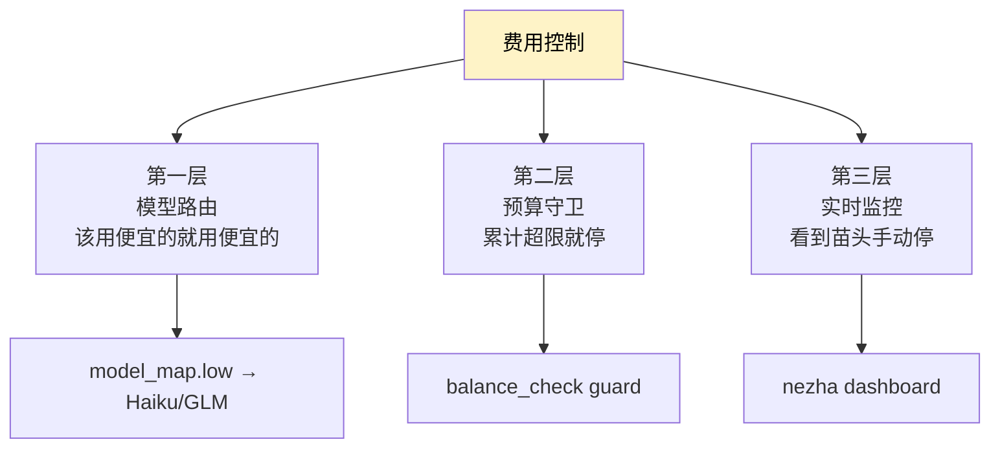
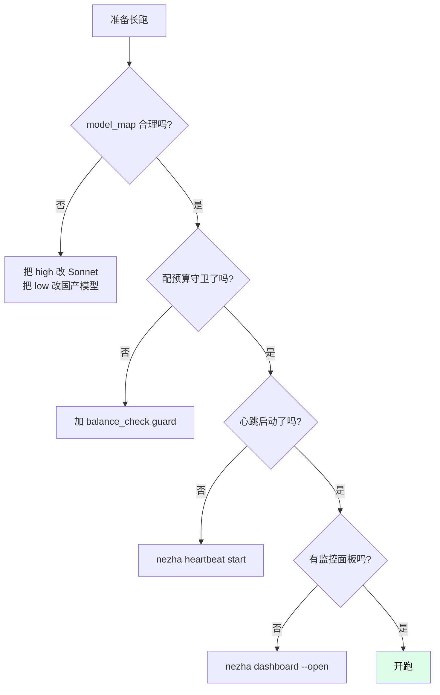

# 费用控制

让 AI 长跑最怕什么？账单暴雷。Nezha 提供几种机制控费用——**预算守卫 + 模型路由 + 心跳成本**。

## 三层防线



## 第一层：模型路由（最有效）

让简单任务用便宜模型，复杂任务才用贵模型。

### 推荐配置

```yaml
model_map:
  low:
    model: claude-haiku-4-5-20251001    # 约 Sonnet 1/10 价格
  medium: claude-sonnet-4-6              # 平衡
  high: claude-sonnet-4-6                # 省钱：高难度也用 Sonnet
```

或者用国产模型省更多：

```yaml
model_map:
  low:
    model: glm-4-flash                   # 免费 / 极便宜
    env:
      OPENAI_API_KEY: "${GLM_API_KEY}"
      OPENAI_BASE_URL: "https://open.bigmodel.cn/api/paas/v4"
  medium: claude-sonnet-4-6
  high: claude-sonnet-4-6
```

详见 [How-To: 接入第三方模型](third-party-models.md)。

### 价格对比（粗略，2026 年初）

| 模型 | input ($/1M tok) | output ($/1M tok) | 适合 |
|------|----------------|------------------|------|
| GLM-4-Flash | 免费 | 免费 | 简单 task |
| Claude Haiku 4.5 | 1.00 | 5.00 | 简单 task |
| Claude Sonnet 4.6 | 3.00 | 15.00 | 主力 |
| Claude Opus 4.6 | 15.00 | 75.00 | 高难度核心模块 |
| DeepSeek-Coder | 0.14 | 0.28 | 简单 / 中等 task |

> ⚠️ 价格随时变化，以厂商官网为准。

### 拆细 task 进一步省钱

弱模型 + 拆细 task = 每次 LLM 调用 token 数都很少：

```yaml
model_map:
  low:
    model: glm-4-flash
    env: {...}
    task_factor: 1.5     # 拆得更细
```

## 第二层：预算守卫（balance_check）

累计花费达到上限就**自动停止**。

### 配置

```yaml
guards:
  - type: balance_check
    enabled: true
    params:
      max_cost_usd: 50.0       # 累计 50 美元就停
      check_interval: 300      # 5 分钟检查一次
```

### 触发后

```
[balance] Cost so far: $48.21 / $50.00
[guard] balance_check: budget exceeded ($50.43 >= $50.00)
[executor] Guard failed, stopping
```

会写 `.stop` 信号触发优雅停止。

### 跨进程累加

`max_cost_usd` 是**当前进程内累计**的。重启 `nezha run` 后归零。

如果想跨进程累加（比如限制每天总花费），需要自己加自定义 Guard，从持久化文件读累计值。详见 [开发扩展](../05-extend/)。

## 第三层：实时监控

### dashboard

```bash
nezha dashboard --open
```

可视化看：
- 每个 Feature 的累计费用
- 每个 task 的费用
- 总累计

### CLI 速查

```bash
nezha feature list
```

输出带 COST 列：

```
ID                    TITLE              STATUS     COST
2026-06-04-001       项目骨架             completed  $0.84
2026-06-04-002       数据 Schema         completed  $1.23
2026-06-04-003       简历组件             running    $4.51
```

### 看某个 Feature 的费用明细

```bash
nezha feature show 2026-06-04-003
```

会显示每个 session 的费用。

## 费用统计的局限

`cost_usd` 来自 LLM SDK 返回值，**只对官方 Claude API 准确**。其他场景：

| 场景 | 费用准确度 |
|------|----------|
| Claude API 直连 | ✅ 准确 |
| Claude Code 登录态 | ⚠️ Anthropic 不返回 cost，显示为 0 |
| 第三方 OpenAI 兼容 API | ⚠️ 大部分厂商不返回，显示为 0 |

**意味着**：

- 用 Claude Code 登录态时，Nezha 显示的 cost 不准
- 想精准统计：自己按 token 数 × 单价算（或者用厂商 dashboard）

## 估算工具

跑之前预估费用，用 skill：

```
/estimate
```

会根据当前 task_list.json + model_map 估算总费用。

## 长跑前的费用 checklist



## 实际省钱策略

### 策略 1：先小后大

先跑 1-2 个 Feature 看费用规律，再决定要不要跑后面的：

```bash
nezha run frontend-agent --feature-id <第一个 feature>
nezha feature show <id>                # 看花了多少
nezha run frontend-agent               # 满意了再连续跑
```

### 策略 2：cap 单 Feature 费用

```yaml
agents:
  - name: frontend-agent
    engine:
      max_turns: 30                   # 单 task 最多 30 轮
```

`max_turns` 越小，单 task 上限越低。但太小会让复杂 task 跑不完。

### 策略 3：拆 task 拆得更细

每个 task 范围越小，单次失败成本越低：

```yaml
model_map:
  medium:
    model: claude-sonnet-4-6
    task_factor: 1.3     # 默认 1.0，调大让 planner 拆细
```

### 策略 4：限制重试次数

Rework 默认 3 次，可以调小：

```yaml
# 改源码 src/nezha/dag/graph.py
REWORK_MAX_COUNT = 2     # 默认 3，调到 2
```

代价：可能性能略降，但费用更可控。

## 常见问题

**Q: 费用显示是 $0 是为啥？**

可能是用了 Claude Code 登录态或第三方模型，SDK 不返回 cost。看本地 dashboard 没用，去 Anthropic Console 看实际费用。

**Q: 预算守卫触发后能继续吗？**

可以。`nezha run` 重启，进程内累计费用会归零。但你要先确认是否真的还想花。

**Q: 怎么知道单 task 大概花多少？**

经验值：

| Task 复杂度 | Sonnet 大概花费 |
|------------|---------------|
| low（改个文件、加几行） | $0.01 - $0.05 |
| medium（实现一个组件） | $0.05 - $0.30 |
| high（设计一个模块） | $0.30 - $2.00 |

整个简历生成器项目（4 Feature，30+ task）大概 $5-15。

**Q: 限制总 token 而不是 USD？**

目前 `balance_check` 只支持 USD。token 数限制可以自己加 Guard。

## 相关章节

- [Reference: balance_check guard](../02-cheatsheet/executor-yaml.md#守卫链)
- [How-To: 接入第三方模型](third-party-models.md)
- [How-To: 心跳保活](heartbeat.md)
- [How-To: 限流处理](rate-limit.md)
