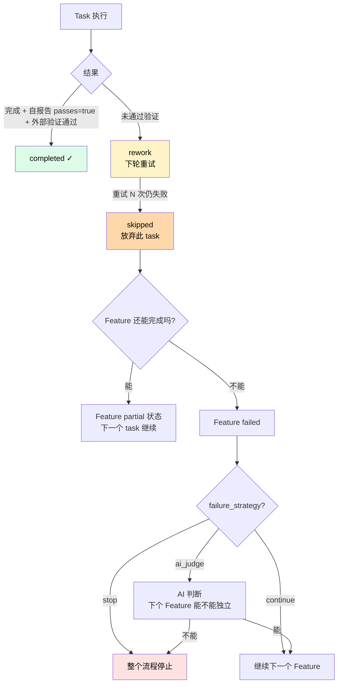
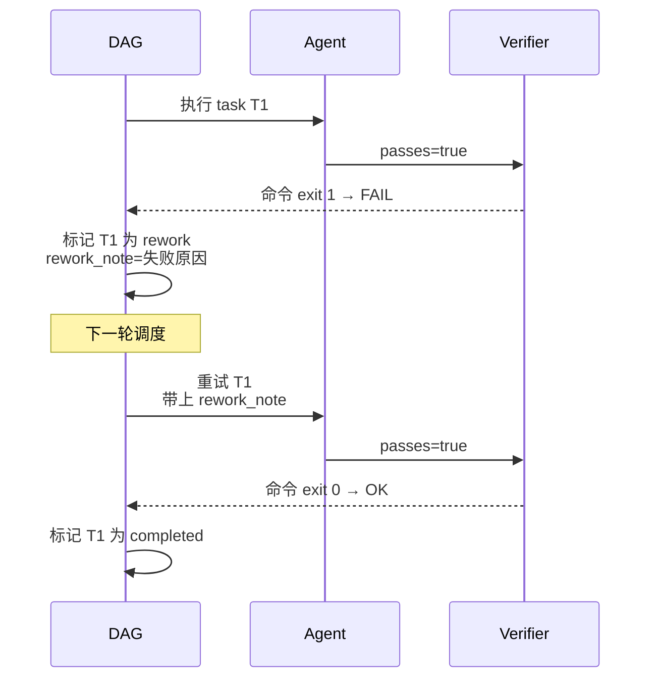
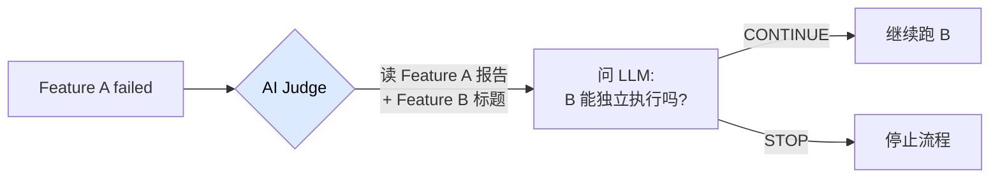

# Task 失败处理

任务失败是正常的。Nezha 设计了几道防线让流程**自愈**而不是卡死。

## 失败的几个层级



## 第一道防线：验证（Verifier）

每个 task 跑完后会走两级验证：

| 验证层 | 怎么验 | 通过条件 |
|--------|--------|----------|
| **Agent 自报告** | task_list.json 里 `passes` 字段 | `passes: true` |
| **外部命令**（可选） | agent YAML 配的 `verification_command` | 命令 exit 0 |

**两个都通过才算 completed**。任何一个失败 → 标记 rework。

### 配置外部验证命令

```yaml
# agents/coding-agent.yaml
verification:
  command: "pnpm test"        # 每个 task 跑完后执行
```

或者更精细：

```yaml
verification:
  command: "pnpm test -- --findRelatedTests"
  timeout: 60
```

## 第二道防线：Rework 循环



每次 rework，Nezha 会把**失败原因**作为 `rework_note` 注入到下次 prompt，引导 AI 修复。

### rework_note 数据结构

```json
{
  "id": "t05",
  "description": "实现 PDF 导出",
  "passes": false,
  "rework": true,
  "rework_count": 2,
  "rework_note": {
    "attempt": 2,
    "tried": "用 jsPDF 失败，尝试 react-pdf",
    "not_tried": "puppeteer",
    "related_files": ["src/export.ts"],
    "block_reason": "jsPDF 不支持中文字体"
  }
}
```

### Rework 上限

默认重试 **3 次** 后标记 `skipped`。超过这个数还失败的 task 通常是设计问题，需要人工介入。

## 第三道防线：AI Judge

Feature 失败时，调用 LLM 判断「下一个 Feature 能不能独立执行」。



### 配置

```yaml
scheduler:
  failure_strategy: "ai_judge"
```

### 用什么模型

按这个优先级：

1. `model_map.low`（推荐——简单的 yes/no 判断用便宜模型）
2. `scheduler.judge_model`（默认 `claude-haiku-4-5-20251001`）

Claude 模型走 SDK 登录态，第三方模型走 OpenAI 兼容 API。**无需单独配 API Key**。

### Judge 的判断 prompt 长什么样

简化版：

```
A feature just failed. Decide if the next feature can be executed independently.

## Failed Feature
- ID: F-002
- Error: Could not install puppeteer
- Report: [report excerpt]

## Next Pending Feature
- Title: Add PDF export button

## Question
Can the next feature be executed independently, without depending on
the failed parts of the previous feature?

Answer with EXACTLY one word: CONTINUE or STOP.
```

## 三种 failure_strategy 对比

| 策略 | 行为 | 适合 |
|------|------|------|
| `stop` | 一失败就停整个流程 | 严格生产环境、不允许部分交付 |
| `continue` | 一直跑，失败也不管 | 探索性项目、想看哪些能跑通 |
| `ai_judge` | AI 判断是否继续 | **推荐**：平衡严格和灵活 |

## 第四道防线：人工 rework

如果 AI 自己重试还不行，手动介入：

```bash
nezha rework coding-agent T-005 "这里不要用 jsPDF，改用 puppeteer"
```

下一轮 `nezha run` 时，T-005 会带着你的 note 重新执行。

或者用 skill：

```
/rework T-005 "改用 puppeteer，jsPDF 不支持中文"
```

## 第五道防线：回滚

如果一个 Feature 改飞了，整个回滚：

```bash
# 用 skill
/rollback <feature-id>

# 或者手动 git
cd /path/to/target-repo
git reset --hard <commit-before-feature>
```

然后改 `feature.yaml` 把状态设回 `pending`，重新跑。

## Feature 三种最终状态

| 状态 | 含义 | 怎么产生 |
|------|------|---------|
| `completed` | 所有 task 都 completed | 一切顺利 |
| `partial` | 部分 task 完成，部分 skipped | rework 超限或 stuck |
| `failed` | DAG 引擎直接失败 | session 严重错误（401、限流、超时等） |

```bash
# 看哪些 Feature partial
nezha feature list --status partial

# 看具体哪些 task 失败
nezha feature show <feature-id>
```

## 常见场景

### 场景 1：外部命令 timeout

task 跑完了，但 `pnpm test` 等待 60 秒后 timeout。

**对策**：

```yaml
verification:
  command: "pnpm test"
  timeout: 300         # 改大
```

### 场景 2：rework 3 次还失败，task 被 skip

打开 task_list.json 看 `rework_note`，根据 `block_reason` 决定：

- **真的实现不了**：手动改 task description，降低范围
- **AI 没理解清楚**：手动 rework 加更明确的 note
- **依赖问题**：先解决依赖（比如装个库），再 rework

### 场景 3：Feature 跑到一半网络断了

session 报 error 后，Feature 进入 `partial` 状态。

**对策**：

```bash
# 看具体哪个 task 没跑完
nezha feature show <feature-id>

# 把 Feature 状态改回 pending
# 直接编辑 workspace/features/<id>/feature.yaml
status: pending

# 重跑（DAG 会跳过已 completed 的 task）
nezha run frontend-agent --feature-id <id>
```

### 场景 4：AI 修来修去越改越乱

```bash
# 1. 回滚到 Feature 开始之前
cd target-repo
git reset --hard <commit-before-feature>

# 2. 改 PRD，把约束写得更明确
edit input/PRD-XXX.md

# 3. 改 task_list.json，拆得更细
edit workspace/features/<id>/task_list.json

# 4. 重跑
nezha run frontend-agent --feature-id <id>
```

## 调试技巧

### 看 task 失败的具体原因

```bash
# CLI
nezha feature show <feature-id>

# 或者直接看 task_list.json
cat workspace/features/<id>/task_list.json | jq '.[] | select(.rework == true)'
```

### 单独跑一个 task

```bash
# 创建一个临时 Feature 只包含这个 task
nezha feature create --title "调试 t05" --input task_t05.md
nezha run coding-agent --feature-id <临时 id>
```

### 用 vibe 模式手动调试

```bash
nezha vibe coding-agent --feature-id <feature-id>
```

会进入交互式 REPL，你可以一步步问 AI 做啥、让它读文件、试方案。

## 相关章节

- [Reference: scheduler.failure_strategy](../02-cheatsheet/executor-yaml.md#调度器)
- [Reference: rework 命令](../02-cheatsheet/cli-commands.md#修复重做)
- [How-To: 限流处理](rate-limit.md)
- [How-To: 故障排查](troubleshooting.md)
- [Quick Start: 迭代与修复](../01-quickstart/09-iterate.md)
