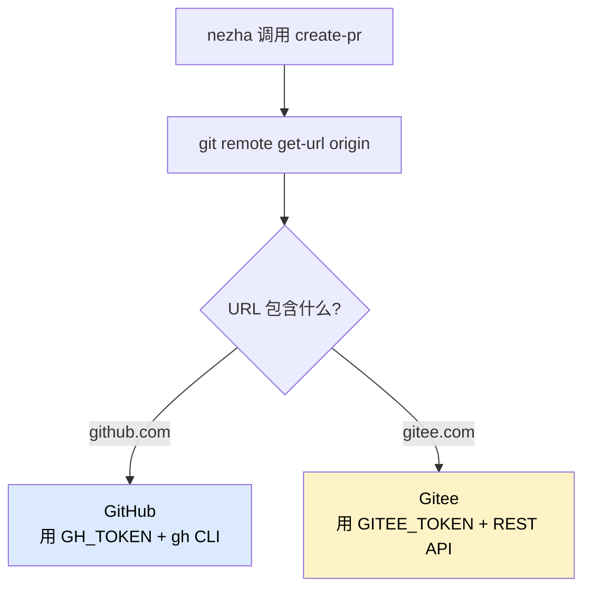

# GitHub vs Gitee

Nezha 自动检测代码仓库的 Git 平台，**不需要在配置里写 platform**。你要做的只有一件事：**配对应的 Token**。

## 自动检测原理



只要 `git remote get-url origin` 能识别出来，就自动用对应的认证方式：

```bash
# 这些 URL 都识别为 GitHub
git@github.com:org/repo.git
https://github.com/org/repo.git
https://github.com/org/repo

# 这些识别为 Gitee
git@gitee.com:org/repo.git
https://gitee.com/org/repo.git
```

## GitHub 配置

### 1. 准备 Token

去 https://github.com/settings/tokens 创建 Personal Access Token，权限至少需要：

- `repo`（仓库读写）
- `workflow`（如果需要操作 GitHub Actions）

### 2. 安装 gh CLI

```bash
brew install gh
gh auth login
# 或者直接用 token 登录
echo "$GH_TOKEN" | gh auth login --with-token
```

### 3. 配置环境变量

`.env`：

```bash
GH_TOKEN=ghp_xxxxxxxxxxxxxxxxxxxx
```

`executor.yaml`：

```yaml
env:
  GH_TOKEN: "${GH_TOKEN}"
```

### 4. 验证

```bash
gh pr list                # 应该能列出 PR
gh auth status            # 应该显示已登录
```

## Gitee 配置

Gitee 没有官方 CLI，Nezha 直接调 Gitee REST API（v5），用 `urllib`（标准库，零额外依赖）。

### 1. 准备 Token

去 https://gitee.com/personal_access_tokens 创建私人令牌，权限至少需要：

- `projects`（仓库读写）
- `pull_requests`（创建 PR）

### 2. 配置环境变量

`.env`：

```bash
GITEE_TOKEN=your_gitee_token_here
```

`executor.yaml`：

```yaml
env:
  GITEE_TOKEN: "${GITEE_TOKEN}"
```

### 3. 验证

```bash
# Nezha 触发 create-pr 时会自动从 remote URL 解析 owner/repo
# 调用：POST https://gitee.com/api/v5/repos/{owner}/{repo}/pulls
```

可以手动测试：

```bash
TOKEN=$GITEE_TOKEN
curl "https://gitee.com/api/v5/user?access_token=$TOKEN"
# 应该返回你的用户信息
```

## 两个平台同时存在

如果你同时有 GitHub 和 Gitee 仓库，**两个 Token 都配上**，Nezha 自动识别用哪个：

`.env`：

```bash
GH_TOKEN=ghp_xxxxxxxxxxxx
GITEE_TOKEN=gitee_xxxxxxxx
```

不同的 target 仓库分别检测：

| target 的 remote URL | 用什么 Token |
|---------------------|-------------|
| `git@github.com:foo/bar.git` | `GH_TOKEN` |
| `git@gitee.com:foo/bar.git` | `GITEE_TOKEN` |

## 不创建 PR 的话

如果不需要自动创建 PR（只想 commit + push），可以在 agent YAML 关掉：

```yaml
# agents/coding-agent.yaml
git:
  auto_commit: true       # 自动 commit ✓
  auto_push: true         # 自动 push ✓
  # 不配 post_tools 里的 create-pr，就不创建 PR
```

这种情况下，Token 也用不上——`git push` 走的是本地 git 凭据（SSH key 或 git credential helper），不读 `GH_TOKEN`/`GITEE_TOKEN`。

## 常见问题

**Q: Token 配了为啥还是认证失败？**

排查顺序：

1. `.env` 在 `executor.yaml` 同目录吗？
2. `${VAR}` 引用语法对吗？
3. Token 是否过期？去对应平台测试 API：
   ```bash
   # GitHub
   curl -H "Authorization: token $GH_TOKEN" https://api.github.com/user

   # Gitee
   curl "https://gitee.com/api/v5/user?access_token=$GITEE_TOKEN"
   ```
4. Token 权限是否够？

**Q: Gitee 的 PR 标题 / 描述里有中文，会乱码吗？**

不会。Nezha 调 Gitee API 时用 `Content-Type: application/json` + UTF-8 编码，正常处理中文。

**Q: 自建 GitLab 怎么办？**

目前 Nezha 没有原生支持 GitLab API。临时方案：

- 用 GitLab Runner 模拟 PR 流程
- 或者只 commit + push，不创建 PR（人工创建）

如果有需求，可以提 issue。

**Q: 一个项目里同时有 GitHub 远程和 Gitee 远程怎么办？**

Nezha 只检测 `origin`。如果想用 Gitee 创建 PR，把 Gitee 设为 `origin`：

```bash
git remote set-url origin git@gitee.com:foo/bar.git
git remote add github git@github.com:foo/bar.git
```

**Q: 我用 SSH 不用 HTTPS，Token 还需要吗？**

`git push` 走 SSH 不用 Token。但**`create-pr` 必须用 Token**——SSH 只能操作 git 协议，PR 是平台的 REST API。

## 相关章节

- [Reference: 环境变量](../02-cheatsheet/env-variables.md#git-相关)
- [Agent YAML 配置](../02-cheatsheet/executor-yaml.md)
