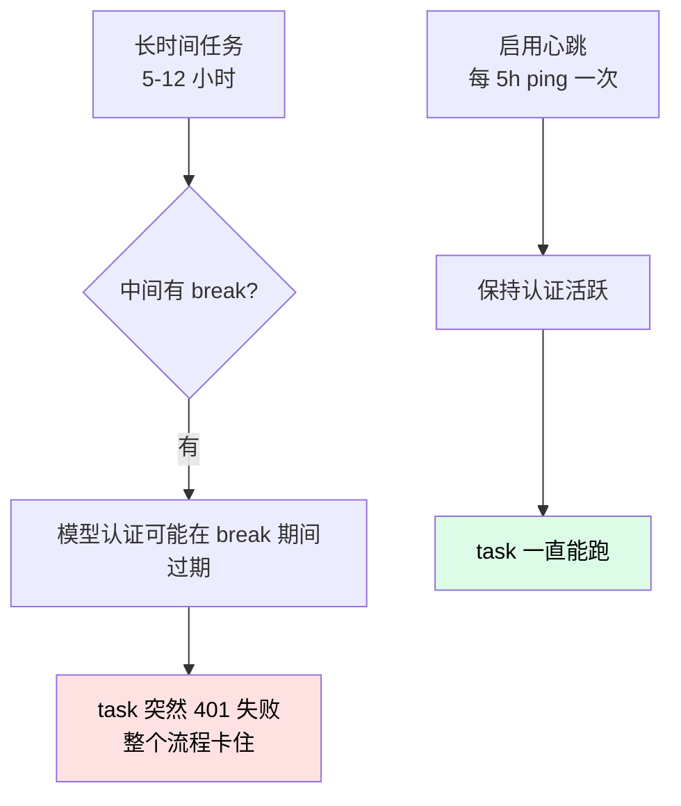
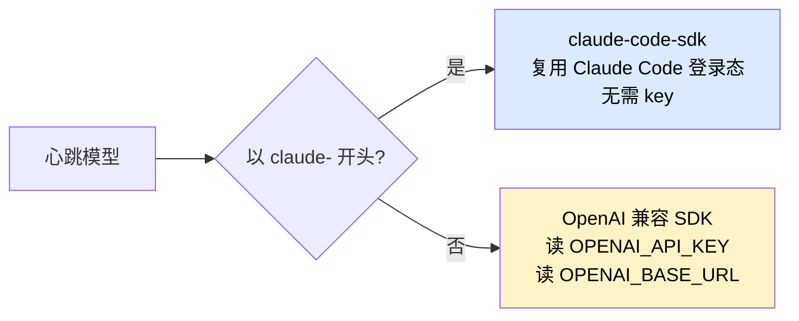
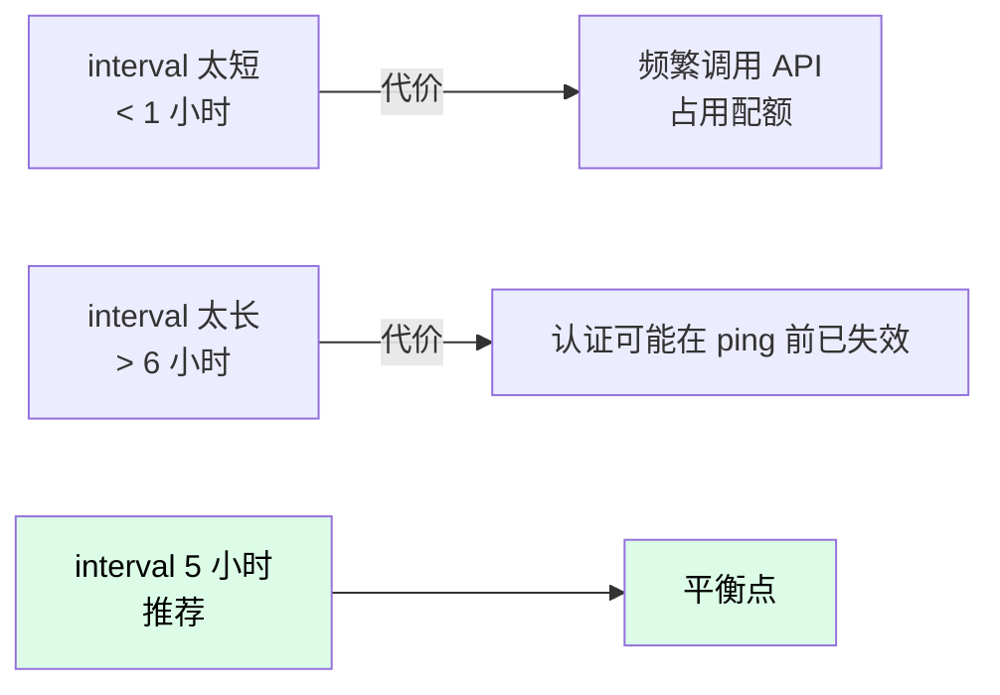

# 心跳保活

长时间运行（几小时甚至一夜）时，给 Nezha 加一个心跳进程。每隔 N 小时给配置的模型发个 `hi`，确保认证状态没失效。

## 为什么需要心跳



典型场景：

| 场景 | 心跳价值 |
|------|---------|
| 夜间无人值守跑大项目 | ⭐⭐⭐ 必备 |
| 1-2 小时短跑 | ⭐ 可选 |
| 用了 Claude Code 登录态 | ⭐⭐ 推荐（OAuth token 会刷新失败） |
| 用第三方模型 API Key | ⭐ 一般不需要（key 长期有效） |

## 命令三件套

| 命令 | 用途 |
|------|------|
| `nezha heartbeat start` | 后台启动（幂等，重复执行不会重启） |
| `nezha heartbeat test` | 立即 ping 一次（验证配置） |
| `nezha heartbeat stop` | 停止后台进程 |

## 配置

`executor.yaml`：

```yaml
heartbeat:
  interval: 18000              # 秒，默认 5 小时
  models:
    - model: claude-haiku-4-5-20251001
    # 多个模型同时保活
    # - model: claude-sonnet-4-6
    # - model: glm-4-flash
    #   env:
    #     OPENAI_API_KEY: "${GLM_API_KEY}"
    #     OPENAI_BASE_URL: "https://open.bigmodel.cn/api/paas/v4"
```

### 配置说明

| 字段 | 含义 | 默认值 |
|------|------|--------|
| `interval` | 心跳间隔（秒） | `18000`（5 小时） |
| `models[]` | 要保活的模型列表 | 空 |
| `models[].model` | 模型 ID | - |
| `models[].env` | 模型 env（API key、base URL） | `{}` |

### Claude vs 第三方模型



Claude 模型简单：

```yaml
heartbeat:
  interval: 18000
  models:
    - model: claude-haiku-4-5-20251001    # 自动用登录态
```

第三方模型要带 env：

```yaml
heartbeat:
  interval: 18000
  models:
    - model: glm-4-flash
      env:
        OPENAI_API_KEY: "${GLM_API_KEY}"
        OPENAI_BASE_URL: "https://open.bigmodel.cn/api/paas/v4"
```

## 使用流程

### 1. 配完先 test

启动前先 test 一次，验证配置正确：

```bash
nezha heartbeat test
```

输出：

```
[heartbeat] Pinging claude-haiku-4-5-20251001 ... ok
[heartbeat] Pinging glm-4-flash ... ok
```

任何报错（401、404、网络超时等）都要先解决。

### 2. 启动 nezha run 前 start

```bash
nezha heartbeat start
```

输出：

```
[heartbeat] Started (pid=12345)
  Models: ['claude-haiku-4-5-20251001']
  Interval: 18000s
  Log: ./state/heartbeat.log
```

PID 文件写到 `state/.heartbeat.pid`，日志到 `state/heartbeat.log`。

### 3. 启动主流程

```bash
nezha run frontend-agent
```

心跳进程独立后台运行，跟 nezha run 互不干扰。

### 4. 任务结束后 stop

```bash
nezha heartbeat stop
```

输出：

```
[heartbeat] Stopped (pid=12345)
```

## 幂等性

`nezha heartbeat start` 重复执行不会重复启动：

```bash
$ nezha heartbeat start
[heartbeat] Started (pid=12345)

$ nezha heartbeat start
[heartbeat] Already running (pid=12345)
  Use 'nezha heartbeat stop' to stop it first
```

防止误操作产生多个心跳进程。

## 查看心跳日志

```bash
tail -f state/heartbeat.log
```

正常应该看到：

```
[heartbeat] Started — interval=18000s, models=['claude-haiku-4-5-20251001']
[heartbeat] Pinging claude-haiku-4-5-20251001 ... ok
[heartbeat] Next ping in 18000s
[heartbeat] Pinging claude-haiku-4-5-20251001 ... ok
[heartbeat] Next ping in 18000s
```

## interval 怎么设？



| interval | 适合 |
|---------|------|
| 1 小时（3600） | 频繁失活的环境 |
| 5 小时（18000） | **推荐默认值** |
| 12 小时（43200） | 认证较稳定的环境 |

## 心跳会产生费用吗？

会，但极少。每次心跳就是一条 `hi` + 模型回复 `hi`，token 数极少（< 10 tokens）。

按 Claude Haiku 单价算：每天 4-5 次心跳 ≈ 0.001 美元。**可以忽略**。

## 常见问题

**Q: 启动 heartbeat 报 "No models configured"？**

`executor.yaml` 里没配 `heartbeat.models`，或者列表是空的。加上：

```yaml
heartbeat:
  models:
    - model: claude-haiku-4-5-20251001
```

**Q: ping 报 "Unknown message type: rate_limit_event"？**

旧版本 bug，升级到最新 Nezha 即可：

```bash
cd /path/to/nezha
PIP_INDEX_URL=https://pypi.org/simple pipx install --force .
```

**Q: 我不想后台跑，能定时手动 ping 吗？**

可以用 cron + `nezha heartbeat test`：

```cron
0 */5 * * *  cd /path/to/harness && nezha heartbeat test >> heartbeat.log 2>&1
```

**Q: 心跳进程意外退出怎么办？**

正常退出会清理 PID 文件。异常退出（kill -9 等）会留下 stale PID 文件。下次 `nezha heartbeat start` 会检测到进程已死，清理 PID 文件后正常启动。

**Q: 多个 Harness 工程能同时跑心跳吗？**

可以。每个 Harness 工程的 PID 文件独立（`state/.heartbeat.pid`），互不干扰。

**Q: 心跳能保活 GitHub Token / Gitee Token 吗？**

不能。心跳只 ping LLM API。Token 失活的话另开 [How-To: GitHub vs Gitee](github-vs-gitee.md) 重新配。

## 相关章节

- [Reference: executor.yaml heartbeat 字段](../02-cheatsheet/executor-yaml.md#心跳)
- [Reference: CLI heartbeat 命令](../02-cheatsheet/cli-commands.md#心跳保活)
- [How-To: 限流处理](rate-limit.md)
