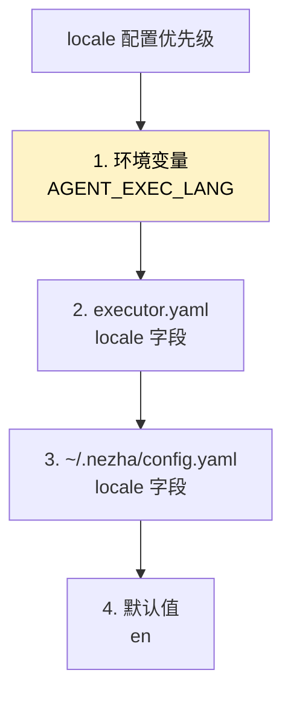
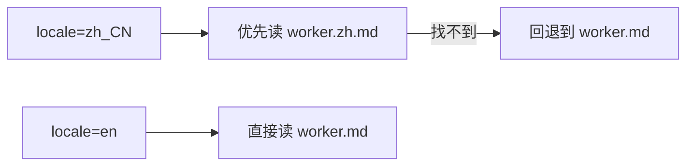

# 中英文 Prompt 切换

Nezha 的所有内置 Prompt 都有**英文版 + 中文版**，根据 `locale` 配置自动选择。

## 三种切换方式



### 方式 1：环境变量（一次性）

```bash
AGENT_EXEC_LANG=zh_CN nezha run frontend-agent
```

适合临时切换。

### 方式 2：项目级配置（推荐）

`executor.yaml`：

```yaml
locale: "zh_CN"        # "en" | "zh_CN"
```

整个项目都用中文 prompt。

### 方式 3：全局用户配置（最方便）

`~/.nezha/config.yaml`：

```yaml
locale: "zh_CN"
```

所有项目默认都用中文，不用每个项目都配。

## Prompt 文件命名约定



文件结构：

```
prompts/
├── coding/
│   ├── worker.md          ← 英文（默认）
│   ├── worker.zh.md       ← 中文版
│   └── fix.md
│       fix.zh.md
└── modules/
    ├── phases/
    │   ├── tdd.md
    │   └── tdd.zh.md
    └── stacks/
        ├── python.md
        ├── python.zh.md
        └── ...
```

## 哪些地方有中文版？

| 类别 | 文件 | 中文版 |
|------|------|--------|
| **Agent worker prompt** | `prompts/<role>/worker.md` | ✅ `worker.zh.md` |
| **Prompt 模块** | `prompts/modules/phases/*.md` | ✅ `*.zh.md` |
| **技术栈模块** | `prompts/modules/stacks/*.md` | ✅ `*.zh.md` |
| **关注点模块** | `prompts/modules/concerns/*.md` | ✅ `*.zh.md` |
| **Skill 描述** | `.claude/skills/*/SKILL.md` | 通过 `_SKILL_*_ZH` 变量切换 |
| **CLI 输出** | 通过 `locales/zh_CN.yaml` 翻译 | ✅ |

## 验证生效

```bash
nezha status
```

看 CLI 输出是中文就成功了。

或者跑一次 task：

```bash
nezha run frontend-agent --max-iterations 1
```

看 prompt 注入到 LLM 的内容是中文还是英文。

## 自定义 Prompt 也要双语吗？

**不是强制**。你自己写的 prompt 只有一份也能跑——找不到 `.zh.md` 会回退到 `.md`。

但建议双语：

| 场景 | 是否建议双语 |
|------|-------------|
| 个人项目 | 一种语言就够 |
| 团队中有非中文成员 | ✅ 双语 |
| 想贡献回 Nezha 模板 | ✅ 双语（必须） |

## 跨项目语言不一致

`~/.nezha/config.yaml` 配 `zh_CN`，某个特定项目想用英文：

```yaml
# 该项目的 executor.yaml
locale: "en"
```

项目级覆盖全局。

## 部分场景的特殊处理

### 与 LLM 对话语言

LLM 生成的代码注释、文档、变量命名等是英文还是中文，取决于：

1. 你 prompt 里的语言（中文 prompt 会引导中文输出）
2. 你在对话里的明确要求（"请用英文注释"）
3. 项目已有代码的风格（AI 会跟随）

`locale` 只控制 Nezha **框架自身**的 prompt 语言，不强制约束 LLM 生成内容的语言。

### Git commit message 语言

默认会跟着 `locale` 走（中文 locale → 中文 commit message）。如果想强制英文 commit：

```yaml
# agents/<agent>.yaml
git:
  auto_commit: true
  commit_lang: "en"        # 覆盖 locale
```

## 常见问题

**Q: 改了 `locale` 为啥还是英文？**

检查：

1. `locale` 字段拼写对吗？（`zh_CN` 不是 `zh-CN` 也不是 `zh`）
2. `executor.yaml` 在当前命令的 working directory 吗？
3. 有没有被 `AGENT_EXEC_LANG` 环境变量覆盖？
   ```bash
   echo $AGENT_EXEC_LANG     # 应该是空或者 zh_CN
   ```

**Q: 有些 prompt 是英文，有些是中文，混的？**

可能是某些 prompt 模块没有 `.zh.md` 版本，自动回退到了英文。

要么提供 `.zh.md`，要么接受混排（一般不影响 LLM 理解）。

**Q: CLI 输出有些中文，有些英文？**

CLI 文案在 `src/nezha/locales/zh_CN.yaml`，如果某些 key 没翻译会回退到 `en.yaml`。可以提 PR 补全翻译。

**Q: 想加日语 / 韩语等？**

理论上支持，但目前只有 `en` 和 `zh_CN` 的翻译资源。可以：

1. 在 `src/nezha/locales/` 加 `ja_JP.yaml`
2. 在 `prompts/` 里加 `worker.ja.md` 等
3. 改 `_LOCALE_FALLBACK` 字典

详见 [开发扩展](../05-extend/)。

## 相关章节

- [Reference: 环境变量](../02-cheatsheet/env-variables.md#语言--区域)
- [Reference: executor.yaml](../02-cheatsheet/executor-yaml.md)
