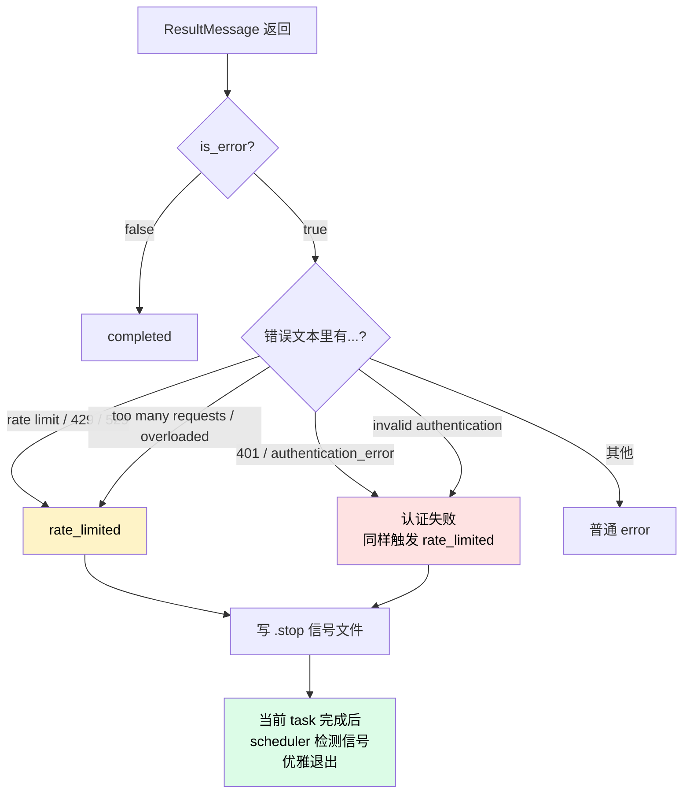
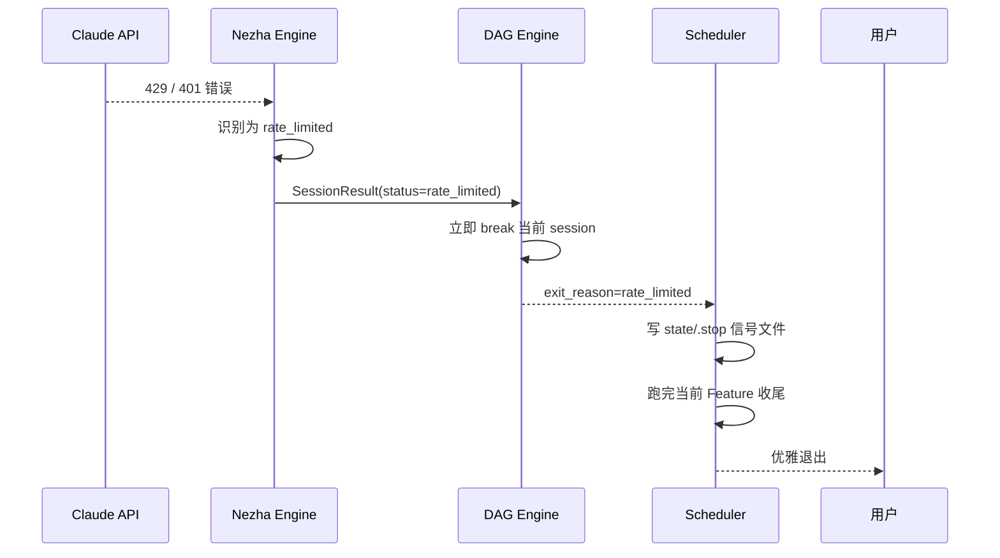

# 限流处理

Claude 5 小时配额用完、API 限流、认证失效——这些情况 Nezha 会**自动识别 + 优雅停止**，不会傻跑浪费时间。

## 自动识别的几类错误



## 触发场景

| 场景 | 错误信息 | 行为 |
|------|----------|------|
| 5 小时配额用完 | `429 rate limit exceeded` | 优雅停止 |
| 短时间高频请求 | `429 too many requests` | 优雅停止 |
| Anthropic 系统过载 | `529 overloaded` | 优雅停止 |
| API Key 过期 | `401 authentication_error` | 优雅停止 |
| Claude Code 登录过期 | `401 invalid authentication` | 优雅停止 |

> **注意**：Claude Code CLI 在正常运行时也会发 `rate_limit_event` 消息（API 响应头的配额信息），但**这不是真的限流**。Nezha 区分了真假限流，只对真的报错才触发停止。

## 触发后会发生什么



**用户视角**：终端会看到类似：

```
[executor] Rate limit detected — writing graceful stop signal
[scheduler] Stop signal detected, exiting after current feature
[continuous] Stopped after 3 iterations
```

## 限流后恢复

### 1. 等配额恢复

| 限制类型 | 恢复时间 |
|---------|---------|
| Claude 5 小时配额 | 5 小时窗口滚动恢复 |
| 短时高频限流 | 几分钟 |
| 系统过载（529） | 几分钟到几小时 |
| 认证失败 | 重新登录后立刻恢复 |

### 2. 重新启动

```bash
nezha run frontend-agent
```

DAG 会接着上次跑——已 completed 的 task 不会重跑，pending 和 rework 的会继续。

### 3. 永久解决

#### 用心跳保活避免认证失效

```bash
nezha heartbeat start
```

详见 [How-To: 心跳保活](heartbeat.md)。

#### 启用多模型 fallback

某些厂商限流了切到其他厂商。在 `model_map` 配多个供选：

```yaml
model_map:
  low:
    model: glm-4-flash
    env:
      OPENAI_API_KEY: "${GLM_API_KEY}"
      OPENAI_BASE_URL: "https://open.bigmodel.cn/api/paas/v4"
  medium: claude-sonnet-4-6
  high: deepseek-coder
    env:
      OPENAI_API_KEY: "${DEEPSEEK_API_KEY}"
      OPENAI_BASE_URL: "https://api.deepseek.com/v1"
```

不同复杂度走不同厂商，分摊风险。

#### 控制并发数

```yaml
scheduler:
  concurrency: 1     # 串行执行，降低 API 调用频率
```

#### 调整调度间隔

```yaml
scheduler:
  interval: 60       # Feature 间隔 60 秒
  max_backoff: 3600  # 退避上限 1 小时
```

## 怎么知道是不是真的被限流

看终端最后的错误信息：

```
[DAG] Session error: rate_limit_exceeded: You have exceeded your rate limit...
```

或者看 `state/logs/`：

```bash
nezha logs | grep -i "rate\|429\|401"
```

如果是 401，去对应平台检查：

- Anthropic: https://console.anthropic.com/settings/keys
- 用 Claude Code 登录的话: `claude login` 重登

## 强制停止 vs 优雅停止

| 触发方式 | 行为 | 适用 |
|---------|------|------|
| **限流自动停**（rate_limited） | 当前 session 立即中断 + 跑完当前 Feature 收尾 + 退出 | API 真的不能再调了 |
| **`nezha stop`** | 当前 Feature 跑完后退出 | 主动想停一下 |
| **`nezha stop --force`** | 立刻 SIGTERM | 紧急停 |
| **Ctrl+C** | 立刻退出，Feature 状态卡 running | 不推荐 |

## 限流不要慌的几个理由

1. **数据不丢**：当前 task 的代码已经 commit 了，已完成 task 状态都已持久化
2. **可恢复**：等配额恢复后 `nezha run` 接着跑
3. **DAG 智能跳过**：已完成的 task 不会重跑
4. **报告完整**：`workspace/features/<id>/execution-report.md` 记录了限流前的所有进度

## 常见问题

**Q: 没用完配额就被限流了？**

可能是：

1. **RPM 限流**（每分钟请求数）：调慢 `scheduler.interval`
2. **共享配额**：组织内多人用同一个账号，整体超了
3. **服务端临时过载**（529）：等几分钟自然恢复

**Q: 偶发 401，但 key 没问题？**

如果是 Claude Code 登录态，可能是 OAuth token 临时刷新失败。重启 Nezha 或重新登录：

```bash
claude login
nezha run frontend-agent
```

详见 [How-To: 故障排查](troubleshooting.md)。

**Q: 想关掉自动停止，让它一直试？**

不建议（会反复撞限流浪费）。但可以改代码——把 `engine.py` 里的 `rate_limited` 关键词列表清空。

**Q: 怎么估算自己 5 小时配额还剩多少？**

Anthropic 官方没有公开 API 查实时配额。可以：

1. 看 Anthropic Console: https://console.anthropic.com/usage
2. 用 Admin Key 查 Usage API（需要组织账号）

详见 [How-To: 费用控制](cost-budget.md)。

## 相关章节

- [Quick Start: nezha run](../01-quickstart/08-run.md#自动停机的情况)
- [How-To: 心跳保活](heartbeat.md)
- [How-To: 费用控制](cost-budget.md)
- [Internals: 限流识别机制](../04-internals/)
