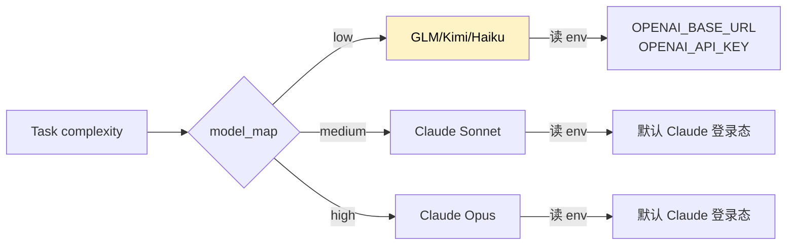

# 接入第三方模型

把简单 task 交给 GLM / Kimi / DeepSeek 这类成本更低的国产模型，复杂任务还是用 Claude——既省钱又稳。

## 原理

Nezha 通过 `model_map` + `env` 字段路由：



**判断逻辑**：

| 模型名以...开头 | 用什么 SDK | 认证方式 |
|----------------|------------|----------|
| `claude-*` | claude-code-sdk | Claude Code 登录态（无需 key） |
| 其他（`glm-*`、`kimi-*`、`deepseek-*` 等） | OpenAI 兼容 SDK | 读 `OPENAI_API_KEY` + `OPENAI_BASE_URL` |

## 支持的厂商

理论上**所有 OpenAI 兼容 API** 都能接，常见的：

| 厂商 | 模型名前缀 | Base URL |
|------|-----------|----------|
| 智谱 GLM | `glm-4-flash`、`glm-4-plus` | `https://open.bigmodel.cn/api/paas/v4` |
| 月之暗面 Kimi | `kimi-k2-instruct`、`moonshot-v1-8k` | `https://api.moonshot.cn/v1` |
| DeepSeek | `deepseek-chat`、`deepseek-coder` | `https://api.deepseek.com/v1` |
| MiniMax | `abab6.5-chat` | `https://api.minimax.chat/v1` |
| 字节豆包 | `doubao-pro-32k` | `https://ark.cn-beijing.volces.com/api/v3` |
| 阿里通义 | `qwen-max`、`qwen-plus` | `https://dashscope.aliyuncs.com/compatible-mode/v1` |
| OpenRouter | 几乎所有模型 | `https://openrouter.ai/api/v1` |

## 完整配置示例

### 场景 1：低难度用 GLM，中高难度用 Claude

`.env`：

```bash
GLM_API_KEY=your_glm_key
```

`executor.yaml`：

```yaml
model_map:
  low:
    model: glm-4-flash
    env:
      OPENAI_API_KEY: "${GLM_API_KEY}"
      OPENAI_BASE_URL: "https://open.bigmodel.cn/api/paas/v4"
  medium: claude-sonnet-4-6
  high: claude-opus-4-6
```

### 场景 2：完全不用 Claude

`.env`：

```bash
KIMI_API_KEY=your_kimi_key
DEEPSEEK_API_KEY=your_deepseek_key
```

`executor.yaml`：

```yaml
model_map:
  low:
    model: kimi-k2-instruct
    env:
      OPENAI_API_KEY: "${KIMI_API_KEY}"
      OPENAI_BASE_URL: "https://api.moonshot.cn/v1"
  medium:
    model: deepseek-chat
    env:
      OPENAI_API_KEY: "${DEEPSEEK_API_KEY}"
      OPENAI_BASE_URL: "https://api.deepseek.com/v1"
  high:
    model: deepseek-coder
    env:
      OPENAI_API_KEY: "${DEEPSEEK_API_KEY}"
      OPENAI_BASE_URL: "https://api.deepseek.com/v1"
```

> ⚠️ 完全不用 Claude 时，task 不能用 SDK 内置工具（Read/Write/Bash 等），只能用 `direct` 模式跑文本生成。详见下文。

### 场景 3：DeepSeek + OpenRouter 兜底

```yaml
model_map:
  low:
    model: deepseek-chat
    env:
      OPENAI_API_KEY: "${DEEPSEEK_API_KEY}"
      OPENAI_BASE_URL: "https://api.deepseek.com/v1"
  medium: claude-sonnet-4-6
  high:
    model: anthropic/claude-opus-4
    env:
      OPENAI_API_KEY: "${OPENROUTER_API_KEY}"
      OPENAI_BASE_URL: "https://openrouter.ai/api/v1"
```

## 弱模型的 task_factor 调整

弱模型代码能力差一些，建议拆细 task，每个 task 范围更小：

```yaml
model_map:
  low:
    model: glm-4-flash
    env: {...}
    task_factor: 1.5    # 默认 1.2，弱模型可以调到 1.5
```

`task_factor` 越大，planner 拆出的 task 越多越细。

| task_factor | 效果 | 适合 |
|-------------|------|------|
| 0.8 | 拆少而粗 | 强模型（Opus） |
| 1.0 | 默认中粒度 | Sonnet |
| 1.2 | 默认稍细 | Haiku |
| 1.5+ | 拆很细 | GLM-Flash、DeepSeek-Chat 等 |

## 验证配置

最快验证方式：用心跳测试 ping 一下：

```yaml
heartbeat:
  interval: 18000
  models:
    - model: glm-4-flash
      env:
        OPENAI_API_KEY: "${GLM_API_KEY}"
        OPENAI_BASE_URL: "https://open.bigmodel.cn/api/paas/v4"
```

```bash
nezha heartbeat test
```

返回 `ok` 即成功，报错就根据错误信息修。

## 第三方模型的限制

### 1. 不能用 Claude Code 工具

Claude Code 的 `Read`/`Write`/`Edit`/`Bash`/`Grep` 等工具是 claude-code-sdk 提供的，第三方模型用不了。**所以第三方模型只能跑 `direct_api` 模式**——一次 prompt 输入，一次文本输出。

| Agent 类型 | 能用第三方模型吗 |
|-----------|----------------|
| `planning`（如 planner-agent） | ✅ 可以 |
| `design`（如 db-design-agent） | ✅ 可以 |
| `management`（如 pm-agent） | ✅ 可以 |
| `coding`（如 frontend-agent） | ❌ 不行（需要工具调用） |

**结论**：第三方模型适合用在**辅助 Agent**（planner、PM、Judge 等），不适合直接写代码的 coding agent。

### 2. AI Judge 自动适配

`failure_strategy: ai_judge` 时，judge 会优先用 `model_map.low`。如果 low 是 Claude 模型走 SDK 登录态；如果是第三方模型走 OpenAI 兼容 SDK。**无需单独配置 `judge_env`**。

详见 [Reference](../02-cheatsheet/executor-yaml.md#字段速查表按字母排序) `scheduler.judge_*` 字段。

### 3. 费用计算可能不准

`SessionResult.cost_usd` 来自 SDK 返回，第三方模型这个字段经常是 0。如果要精准统计费用，自己按 token 数 × 单价算。

## 常见问题

**Q: 接入后报 "Invalid authentication credentials"？**

检查：
1. `OPENAI_API_KEY` 是否真的有效（去厂商控制台测一下）
2. `OPENAI_BASE_URL` 是否正确（注意有的厂商需要带 `/v1`，有的不需要）
3. `.env` 文件在不在 `executor.yaml` 同目录
4. `${VAR}` 引用是否正确

**Q: GLM-4-Flash 太弱，代码写得很烂？**

把 `task_factor` 调大到 1.5-2.0，让 planner 拆得更细。或者只用 GLM 跑 planner、PM 这类不写代码的 agent。

**Q: 想为不同 Agent 用不同厂商？**

在 agent YAML 的 `engine.env` 单独配，覆盖 executor.yaml：

```yaml
# agents/planner-agent.yaml
engine:
  model: glm-4-flash
  env:
    OPENAI_API_KEY: "${GLM_API_KEY}"
    OPENAI_BASE_URL: "https://open.bigmodel.cn/api/paas/v4"
```

**Q: OpenRouter 怎么用？**

OpenRouter 聚合了所有模型，模型 ID 用 `<provider>/<model>` 格式：

```yaml
model_map:
  high:
    model: "anthropic/claude-opus-4"      # 或 "openai/gpt-5" 等
    env:
      OPENAI_API_KEY: "${OPENROUTER_API_KEY}"
      OPENAI_BASE_URL: "https://openrouter.ai/api/v1"
```

**Q: 国产模型为啥用 `OPENAI_API_KEY` 这个名字？**

因为它们走的是 **OpenAI 兼容协议**，SDK 用的是 OpenAI Python SDK。变量名跟着 SDK 走，不代表是 OpenAI 的 key。
