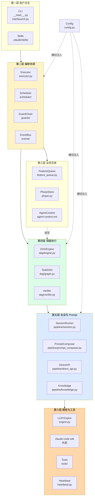
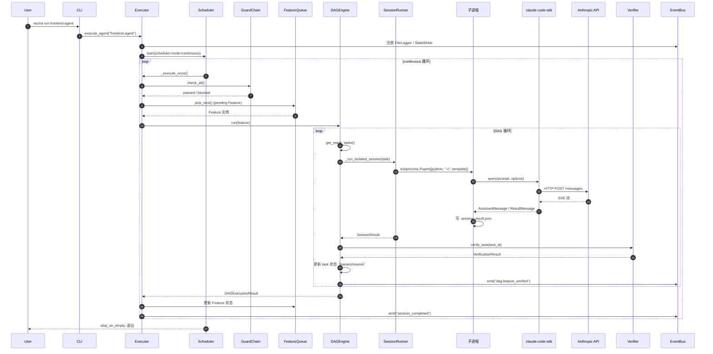
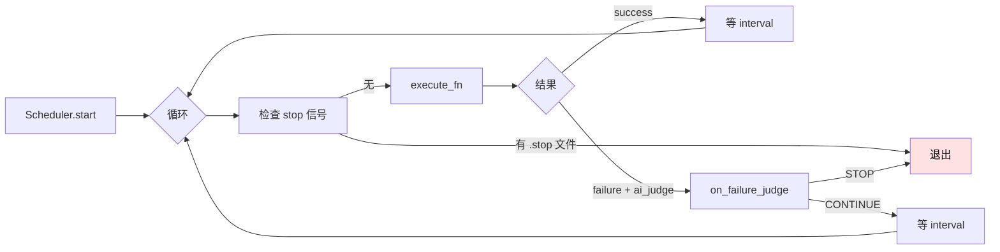
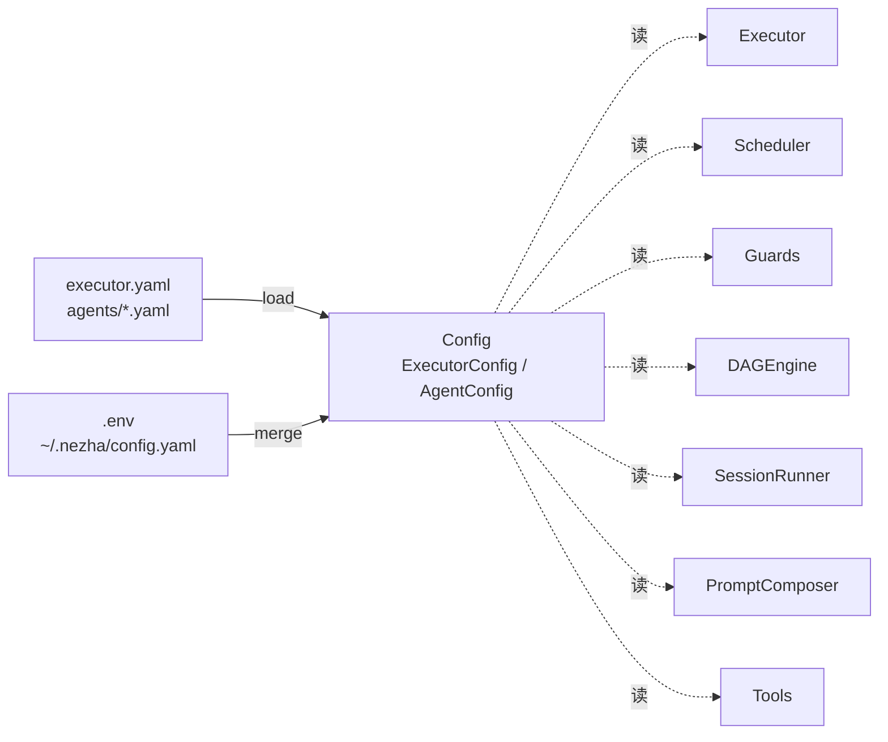

# 分层架构

Nezha 的代码组织遵循**清晰分层**，每一层只依赖下层，上层换实现不影响下层。

## 六层架构



## 数据流：从命令到代码

以 `nezha run frontend-agent` 为例，完整流程：



## 关键组件深入

### Executor：协调中枢

`executor.py` 是整个框架的**协调器**——负责：

1. 加载配置（`load_executor_config` + `load_agent_config`）
2. 构建 EventBus 和 GuardChain
3. 创建 Scheduler 并启动循环
4. 处理 session 结果，触发 post_tools

```python
async def execute_agent(agent_name: str, ...):
    executor_config = load_executor_config(config_path)
    agent_config = load_agent_config(agent_config_path)

    event_bus = _build_event_bus(executor_config, base_dir)
    guard_chain = _build_guard_chain(executor_config)

    scheduler = SchedulerFactory.create(executor_config.scheduler, ...)
    await scheduler.start(execute_fn=_execute_once, on_failure_judge=_judge)
```

### Scheduler：循环驱动

三种调度模式，都实现 `BaseScheduler` 接口：

| 实现 | 文件 | 行为 |
|------|------|------|
| `ManualScheduler` | `scheduler/manual.py` | 跑一次就退出 |
| `ContinuousScheduler` | `scheduler/continuous.py` | 循环跑直到队列空 |
| `CronScheduler` | `scheduler/cron.py` | 按 cron 表达式触发 |



### GuardChain：执行前检查

每次 `_execute_once` 前，所有 Guard 串行 check：

| Guard | 文件 | 触发条件 |
|-------|------|---------|
| `CircuitBreaker` | `guards/circuit_breaker.py` | 连续 N 次失败，冷却 X 秒 |
| `TimeWindow` | `guards/time_window.py` | 当前时间不在允许窗口内 |
| `BalanceCheck` | `guards/balance.py` | 累计费用超 `max_cost_usd` |

任何一个 Guard 不通过 → 跳过本次执行。

### FeatureQueue：Port/Adapter

```python
class FeatureQueue(Protocol):    # Port
    def create(...) -> Feature: ...
    def list(...) -> list[Feature]: ...
    def get(feature_id) -> Feature | None: ...

class FileFeatureQueue:          # 当前 Adapter
    """读写 workspace/features/<id>/feature.yaml"""
```

未来可以加 `RedisFeatureQueue`、`PostgresFeatureQueue` 等，上层代码不变。

### DAGEngine：任务调度核心

详见 [DAG 引擎](dag-engine.md)。

### SessionRunner：会话隔离

详见 [子进程隔离](subprocess-isolation.md)。

### EventBus：事件分发

```python
class EventBus:
    def register(self, handler): ...
    async def emit(self, event: Event): ...
```

注册的 handler 接收所有 event，自己决定要不要处理。

内置三个 handler：

| Handler | 写到哪 | 用途 |
|---------|--------|------|
| `FileLoggerHandler` | `state/logs/*.log` | 人类可读日志 |
| `StateWriterHandler` | `state/executor_status.json` | 实时状态 JSON |
| `TraceWriterHandler` | `state/trace.jsonl` | 链路追踪（结构化） |

## 横切关注点：Config

`config.py` 的 dataclass 会被所有层使用：



三层合并优先级：

```
~/.nezha/config.yaml < executor.yaml < agents/*.yaml < task.model
                  最低                                          最高
```

## src layout 项目结构

```
nezha/
├── src/nezha/                      ← 实际代码
│   ├── __main__.py                  CLI 入口
│   ├── config.py                    配置 dataclass
│   ├── engine.py                    LLM 引擎
│   ├── executor.py                  主协调器
│   ├── heartbeat.py                 心跳
│   ├── feature_queue.py             Feature CRUD
│   ├── phase.py                     Phase 编排
│   ├── task_queue.py                向后兼容层
│   ├── i18n.py                      多语言
│   ├── dag/                         DAG 子系统
│   ├── pipeline/                    会话与 Prompt
│   ├── scheduler/                   调度器
│   ├── guards/                      守卫
│   ├── events/                      事件系统
│   ├── tools/                       post-session 工具
│   ├── interface/                   CLI 实现
│   ├── locales/                     翻译资源
│   └── templates/                   nezha init 模板
├── tests/                           单元测试（994+）
├── docs/                            设计文档（开发者内部）
└── wiki/                            用户文档（即本目录）
```

## 测试结构

```
tests/
├── test_config.py                   配置加载
├── test_executor.py                 编排
├── test_dag_engine.py               DAG 调度
├── test_session.py                  Session 隔离
├── test_prompt_composer.py          Prompt 组合
├── test_feature_queue.py            Feature 持久化
├── test_phase.py                    Phase 编排
├── test_heartbeat.py                心跳
├── test_runtime.py                  Runtime 抽象
└── ...
```

994 个测试，跑全量：

```bash
python3 -m pytest tests/ -v
```

跑单文件：

```bash
python3 -m pytest tests/test_dag_engine.py -v
```

## 相关章节

- [DAG 引擎细节](dag-engine.md)
- [子进程隔离](subprocess-isolation.md)
- [Prompt 组合系统](prompt-composer.md)
- [关键设计决策](design-decisions.md)
- [开发扩展](../05-extend/)
