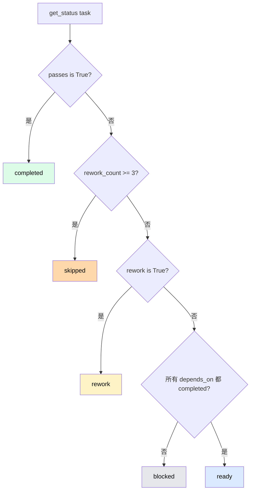
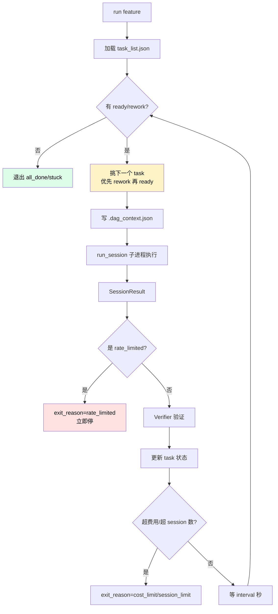
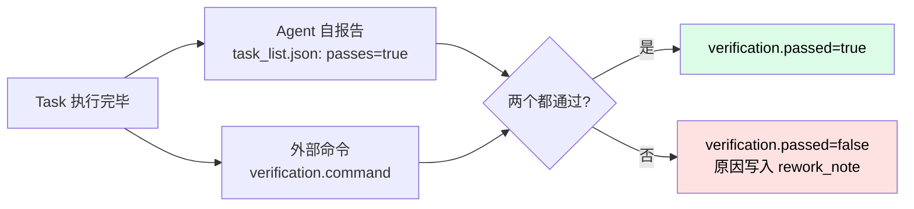
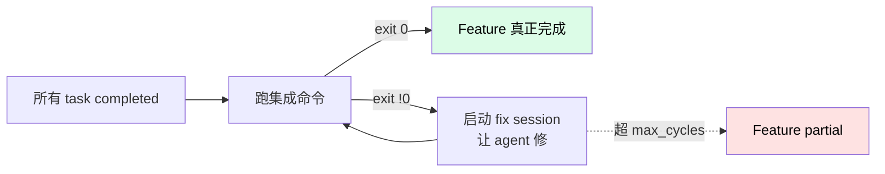

# DAG 引擎

DAG 引擎是 Nezha 的**任务调度大脑**。理解它，就理解了 Nezha 怎么让一堆 task 按依赖关系正确执行。

## 核心数据结构

### Task

每个 Task 在 `task_list.json` 里是一条记录：

```json
{
  "id": "t05",
  "description": "实现 Header 组件",
  "complexity": "medium",
  "depends_on": ["t02", "t04"],
  "passes": false,
  "rework": false,
  "rework_count": 0,
  "rework_note": null,
  "model": null
}
```

### TaskDAG

`dag/graph.py` 把 task 列表加载成图：

```python
class TaskDAG:
    def __init__(self, tasks: list[Task]):
        self._tasks: dict[str, Task] = {t.id: t for t in tasks}

    def get_status(self, task_id: str) -> str:
        """状态动态计算，不存储"""
        ...
```

## 状态动态计算：Nezha 的精妙设计

**关键设计**：Task 状态不存储在 Task 对象上，每次调用 `get_status()` **动态计算**：



### 为什么动态计算？

| 方案 | 问题 |
|------|------|
| **状态存储在 Task 上** | 容易不一致（task 已通过但 status 字段忘改） |
| **状态动态计算** ✅ | 状态永远等于 `passes`/`rework` 字段的"派生值"，不会矛盾 |

### 六种状态

| 状态 | 含义 |
|------|------|
| `blocked` | 依赖未完成，等着 |
| `ready` | 依赖都完成了，可以执行 |
| `running` | 当前正在执行（DAG 临时记录） |
| `completed` | passes=true，验证通过 |
| `rework` | passes=false 且 rework=true，等下轮重试 |
| `skipped` | rework 超 3 次还没成功 |

> **优先级**：`completed` > `skipped` > `rework` > `blocked` / `ready`。
>
> 比如 `passes=true` 同时 `rework=true`（异常状态），返回 `completed`——`passes` 是最终结论。

## DAG 执行循环

`dag/engine.py` 的核心循环：



### 挑选下一个 task 的策略

```python
def _pick_target(dag, consecutive_same, last_target_id):
    rework_list = dag.get_rework_tasks()
    ready_list = dag.get_ready_tasks()

    # 优先 rework（修 bug 比开新功能优先）
    if rework_list:
        target = rework_list[0]
    elif ready_list:
        target = ready_list[0]
    else:
        return None  # 没有可执行

    # 防卡死：如果同一个 task 连续 N 次还在挑，换备选
    if target.id == last_target_id and consecutive_same[target.id] >= STUCK_THRESHOLD:
        alternatives = [t for t in (rework_list or ready_list) if t.id != target.id]
        if alternatives:
            target = alternatives[0]
        else:
            return None  # stuck

    return target
```

## 验证（Verifier）

`dag/verifier.py` 实现**两级验证**：



### Agent 自报告

Agent 在 prompt 引导下，自己更新 `task_list.json`：

```json
{
  "id": "t05",
  "passes": true       // ← Agent 自己写
}
```

### 外部命令验证

可选。agent YAML 配 `verification.command`：

```yaml
verification:
  command: "pnpm test"
  timeout: 60
```

Verifier 在 task 跑完后执行命令，检查 exit code。

### 失败时的处理

```python
def apply_verification_result(result, task_list_path):
    if result.passed:
        return  # 通过不动

    # 失败，回写 task_list.json
    for task in tasks:
        if task["id"] == result.task_id:
            task["passes"] = False
            task["rework"] = True
            task["rework_count"] += 1
            task["rework_note"] = {
                "attempt": new_count,
                "block_reason": result.reason,
                ...
            }
```

## 通过后清除 rework 标记

如果 task 之前是 rework 状态，这次跑通了：

```python
if status_after == STATUS_COMPLETED and target.rework:
    result.rework_fixed += 1
    self._clear_rework_flag(target.id)  # 把 task_list.json 里的 rework 改回 False
```

这是 [前面提到过的 bug 修复](../03-howto/troubleshooting.md#历史-bug-修复)——避免 rework 标记残留导致 DAG 反复调度。

但即使这个清除失败，**`graph.py` 的状态优先级（passes > rework）也保证 DAG 不会卡死**——双保险。

## 退出原因（exit_reason）

DAG 引擎结束时会标记原因：

| exit_reason | 含义 |
|-------------|------|
| `all_done` | 所有 task 都 completed |
| `stuck` | 没有可推进的 task |
| `cost_limit` | 触发 `max_cost_usd` |
| `session_limit` | 触发 `max_sessions` |
| `rate_limited` | API 限流 |
| `deadlocked` | 循环依赖（应该在加载时就检测出来） |

Executor 根据 exit_reason 决定 Feature 最终状态：

| exit_reason | Feature 状态 |
|-------------|-------------|
| `all_done` | `completed` |
| 其他 | `partial`（部分完成） |

## 写入 .dag_context.json

每次执行 task 前，DAG 引擎把上下文写入 `feature_workspace/.dag_context.json`：

```json
{
  "current_task": {
    "id": "t05",
    "description": "实现 Header 组件"
  },
  "all_tasks": [
    {"id": "t01", "status": "completed"},
    {"id": "t02", "status": "completed"},
    {"id": "t05", "status": "ready"},
    {"id": "t06", "status": "blocked"}
  ],
  "rework_note": null,
  "is_rework": false
}
```

Agent prompt 模板里通过 `{{dag_context}}` 注入这个上下文，让 Agent 知道：

- 自己当前在做什么
- 整体进度如何
- 之前哪些 task 已完成（可以参考它们的产物）

## 集成验证（Integration Test）

DAG 跑完所有 task 之后，可选触发一次**集成测试**：

```yaml
pipeline:
  post_task_test:
    enabled: true
    command: "pnpm test && pnpm build"
    max_cycles: 3      # 失败后最多重试 3 次
    timeout: 900
```



这一步对**保证整体一致性**很重要——单 task 通过不代表整体能跑。

## 报告生成

DAG 执行结束后，自动生成：

| 文件 | 内容 |
|------|------|
| `workspace/features/<id>/execution-report.md` | 执行报告（哪些 task 通过/失败、费用、时长） |
| `workspace/features/<id>/exec-plan.md` | 实时 DAG 状态（执行过程中持续更新） |

## 关键代码位置

| 关注点 | 代码位置 |
|--------|---------|
| Task 状态计算 | `src/nezha/dag/graph.py:120-148` |
| 主执行循环 | `src/nezha/dag/engine.py:280-490` |
| 验证逻辑 | `src/nezha/dag/verifier.py` |
| rework 标记清除 | `src/nezha/dag/engine.py:_clear_rework_flag()` |
| 集成测试循环 | `src/nezha/dag/engine.py` + `src/nezha/testing/integration.py` |
| 报告生成 | `src/nezha/dag/report.py` |

## 设计取舍

| 决策 | 优点 | 代价 |
|------|------|------|
| 状态动态计算 | 永远一致，无 bug | 每次需要遍历 depends_on |
| rework 优先于 ready | 修问题比开新功能优先 | 修不好可能阻塞新功能 |
| 两级验证 | 双保险（agent + 外部） | 多一次命令执行成本 |
| 限流立即停 | 不浪费配额 | 当前 task 中断（但状态已持久化） |
| 集成测试可选 | 灵活 | 不开就缺整体保障 |

## 测试

DAG 相关测试在：

- `tests/test_dag_engine.py`
- `tests/test_graph.py`
- `tests/test_verifier.py`

跑：

```bash
python3 -m pytest tests/test_dag_engine.py tests/test_graph.py tests/test_verifier.py -v
```

## 相关章节

- [子进程隔离](subprocess-isolation.md) — DAG 怎么调子进程跑 session
- [Prompt 组合系统](prompt-composer.md) — `{{dag_context}}` 怎么注入到 prompt
- [How-To: 失败处理](../03-howto/failure-handling.md) — 用户视角的 rework 和验证
- [Reference: task_list.json schema](../02-cheatsheet/executor-yaml.md)
