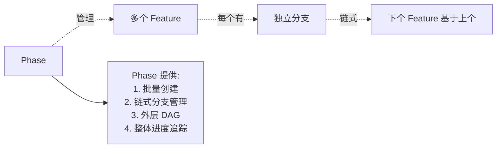
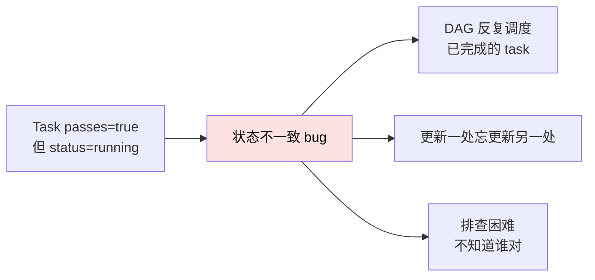
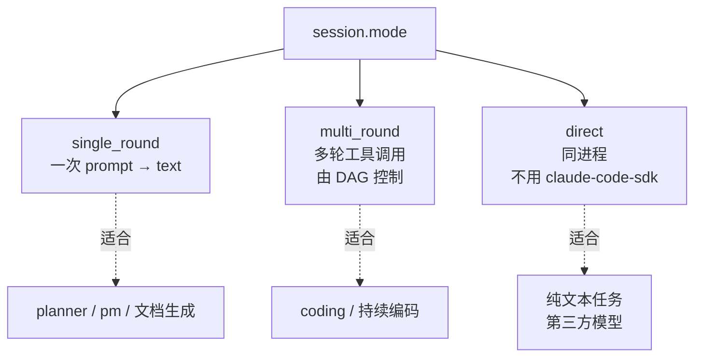
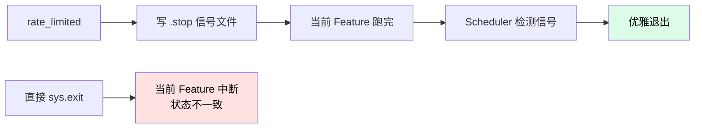
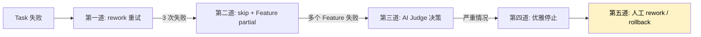
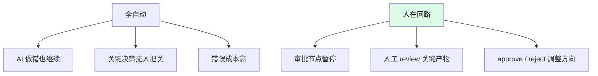

# 关键设计决策

每一条决策都有它的理由——理解这些理由，能帮你**判断要不要改、怎么改**。

## 决策 1：Feature 和 Task 分两层

> 为什么不直接用一层"任务"？

| 一层任务 | Feature + Task 两层 |
|---------|-------------------|
| 一个任务对应一份 PRD | Feature 对应 PRD（人维护），Task 是细节（AI 拆） |
| 拆得粗 → 失败时回退成本高 | Task 失败只影响小范围 |
| 拆得细 → PRD 写不完 | PRD 在 Feature 粒度，可写可读 |
| 难以人在回路审批 | Feature 是审批单位 |

**结论**：Feature 是**人/AI 协作的契约**，Task 是 **AI 内部规划的产物**。两者粒度不同，职责不同。

## 决策 2：Phase 在 Feature 之上

> 为什么还要 Phase？



| 需求 | Phase 解决方式 |
|------|---------------|
| 多个 Feature 一起规划 | `nezha phase plan` 一次创建 |
| Feature 之间有依赖 | Phase 内的 `depends_on` |
| 代码需要逐步积累 | 自动链式分支（Feature 2 基于 Feature 1） |
| 一次发布多个 Feature | Phase 整体合并 |

**结论**：Phase 是**项目级编排单位**，Feature 是**需求级交付单位**，Task 是**实现级执行单位**。三层各司其职。

## 决策 3：DAG 状态动态计算，不存储

> 为什么不直接给 Task 加个 `status` 字段？

**存储状态的问题**：



**动态计算的好处**：

```python
def get_status(self, task_id):
    f = self._tasks[task_id]
    if f.passes:
        return STATUS_COMPLETED   # 派生自 passes 字段
    if f.rework_count >= 3:
        return STATUS_SKIPPED
    if f.rework:
        return STATUS_REWORK
    if self._all_deps_completed(task_id):
        return STATUS_READY
    return STATUS_BLOCKED
```

状态永远是**真实字段的派生值**，不会跟字段矛盾。

**结论**：能动态计算就别存储——避免一类状态一致性 bug。

## 决策 4：每个 session 独立子进程

详见 [子进程隔离](subprocess-isolation.md)。

**核心理由**：claude-code-sdk 的 anyio cancel scope 不能在同进程内重复使用，否则崩溃。

**代价**：每次启动 Python 解释器（~200ms），但相比 LLM 调用（几秒到几十秒），可忽略。

## 决策 5：workspace（元数据）vs target（代码）分离

详见 [01-concepts](../01-quickstart/01-concepts.md#harness-工程-vs-target-仓库)。

**核心理由**：

| 不分离 | 分离 |
|--------|------|
| Nezha 状态污染代码仓库 | 代码仓库干净 |
| 多个 Agent 共享一个 workspace 时冲突 | 每个 agent 独立 workspace |
| target 改了，Nezha 状态也跟着改 | 各自演进 |

**代价**：用户要理解两个目录的区别（初学时容易混）。

## 决策 6：Port/Adapter 模式

`FeatureQueue` 是 Protocol，`FileFeatureQueue` 是当前实现：

```python
class FeatureQueue(Protocol):
    def create(...) -> Feature: ...
    def list(...) -> list[Feature]: ...

class FileFeatureQueue:
    """读写 workspace/features/<id>/feature.yaml"""
```

**好处**：

- 未来想换 `RedisFeatureQueue` / `PostgresFeatureQueue`，上层代码不变
- 测试时可以用 `InMemoryFeatureQueue`
- 不同部署场景用不同实现（本地文件 vs 云端 MQ）

**应用到的组件**：

| 抽象 | 实现 |
|------|------|
| `FeatureQueue` | `FileFeatureQueue` |
| `BaseScheduler` | `ManualScheduler` / `ContinuousScheduler` / `CronScheduler` |
| `BaseGuard` | `CircuitBreaker` / `TimeWindow` / `BalanceCheck` |
| `EventHandler` | `FileLoggerHandler` / `StateWriterHandler` / `TraceWriterHandler` |
| `BaseTool` | `GitTool` / `TestTool` |

**结论**：核心机制都用 Port/Adapter，方便扩展和测试。

## 决策 7：声明式 YAML 配置

> 为什么不用 Python 代码配置？

| Python 代码配置 | YAML 配置 |
|----------------|----------|
| 程序员才能改 | 非程序员也能改 |
| 改配置要 commit 代码 | 改配置不动代码 |
| 灵活但不可控 | 受 dataclass 约束，类型安全 |

**Nezha 选 YAML**：

- `executor.yaml` / `agents/*.yaml` 都是声明式
- 通过 `config.py` 的 dataclass 转换 → 类型安全 + IDE 自动补全
- 支持 `${VAR}` 引用 → 敏感信息隔离

## 决策 8：三种 session 模式（single/multi/direct）



为什么三种？

| 场景 | 单一模式的痛点 | 三种模式的好处 |
|------|--------------|--------------|
| 简单一次性 prompt | multi_round 太重 | single_round 轻量 |
| 持续编码需要工具 | single_round 不够 | multi_round 配 DAG |
| 纯文本生成不需工具 | 还要走 claude-code-sdk 太啰嗦 | direct 模式直接调 API |

**结论**：不同场景用不同模式，避免一招走天下的妥协。

## 决策 9：限流自动停 + 信号文件机制

详见 [How-To: 限流处理](../03-howto/rate-limit.md)。

**为什么不直接 `sys.exit()` ？**



信号文件 + Scheduler 配合 = **当前 Feature 收尾后退出**，状态完整。

## 决策 10：失败自愈机制

> 为什么 task 失败不立即停？



**五道防线** = 长跑可靠性。没有这些，AI 一遇错就停，无法实现"无人值守跑完整项目"。

## 决策 11：人在回路（Human-in-the-Loop）

> 为什么要审批节点而不是全自动？



实现：`feature.steps[].requires_review = true` 的 step 跑完会暂停，等：

```bash
nezha feature approve <feature-id> <step-id>
# 或
nezha feature reject <feature-id> <step-id> --note "..."
```

**结论**：自动化 + 人工控制 = 最佳实践，比全自动稳，比手动快。

## 决策 12：model_map 三层模型路由

详见 [How-To: 接入第三方模型](../03-howto/third-party-models.md)。

```yaml
model_map:
  low: claude-haiku-4-5-20251001    # 简单任务
  medium: claude-sonnet-4-6           # 中等
  high: claude-opus-4-6               # 复杂
```

**核心理由**：

- 一刀切（全部 Opus）→ 浪费钱
- 一刀切（全部 Haiku）→ 复杂任务做不好
- **按难度路由** → 性价比最高

并且支持**不同厂商**，比如 low 用 GLM，medium/high 用 Claude。

## 决策 13：task_factor 适配模型能力

弱模型自动拆细，强模型拆粗：

```yaml
model_map:
  low:
    model: glm-4-flash
    task_factor: 1.5      # 默认 1.2，弱模型调大
  high:
    model: claude-opus-4-6
    task_factor: 0.8      # 强模型调小
```

**为什么**：

- 弱模型一次能搞定的代码量少 → 把 task 拆细，每个 task 范围小
- 强模型理解力强 → task 可以大一点

`planner-agent` 根据 `task_factor` 调整拆分粒度。

## 决策 14：AI Judge 判断要不要继续

详见 [How-To: 失败处理](../03-howto/failure-handling.md#第三道防线ai-judge)。

**核心理由**：Feature 失败后，下一个 Feature 能不能跑？人不在身边，让 AI 判断。

| Feature B 跟 A 强相关 | Feature B 跟 A 无关 |
|---------------------|---------------------|
| A 失败 → B 也跑不通 | A 失败 → B 可以独立跑 |
| Judge 返回 STOP | Judge 返回 CONTINUE |

## 决策 15：Prompt 组合系统

详见 [Prompt 组合系统](prompt-composer.md)。

**核心理由**：

- 不同 Agent 需要相似但不同的 prompt
- 共性的部分（TDD / Commit 规则）应该复用
- 特化的部分（Python / 前端）应该可插拔

→ base + sections 的组合模式。

## 决策 16：项目知识高于 target CLAUDE.md

详见 [Quick Start: project init](../01-quickstart/04-project-init.md#三种知识层次)。

```
workspace/project/ > target/CLAUDE.md > agent prompt
   项目级约束             代码局部说明        基础职责
```

**核心理由**：

- target CLAUDE.md 可能是 IDE 工具自动生成的（不一定对）
- workspace/project/ 是项目主人手写的，权威性高
- 优先级要高，否则约束被覆盖

## 决策 17：心跳保活

详见 [How-To: 心跳保活](../03-howto/heartbeat.md)。

**核心理由**：长跑时 OAuth token 容易过期，每 5 小时 ping 一下保活。

为什么不在 Nezha 内部自动 ping？

- 心跳应该跟主任务**解耦**——主任务卡住，心跳还能跑
- 用独立进程更可靠
- 不是所有用户都需要（短跑不需要）

## 决策总结：一张表

| 决策 | 一句话 | 替代方案 | 取舍 |
|------|--------|---------|------|
| Feature/Task 分层 | 不同粒度，不同职责 | 单层 | 复杂换灵活 |
| Phase 之上 | 项目级编排 | 没有 Phase | 复杂换批量能力 |
| DAG 状态动态计算 | 永远一致 | 存储状态 | 性能换正确性 |
| 子进程隔离 | 避免 SDK 污染 | 同进程 | 启动开销换稳定 |
| workspace/target 分离 | 不污染代码仓库 | 一个目录 | 学习成本换干净 |
| Port/Adapter | 易扩展 | 单实现 | 抽象成本换灵活 |
| YAML 配置 | 非程序员可改 | Python 代码 | 表达力换易用 |
| 三种 session 模式 | 各场景最优 | 单模式 | 复杂度换灵活 |
| 限流信号文件 | 优雅停止 | 直接 exit | 复杂度换状态完整 |
| 五道失败防线 | 长跑可靠 | 失败即停 | 复杂换可靠 |
| 人在回路 | 关键节点把关 | 全自动 | 速度换可控 |
| model_map 路由 | 性价比最高 | 一刀切 | 配置换钱 |
| task_factor 适配 | 弱模型拆细 | 固定粒度 | 复杂换适配 |
| AI Judge | 无人值守判断 | 失败即停 | 调用换灵活 |
| Prompt 组合 | 模块化 | 单文件 | 配置换复用 |
| project > CLAUDE.md | 主人约束优先 | 一视同仁 | 复杂换权威 |
| 心跳独立进程 | 解耦 | 主进程内 | 复杂换可靠 |

## 还有什么没决定？

一些**故意没做**的事情：

| 没做的事 | 为什么不做 |
|---------|-----------|
| 多 runtime 抽象（Codex / OpenCode 等） | 当前 Claude Code 能力远超其他，硬抽象会损失能力。等竞品成熟再做。 |
| 服务端模式 / Web UI | 个人 / 小团队用本地最简单。后续可能做 Tauri 客户端。 |
| 自动估算费用 | LLM 单价波动，估算容易出错。让用户看实际 cost。 |
| 自动决定 task_factor | 太黑盒。让用户自己控制。 |
| 自动生成 PRD | 已经做了（`/prd` skill），但拆几份 PRD 还是要人决定。 |
| 跨 Phase 的费用累计 | 复杂度太高，进程内累计已够用。 |

这些不是"做不到"，而是**故意不做**——避免过度工程。

## 相关章节

- [分层架构](architecture.md)
- [DAG 引擎](dag-engine.md)
- [子进程隔离](subprocess-isolation.md)
- [Prompt 组合系统](prompt-composer.md)
- [开发扩展](../05-extend/)
