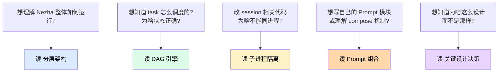
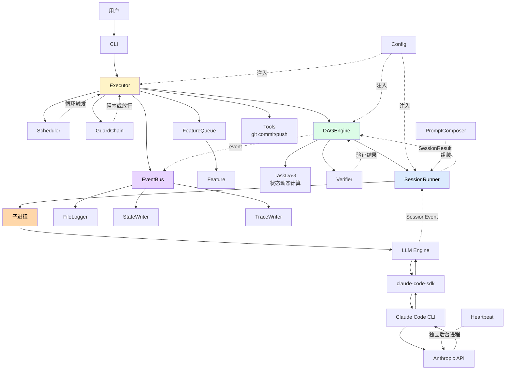

# 内部架构

理解 Nezha 是怎么工作的——为什么这么设计、关键决策的取舍。

> 不需要懂这些也能用 Nezha。这里是**给想修改源码或者排查深层问题的人看的**。

## 章节导航

| 文档 | 主题 |
|------|------|
| [分层架构](architecture.md) | 整体分层 + 数据流 + 关键组件 |
| [DAG 引擎](dag-engine.md) | 任务调度、状态动态计算、依赖解析 |
| [子进程隔离](subprocess-isolation.md) | 为什么每个 session 都开子进程 |
| [Prompt 组合系统](prompt-composer.md) | 可插拔模块、locale 感知、组合 vs 单模板 |
| [关键设计决策](design-decisions.md) | Feature vs Task、Port/Adapter、workspace 分离等 |

## 读图导览

## 一句话定位每个模块

| 模块 | 一句话 |
|------|--------|
| **CLI** (`__main__.py` + `interface/cli.py`) | 用户入口，解析参数 → 调对应业务函数 |
| **Executor** (`executor.py`) | 主协调器，串联调度器 / Guard / EventBus / Session |
| **Scheduler** (`scheduler/`) | 调度循环（manual / continuous / cron） |
| **GuardChain** (`guards/`) | 执行前检查（熔断 / 时间窗口 / 预算） |
| **FeatureQueue** (`feature_queue.py`) | Feature CRUD（Port/Adapter，文件实现） |
| **PhaseStore** (`phase.py`) | Phase 编排（批量创建 Feature + 链式分支） |
| **DAGEngine** (`dag/engine.py`) | Task 调度循环（挑 ready → 跑 session → 验证） |
| **TaskDAG** (`dag/graph.py`) | 依赖图，状态**动态计算**而非存储 |
| **Verifier** (`dag/verifier.py`) | 两级验证：agent 自报告 + 外部命令 |
| **SessionRunner** (`pipeline/session.py`) | 子进程隔离运行单个 session |
| **PromptComposer** (`pipeline/prompt_composer.py`) | 可插拔模块组合 prompt |
| **DirectAPI** (`pipeline/direct_api.py`) | 轻量模式，不用 SDK 直接调 API |
| **LLM Engine** (`engine.py`) | claude-code-sdk 封装，yield SessionEvent |
| **EventBus** (`events/`) | 事件总线，分发给 FileLogger/StateWriter/TraceWriter |
| **Tools** (`tools/`) | post-session 确定性操作（git commit/push、create-pr） |
| **Config** (`config.py`) | YAML → dataclass，三层 merge |
| **Heartbeat** (`heartbeat.py`) | 后台心跳进程 |
| **i18n** (`i18n.py` + `locales/`) | CLI 文案多语言 |

## 一张大图：所有组件如何联动

读懂这张图，再去看具体章节细节。

## 设计取向

理解 Nezha 设计前，先理解几个**核心取向**：

| 取向 | 体现 | 为什么 |
|------|------|--------|
| **状态最少化** | DAG 状态动态计算不存储 | 避免状态不一致 bug |
| **进程隔离** | 每个 session 独立子进程 | claude-code-sdk 的 anyio scope 不能复用 |
| **职责分离** | workspace（元数据） vs target（代码） | 不污染用户代码仓库 |
| **Port/Adapter** | FeatureQueue 是 Protocol，FileFeatureQueue 是实现 | 未来可换 Redis/MQ |
| **可组合 Prompt** | base + sections 拼装 | 复用模块，灵活适配技术栈 |
| **声明式配置** | YAML → dataclass | 配置和代码解耦 |
| **失败自愈** | rework 循环 + AI Judge + 优雅停止 | 长跑可靠性 |

## 给读者的建议

**第一次读 Nezha 源码？**

按这个顺序：

1. [分层架构](architecture.md) — 建立全局视野
2. [关键设计决策](design-decisions.md) — 理解 why
3. [DAG 引擎](dag-engine.md) — 核心调度逻辑
4. [子进程隔离](subprocess-isolation.md) — 避免踩坑
5. [Prompt 组合](prompt-composer.md) — 扩展能力

**只想改某个功能？**

跳到对应章节即可，每章末尾会指引到具体代码文件位置。

**想加新功能？**

读完这一节后去 [05-extend/](../05-extend/) 看具体扩展指南。
