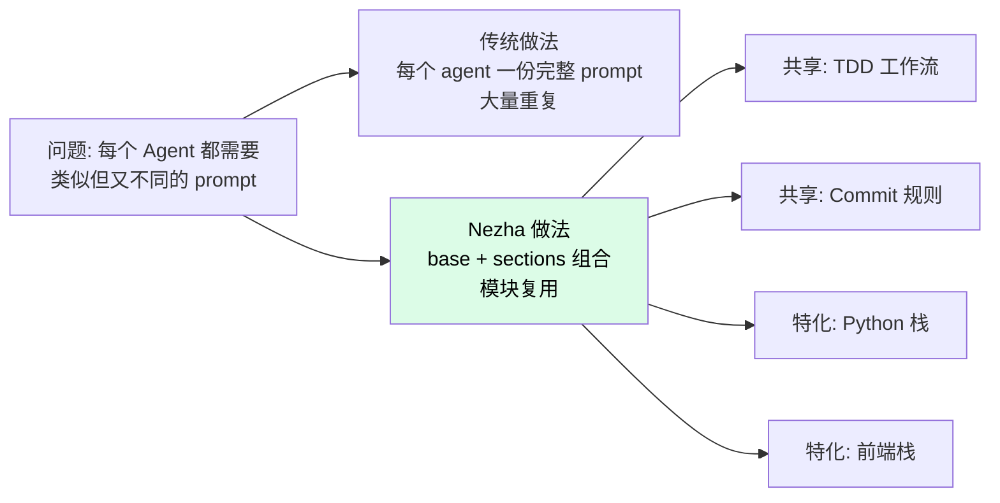
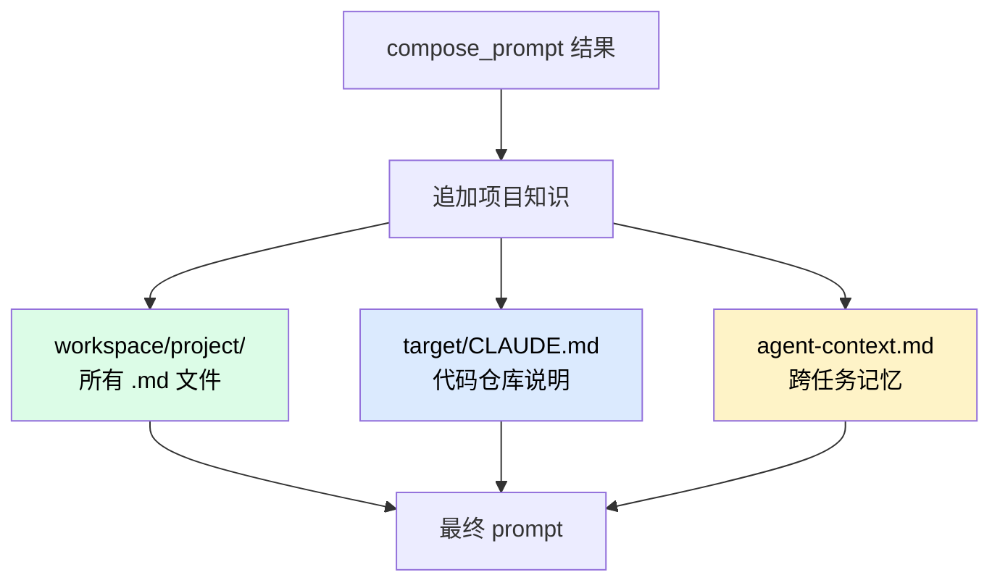
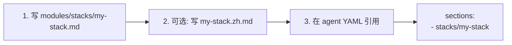

# Prompt 组合系统

Prompt = base 角色声明 + sections 可插拔模块。**用搭积木的方式给不同 Agent 拼 prompt**，模块复用，灵活适配技术栈。

## 设计目标



## 三类模块

`prompts/modules/` 下分三类：

```
prompts/modules/
├── phases/          ← 工作流阶段
│   ├── context-acquisition.md     上下文获取
│   ├── tdd.md                     TDD 流程
│   ├── regression.md              回归测试
│   ├── rework.md                  返工处理
│   └── commit-rules.md            提交规则
├── stacks/          ← 技术栈知识
│   ├── general.md
│   ├── python.md
│   ├── frontend.md
│   ├── java-spring.md
│   └── tauri-fullstack.md
└── concerns/        ← 横切关注点
    ├── exec-plan.md               执行计划维护
    └── quality-tracking.md        质量追踪
```

每个模块都有 `.md`（英文）和 `.zh.md`（中文）两个版本。

## Agent YAML 怎么配

```yaml
session:
  mode: "multi_round"
  compose:
    worker:
      base: "coding/base.md"             # 角色基础
      sections:
        - phases/context-acquisition     # 加上下文获取流程
        - stacks/python                  # 加 Python 栈知识
        - phases/tdd                     # 加 TDD 工作流
        - phases/regression              # 加回归测试
        - phases/commit-rules            # 加提交规则
```

也可以为不同模式配不同组合：

```yaml
session:
  compose:
    worker:          # 主流程
      base: "coding/base.md"
      sections: [...]
    initializer:     # 初始化模式
      base: "coding/base.md"
      sections: [phases/context-acquisition, stacks/python]
    vibe:            # vibe coding 模式
      base: "coding/vibe.md"
      sections: [stacks/python]
```

## 组合的执行过程

```mermaid
sequenceDiagram
  participant PC as PromptComposer
  participant FS as 文件系统
  participant SR as SessionRunner

  SR->>PC: compose_prompt(compose_config, prompts_dir, locale="zh_CN")
  PC->>FS: 读 base.md（按 locale 找 base.zh.md → 回退 base.md）
  FS-->>PC: base 内容
  PC->>FS: 读 sections[0] (context-acquisition.zh.md)
  FS-->>PC: 模块内容
  PC->>FS: 读 sections[1] ...
  ...
  PC->>PC: 拼接 + 变量替换 {{var}}
  PC-->>SR: 完整 prompt
```

## 完整 prompt 长什么样

最终 prompt 大致结构：

```
[base.md 内容]
- 你是一个 XX 角色
- 你的目标是 ...

---

[phases/context-acquisition.md]
## 上下文获取
任务开始前必须读取以下文件：
1. workspace/project/architecture.md
2. workspace/project/conventions.md
3. ...

---

[stacks/python.md]
## Python 技术栈知识
- 使用 type hints
- pytest 写测试
- ...

---

[phases/tdd.md]
## TDD 工作流
1. 先写失败测试
2. 实现最小代码
3. ...

---

[phases/commit-rules.md]
## 提交规则
- conventional commits
- 每个 task 一次 commit
- ...
```

## locale 感知的文件解析

`pipeline/prompt_template.py:resolve_prompt_path()`：

```python
def resolve_prompt_path(prompts_dir, relative_path, locale="en"):
    if locale == "zh_CN":
        # 优先找 .zh.md
        zh_path = relative_path.replace(".md", ".zh.md")
        if (prompts_dir / zh_path).exists():
            return prompts_dir / zh_path
    # 回退到默认 .md
    return prompts_dir / relative_path
```

调用方传入 `"phases/tdd"` 或 `"phases/tdd.md"`，自动找：

| locale | 查找顺序 |
|--------|---------|
| `zh_CN` | `phases/tdd.zh.md` → `phases/tdd.md` |
| `en` | `phases/tdd.md` |

## 变量替换 `{{var}}`

模块里可以用变量：

```markdown
## 你的任务

ID: {{task_id}}
描述: {{task_description}}

## 当前 DAG 状态

{{dag_context}}
```

`compose_prompt()` 传入 `variables` 字典，渲染时替换：

```python
prompt = compose_prompt(
    compose_config,
    prompts_dir,
    locale="zh_CN",
    variables={
        "task_id": "t05",
        "task_description": "实现 Header 组件",
        "dag_context": json.dumps(dag_ctx, ensure_ascii=False, indent=2),
        ...
    }
)
```

找不到的变量会保留 `{{var}}` 原样（不报错），方便调试。

## 项目知识自动注入

除了 compose，子进程会额外注入：



优先级：**project 知识 > target CLAUDE.md**（项目级约束覆盖代码仓库局部说明）。

## 单模板模式（向后兼容）

不用 compose，直接指定一个完整 prompt 文件：

```yaml
session:
  prompts:
    worker: "coding/worker.md"   # 单个完整模板
```

这种模式下整个 `worker.md` 就是完整 prompt，不会做组合。

`run_single_round` 和 `run_multi_round` 同时支持两种模式：

```python
worker_prompt_path = agent_config.session.prompts.get("worker", "")
worker_compose = agent_config.session.compose.get("worker") if agent_config.session.compose else None
if not worker_prompt_path and not (worker_compose and worker_compose.base):
    raise ValueError(f"Agent {name}: no worker prompt configured")
```

两种都没配才报错。

## 自定义模块怎么加



例子：写一个 Rust 栈模块。

`prompts/modules/stacks/rust.md`：

```markdown
## Rust 技术栈知识

- 使用 `cargo build` / `cargo test`
- 偏好 `Result<T, E>` 错误处理
- 异步用 `tokio`
- ...
```

`prompts/modules/stacks/rust.zh.md`：

```markdown
## Rust 技术栈知识（中文）
- ...
```

agent YAML 引用：

```yaml
session:
  compose:
    worker:
      base: "coding/base.md"
      sections:
        - phases/context-acquisition
        - stacks/rust              # ← 引用新模块
        - phases/tdd
```

下次 `nezha run` 就会自动用上。

## 测试 prompt 组装结果

跑一次 session，看子进程写的 manifest：

```bash
cat workspace/features/<id>/.session_manifest.json
```

里面有实际注入到 LLM 的完整 prompt（脱敏后的）：

```json
{
  "compose": {
    "base": "coding/base.md",
    "sections": ["phases/context-acquisition", "stacks/python", "phases/tdd"]
  },
  "locale": "zh_CN",
  "knowledge_files": ["workspace/project/architecture.md", "..."],
  "prompt_length": 12345,
  "variables_used": ["task_id", "task_description", "dag_context"]
}
```

也可以用 `--mode debug` 启动 session 看完整 prompt（如果实现了）。

## 关键代码位置

| 关注点 | 代码位置 |
|--------|---------|
| 组合主函数 | `src/nezha/pipeline/prompt_composer.py:compose_prompt()` |
| locale 解析 | `src/nezha/pipeline/prompt_template.py:resolve_prompt_path()` |
| 模板渲染 | `src/nezha/pipeline/prompt_template.py:load_and_render()` |
| 项目知识加载 | `src/nezha/pipeline/knowledge.py:load_project_context()`、`load_knowledge()` |
| 子进程注入逻辑 | `src/nezha/pipeline/session.py:_SUBPROCESS_RUNNER` |
| 模块文件 | `src/nezha/templates/prompts/modules/` |

## 设计取舍

| 决策 | 优点 | 代价 |
|------|------|------|
| 模块化组合 | 复用、灵活 | 每个 agent 要思考用哪些模块 |
| `{{var}}` 找不到不报错 | 容错好 | debug 难（要看 manifest） |
| 项目知识 > target CLAUDE.md | 强约束 | 偶尔会跟代码仓库说明冲突 |
| locale 自动回退 | 多语言友好 | 同一 prompt 可能混语言 |

## 测试

```bash
python3 -m pytest tests/test_prompt_composer.py -v
python3 -m pytest tests/test_prompt_template.py -v
```

## 相关章节

- [DAG 引擎](dag-engine.md) — `{{dag_context}}` 怎么来的
- [子进程隔离](subprocess-isolation.md) — 组装后的 prompt 在哪里执行
- [Quick Start: project init](../01-quickstart/04-project-init.md) — 项目知识层次
- [How-To: 多语言](../03-howto/multi-language.md) — locale 配置
- [Reference: 内置模块列表](../02-cheatsheet/executor-yaml.md)
