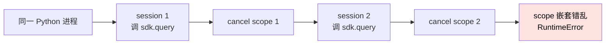
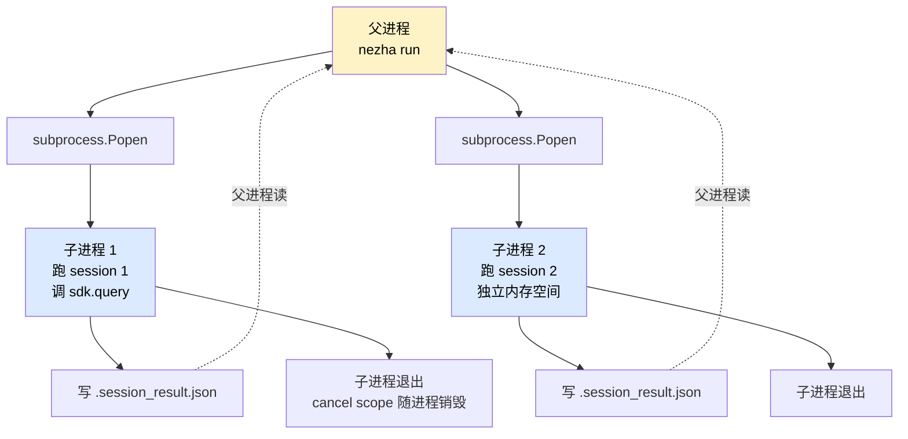
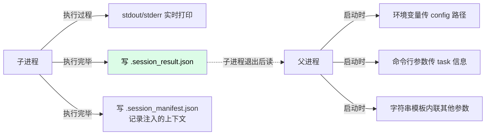
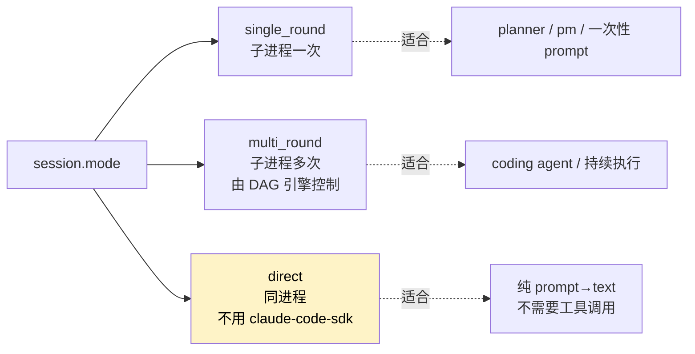

# 子进程隔离

为什么 Nezha 每个 session 都要开一个独立 Python 子进程？因为 **claude-code-sdk 在同进程内连续调用会污染 event loop**。

这个设计避免踩坑的代价是：**性能稍降 + 实现复杂**，但**正确性 + 稳定性**收益巨大。

## 问题：anyio cancel scope 污染

claude-code-sdk 内部用 anyio 管理 async context。它的 `query()` 函数返回 async generator，结束时需要清理 cancel scope。



具体错误长这样：

```
File ".../anyio/_backends/_asyncio.py", line 455, in __exit__
    raise RuntimeError(
RuntimeError: Attempted to exit cancel scope in a different task than it was entered in
```

这个问题在 SDK 内部修复成本极高，所以 Nezha 选择**外部规避**——**每个 session 独立子进程**。

## 解决方案：subprocess 隔离



每个 session 独立进程 → 各自 event loop → cancel scope 互不干扰。

## 实现细节

### 子进程模板

`pipeline/session.py` 里定义了 `_SUBPROCESS_RUNNER` 模板（一个 Python 字符串）：

```python
_SUBPROCESS_RUNNER = """\
import asyncio, json, sys
from pathlib import Path
from nezha.config import load_executor_config, load_agent_config
from nezha.engine import build_options, run_session
from nezha.pipeline.security import create_security_hook
from nezha.pipeline.prompt_composer import compose_prompt

# 加载配置
executor_config = load_executor_config({executor_config_path!r})
agent_config = load_agent_config({agent_config_path!r})

# 构建 prompt（compose 模式或单模板）
...
prompt = ...

# 构建 SDK options
security_hook = create_security_hook(...)
options = build_options(agent_config, ..., security_hook=security_hook)

# 跑 session
result = None
async def main():
    global result
    async for event in run_session(prompt, options):
        if isinstance(event, SessionResult):
            result = event
        elif isinstance(event, SessionEvent):
            # 处理事件、打印进度
            ...

asyncio.run(main())

# 写结果文件
Path({workspace!r}) / ".session_result.json".write_text(
    json.dumps(asdict(result))
)
"""
```

### 父进程怎么调

```python
def _run_isolated_session(...):
    runner_script = _SUBPROCESS_RUNNER.format(
        executor_config_path=str(executor_config_path),
        agent_config_path=str(agent_config_path),
        workspace=str(workspace),
        ...
    )

    proc = subprocess.run(
        [sys.executable, "-c", runner_script],
        timeout=timeout,
        capture_output=True,
        text=True,
    )

    # 读结果
    result_file = workspace / ".session_result.json"
    if result_file.exists():
        data = json.loads(result_file.read_text())
        result_file.unlink()
        return SessionResult(**data)
```

## 中间结果如何传递



| 传递方向 | 机制 | 用于 |
|---------|------|------|
| 父 → 子 | 字符串模板内联 | 配置路径、workspace 路径、task 信息 |
| 子 → 父（实时） | stdout/stderr | 进度日志（thinking / tool_call / tool_result） |
| 子 → 父（结果） | `.session_result.json` 文件 | SessionResult 数据结构 |
| 子 → 审计 | `.session_manifest.json` 文件 | 实际注入的 prompt、上下文（debug 用） |

## 字符串模板格式化的坑

`_SUBPROCESS_RUNNER` 是 Python `.format()` 模板：

| 符号 | 含义 |
|------|------|
| `{var}` | 占位符，被 `format()` 替换 |
| `{{` / `}}` | 转义大括号（输出字面 `{` `}`） |

例如子进程模板里写字典：

```python
tool_input = event.data.get("input", {{}})    # 输出 `{}`，不是占位符
```

这是个常见的踩坑点，改子进程模板时要小心。

## 安全 Hook 注入

每个 session 启动时，注入一个 PreToolUse hook 拦截危险命令：

```python
hooks = {
    "PreToolUse": [
        HookMatcher(matcher="Bash", hooks=[security_hook])
    ]
}
```

`security_hook` 由 `pipeline/security.py` 创建，从 agent YAML 的 `engine.security.allowed_commands` 读白名单：

```yaml
engine:
  security:
    allowed_commands:
      - ls
      - cat
      - npm
      - pnpm
      - git
```

不在白名单内的 Bash 命令会被拒绝（返回 `decision: block`），LLM 收到拒绝消息后会换其他方式。

## 子进程 vs 同进程的权衡

| 方面 | 子进程隔离 | 同进程 |
|------|-----------|--------|
| **正确性** | ✅ 无 scope 污染 | ❌ 多次调用 SDK 必崩 |
| **稳定性** | ✅ 一个 session 崩不影响其他 | ❌ 一处 crash 整个进程死 |
| **启动开销** | ❌ 每次 ~100-500ms Python 启动 | ✅ 零开销 |
| **内存** | ❌ 每次独立 Python 解释器 | ✅ 共享 |
| **调试** | ❌ 子进程 stdout 需要捕获 | ✅ 直接看 |
| **日志噪音** | ❌ SDK 退出时有 anyio 噪音 | ✅ 无 |

**权衡结论**：长跑场景下，启动开销可忽略（相比 LLM 调用的几秒到几十秒），正确性收益远大于开销。

## stderr 噪音过滤

子进程退出时会有 anyio 清理噪音：

```
[session] stderr:     await query.close()
  File ".../claude_code_sdk/_internal/query.py", line 502, in close
    await self._tg.__aexit__(None, None, None)
  File ".../anyio/_backends/_asyncio.py", line 810, in __aexit__
    ...
RuntimeError: ...
```

这些**不影响功能**，Nezha 在 `pipeline/session.py` 加了过滤：

```python
_important_lines = [
    line for line in stderr_text.split("\n")
    if "cancel scope" not in line.lower()
    and "GeneratorExit" not in line
    and "Task exception was never retrieved" not in line
    and "__aexit__" not in line
    and "query.py" not in line
    and "anyio/_backends" not in line
    and "await query.close()" not in line
]
```

只显示真正有用的错误。

## 三种 session 模式

不是所有 agent 都用子进程，看 agent YAML 的 `session.mode`：



| 模式 | 是否子进程 | 用什么 SDK |
|------|-----------|------------|
| `single_round` | ✅ 是 | claude-code-sdk |
| `multi_round` | ✅ 每次 task 一个子进程 | claude-code-sdk |
| `direct` | ❌ 不需要 | Anthropic SDK 或 OpenAI SDK |

`direct` 模式不会有 cancel scope 问题，所以**同进程跑也安全**——详见 [direct_api.py](https://github.com/<your-org>/nezha/blob/main/src/nezha/pipeline/direct_api.py)。

## 关键代码位置

| 关注点 | 代码位置 |
|--------|---------|
| 子进程模板（single_round） | `src/nezha/pipeline/session.py:_SUBPROCESS_RUNNER` |
| 子进程模板（vibe） | `src/nezha/pipeline/session.py:_VIBE_SUBPROCESS_RUNNER` |
| 子进程启动与读结果 | `src/nezha/pipeline/session.py:_run_isolated_session()` |
| stderr 过滤 | `src/nezha/pipeline/session.py` 同函数 |
| direct 模式 | `src/nezha/pipeline/direct_api.py` |
| monkey-patch（SDK 容错） | `src/nezha/engine.py:24-41` |

## 测试

```bash
python3 -m pytest tests/test_session.py -v
```

## 改子进程模板的注意事项

如果你要修改 `_SUBPROCESS_RUNNER`：

1. **每对 `{}` 要用 `{{}}`**（除非是 format 占位符）
2. **保持 import 在模板顶部**，避免运行时找不到
3. **结果一定要写 `.session_result.json`**，不然父进程读不到
4. **stderr 不要随便 print**，会被过滤掉

## 未来可能的优化

| 方向 | 说明 |
|------|------|
| 进程池复用 | 避免每次启动新进程，但要解决 anyio 问题 |
| 远程 worker | 子进程可以是远程 docker 容器 |
| 流式结果传递 | 当前是文件传，可改 pipe |

但这些都会增加复杂度，**当前实现的简单 + 正确**已经是好的选择。

## 相关章节

- [DAG 引擎](dag-engine.md) — 谁调用子进程
- [Prompt 组合系统](prompt-composer.md) — 子进程内的 prompt 怎么组装
- [关键设计决策](design-decisions.md) — 为什么这么设计
