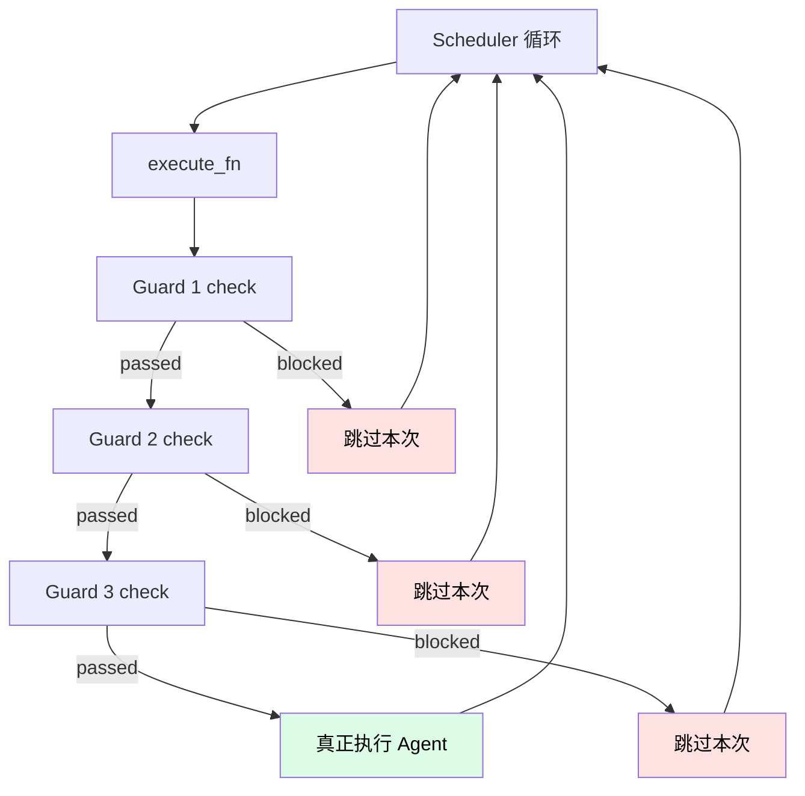

# 新增 Guard

Guard 是**执行前检查**——每次 `_execute_once` 前问一遍："现在能跑吗？"。任何一个 Guard 不通过就跳过本次执行。

## 什么时候要加 Guard

| 场景 | 例子 |
|------|------|
| 限制运行环境 | 只在工作日跑、只在某个机器跑 |
| 限制并发 | 全局只允许一个 Agent 在跑 |
| 跟监控集成 | 看到错误率高就暂停 |
| 自定义预算 | 跨进程累计费用、按月份算预算 |

## Guard 在哪里被调用



## 现有 Guard

| Guard | 文件 | 触发条件 |
|-------|------|---------|
| `circuit_breaker` | `guards/circuit_breaker.py` | 连续 N 次失败 |
| `time_window` | `guards/time_window.py` | 不在允许时间窗口 |
| `balance_check` | `guards/balance.py` | 累计费用超限 |

## 从零写一个新 Guard

以"**只有工作日才跑的 Weekday Guard**"为例。

### Step 1：理解 BaseGuard

```python
class BaseGuard(ABC):
    def __init__(self, config: GuardConfig):
        self.config = config
        self.enabled = config.enabled

    @abstractmethod
    async def check(self) -> GuardResult:
        """主检查方法"""

    async def on_success(self, **kwargs) -> None:
        """成功时回调，可选实现"""

    async def on_failure(self, error: str = "") -> None:
        """失败时回调，可选实现"""
```

返回值是 `GuardResult`：

```python
@dataclass
class GuardResult:
    passed: bool
    reason: str = ""
    guard_type: str = ""
```

### Step 2：写新 Guard 类

`src/nezha/guards/weekday.py`：

```python
"""Weekday guard — only allow execution Monday through Friday."""

from datetime import datetime
from zoneinfo import ZoneInfo

from nezha.config import GuardConfig
from nezha.guards.base import BaseGuard, GuardResult


class WeekdayGuard(BaseGuard):
    """Block execution on weekends.

    Config params (via GuardConfig.params):
        timezone: str (default 'Asia/Shanghai')
        allow_saturday: bool (default False)
        allow_sunday: bool (default False)
    """

    def __init__(self, config: GuardConfig):
        super().__init__(config)
        self._tz = ZoneInfo(config.params.get("timezone", "Asia/Shanghai"))
        self._allow_sat = config.params.get("allow_saturday", False)
        self._allow_sun = config.params.get("allow_sunday", False)

    async def check(self) -> GuardResult:
        now = datetime.now(self._tz)
        weekday = now.weekday()  # 0=Mon, 6=Sun

        if weekday == 5 and not self._allow_sat:
            return GuardResult(
                passed=False,
                reason="Saturday: execution blocked",
                guard_type="weekday",
            )
        if weekday == 6 and not self._allow_sun:
            return GuardResult(
                passed=False,
                reason="Sunday: execution blocked",
                guard_type="weekday",
            )
        return GuardResult(passed=True, guard_type="weekday")
```

### Step 3：在工厂注册

`src/nezha/guards/__init__.py`：

```python
from nezha.guards.base import BaseGuard, GuardChain, GuardResult
from nezha.guards.circuit_breaker import CircuitBreakerGuard
from nezha.guards.time_window import TimeWindowGuard
from nezha.guards.balance import BalanceCheckGuard
from nezha.guards.weekday import WeekdayGuard          # ← 新增


class GuardFactory:
    _REGISTRY = {
        "circuit_breaker": CircuitBreakerGuard,
        "time_window": TimeWindowGuard,
        "balance_check": BalanceCheckGuard,
        "weekday": WeekdayGuard,                        # ← 新增
    }

    @classmethod
    def create(cls, config):
        guard_cls = cls._REGISTRY.get(config.type)
        if guard_cls is None:
            raise ValueError(f"Unknown guard type: '{config.type}'")
        return guard_cls(config)


__all__ = [
    "BaseGuard", "GuardChain", "GuardResult", "GuardFactory",
    "CircuitBreakerGuard", "TimeWindowGuard", "BalanceCheckGuard",
    "WeekdayGuard",
]
```

### Step 4：写测试

`tests/test_weekday_guard.py`：

```python
import pytest
from datetime import datetime
from unittest.mock import patch
from zoneinfo import ZoneInfo

from nezha.config import GuardConfig
from nezha.guards.weekday import WeekdayGuard


@pytest.mark.asyncio
async def test_monday_passes():
    """Monday should pass."""
    config = GuardConfig(type="weekday", enabled=True, params={})
    guard = WeekdayGuard(config)

    monday = datetime(2026, 6, 1, 10, 0, tzinfo=ZoneInfo("Asia/Shanghai"))
    with patch("nezha.guards.weekday.datetime") as mock_dt:
        mock_dt.now.return_value = monday
        result = await guard.check()
    assert result.passed


@pytest.mark.asyncio
async def test_saturday_blocked():
    """Saturday should be blocked by default."""
    config = GuardConfig(type="weekday", enabled=True, params={})
    guard = WeekdayGuard(config)

    saturday = datetime(2026, 6, 6, 10, 0, tzinfo=ZoneInfo("Asia/Shanghai"))
    with patch("nezha.guards.weekday.datetime") as mock_dt:
        mock_dt.now.return_value = saturday
        result = await guard.check()
    assert not result.passed
    assert "Saturday" in result.reason


@pytest.mark.asyncio
async def test_saturday_allowed_via_config():
    """allow_saturday=True should let Saturday pass."""
    config = GuardConfig(
        type="weekday",
        enabled=True,
        params={"allow_saturday": True},
    )
    guard = WeekdayGuard(config)

    saturday = datetime(2026, 6, 6, 10, 0, tzinfo=ZoneInfo("Asia/Shanghai"))
    with patch("nezha.guards.weekday.datetime") as mock_dt:
        mock_dt.now.return_value = saturday
        result = await guard.check()
    assert result.passed
```

跑测试：

```bash
python3 -m pytest tests/test_weekday_guard.py -v
```

### Step 5：在 executor.yaml 启用

```yaml
guards:
  - type: weekday
    enabled: true
    params:
      timezone: "Asia/Shanghai"
      allow_saturday: false
      allow_sunday: false
```

### Step 6：跑

```bash
nezha run frontend-agent
```

如果是周末，应该看到：

```
[guard] weekday: Saturday: execution blocked
[scheduler] Iteration outcome=skipped
```

## Guard 设计原则

### 1. check() 要快

每次执行循环都会调一遍，**不要做耗时操作**（不要查数据库、不要发 HTTP）。如果必须，加缓存：

```python
class MyGuard(BaseGuard):
    def __init__(self, config):
        super().__init__(config)
        self._cache_ttl = config.params.get("cache_seconds", 60)
        self._last_check = 0
        self._cached_result = None

    async def check(self):
        now = time.time()
        if now - self._last_check < self._cache_ttl and self._cached_result:
            return self._cached_result
        # ... 实际检查
        self._last_check = now
        self._cached_result = result
        return result
```

### 2. 默认 enabled=False

新 Guard 默认应该是禁用的，用户主动启用。

### 3. 失败 reason 要清晰

`GuardResult.reason` 会打印给用户看，要解释**为什么阻塞**：

```python
# ✅ 好
reason="Saturday: execution blocked by weekday guard"

# ❌ 不好
reason="failed"
```

### 4. 异常 = 默认放行

Guard 自身崩了不应该阻塞执行（除非是认证之类的硬限制）。`balance_check` 的做法：

```python
async def _fetch_balance(self):
    try:
        # ... API call
        return balance
    except Exception:
        return None    # 失败时返回 None，上层判断为放行

async def check(self):
    balance = await self._fetch_balance()
    if balance is None:
        print("[balance] Could not check, degrading to pass")
        return GuardResult(passed=True, guard_type="balance_check")
    # ...
```

### 5. 状态用回调更新

Guard 想跟踪状态（成功次数、失败次数、累计费用），用 `on_success` / `on_failure` 回调：

```python
class MyGuard(BaseGuard):
    def __init__(self, config):
        super().__init__(config)
        self._failure_count = 0

    async def check(self):
        if self._failure_count >= 5:
            return GuardResult(passed=False, reason="too many failures")
        return GuardResult(passed=True)

    async def on_failure(self, error: str = ""):
        self._failure_count += 1

    async def on_success(self, **kwargs):
        self._failure_count = 0      # 成功一次就清零
```

### 6. 跨进程状态用文件

Guard 实例的状态只在**当前进程内**。如果需要跨进程（比如累计当月费用），写到文件：

```python
class MonthlyBudgetGuard(BaseGuard):
    def __init__(self, config):
        super().__init__(config)
        self._state_file = Path(config.params.get("state_file", "./state/budget.json"))

    async def check(self):
        data = json.loads(self._state_file.read_text()) if self._state_file.exists() else {}
        # 检查 data["this_month_cost"] ...

    async def on_success(self, cost_usd=0.0, **kwargs):
        # 累加到文件
        data = ...
        data["this_month_cost"] += cost_usd
        self._state_file.write_text(json.dumps(data))
```

## 常见模式参考

### 模式 1：时间相关（cron-like）

参考 `time_window.py` 和上面的 `WeekdayGuard`。

### 模式 2：状态累计（连续失败、累计费用）

参考 `circuit_breaker.py` 和 `balance.py`。

### 模式 3：外部依赖（API / 数据库）

```python
async def check(self):
    try:
        async with httpx.AsyncClient(timeout=5) as client:
            resp = await client.get("https://my-status-api/check")
        if resp.status_code != 200:
            return GuardResult(passed=False, reason="upstream unhealthy")
    except Exception:
        return GuardResult(passed=True)  # 检查失败 → 放行
    return GuardResult(passed=True)
```

注意加超时，别让 Guard 把主流程卡死。

### 模式 4：并发互斥

```python
class GlobalLockGuard(BaseGuard):
    def __init__(self, config):
        super().__init__(config)
        self._lock_file = Path("/tmp/nezha.lock")

    async def check(self):
        if self._lock_file.exists():
            return GuardResult(passed=False, reason="另一个 Nezha 实例在跑")
        return GuardResult(passed=True)
```

> ⚠️ 真正的并发控制要用 `fcntl` 文件锁，这个示例只是演示。

## 常见问题

**Q: Guard 失败后什么时候再试？**

下一个 `scheduler.interval` 周期。如果想立即重试，得改 scheduler 逻辑。

**Q: Guard 顺序重要吗？**

按 YAML 里的顺序串行 check。第一个失败就跳过后面的。**应该把便宜的 / 高频失败的放前面**（快速失败）。

**Q: 怎么 disable 一个 Guard？**

YAML 里 `enabled: false`，或者直接删掉那一段。

**Q: 自定义 Guard 怎么贡献回主仓？**

如果是通用 Guard：

1. 放到 `src/nezha/guards/`
2. 在 `__init__.py` 注册
3. 写测试
4. 在 `wiki/02-cheatsheet/executor-yaml.md` 加字段说明
5. 提 PR

## 相关章节

- [Internals: GuardChain](../04-internals/architecture.md) — Guard 调用机制
- [How-To: 费用控制](../03-howto/cost-budget.md) — `balance_check` 用法
- [Reference: guards 配置](../02-cheatsheet/executor-yaml.md#守卫链)
