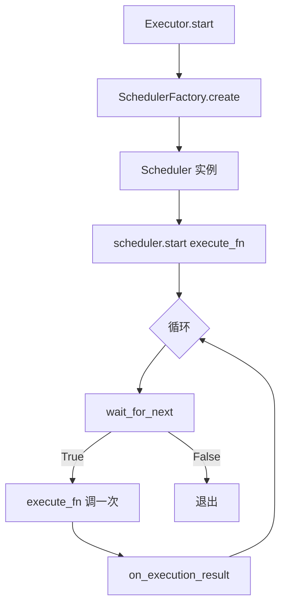

# 新增 Scheduler

Scheduler 控制**什么时候触发 Agent 执行**。三种已有模式（manual / continuous / cron）覆盖了 90% 场景，需要新加的情况不多。

> Scheduler 是相对复杂的扩展点，涉及完整的 async 循环逻辑。**新手不建议从这里开始**。

## 什么时候要加 Scheduler

| 场景 | 例子 |
|------|------|
| 跟外部触发器集成 | 收到 webhook 才跑 |
| 智能调度 | 根据 CPU / 内存动态调间隔 |
| 队列驱动 | 从 MQ 消费消息触发 |
| 自适应退避 | 根据成功率调整频率 |

## Scheduler 在哪里被调用



## 现有 Scheduler

| Scheduler | 文件 | 触发逻辑 |
|-----------|------|---------|
| `manual` | `scheduler/manual.py` | 跑一次就退出 |
| `continuous` | `scheduler/continuous.py` | 固定间隔循环 |
| `cron` | `scheduler/cron.py` | cron 表达式 |

## 从零写一个新 Scheduler

以"**Webhook Scheduler**——监听 HTTP webhook 触发执行"为例。

### Step 1：理解 BaseScheduler

```python
class BaseScheduler(ABC):
    def __init__(self, config: SchedulerConfig):
        self.config = config
        self._running = False

    @property
    def mode(self) -> str:
        return self.config.mode

    @abstractmethod
    async def start(self, execute_fn, on_failure_judge=None) -> None:
        """主循环入口"""

    async def stop(self) -> None:
        """优雅停止"""
        self._running = False

    @abstractmethod
    async def wait_for_next(self) -> bool:
        """等下一次触发"""
```

最关键的是 `start()` 方法，需要：

1. 循环触发 `execute_fn`
2. 检查 `.stop` 信号文件
3. 处理 success / failure 回调
4. 退出条件（队列空、stop 信号、外部 stop）

### Step 2：写新 Scheduler

`src/nezha/scheduler/webhook.py`：

```python
"""Webhook scheduler — triggered by HTTP POST requests."""

import asyncio
import http.server
from pathlib import Path
from threading import Thread

from nezha.config import SchedulerConfig
from nezha.scheduler.base import BaseScheduler


class WebhookScheduler(BaseScheduler):
    """Listen for HTTP webhook to trigger execution.

    Config params:
        port: int (default 9999)
        path: str (default "/trigger")
        token: str (optional, validate against X-Token header)
    """

    def __init__(self, config: SchedulerConfig, state_dir: Path = None):
        super().__init__(config)
        self._port = config.params.get("port", 9999)
        self._path = config.params.get("path", "/trigger")
        self._token = config.params.get("token", "")
        self._state_dir = state_dir
        self._trigger_event = asyncio.Event()

    async def start(self, execute_fn, on_failure_judge=None) -> None:
        self._running = True

        # Clear stale stop signal
        if self._state_dir:
            stop_file = self._state_dir / ".stop"
            if stop_file.exists():
                stop_file.unlink(missing_ok=True)

        # Start HTTP server in background thread
        server_thread = Thread(
            target=self._run_http_server,
            daemon=True,
        )
        server_thread.start()

        print(f"[webhook] Listening on port {self._port}, path={self._path}")

        # Main loop: wait for trigger, execute, repeat
        iteration = 0
        while self._running:
            should_continue = await self.wait_for_next()
            if not should_continue:
                break

            iteration += 1
            print(f"[webhook] Iteration {iteration} triggered by webhook")
            try:
                outcome = await execute_fn()
                # outcome 可以是 "success" / "failure" / "skipped"
                print(f"[webhook] Iteration {iteration} outcome={outcome}")
            except Exception as e:
                print(f"[webhook] Iteration {iteration} error: {e}")

        print(f"[webhook] Stopped after {iteration} iterations")

    async def wait_for_next(self) -> bool:
        """等待 webhook 触发或 stop 信号"""
        while self._running:
            # Check stop signal
            if self._check_stop_signal():
                return False

            # Wait for trigger with timeout (let us check stop signal periodically)
            try:
                await asyncio.wait_for(self._trigger_event.wait(), timeout=5.0)
                self._trigger_event.clear()
                return True
            except asyncio.TimeoutError:
                continue  # Re-check stop signal

        return False

    def _check_stop_signal(self) -> bool:
        if not self._state_dir:
            return False
        stop_file = self._state_dir / ".stop"
        if stop_file.exists():
            stop_file.unlink(missing_ok=True)
            return True
        return False

    def _run_http_server(self):
        scheduler = self

        class Handler(http.server.BaseHTTPRequestHandler):
            def do_POST(self):
                if self.path != scheduler._path:
                    self.send_response(404)
                    self.end_headers()
                    return

                # Validate token
                if scheduler._token:
                    token = self.headers.get("X-Token", "")
                    if token != scheduler._token:
                        self.send_response(401)
                        self.end_headers()
                        return

                # Trigger
                scheduler._trigger_event.set()
                self.send_response(202)
                self.send_header("Content-Type", "application/json")
                self.end_headers()
                self.wfile.write(b'{"status":"triggered"}')

            def log_message(self, format, *args):
                pass  # silence access logs

        server = http.server.HTTPServer(("0.0.0.0", self._port), Handler)
        server.serve_forever()
```

### Step 3：在工厂注册

`src/nezha/scheduler/__init__.py`：

```python
from nezha.scheduler.base import BaseScheduler
from nezha.scheduler.manual import ManualScheduler
from nezha.scheduler.continuous import ContinuousScheduler
from nezha.scheduler.cron import CronScheduler
from nezha.scheduler.webhook import WebhookScheduler          # ← 新增


class SchedulerFactory:
    _REGISTRY = {
        "manual": ManualScheduler,
        "continuous": ContinuousScheduler,
        "cron": CronScheduler,
        "webhook": WebhookScheduler,                           # ← 新增
    }

    @classmethod
    def create(cls, config, state_dir=None):
        scheduler_cls = cls._REGISTRY.get(config.mode)
        if scheduler_cls is None:
            raise ValueError(f"Unknown scheduler mode: '{config.mode}'")
        if config.mode in ("continuous", "webhook"):
            return scheduler_cls(config, state_dir=state_dir)
        return scheduler_cls(config)
```

### Step 4：写测试

`tests/test_webhook_scheduler.py`：

```python
import asyncio
from unittest.mock import AsyncMock

import pytest

from nezha.config import SchedulerConfig
from nezha.scheduler.webhook import WebhookScheduler


@pytest.mark.asyncio
async def test_trigger_via_event():
    """模拟手动触发 _trigger_event"""
    config = SchedulerConfig(mode="webhook", params={"port": 19998})
    scheduler = WebhookScheduler(config, state_dir=None)
    execute_fn = AsyncMock(return_value="success")

    # 启动 + 立即触发 + 等执行后停止
    async def trigger_and_stop():
        await asyncio.sleep(0.1)
        scheduler._trigger_event.set()
        await asyncio.sleep(0.5)
        scheduler._running = False

    task = asyncio.create_task(scheduler.start(execute_fn))
    await trigger_and_stop()
    await asyncio.wait_for(task, timeout=5)

    assert execute_fn.called
```

跑：

```bash
python3 -m pytest tests/test_webhook_scheduler.py -v
```

### Step 5：用起来

`executor.yaml`：

```yaml
scheduler:
  mode: "webhook"
  params:
    port: 9999
    path: "/trigger"
    token: "${WEBHOOK_TOKEN}"
```

`.env`：

```bash
WEBHOOK_TOKEN=secret-123
```

启动：

```bash
nezha run frontend-agent
```

触发：

```bash
curl -X POST http://localhost:9999/trigger -H "X-Token: secret-123"
```

应该看到 webhook 接收，触发一次 Agent 执行。

## Scheduler 设计原则

### 1. 必须支持 `.stop` 信号

所有 Scheduler 都应该周期性检查 `state/.stop` 文件——这是统一的优雅停止机制。

```python
def _check_stop_signal(self) -> bool:
    if not self._state_dir:
        return False
    stop_file = self._state_dir / ".stop"
    if stop_file.exists():
        stop_file.unlink(missing_ok=True)
        return True
    return False
```

### 2. wait_for_next 不能一直阻塞

应该有超时机制，能定期检查 stop 信号：

```python
try:
    await asyncio.wait_for(self._trigger_event.wait(), timeout=5.0)
except asyncio.TimeoutError:
    # 让循环重新检查 stop 信号
    continue
```

### 3. start 是 async，不能用 blocking IO

如果要起 HTTP server / 监听 MQ 等，用 `asyncio` 原生方式，或者起 daemon 线程（如本例）。

### 4. 提供清晰的状态日志

每次触发、停止都要打印。用户看不到调度逻辑，全靠日志判断。

### 5. 优雅停止

`stop()` 方法应该让 `start()` 循环退出，不留下僵尸进程或文件描述符。

## 常见 Scheduler 模式

### 模式 1：固定间隔（continuous）

参考 `continuous.py`。核心：

```python
while self._running:
    await execute_fn()
    await asyncio.sleep(self._interval)
```

### 模式 2：cron 表达式

参考 `cron.py`。用 `croniter` 库计算下次触发时间。

### 模式 3：外部触发（webhook / MQ）

参考上面 WebhookScheduler。用 `asyncio.Event` 协调主循环和外部触发源。

### 模式 4：自适应

```python
async def start(self, execute_fn, ...):
    interval = self._initial_interval
    while self._running:
        outcome = await execute_fn()
        if outcome == "success":
            interval = max(self._min_interval, interval * 0.9)  # 加速
        else:
            interval = min(self._max_interval, interval * 1.5)  # 减速
        await asyncio.sleep(interval)
```

## 常见问题

**Q: 想用现有 Scheduler 的一部分功能加自己的？**

可以继承现有 Scheduler：

```python
from nezha.scheduler.continuous import ContinuousScheduler

class MyScheduler(ContinuousScheduler):
    async def wait_for_next(self):
        # 自定义等待逻辑
        ...
```

**Q: Scheduler 之间能切换吗？**

运行时不行——Scheduler 在 `executor.yaml` 加载时确定。

**Q: 一个 Agent 能配多个 Scheduler 吗？**

不行。一个 executor.yaml 只有一个 `scheduler` 块。

要"同时"用多种触发方式，可以写一个组合 Scheduler 在内部包装：

```python
class CombinedScheduler(BaseScheduler):
    def __init__(self, config):
        # 内部组合 continuous + webhook
        ...
```

**Q: 我的自定义 Scheduler 想读 SchedulerConfig 里没有的字段怎么办？**

`SchedulerConfig.params: dict` 是个 catch-all，自由用：

```yaml
scheduler:
  mode: "webhook"
  params:
    port: 9999
    custom_field: "..."
```

```python
self._custom = config.params.get("custom_field", "default")
```

## 相关章节

- [Internals: 分层架构](../04-internals/architecture.md#scheduler循环驱动)
- [How-To: 限流处理](../03-howto/rate-limit.md) — `.stop` 信号机制
- [Reference: scheduler 配置](../02-cheatsheet/executor-yaml.md#调度器)
