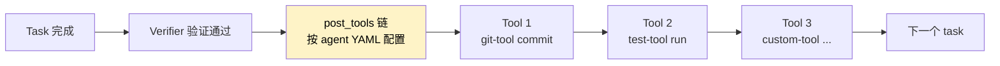

# 新增 Tool

Tool 是 **post-session 阶段执行的确定性操作**——不是 AI，是固定的 Python 代码。比如 git commit、跑测试、上传产物等。

## 什么时候要加 Tool

| 场景 | 例子 |
|------|------|
| 跑完 task 自动部署 | 上传到 S3 / 推 Docker 镜像 |
| 跑完 task 通知 | 发钉钉 / Slack 消息 |
| 跑完 task 跑性能测试 | benchmark + 生成报告 |
| 跑完 task 同步文档 | 把 README 推到 wiki |

> Tool **不是 LLM**——别拿它当 Agent 用。

## Tool 在哪里被调用



## 现有 Tool

| Tool | 文件 | 用途 |
|------|------|------|
| `git-tool` | `tools/git_tool.py` | git commit/push/create-pr |
| `test-tool` | `tools/test_tool.py` | 跑测试命令 |

## 从零写一个新 Tool

以"**钉钉通知 Tool**"为例：每个 task 完成后发钉钉消息。

### Step 1：理解 BaseTool Protocol

```python
@runtime_checkable
class BaseTool(Protocol):
    def run(self, action: str, cwd: Path, params: dict) -> ToolResult:
        """Execute the tool action.

        Args:
            action:  What to do (e.g. "commit", "notify", "run")
            cwd:     Working directory
            params:  Extra params from YAML config

        Returns:
            ToolResult(success, output, error)
        """
        ...
```

Tool 只有一个方法 `run()`，三个参数：

| 参数 | 含义 |
|------|------|
| `action` | 干什么（一个 Tool 可以支持多个 action） |
| `cwd` | 当前工作目录 |
| `params` | YAML 里 `post_tools[].params` 传进来 |

返回值是 `ToolResult`：

```python
@dataclass
class ToolResult:
    success: bool
    output: str = ""
    error: str = ""
```

### Step 2：写新 Tool 类

`src/nezha/tools/dingtalk_tool.py`：

```python
"""DingTalk notification tool — send messages via webhook."""

import json
import urllib.request
from pathlib import Path

from nezha.tools.base import ToolResult


class DingTalkTool:
    """Send DingTalk messages via webhook.

    Supported actions:
        notify — send a simple text message
    """

    def run(self, action: str, cwd: Path, params: dict) -> ToolResult:
        if action == "notify":
            return self._notify(params)
        return ToolResult(
            success=False,
            error=f"Unknown dingtalk-tool action: '{action}'",
        )

    def _notify(self, params: dict) -> ToolResult:
        webhook = params.get("webhook", "")
        message = params.get("message", "Task completed")

        if not webhook:
            return ToolResult(success=False, error="webhook not configured")

        payload = json.dumps({
            "msgtype": "text",
            "text": {"content": message},
        }).encode("utf-8")

        req = urllib.request.Request(
            webhook,
            data=payload,
            headers={"Content-Type": "application/json"},
            method="POST",
        )
        try:
            with urllib.request.urlopen(req, timeout=10) as resp:
                data = json.loads(resp.read())
            if data.get("errcode") == 0:
                return ToolResult(success=True, output="DingTalk sent")
            return ToolResult(
                success=False,
                error=f"DingTalk API: {data.get('errmsg', 'unknown')}",
            )
        except Exception as e:
            return ToolResult(success=False, error=str(e))
```

### Step 3：在工厂注册

`src/nezha/tools/__init__.py`：

```python
from nezha.tools.base import BaseTool, ToolResult
from nezha.tools.git_tool import GitTool
from nezha.tools.test_tool import TestTool
from nezha.tools.dingtalk_tool import DingTalkTool      # ← 新增

_REGISTRY: dict[str, type[BaseTool]] = {
    "git-tool": GitTool,
    "test-tool": TestTool,
    "dingtalk-tool": DingTalkTool,                      # ← 新增
}


def create_tool(name: str) -> BaseTool:
    cls = _REGISTRY.get(name)
    if cls is None:
        raise ValueError(f"Unknown tool: '{name}'. Available: {list(_REGISTRY)}")
    return cls()


__all__ = ["BaseTool", "ToolResult", "GitTool", "TestTool", "DingTalkTool", "create_tool"]
```

### Step 4：写测试

`tests/test_dingtalk_tool.py`：

```python
from pathlib import Path
from unittest.mock import patch, MagicMock

from nezha.tools.dingtalk_tool import DingTalkTool


def test_notify_success():
    tool = DingTalkTool()
    with patch("urllib.request.urlopen") as mock_open:
        mock_resp = MagicMock()
        mock_resp.read.return_value = b'{"errcode": 0}'
        mock_open.return_value.__enter__.return_value = mock_resp

        result = tool.run(
            "notify",
            Path("."),
            {"webhook": "https://oapi.dingtalk.com/...", "message": "hello"},
        )
    assert result.success
    assert "DingTalk sent" in result.output


def test_notify_missing_webhook():
    tool = DingTalkTool()
    result = tool.run("notify", Path("."), {})
    assert not result.success
    assert "webhook not configured" in result.error


def test_unknown_action():
    tool = DingTalkTool()
    result = tool.run("delete-everything", Path("."), {})
    assert not result.success
    assert "Unknown" in result.error
```

跑测试：

```bash
python3 -m pytest tests/test_dingtalk_tool.py -v
```

### Step 5：在 agent YAML 用

```yaml
# agents/frontend-agent.yaml
pipeline:
  post_tools:
    - name: git-tool
      action: commit
      params:
        message: "feat: {{task_description}}"
    - name: dingtalk-tool           # ← 用上
      action: notify
      params:
        webhook: "${DINGTALK_WEBHOOK}"
        message: "Task completed: {{task_id}}"
```

`{{task_description}}` 和 `{{task_id}}` 这类变量在 executor 调用 Tool 前会自动渲染。

### Step 6：补 wiki 文档

如果 Tool 是通用的，在 `wiki/02-cheatsheet/` 或 `wiki/03-howto/` 里加一篇说明。

## Tool 设计原则

### 1. 单一职责

一个 Tool 做一类事。**不要**把 git + 钉钉 + 上传 S3 全塞一个 Tool 里。

### 2. action 用动词

| ✅ 好 | ❌ 不好 |
|------|---------|
| `commit`、`push`、`notify`、`run` | `do-something`、`thing-1` |

### 3. params 校验在前

```python
def _notify(self, params):
    webhook = params.get("webhook", "")
    if not webhook:
        return ToolResult(success=False, error="webhook not configured")
    # 继续
```

提前 fail 比后面崩好。

### 4. 异常一律捕获

```python
try:
    # ...
    return ToolResult(success=True, output="...")
except Exception as e:
    return ToolResult(success=False, error=str(e))
```

Tool 抛异常会让 executor 主流程崩溃，要兜住。

### 5. 不依赖第三方库

能用 Python 标准库就别引第三方。比如 HTTP 请求用 `urllib`，别用 `requests`（除非 Nezha 已经有这个依赖）。

`nezha` 当前依赖很精简，加 Tool 时尽量保持。

### 6. cwd 要尊重

`cwd` 参数是上层传进来的工作目录，不要在 Tool 里随便 `os.chdir`。

```python
# ✅ 好
subprocess.run(["cargo", "build"], cwd=cwd)

# ❌ 不好
os.chdir(cwd)
subprocess.run(["cargo", "build"])
```

### 7. 安全考虑

Tool 接受用户配置的 params，可能有恶意输入。**不要直接 `shell=True`**：

```python
# ✅ 好
subprocess.run(["echo", message])

# ❌ 危险
subprocess.run(f"echo {message}", shell=True)
```

## 常见 Tool 模式

### 模式 1：HTTP webhook 类（钉钉 / Slack / 飞书）

参考上面 DingTalkTool。

### 模式 2：本地命令类（git / test / build）

```python
def _run_command(self, cwd, params):
    cmd = params.get("command", "")
    result = subprocess.run(
        cmd.split(),                # 安全：不用 shell=True
        cwd=cwd,
        capture_output=True,
        text=True,
        timeout=params.get("timeout", 60),
    )
    if result.returncode != 0:
        return ToolResult(success=False, error=result.stderr)
    return ToolResult(success=True, output=result.stdout)
```

### 模式 3：文件操作类（生成报告 / 上传产物）

```python
def _generate_report(self, cwd, params):
    output_path = Path(params.get("output", "report.md"))
    content = f"# Task Report\n\n..."
    output_path.write_text(content, encoding="utf-8")
    return ToolResult(success=True, output=f"Report at {output_path}")
```

## 常见问题

**Q: Tool 失败会怎样？**

`ToolResult.success=False` 会让 executor 打 warning，但**不中断**主流程（因为 task 已经完成了）。

如果 Tool 失败应该中断流程，自己在 executor 加逻辑（不推荐）。

**Q: 多个 post_tools 怎么执行顺序？**

按 YAML 里的顺序执行。一个失败下一个还是会跑。

**Q: 能在 Tool 里调 LLM 吗？**

技术上可以，但**不推荐**——破坏了 Tool 的"确定性"定位。如果需要 LLM 决策，应该用 Agent 而不是 Tool。

**Q: 自定义 Tool 怎么部署？**

- **贡献回主仓**：放到 `src/nezha/tools/` 注册
- **项目内私有**：放到 `用户项目/lib/` + 改 `agents/` YAML 引用（需要改 `tools/__init__.py` 的 registry——目前还不支持运行时注册，必须在源码改）

> ⚠️ 当前 `tools` 系统不支持运行时插件，私有 Tool 必须 fork 修改。这是个待改进的扩展点。

## 相关章节

- [新增 Agent](adding-an-agent.md) — 在 Agent 里用 Tool
- [Reference: post_tools 配置](../02-cheatsheet/executor-yaml.md)
- [Internals: 分层架构](../04-internals/architecture.md#executor协调中枢)
