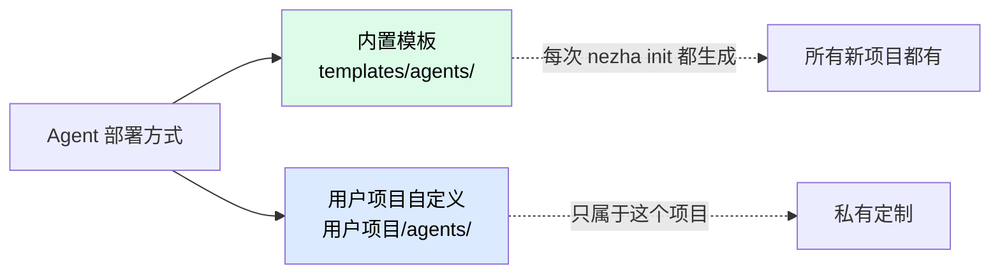
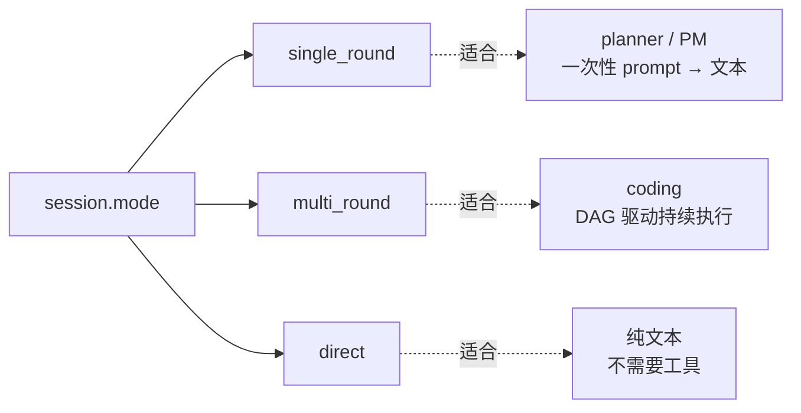

# 新增 Agent

Agent 是 Nezha 最常见的扩展点。**90% 的扩展只需要加一个 YAML 文件**——不需要写 Python。

## 什么时候要加 Agent

| 场景 | 例子 |
|------|------|
| 新技术栈 | Rust 项目、Go 项目、Flutter 项目 |
| 新角色 | DB 设计师、安全 reviewer、文档生成器 |
| 新工作流 | 翻译 Agent、SEO 优化 Agent |
| 特定项目定制 | 公司内部规范 / 工具链 |

## Agent 的两种部署方式



| 部署方式 | 适合 | 改动位置 |
|---------|------|---------|
| **内置模板** | 通用 Agent，要贡献回主仓 | `src/nezha/templates/agents/<name>.yaml` |
| **项目级自定义** | 公司 / 项目专属 | `用户项目/agents/<name>.yaml` |

下面以"加一个 **Rust Agent**"为例，演示从零开始的完整流程。

## Step 1：选 category

Agent YAML 的 `agent.category` 决定运行时行为：

| category | 行为 | 适合 |
|----------|------|------|
| `coding` | 有 target、运行安全检查、git 操作 | 写代码的 Agent |
| `planning` | 无 target、cwd=feature_workspace、无 git | 拆任务、写 PRD |
| `design` | 同 planning | 架构 / DB 设计 |
| `management` | 同 planning，操作 `workspace/project/` | PM / Helper |

我们要的 Rust Agent 写代码 → `category: coding`。

## Step 2：选 session.mode



Coding Agent 用 `multi_round`。

## Step 3：写 YAML

`agents/rust-agent.yaml`（用户项目内）或 `src/nezha/templates/agents/rust-agent.yaml`（贡献回主仓）：

```yaml
# =============================================================================
# Rust Agent — Rust 项目编码 Agent
# =============================================================================

agent:
  name: "rust-agent"
  category: "coding"
  description: "Rust 编码 Agent — 用 cargo + TDD 实现 feature、修 bug、写测试"

engine:
  model: "claude-sonnet-4-6"
  max_turns: 200
  tools:
    - Read
    - Write
    - Edit
    - Bash
    - Glob
    - Grep
  security:
    allowed_commands:
      # 通用
      - ls
      - cat
      - find
      - grep
      - head
      - tail
      - wc
      - pwd
      - mkdir
      - cp
      - rm
      - mv
      - chmod
      - git
      - curl
      # Rust 工具链
      - cargo
      - rustc
      - rustup
      - rustfmt
      - clippy

session:
  mode: "multi_round"
  compose:
    worker:
      base: "coding/base.md"
      sections:
        - phases/context-acquisition
        - stacks/rust                # ← 用 Rust 栈模块（需要单独创建）
        - phases/tdd
        - phases/regression
        - phases/commit-rules
    initializer:
      base: "coding/base.md"
      sections:
        - phases/context-acquisition
        - stacks/rust

git:
  branch_per_task: true
  use_worktree: true
  base_branch: "main"
  auto_commit: true
  auto_push: false

pipeline:
  # Rust 项目跑测试（可选）
  # post_task_test:
  #   enabled: true
  #   command: "cargo test"
  #   max_cycles: 3
  #   timeout: 600

workspace:
  path: "./workspace/rust-agent"

# target 来自 executor.yaml；想覆盖在这里加：
# target: "/path/to/rust-project"
# 单仓目录：
# target_scope: "backend"
```

## Step 4：写对应的 Prompt 模块

如果你用了 `compose.worker.sections` 引用了不存在的模块（比如 `stacks/rust`），要先创建它。

详见 [编写 Prompt 模块](prompt-module-authoring.md)。简短示例：

`prompts/modules/stacks/rust.md`：

```markdown
## Rust 技术栈知识

### 工具链
- 构建：`cargo build`
- 测试：`cargo test`
- 格式化：`cargo fmt`
- 静态检查：`cargo clippy`

### 错误处理
- 偏好 `Result<T, E>` + `?` 操作符
- 避免 `unwrap()` 在生产代码
- 自定义错误用 `thiserror`

### 异步
- 用 `tokio` runtime
- 异步函数 `async fn`，调用 `.await`

### 测试
- 单元测试在源文件内 `#[cfg(test)] mod tests`
- 集成测试在 `tests/` 目录
```

中文版 `prompts/modules/stacks/rust.zh.md`（可选但推荐）。

## Step 5：测试一下

### 5a. 跑 plan 命令看 DAG

```bash
nezha plan rust-agent
```

应该看到 DAG 显示当前 task 列表。

### 5b. 创建一个简单 Feature 测试

```bash
nezha feature create --title "测试 Rust Agent" --input test-input.md
```

`test-input.md`：

```markdown
# 测试需求

写一个 `hello.rs`，包含一个返回 "Hello, World!" 的函数，并写测试。
```

### 5c. 跑

```bash
nezha run rust-agent --feature-id <创建出来的 id>
```

如果配置对，应该看到：

- 子进程启动
- `cargo` 命令被调用
- 代码写入 target
- 测试通过 → task completed

### 5d. 看结果

```bash
nezha feature show <id>
cd <target-repo>
git log
```

## 完整 checklist

加 Agent 完成后过一遍：

- [ ] YAML 文件命名规范 `<name>-agent.yaml`
- [ ] `agent.category` 选对了（coding/planning/design/management）
- [ ] `engine.tools` 包含必要的工具（Read/Write/Edit/Bash 等）
- [ ] `engine.security.allowed_commands` 涵盖了所需命令
- [ ] `session.mode` 选对了
- [ ] `session.compose.worker` 引用的 prompt 模块都存在
- [ ] `git` 配置合理（auto_commit / branch_per_task）
- [ ] `workspace.path` 不和其他 Agent 冲突
- [ ] 跑一个简单 task 验证

## 常见模式参考

### 模式 1：纯 coding（如 frontend / python / rust / java）

```yaml
agent:
  category: "coding"
session:
  mode: "multi_round"
  compose:
    worker:
      base: "coding/base.md"
      sections: [phases/context-acquisition, stacks/<栈>, phases/tdd, ...]
git:
  branch_per_task: true
  auto_commit: true
```

### 模式 2：planning（如 planner / product）

```yaml
agent:
  category: "planning"
session:
  mode: "single_round"
  prompts:
    worker: "planner/worker.md"
git:
  # 不需要 git 配置
```

### 模式 3：management（如 PM / helper）

```yaml
agent:
  category: "management"
session:
  mode: "single_round"
  prompts:
    worker: "pm/worker.md"
# 操作 workspace/project/ 目录
```

### 模式 4：跨语言全栈（如 tauri-agent）

```yaml
agent:
  category: "coding"
engine:
  security:
    allowed_commands:
      - cargo            # Rust
      - npm              # 前端
      - pnpm
      - python           # Python sidecar
      - pytest
session:
  compose:
    worker:
      sections:
        - stacks/tauri-fullstack    # 跨栈整合模块
```

## 高级：覆盖某些字段

### 单独覆盖 target

agent YAML 加：

```yaml
target: "/path/to/specific-repo"
```

这个 Agent 用这个 target，其他 Agent 还是 executor.yaml 的 target。

### 单仓内只关注某个子目录

```yaml
target: "/path/to/monorepo"
target_scope: "packages/web"
```

Agent 实际 cwd 是 `target + target_scope`。

### per-Agent 模型路由

```yaml
engine:
  model: "claude-opus-4-6"    # 强制用 Opus，不走 model_map
```

或者用专属 env：

```yaml
engine:
  model: "glm-4-flash"
  env:
    OPENAI_API_KEY: "${GLM_API_KEY}"
    OPENAI_BASE_URL: "https://open.bigmodel.cn/api/paas/v4"
```

### post_tools：跑完 task 执行额外命令

```yaml
pipeline:
  post_tools:
    - name: git-tool
      action: commit
      params:
        message: "feat: {{task_description}}"
    - name: test-tool
      action: run
      params:
        command: "cargo test"
```

## 常见问题

**Q: agent YAML 改了不生效？**

- 跑 `nezha run` 的 working directory 对吗？
- agent YAML 在 `agents/` 目录下吗？
- agent name（YAML 里的 `agent.name`）和文件名一致吗？

**Q: `category` 选错了会怎样？**

- 选 `coding` 但 agent 不写代码 → 无所谓但浪费 git 配置
- 选 `planning` 但 agent 要写代码 → 无 target，agent 不知道往哪写

**Q: 想 disable 某个内置 Agent？**

直接删除 `agents/<name>.yaml` 即可。Nezha 不会"找不到 agent 就报错"——只有你 `nezha run <name>` 时才会检查。

**Q: 自定义 Agent 怎么贡献回主仓？**

把 YAML 放到 `src/nezha/templates/agents/`，加对应 prompt 模块到 `src/nezha/templates/prompts/`，写测试，提 PR。详见 [贡献流程](contributing.md)。

## 相关章节

- [编写 Prompt 模块](prompt-module-authoring.md) — 写自定义 sections
- [新增 Tool](adding-a-tool.md) — 写 post_tool
- [Reference: agent YAML 字段](../02-cheatsheet/executor-yaml.md) — 字段完整清单
- [Internals: Prompt 组合](../04-internals/prompt-composer.md)
