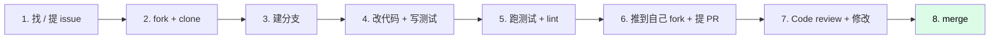

# 贡献流程

欢迎贡献！这里讲清楚**从想法到合并 PR** 的完整流程。

## TL;DR



## Step 1：找 / 提 issue

### 找现有 issue

```bash
gh issue list --state open --label "good first issue"
# 或者
open https://github.com/<your-org>/nezha/issues
```

### 提新 issue

提之前先搜重复。提 issue 时包含：

```markdown
## 问题描述
（一句话说清楚）

## 复现步骤
1. ...
2. ...

## 期望行为
...

## 实际行为
...

## 环境
- OS: macOS 14.0
- Python: 3.13
- Nezha 版本: <git commit / pipx show>

## 日志 / 错误信息
```
...
```
```

### 大改动先讨论

加新 Agent 模板、改公共接口、改 DAG 引擎等大改动，**先在 issue 讨论方案**再写代码。避免：

- 你做了一周，发现思路和维护者不一致
- 维护者觉得不该加这个功能

## Step 2：fork + clone

```bash
# 在 GitHub 网页点 Fork

# clone 自己的 fork
git clone https://github.com/<你的用户名>/nezha.git
cd nezha

# 加 upstream
git remote add upstream https://github.com/<原仓库>/nezha.git
```

## Step 3：建分支

```bash
git checkout -b feat/add-rust-agent
# 或
git checkout -b fix/dag-rework-clearing
```

分支命名建议：

| 前缀 | 用途 |
|------|------|
| `feat/` | 新功能 |
| `fix/` | 修 bug |
| `docs/` | 改文档 |
| `refactor/` | 重构（不改行为） |
| `test/` | 加 / 改测试 |
| `chore/` | 杂项（CI、构建等） |

## Step 4：改代码

### 装开发依赖

```bash
pip install -e ".[dev]"
```

这会安装 pytest 等开发依赖，让 `import nezha` 在测试里能用。

### 代码风格

跟着现有代码风格写：

| 风格 | Nezha 约定 |
|------|----------|
| 缩进 | 4 空格 |
| 字符串 | 双引号优先 |
| 类型注解 | 公开 API 必须有 |
| Docstring | 公开类 / 函数必须有 |
| 注释 | 解释 "why"，不解释 "what" |
| 文件编码 | UTF-8 |

具体可以看 `src/nezha/executor.py` 学习风格。

### 写测试

每个新功能 / bug 修复都要有对应测试。详见 [测试策略](testing.md)。

### 不要做的事

- ❌ 改公共 API 不加测试
- ❌ 删除现有测试（除非真的过时）
- ❌ 加大量第三方依赖（增加用户安装负担）
- ❌ 加全局变量 / 单例（破坏可测性）
- ❌ commit 二进制文件 / 大文件
- ❌ commit `.env`、API key 等敏感文件

## Step 5：本地验证

```bash
# 1. 跑全量测试
make test
# 应该看到 994+ 通过

# 2. 跑 lint（如果有）
make lint

# 3. 格式化代码
make format

# 4. 跑你改的功能（手动测一遍）
nezha run <agent>  # 或对应 CLI 命令
```

任何一项过不了，**不要提 PR**。

## Step 6：提交 + push

### Commit message 规范

跟 [Conventional Commits](https://www.conventionalcommits.org/) 走：

```
<type>(<scope>): <subject>

[optional body]

[optional footer]
```

`type`：

| type | 用途 |
|------|------|
| `feat` | 新功能 |
| `fix` | 修 bug |
| `docs` | 文档 |
| `refactor` | 重构 |
| `test` | 测试 |
| `chore` | 杂项 |
| `perf` | 性能优化 |

例子：

```
feat(scheduler): add webhook scheduler

Allow triggering agent execution via HTTP webhook. Supports
optional token authentication. Tests added in test_webhook_scheduler.py.

Closes #123
```

### push

```bash
git push origin feat/add-rust-agent
```

## Step 7：提 PR

```bash
gh pr create --title "feat(scheduler): add webhook scheduler" --body "..."
```

或在 GitHub 网页提。

### PR 描述模板

```markdown
## 概述
（一句话）

## 改了什么
- 改动 1
- 改动 2

## 为什么
（为什么需要这个 PR，关联哪个 issue）

Closes #<issue 号>

## 怎么测
- [ ] 单元测试覆盖
- [ ] 手动测试了 X 场景
- [ ] CI 通过

## 截图 / 录屏（如果是 UI 相关）
...

## Breaking Changes
（如果有不兼容改动，列出来）
...

## 文档更新
- [ ] 改了 wiki/<...>
- [ ] 改了 CLAUDE.md
- [ ] 改了 README
```

## Step 8：Code Review

### 常见 review 反馈

| 反馈 | 怎么改 |
|------|--------|
| "加个测试" | 写对应测试 |
| "这里命名不清楚" | 改个更清楚的名字 |
| "拆成两个 PR" | 把不相关的改动分开 |
| "破坏向后兼容" | 加兼容层或讨论是否真的要 break |
| "缺文档" | 更新 wiki / docstring |

### 怎么改

```bash
# 在同一个分支继续改
git add .
git commit -m "fix: address review comments"
git push

# PR 会自动更新
```

**不要** force push 已经 review 过的 commit（会丢 review 历史）。

### Review 期间的礼仪

| 做 | 不做 |
|----|------|
| 解释为什么这样设计 | 反驳说"就该这样" |
| 主动响应所有评论 | 选择性回应 |
| 不同意时讨论，必要时升级到 issue | 直接合并 |
| 大改后请求 re-review | 假设 reviewer 会自动看 |

## Step 9：Merge

维护者觉得 OK 后会 merge。常见 merge 方式：

- **Squash and merge**（推荐）：把所有 commit 合成一个，主分支干净
- **Rebase and merge**：保留所有 commit
- **Create merge commit**：保留分支结构

具体看仓库设置。

## 大类贡献的特殊流程

### 贡献新 Agent 模板

1. 在 `src/nezha/templates/agents/` 加 YAML
2. 在 `src/nezha/templates/prompts/` 加对应 prompt 模块（双语）
3. 在 `wiki/02-cheatsheet/skills.md` 提及（如果适用）
4. 加测试验证 YAML 能加载
5. PR 描述里说明：这个 Agent 解决什么场景

### 贡献新 Prompt 模块

1. 在 `src/nezha/templates/prompts/modules/<类>/` 加 `.md` 和 `.zh.md`
2. 在 `wiki/04-internals/prompt-composer.md` 列表里补
3. PR 描述里给出适用场景

### 贡献 bug 修复

1. **先写测试复现 bug**（让测试失败）
2. 修代码（让测试通过）
3. 在 commit message 里说明 root cause
4. PR 描述：「现状 → bug → 根因 → 修复」

### 贡献文档

文档改动相对宽松，不需要太多测试。但要：

1. 跟现有 wiki 风格保持一致
2. 链接其他章节
3. 加 mermaid 图（如果适用）
4. 中文文档保持自然，不要机翻

## 我的 PR 一直没人 review？

- 第一次提：耐心等 1-2 周
- @ 维护者（在 PR 评论里）礼貌催一下
- 在 issue 评论里说明已经提了 PR

如果一个月都没回应，可以考虑：

- 把 PR 拆小（小 PR 更容易 review）
- 加更详细的描述和测试结果

## 版本发布（维护者）

> 这一节给维护者看。

```bash
# 1. 更新版本号
edit pyproject.toml          # version = "0.2.0"

# 2. 更新 CHANGELOG（如果有）
edit CHANGELOG.md

# 3. commit
git commit -am "chore: bump version to 0.2.0"

# 4. tag
git tag v0.2.0
git push origin main --tags

# 5. 发布到 PyPI（如果适用）
python -m build
twine upload dist/*

# 6. 在 GitHub 创建 release
gh release create v0.2.0 --notes "..."
```

## 常见问题

**Q: 我不确定我的改动是否合适，要不要提 PR？**

先提 issue 讨论。维护者会告诉你方向是否对。

**Q: PR 太大怎么办？**

拆成多个小 PR，每个 PR 一个独立改动。reviewer 更容易看。

**Q: 我改的是 BC-breaking 怎么办？**

- 先发 issue 讨论
- 在 PR 描述里明确标注 `BREAKING CHANGE:`
- 提供 migration 指南
- 维护者可能要求等下个大版本再合

**Q: 我想加的功能 Nezha 不收，怎么办？**

- 可以维护自己的 fork
- 或者发到第三方插件市场（如果未来有）
- 或者写一篇 blog 分享给社区

## 行为准则

参考 [Contributor Covenant](https://www.contributor-covenant.org/)。简言之：

- 互相尊重
- 对事不对人
- 鼓励新手
- 不容忍骚扰

## 谢谢

每一个 PR、每一个 issue、每一条评论都让 Nezha 变得更好。❤️

## 相关章节

- [项目结构](project-structure.md)
- [测试策略](testing.md)
- [关键设计决策](../04-internals/design-decisions.md) — 改之前理解为什么这么设计
