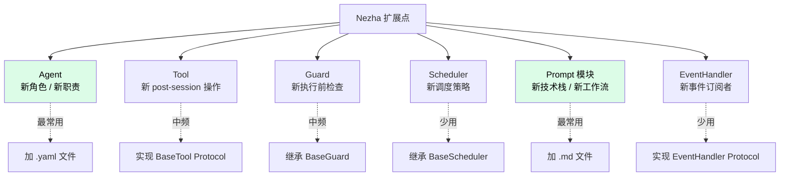

# 开发扩展

想给 Nezha 加新 Agent、新 Tool、新 Guard，或者贡献回主仓库？这一节带你上手。

> 阅读这一节前，建议先看 [04-internals/](../04-internals/) 理解基本架构。

## 章节导航

| 文档 | 主题 |
|------|------|
| [项目结构](project-structure.md) | 代码目录导览 + 关键模块定位 |
| [新增 Agent](adding-an-agent.md) | 加一个新的 Agent YAML + 对应 prompt |
| [新增 Tool](adding-a-tool.md) | 加一个 post-session 工具（git/test 之类） |
| [新增 Guard](adding-a-guard.md) | 加一个执行前检查 |
| [新增 Scheduler](adding-a-scheduler.md) | 加一种调度策略 |
| [编写 Prompt 模块](prompt-module-authoring.md) | 自定义 phases/stacks/concerns 模块 |
| [测试策略](testing.md) | 994+ 测试怎么跑 + 怎么写新测试 |
| [贡献流程](contributing.md) | PR、Code Review、版本发布 |

## 扩展点全景

## 难度分级

| 扩展类型 | 难度 | 改动范围 |
|---------|------|---------|
| 加 Prompt 模块 | ⭐ | 1 个 `.md` 文件 |
| 加 Agent | ⭐⭐ | 1 个 `.yaml` + 可选 prompt 文件 |
| 加 Tool | ⭐⭐⭐ | 1 个 Python 类 + 注册 |
| 加 Guard | ⭐⭐⭐ | 1 个 Python 类 + 注册 |
| 加 EventHandler | ⭐⭐⭐ | 1 个 Python 类 + 注册 |
| 加 Scheduler | ⭐⭐⭐⭐ | 完整 async 循环逻辑 |
| 改 DAG 引擎 | ⭐⭐⭐⭐⭐ | 涉及核心，慎改 |

## 通用扩展原则

1. **优先用配置而非代码**——能在 YAML 解决就不写 Python
2. **遵循 Port/Adapter 模式**——新组件先看有没有对应 Protocol/BaseClass
3. **写测试**——Nezha 有 994+ 测试，新代码要保持这个标准
4. **保持向后兼容**——改公共接口前考虑现有用户
5. **更新文档**——改了 API 就要改 wiki

## 推荐顺序

**第一次贡献？**

1. 读 [项目结构](project-structure.md) 找路
2. 试着 [加一个 Prompt 模块](prompt-module-authoring.md)（最简单）
3. 试着 [加一个 Agent](adding-an-agent.md)
4. 跑通 [测试](testing.md) 验证
5. 看 [贡献流程](contributing.md) 提 PR

**想做大改动？**

1. 在 issue 里先讨论方案
2. 看 [关键设计决策](../04-internals/design-decisions.md) 理解约束
3. 写设计文档 → 评审 → 实现

## 相关章节

- [内部架构](../04-internals/) — 架构和设计
- [Reference](../02-cheatsheet/) — 配置字段速查
