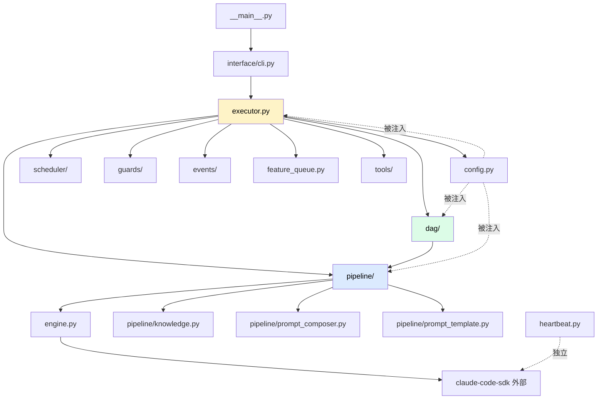

# 项目结构

代码目录导览。**改某个功能先来这里找路**。

## 顶层结构

```
nezha/
├── src/nezha/                  ← 实际代码（src layout）
├── tests/                       ← 单元测试（994+）
├── docs/                        ← 设计文档（开发者内部）
├── wiki/                        ← 用户文档（这个 wiki）
├── pyproject.toml               ← 包配置
├── CLAUDE.md                    ← Claude Code 项目说明
├── Makefile                     ← 常用命令简写
└── README.md
```

## src/nezha/ 详解

```
src/nezha/
├── __main__.py                  CLI 入口（python -m nezha）
├── config.py                    YAML → dataclass 配置加载
├── engine.py                    LLM 引擎（claude-code-sdk 封装）
├── executor.py                  主协调器（编排核心）
├── heartbeat.py                 心跳保活
├── feature_queue.py             Feature CRUD（Port/Adapter）
├── phase.py                     Phase 编排
├── task_queue.py                向后兼容层
├── i18n.py                      CLI 文案多语言
│
├── dag/                         DAG 子系统
│   ├── engine.py                DAG 执行循环
│   ├── graph.py                 TaskDAG（状态动态计算）
│   ├── verifier.py              两级验证
│   ├── report.py                报告生成（execution-report.md）
│   └── handoff.py               VibeCoding 上下文生成
│
├── pipeline/                    会话与 Prompt
│   ├── session.py               子进程隔离 + session 运行
│   ├── direct_api.py            轻量模式（不用 SDK）
│   ├── io.py                    文件 I/O（input 扫描、output 目录）
│   ├── prompt_template.py       模板渲染（{{var}} 替换 + locale 感知）
│   ├── prompt_composer.py       Prompt 组合（base + sections）
│   ├── knowledge.py             知识注入（CLAUDE.md、workspace/project/）
│   └── security.py              安全 hook（PreToolUseHook 白名单）
│
├── scheduler/                   调度器
│   ├── base.py                  BaseScheduler 抽象
│   ├── manual.py                ManualScheduler（一次性）
│   ├── continuous.py            ContinuousScheduler（循环）
│   ├── cron.py                  CronScheduler（cron 表达式）
│   └── __init__.py              SchedulerFactory
│
├── guards/                      守卫
│   ├── base.py                  BaseGuard + GuardChain
│   ├── circuit_breaker.py       熔断器
│   ├── time_window.py           时间窗口
│   ├── balance.py               预算守卫
│   └── __init__.py              GuardFactory
│
├── events/                      事件系统
│   ├── bus.py                   EventBus
│   ├── types.py                 Event / EventType
│   ├── file_logger.py           日志写文件
│   ├── state_writer.py          状态 JSON
│   └── trace_writer.py          链路追踪
│
├── tools/                       post-session 工具
│   ├── base.py                  BaseTool Protocol
│   ├── git_tool.py              git commit/push/create-pr
│   ├── test_tool.py             跑测试
│   └── __init__.py              create_tool 工厂
│
├── runtime/                     Runtime 抽象（实验性）
│   ├── base.py
│   ├── types.py
│   ├── claude_code.py
│   └── codex_cli.py
│
├── testing/                     集成测试支持
│   └── integration.py
│
├── interface/                   CLI 实现细节
│   ├── cli.py                   各 cmd_* 函数
│   └── dashboard.py             HTML dashboard 生成
│
├── locales/                     翻译资源
│   ├── en.yaml
│   └── zh_CN.yaml
│
└── templates/                   nezha init 模板
    ├── executor.yaml
    ├── agents/                  各种 Agent YAML 模板
    └── prompts/                 Prompt 模块（双语）
        ├── coding/
        ├── planner/
        ├── pm/
        └── modules/
```

## 模块依赖关系



**依赖原则**：

- 上层模块依赖下层
- 同层模块尽量不互相依赖
- 配置（`config.py`）是横切关注点，谁都能用

## 我想改 XX 功能，去哪个文件？

| 我想改... | 文件 |
|----------|------|
| 加一个 CLI 子命令 | `__main__.py` + `interface/cli.py` |
| 改 YAML 配置字段 | `config.py` |
| 改 Agent 调度逻辑 | `executor.py` |
| 改 DAG 调度 | `dag/engine.py` |
| 改 task 状态计算 | `dag/graph.py` |
| 改验证逻辑 | `dag/verifier.py` |
| 改 session 子进程模板 | `pipeline/session.py` |
| 改 prompt 组装 | `pipeline/prompt_composer.py` |
| 改项目知识注入 | `pipeline/knowledge.py` |
| 加新 Guard | `guards/<新文件>.py` + `guards/__init__.py` 注册 |
| 加新 Scheduler | `scheduler/<新文件>.py` + `scheduler/__init__.py` 注册 |
| 加新 Tool | `tools/<新文件>.py` + `tools/__init__.py` 注册 |
| 加新 EventHandler | `events/<新文件>.py` + 在 `executor.py` 注册 |
| 改 LLM 引擎 | `engine.py` |
| 改 CLI 文案翻译 | `locales/*.yaml` |
| 加内置 Agent 模板 | `templates/agents/<新>.yaml` |
| 加内置 Prompt 模块 | `templates/prompts/modules/<类别>/<新>.md` |

## 测试目录对应

```
tests/
├── test_config.py                 ↔ src/nezha/config.py
├── test_executor.py               ↔ src/nezha/executor.py
├── test_engine.py                 ↔ src/nezha/engine.py
├── test_feature_queue.py          ↔ src/nezha/feature_queue.py
├── test_phase.py                  ↔ src/nezha/phase.py
├── test_dag_engine.py             ↔ src/nezha/dag/engine.py
├── test_graph.py                  ↔ src/nezha/dag/graph.py
├── test_verifier.py               ↔ src/nezha/dag/verifier.py
├── test_session.py                ↔ src/nezha/pipeline/session.py
├── test_prompt_composer.py        ↔ src/nezha/pipeline/prompt_composer.py
├── test_knowledge.py              ↔ src/nezha/pipeline/knowledge.py
├── test_scheduler_*.py            ↔ src/nezha/scheduler/
├── test_guards.py                 ↔ src/nezha/guards/
├── test_events.py                 ↔ src/nezha/events/
├── test_tools.py                  ↔ src/nezha/tools/
├── test_heartbeat.py              ↔ src/nezha/heartbeat.py
└── test_runtime.py                ↔ src/nezha/runtime/
```

**约定**：新加一个模块 X，要有对应的 `test_X.py`。

## templates/ 是什么

`templates/` 是 `nezha init` 时复制到用户项目的**初始内容**：

```
templates/                        ← 源码里的模板
├── executor.yaml                 → 复制到 用户项目/executor.yaml
├── agents/                       → 复制到 用户项目/agents/
│   ├── planner-agent.yaml
│   ├── frontend-agent.yaml
│   └── ...
└── prompts/                      → 复制到 用户项目/prompts/
    ├── modules/
    └── ...
```

> **重要**：改 `templates/` 不会影响**已存在**的用户项目，只影响**新 init 的**。已有项目要手动 sync。

## src layout 的好处

为什么用 `src/nezha/` 而不是直接 `nezha/`？

| `src/` layout | 平铺 layout |
|--------------|------------|
| 测试时必须**安装包**才能 import | 可以从工作目录直接 import |
| 避免开发时意外 import 到本地代码 | 容易混淆 |
| 包的"可分发"性更明确 | 不明确 |

详见 [Python Packaging 官方文档](https://packaging.python.org/en/latest/guides/packaging-projects/)。

## docs/ vs wiki/ 的区别

| 目录 | 受众 | 内容 |
|------|------|------|
| `docs/` | 开发者内部 | 设计笔记、决策记录、TODO（不一定结构化） |
| `wiki/` | 用户 + 贡献者 | 体系化的使用 / 架构 / 扩展指南（本文档） |

`docs/` 的内容可以草稿气，wiki/ 应该是**给外部读者**看的。

## Makefile 常用命令

```makefile
test:
	python3 -m pytest tests/ -v

lint:
	ruff check src/ tests/

format:
	ruff format src/ tests/

install:
	pipx install --force .
```

跑：

```bash
make test      # 跑全量测试
make lint      # 代码检查
make format    # 格式化
```

## 相关章节

- [分层架构](../04-internals/architecture.md) — 各模块的设计
- [测试策略](testing.md) — 怎么跑测试
- [贡献流程](contributing.md) — 怎么提 PR
