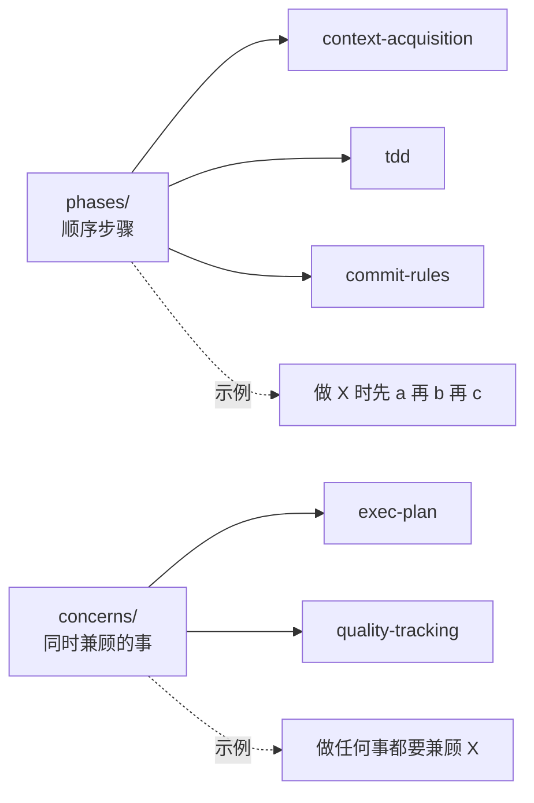
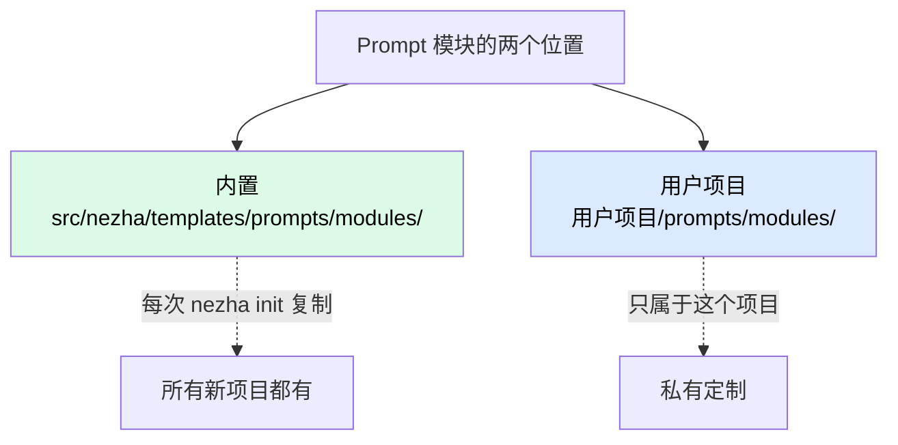

# 编写 Prompt 模块

加 Prompt 模块是 Nezha **最简单的扩展**——一个 `.md` 文件，零 Python 代码。

## 三类模块

```
prompts/modules/
├── phases/       工作流阶段（怎么做）
├── stacks/       技术栈知识（用什么写）
└── concerns/     横切关注点（同时要兼顾的事）
```

| 类型 | 内容 | 例子 |
|------|------|------|
| `phases/` | 怎么做事的流程 | TDD、Commit 规则、Rework 处理 |
| `stacks/` | 技术栈知识 | Python、Java、Rust、Tauri |
| `concerns/` | 横切关注点 | 执行计划维护、质量追踪 |

## 现有模块

```
prompts/modules/
├── phases/
│   ├── context-acquisition.md    上下文获取（必备）
│   ├── tdd.md                     TDD 流程
│   ├── regression.md              回归测试
│   ├── rework.md                  返工处理
│   └── commit-rules.md            提交规则
├── stacks/
│   ├── general.md
│   ├── python.md
│   ├── frontend.md
│   ├── java-spring.md
│   └── tauri-fullstack.md
└── concerns/
    ├── exec-plan.md               执行计划
    └── quality-tracking.md        质量追踪
```

## 从零写一个模块

以"**Rust 技术栈模块**"为例。

### Step 1：选位置

写代码 → `stacks/`。所以新文件路径：

```
prompts/modules/stacks/rust.md
prompts/modules/stacks/rust.zh.md    ← 中文版（推荐）
```

### Step 2：写英文版

`prompts/modules/stacks/rust.md`：

```markdown
## Rust Stack Knowledge

### Toolchain
- Build: `cargo build`
- Test: `cargo test`
- Format: `cargo fmt`
- Lint: `cargo clippy`
- Run: `cargo run`

### Error Handling
- Prefer `Result<T, E>` with `?` operator
- Avoid `unwrap()` and `expect()` in production code
- Use `thiserror` for custom error types

### Async
- Use `tokio` runtime
- Async functions: `async fn`, call with `.await`
- Streams: use `tokio::stream` or `futures::Stream`

### Testing
- Unit tests: inline `#[cfg(test)] mod tests` in source files
- Integration tests: separate `tests/` directory
- Use `proptest` for property-based testing
- Use `mockall` for mocking

### Project Structure
- `src/main.rs` for binaries, `src/lib.rs` for libraries
- Modules: separate file per module, use `mod` declarations
- Public API: explicit `pub` keyword

### Common Crates
- HTTP server: `axum` or `actix-web`
- HTTP client: `reqwest`
- Database: `sqlx` (async, compile-time checked)
- Serialization: `serde` + `serde_json`
- CLI: `clap`
```

### Step 3：写中文版

`prompts/modules/stacks/rust.zh.md`：

```markdown
## Rust 技术栈知识

### 工具链
- 构建：`cargo build`
- 测试：`cargo test`
- 格式化：`cargo fmt`
- 静态检查：`cargo clippy`
- 运行：`cargo run`

### 错误处理
- 偏好 `Result<T, E>` + `?` 操作符
- 避免在生产代码使用 `unwrap()` 和 `expect()`
- 自定义错误用 `thiserror`

### 异步
- 用 `tokio` runtime
- 异步函数 `async fn`，调用 `.await`
- 流处理：`tokio::stream` 或 `futures::Stream`

### 测试
- 单元测试：源文件内 `#[cfg(test)] mod tests`
- 集成测试：独立 `tests/` 目录
- 性质测试用 `proptest`
- Mock 用 `mockall`

### 项目结构
- 二进制 `src/main.rs`，库 `src/lib.rs`
- 模块：每个模块独立文件，用 `mod` 声明
- 公开 API：显式 `pub` 关键字

### 常用 Crate
- HTTP 服务：`axum` 或 `actix-web`
- HTTP 客户端：`reqwest`
- 数据库：`sqlx`（异步，编译期校验）
- 序列化：`serde` + `serde_json`
- CLI：`clap`
```

### Step 4：在 Agent YAML 引用

```yaml
# agents/rust-agent.yaml
session:
  compose:
    worker:
      base: "coding/base.md"
      sections:
        - phases/context-acquisition
        - stacks/rust              # ← 用新模块
        - phases/tdd
        - phases/commit-rules
```

### Step 5：测试

```bash
nezha plan rust-agent
# 看 dag_context 注入是否成功
```

或者直接跑：

```bash
nezha run rust-agent --feature-id <test-feature>
```

看 `workspace/features/<id>/.session_manifest.json` 里 `compose.sections` 列表是否包含 `stacks/rust`。

## Prompt 模块写作技巧

### 1. 标题用 `##`（二级）

模块会拼到 base prompt 后面，base 用 `#`（一级），模块从 `##` 开始：

```markdown
## Rust Stack Knowledge        ← 二级
### Toolchain                  ← 三级
- Build: ...                   ← 列表
```

### 2. 直接面向 AI 写

不要写"This module is about Rust"，直接写**让 AI 怎么做**：

```markdown
✅ Use `Result<T, E>` for error handling
❌ This module describes Rust's error handling philosophy
```

### 3. 给出明确的命令

AI 看到具体命令更容易模仿：

```markdown
✅ Format: `cargo fmt`
❌ Make sure to format the code
```

### 4. 反例 / 边界一起说

```markdown
## Async
- Use `tokio::spawn` for parallel tasks
- Don't use `std::thread::spawn` in async functions
- Don't `block_on` inside async context
```

### 5. 用变量 `{{var}}`

模板里可以引用 `compose_prompt` 注入的变量：

```markdown
## Current Task

ID: {{task_id}}
Description: {{task_description}}

## DAG Context

{{dag_context}}
```

找不到的变量保留 `{{var}}` 字面量（不报错），便于调试。

### 6. 控制长度

每个模块**最好控制在 100 行以内**。长了会挤占 LLM 的 context window，让 task 描述被遗忘。

如果内容多，拆成多个小模块：

```
stacks/rust-basic.md
stacks/rust-async.md
stacks/rust-testing.md
```

Agent 可以按需组合：

```yaml
sections:
  - stacks/rust-basic
  - stacks/rust-testing       # 这个 Agent 只需要基础+测试
```

### 7. 双语保持同步

`rust.md` 和 `rust.zh.md` **结构必须一致**（标题、列表顺序）。`locale=zh_CN` 找不到 `.zh.md` 会回退到 `.md`，所以英文版始终是 fallback。

## 改造现有模块

想改 `phases/tdd.md` 的 TDD 流程？直接编辑就行。但注意：

| 改动类型 | 影响 |
|---------|------|
| 加内容 | 安全，所有用此模块的 Agent 自动受益 |
| 改流程顺序 | 可能影响已有 Agent 的输出习惯 |
| 删内容 | 可能让某些 Agent 失去关键约束 |
| 改命令 | 全局影响，特别小心 |

**改之前**：跑全量测试确认没意外破坏。

```bash
make test
```

## concerns/ vs phases/ 的区别

很多人混淆这两个：



| 维度 | phases | concerns |
|------|--------|----------|
| 时序 | 有先后 | 同时 |
| 数量 | 一个工作流可以有多个 | 通常 1-2 个 |
| 内容 | "做什么" | "怎么持续兼顾" |

### phases 示例

```markdown
## TDD Workflow

1. Write failing test
2. Implement minimum code
3. Run test → green
4. Refactor
5. Repeat
```

### concerns 示例

```markdown
## Execution Plan Maintenance

Throughout the task:
- Update `exec-plan.md` after each step
- Mark completed items with [x]
- Add new TODO items as discovered
```

## 项目级 vs 内置模块



| 位置 | 适合 |
|------|------|
| `src/nezha/templates/prompts/modules/` | 通用，要贡献回主仓 |
| `用户项目/prompts/modules/` | 公司 / 项目专属（如内部规范） |

## 常见问题

**Q: 模块文件不要 frontmatter 吗？**

不要。Prompt 模块就是纯 markdown，直接拼到 prompt 里。

**Q: 怎么测试模块写得好不好？**

跑一个 Agent，看 `.session_manifest.json` 里的实际 prompt。或者：

1. 跑 task 看 AI 行为是否符合期望
2. 改一下模块，再跑同样 task
3. 对比效果

迭代几次就有手感。

**Q: 一个模块用多了被 ban 怎么办？**

如果 LLM 习惯了某个错误（被 phase 中的某句话误导），重写那段话。

或者改更直接：

```markdown
❌ Avoid using `unwrap()`
✅ Never use `unwrap()` in production code; use `?` or explicit match
```

**Q: 内置模块没有我要的，私有项目能扩展吗？**

可以。在用户项目的 `prompts/modules/` 加文件，agent YAML 引用即可。

但要注意：如果你的 `用户项目/prompts/` 是从 `nezha init` 复制来的副本，私有模块可能在升级 Nezha 时被覆盖。**自定义模块建议命名加前缀**：

```
prompts/modules/stacks/myco-internal-stack.md
```

避免和将来 Nezha 内置模块同名。

## 相关章节

- [新增 Agent](adding-an-agent.md) — 在 Agent 里用模块
- [Internals: Prompt 组合系统](../04-internals/prompt-composer.md) — 工作原理
- [How-To: 多语言](../03-howto/multi-language.md) — locale 切换
