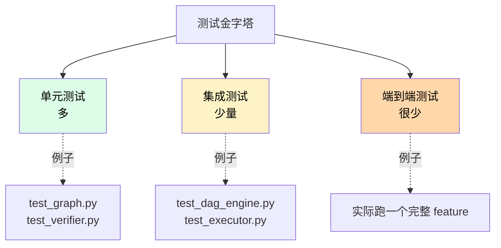

# 测试策略

Nezha 有 994+ 单元测试，是代码质量的核心保障。**任何代码改动都要保证测试不退**。

## 跑测试

### 全量

```bash
python3 -m pytest tests/ -v
# 或简写
make test
```

预期输出：

```
=================== 994 passed, 1 skipped in 27.52s ===================
```

### 单文件

```bash
python3 -m pytest tests/test_dag_engine.py -v
```

或用项目 skill：

```
/test-file test_dag_engine.py
```

### 单测试函数

```bash
python3 -m pytest tests/test_dag_engine.py::test_specific_function -v
```

### 跟踪覆盖率

```bash
pip install pytest-cov
python3 -m pytest tests/ --cov=src/nezha --cov-report=html
open htmlcov/index.html
```

## 测试文件结构

```
tests/
├── conftest.py                      共享 fixture
├── test_config.py                   配置加载
├── test_executor.py                 编排
├── test_dag_engine.py               DAG 调度
├── test_graph.py                    Task 状态计算
├── test_verifier.py                 验证逻辑
├── test_session.py                  Session 子进程
├── test_prompt_composer.py          Prompt 组合
├── test_prompt_template.py          模板渲染
├── test_knowledge.py                项目知识注入
├── test_feature_queue.py            Feature CRUD
├── test_phase.py                    Phase 编排
├── test_heartbeat.py                心跳
├── test_runtime.py                  Runtime 抽象
├── test_codex_cli_runtime.py        Codex runtime
└── ...
```

## 测试约定

### 1. 一个模块一个测试文件

`src/nezha/X.py` ↔ `tests/test_X.py`。

### 2. 测试函数命名

```python
def test_<被测函数>_<场景>():
    """文档：测什么"""
```

例子：

```python
def test_get_status_returns_completed_when_passes_true():
    """passes=true 时，状态应该是 completed"""
    task = Task(id="t1", passes=True, ...)
    dag = TaskDAG([task])
    assert dag.get_status("t1") == STATUS_COMPLETED
```

### 3. AAA 模式（Arrange-Act-Assert）

```python
def test_xxx():
    # Arrange: 准备数据
    config = make_config(...)

    # Act: 调用被测代码
    result = subject.do_something(config)

    # Assert: 检查结果
    assert result.success
    assert result.value == "expected"
```

### 4. 用 pytest fixture

`conftest.py` 里定义复用的 fixture：

```python
import pytest
from pathlib import Path

@pytest.fixture
def tmp_workspace(tmp_path):
    """每个测试都有一个全新的临时 workspace"""
    workspace = tmp_path / "workspace"
    workspace.mkdir()
    return workspace

@pytest.fixture
def sample_task_list():
    return [
        Task(id="t1", description="...", complexity="low"),
        Task(id="t2", description="...", complexity="medium", depends_on=["t1"]),
    ]
```

测试里直接 inject：

```python
def test_dag_load(tmp_workspace, sample_task_list):
    # 用 fixture
    task_list_path = tmp_workspace / "task_list.json"
    task_list_path.write_text(json.dumps([asdict(t) for t in sample_task_list]))
    dag = TaskDAG.load(task_list_path)
    assert len(dag.tasks) == 2
```

### 5. async 测试用 `@pytest.mark.asyncio`

```python
import pytest

@pytest.mark.asyncio
async def test_guard_check():
    config = GuardConfig(type="weekday", enabled=True, params={})
    guard = WeekdayGuard(config)
    result = await guard.check()
    assert isinstance(result, GuardResult)
```

## 写新测试的模板

新加一个功能后，**先写测试**：

```python
"""Tests for <模块名>."""

import pytest
from unittest.mock import patch, MagicMock

from nezha.<模块> import <被测类或函数>


def test_<场景 1>():
    """正常路径"""
    result = <被测函数>(...)
    assert result == expected


def test_<场景 2>():
    """边界情况"""
    result = <被测函数>(...)
    assert ...


def test_<场景 3>_raises_error():
    """错误处理"""
    with pytest.raises(<异常类>):
        <被测函数>(<错误输入>)


@pytest.mark.asyncio
async def test_<async 场景>():
    """async 函数测试"""
    result = await <async 函数>(...)
    assert ...
```

## Mock 技巧

### Mock 外部依赖

外部 HTTP、文件 I/O、subprocess 等都应该 mock：

```python
from unittest.mock import patch

def test_dingtalk_notify():
    tool = DingTalkTool()
    with patch("urllib.request.urlopen") as mock_open:
        mock_resp = MagicMock()
        mock_resp.read.return_value = b'{"errcode": 0}'
        mock_open.return_value.__enter__.return_value = mock_resp

        result = tool.run("notify", Path("."), {"webhook": "...", "message": "hi"})

    assert result.success
```

### Mock LLM 调用

测 Executor 时不要真的调 LLM，mock 掉：

```python
@pytest.mark.asyncio
async def test_executor_runs_session():
    mock_session_result = SessionResult(
        status="completed",
        num_turns=5,
        cost_usd=0.05,
    )

    with patch(
        "nezha.pipeline.session.run_single_round",
        new=AsyncMock(return_value=mock_session_result),
    ):
        await execute_agent("test-agent", config_path="...")
```

### Mock subprocess

```python
def test_git_commit():
    tool = GitTool()
    with patch("subprocess.run") as mock_run:
        mock_run.return_value = MagicMock(
            returncode=0,
            stdout="committed",
            stderr="",
        )

        result = tool.run("commit", Path("."), {"message": "test"})

    assert result.success
```

## 测试金字塔



| 层 | 数量 | 速度 | mock 量 |
|---|------|------|---------|
| 单元测试 | 80%+ | 快 | 多 |
| 集成测试 | 15% | 中 | 少 |
| 端到端 | 极少 | 慢 | 无 |

Nezha 主要是**单元 + 集成**——端到端测试因为要调真实 LLM 成本太高，只在大改动时手动跑。

## 别测什么

| 不该测的 | 为什么 |
|---------|--------|
| LLM 输出质量 | 不稳定，且贵 |
| 第三方库内部逻辑 | 不是我们的代码 |
| Python 标准库 | 同上 |
| Mock 出来的行为 | 测试在测自己 |
| 私有方法（除非很复杂） | 通过公开方法间接测 |

## 跨平台

Nezha 主要在 macOS/Linux 开发，Windows 兼容性靠 CI 保证：

```python
import sys
import pytest

@pytest.mark.skipif(sys.platform == "win32", reason="Windows-incompatible test")
def test_subprocess_isolation():
    ...
```

或者用 `pathlib` 而不是字符串拼路径，自然跨平台。

## CI

```yaml
# .github/workflows/test.yml
name: Test
on: [push, pull_request]
jobs:
  test:
    runs-on: ubuntu-latest
    steps:
      - uses: actions/checkout@v4
      - uses: actions/setup-python@v5
        with:
          python-version: "3.13"
      - run: pip install -e ".[dev]"
      - run: pytest tests/ -v
```

## 添加新测试的 checklist

- [ ] 测试文件命名 `test_<模块>.py`
- [ ] 测试函数命名 `test_<被测>_<场景>`
- [ ] 每个测试有 docstring 说明意图
- [ ] 用 fixture 而不是重复代码
- [ ] mock 所有外部依赖（LLM、HTTP、subprocess）
- [ ] 覆盖正常 / 边界 / 错误三类场景
- [ ] async 函数加 `@pytest.mark.asyncio`
- [ ] 跑全量测试确认没破坏其他测试

## 跑前的快速 sanity check

```bash
# 1. 测试可以收集（没有 import error）
python3 -m pytest tests/ --collect-only

# 2. 跑改动相关的测试
python3 -m pytest tests/test_<改的模块>.py -v

# 3. 全量
make test
```

## 测试慢怎么办

如果 `make test` 跑得太慢（>1 分钟），考虑：

```bash
# 并行跑（需要 pytest-xdist）
pip install pytest-xdist
python3 -m pytest tests/ -n auto
```

但 Nezha 的子进程测试可能不适合并行（资源竞争），按需启用。

## 常见问题

**Q: 测试在本地过，CI 挂？**

最常见原因：

1. 平台差异（Windows / macOS / Linux 路径分隔符）
2. 依赖版本不一致
3. 测试依赖外部状态（环境变量、文件、网络）

排查：

```bash
# 用 Docker 模拟 CI 环境
docker run --rm -v $PWD:/app -w /app python:3.13 bash -c \
  "pip install -e . && pytest tests/ -v"
```

**Q: 测试需要真实 API key？**

不应该。如果某个测试必须调 API，加 mark 跳过：

```python
@pytest.mark.skipif(
    not os.environ.get("ANTHROPIC_API_KEY"),
    reason="Requires real API key",
)
def test_real_llm_call():
    ...
```

**Q: 怎么调试失败的测试？**

```bash
python3 -m pytest tests/test_X.py::test_Y -v -s --tb=long
```

- `-v`: 详细输出
- `-s`: 不捕获 print（看 print 输出）
- `--tb=long`: 完整 traceback

或者用 `pdb`：

```python
def test_xxx():
    import pdb; pdb.set_trace()
    # ...
```

## 相关章节

- [项目结构](project-structure.md) — 测试文件位置
- [贡献流程](contributing.md) — 提 PR 时的测试要求
