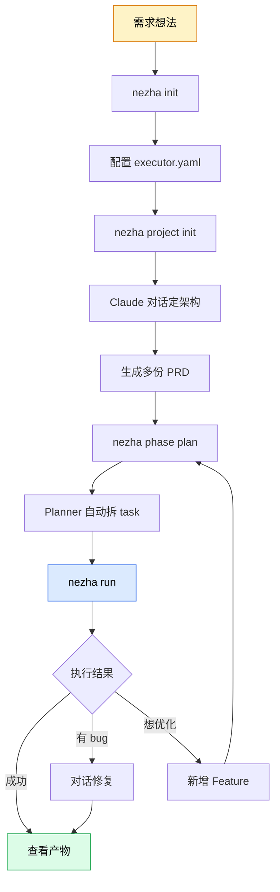

# Nezha

> 让 AI 写代码这件事，放进一个像工程交付的流程里。

## 一句话定位

Nezha 不是 Cursor、不是 Claude Code，而是**在它们之上**的一层工程化框架——把"AI 写代码"从聊天式的随手 Vibe Coding，升级到**需求 → 架构 → PRD → Feature → Task → Run** 的工程化交付流程。

## 适合谁

- 想用 AI 做**完整项目**而不是改几行代码的人
- 已经在用 Claude Code，但发现一句 prompt 撞运气不靠谱的人
- 需要 AI **长时间无人值守**地写代码、并且每一步都可控可回溯的人

## 完整工作流

## 三个必懂概念

| 概念 | 是什么 | 例子 |
|------|--------|------|
| **Phase** | 一次完整的交付阶段 | "简历生成器 V1" |
| **Feature** | 阶段内的大需求 | "数据 schema 设计"、"PDF 导出功能" |
| **Task** | Feature 拆出的小编码任务 | "实现 Header 组件"、"添加打印样式" |

## 几个核心亮点

- **人在回路**：每个 Feature 可设审批节点，AI 自动化和人工管控灵活切换
- **多模型路由**：简单 task 用 Haiku、复杂 task 用 Opus，自动按难度分配
- **依赖驱动 DAG**：自动识别任务依赖，可并行的并行、必须串行的串行
- **链式分支**：每个 Feature 自动基于上一个分支，代码积累不丢
- **限流自动停机**：API 限流时立即写优雅停止信号，不会傻跑浪费配额
- **三方模型支持**：GLM、Kimi、DeepSeek、MiniMax 一行配置接入

## 从哪儿开始

| 我想... | 去这里 |
|---------|--------|
| 30 分钟跑通第一个项目 | [快速开始](01-quickstart/) |
| 速查命令和字段 | [速查手册](02-cheatsheet/) |
| 解决具体问题 | [How-To 指南](03-howto/) |
| 理解原理设计 | [内部架构](04-internals/) |
| 修改源码贡献 | [开发扩展](05-extend/) |
